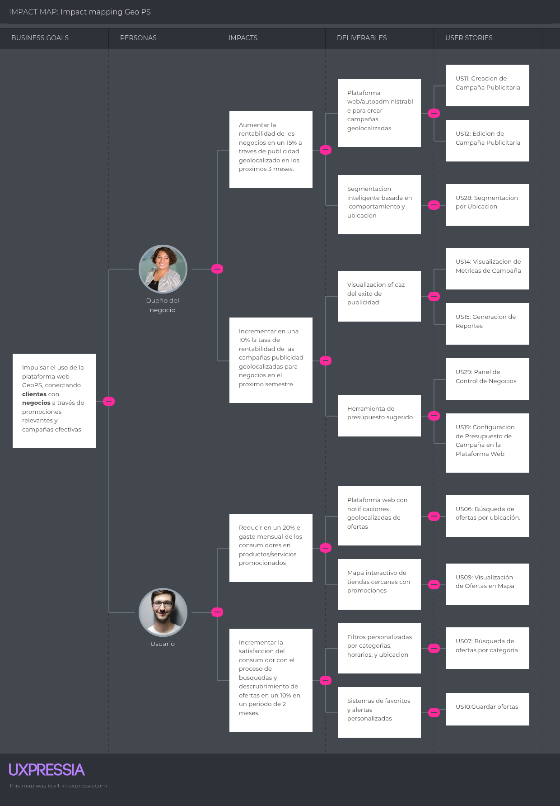

  
## Universidad Peruana de Ciencias Aplicadas

**Ingeniería de Software**

**Ciclo:** 2025-2

**Curso:** Desarrollo de Aplicaciones Open Source

**Sección:** 7391

**Profesor:** Mori Paiva, Hugo Allan

----

## Informe de Trabajo Final

**Startup:** GeoPsLabs

**Nombre del producto:** GeoPs

#### Relación de integrantes

| Integrante                              | Código         |
|-----------------------------------------|----------------|
| Huapaya Galindo, Dyaron                 | U202322855     |
| Huarcaya Matias, Gilbert Alonso         | u202322187     |
| Salazar Caballero, Alvaro Fabrizzio     | u202321941     |
|                                         |                |
|                                         |                |

 
<h3>Agosto 2025</h3>
 

  

---
### Registro de Versiones

  
|**Versión**|**Fecha**|**Autor**|**Descripción de modificación**|
| - | - | - | - |

  

---

# Project Report Collaboration Insights

URL de Organización de GitHub DevWebUPC: 
[https://github.com/OpenSourceDevUPC](https://github.com/OpenSourceDevUPC)

URL del Repositoria del Project Report:
[https://github.com/OpenSourceDevUPC/Project-Report-GeoPS](https://github.com/OpenSourceDevUPC/Project-Report-GeoPS)

<strong>*Entrega TB1:*</strong>

+ Desarrollo de Actividades:
+ Evidencias de colaboracion y commits:

---
# Contenido
- [Contenido](#contenido)
- [Student Outcome](#student-outcome)
- [Capítulo 1: Introducción](#capitulo-1-introducción)
  - [1.1. Startup Profile](#11-startup-profile)
    - [1.1.1. Descripción de la StartUp](#111-descripcion-del-startup)
    - [1.1.2. Perfiles de integrantes del equipo](#112-perfiles-de-integrantes-del-equipo)
  - [1.2. Solution Profile](#12-solution-profile)
    - [1.2.1 Antecedentes y problemática](#121-antecedentes-y-problemática)
    - [1.2.2 Lean UX Process](#122-lean-ux-process)
      - [1.2.2.1 Lean UX Problem Statement](#1221-lean-ux-problem-statements)
      - [1.2.2.2 Lean UX Assumptions](#1222-lean-ux-assumptions)
      - [1.2.2.3 Lean UX Hypothesis Statements](#1223-lean-ux-hypothesis-statements)
      - [1.2.2.4 Lean UX Canvas](#1224-lean-ux-canvas)
  - [1.3. Segmentos Objetivo](#13-segmentos-objetivos)
  
- [Capítulo 2: Requirements Elicitation & Analysis](#capitulo-2-requirements-elicitation--analysis)
  - [2.1. Competidores](#21-competidores)
    - [2.1.1. Análisis competitivo](#211-analisis-competitivo)
    - [2.1.2. Estrategias y tácticas frente a competidores](#212-estrategias-y-tácticas-frente-a-competidores)
  - [2.2 Entrevistas](#22-entrevistas)
    - [2.2.1 Diseño de entrevistas](#221-diseño-de-entrevistas)
    - [2.2.2 Registro de Entrevistas](#222-registro-de-entrevistas)
    - [2.2.3. Análisis de entrevistas](#223-análisis-de-entrevistas)
  - [2.3. Needfinding](#23-needfinding)
    - [2.3.1. User Personas](#231-user-personas)
    - [2.3.2 User Task Matrix](#232--user-task-matrix)
    - [2.3.3. User Journey Mapping](#233-user-journey-mapping)
    - [2.3.4. Empathy Mapping](#234-empathy-mapping)
    - [2.3.5. As-is Scenario Mapping](#235-as-is-scenario-mapping)
  - [2.4. Ubiquitous Language](#24-ubiquitous-language)
    
- [Capítulo 3: Requirements Specification](#capitulo-3-requirements-specification)
  - [3.1. To-Be Scenario Mapping](#31-to-be-scenario-mapping)
  - [3.2. User Stories](#32-user-stories)
  - [3.3. Impact Mapping](#33-impact-mapping)
  - [3.4. Product Backlog](#34-product-backlog)

- [Capítulo 4: Product Design](#capítulo-4-product-design)
  - [4.1 Style Guidelines](#41-style-guidelines)
    - [4.1.1. General Style Guidelines](#411-general-style-guidelines)
    - [4.1.2. Web Style Guidelines](#412-web-style-guidelines)
  - [4.2. Information Architecture](#42-information-architecture)
    - [4.2.1. Organization Systems](#421-organization-systems)
    - [4.2.2. Labeling Systems](#422-labeling-systems)
    - [4.2.3. SEO Tags and Meta Tags](#423-seo-tags-and-meta-tags)
    - [4.2.4. Searching Systems](#424-searching-systems)
    - [4.2.5. Navigation Systems](#425-navigation-systems)
  - [4.3 Landing Page UI Design](#43-landing-page-ui-design)
    - [4.3.1. Landing Page Wireframe](#431-landing-page-wireframe)
    - [4.3.2. Landing Page Mock-up](#432-landing-page-mock-up)
  - [4.4 Web Applications UX/UI Design](#44-web-applications-uxui-design)
    - [4.4.1. Web Applications Wireframes](#441-web-applications-wireframes)
    - [4.4.2. Web Applications Wireflow Diagrams](#442-web-applications-wireflow-diagrams)
    - [4.4.3. Web Applications Mock-ups](#443-web-applications-mock-ups)
    - [4.4.4. Web Applications User Flow Diagrams](#444-web-applications-user-flow-diagrams)
  - [4.5. Web Applications Prototyping](#45-web-applications-prototyping)
  - [4.6. Domain-Driven Software Architecture](#46-domain-driven-software-architecture)
    - [4.6.1. Software Architecture Context Diagram](#461-software-architecture-context-diagram)
    - [4.6.2. Software Architecture Container Diagrams](#462-software-architecture-container-diagrams)
    - [4.6.3. Software Architecture Components Diagrams](#463-software-architecture-components-diagrams)
  - [4.7. Software Object-Oriented Design](#47-software-object-oriented-design)
    - [4.7.1. Class Diagrams](#471-class-diagrams)
    - [4.7.2. Class Dictionary](#472-class-dictionary)
  - [4.8. Database Design](#48-database-design)
    - [4.8.1. Database Diagram](#481-database-diagram)
    
- [Capítulo 5: Product Implementation, Validation & Deployment](#capítulo-5-product-implementation-validation--deployment)
  - [5.1. Software Configuration Management](#51-software-configuration-management)
    - [5.1.1. Software Development Environment Configuration](#511-software-development-environment-configuration)
    - [5.1.2. Source Code Management](#512-source-code-management)
    - [5.1.3. Source Code Style Guide & Conventions](#513-source-code-style-guide--conventions)
    - [5.1.4. Software Deployment Configuration](#514-software-deployment-configuration)
  - [5.2. Landing Page, Services & Applications Implementation](#52-landing-page-services--applications-implementation)
    - [5.2.1. Sprint 1](#521-sprint-1)
      - [5.2.1.1. Sprint Planning 1](#5211-sprint-planning-1)
      - [5.2.1.2. Aspect Leaders and Collaborators](#5212-aspect-leaders-and-collaborators)
      - [5.2.1.3. Sprint Backlog 1](#5213-sprint-backlog-1)
      - [5.2.1.4. Development Evidence for Sprint Review ](#5214-development-evidence-for-sprint-review)
      - [5.2.1.5. Execution Evidence for Sprint Review](#5215-execution-evidence-for-sprint-review)
      - [5.2.1.6. Services Documentation Evidence for Sprint Review](#5216-services-documentation-evidence-for-sprint-review)
      - [5.2.1.7. Software Deployment Evidence for Sprint Review](#5217-software-deployment-evidence-for-sprint-review)
      - [5.2.1.8. Team Collaboration Insights during Sprint](#5218-team-collaboration-insights-during-sprint)
      
- [Conclusiones](#conclusiones)
- [Bibliografía](#bibliografía)
- [Anexos](#anexos)

# Student Outcome
 

   
   |Criterio Específico|Acciones Realizadas|Conclusiones|
   |-------------------|-------------------|------------|
   
 

## Capitulo 1: Introducción
### 1.1. Startup Profile
  #### 1.1.1. Descripcion del Startup
  #### 1.1.2. Perfiles de Integrantes del equipo
### 1.2. Solution Profile
  #### 1.2.1. Antecedentes y problemática
  #### 1.2.2. Lean UX Process
  ##### 1.2.2.1. Lean UX Problem Statements
  ##### 1.2.2.2. Lean UX Assumptions
  ##### 1.2.2.3. Lean UX Hypothesis Statements
  ##### 1.2.2.4. Lean UX Canvas
### 1.3. Segmentos objetivos

## Capitulo 2: Requirements Elicitation & Analysis
### 2.1. Competidores
  #### 2.1.1. Analisis competitivo
  #### 2.1.2. Estrategias y tácticas frente a competidores 
### 2.2. Entrevistas
  #### 2.2.1. Diseño de entrevistas
  #### 2.2.2. Registro de entrevistas
  #### 2.2.3. Análisis de entrevistas
### 2.3. Needfinding
  #### 2.3.1. User Personas
  #### 2.3.2  User Task Matrix
  #### 2.3.3. User Journey Mapping
  #### 2.3.4. Empathy Mapping
  #### 2.3.5. As-is Scenario Mapping
### 2.4. Ubiquitous Language   

## Capitulo 3: Requirements Specification 
### 3.1. User Stories

Las User Stories representan las necesidades y expectativas de los usuarios finales expresadas en un lenguaje sencillo y centrado en su valor.  
A través de ellas se traduce lo que los usuarios quieren lograr al usar el producto, asegurando que las funcionalidades desarrolladas estén alineadas con sus objetivos reales.

| Epic                                               | ID   |
|----------------------------------------------------|------|
| Registro y Autenticación                           | EP01 |
| Descubrimiento y Gestión de Ofertas (Clientes)     | EP02 |
| Gestión de Campañas Publicitarias (Proveedores)    | EP03 |
| Planes y Suscripciones (Clientes y Proveedores)    | EP04 |
| Experiencia del Usuario y Contenido                | EP05 |

| Story ID | Título                                                      | Descripción                                                                                                                                                       | Criterios de aceptación                                                                                                                                                                                                                           | Relacionado con (Epic ID) |
|----------|--------------------------------------------------------------|-------------------------------------------------------------------------------------------------------------------------------------------------------------------|--------------------------------------------------------------------------------------------------------------------------------------------------------------------------------------------------------------------------------------------------|----------------------------|
| US01     | Registro de Usuario en la Plataforma Web                    | Como usuario, quiero poder registrarme en la plataforma web con mi correo electrónico y contraseña para poder acceder a las ofertas personalizadas.                | Escenario 01: Dado que estoy en la página de registro, Cuando ingreso un correo electrónico válido, una contraseña segura, confirmo la contraseña y hago clic en “Registrar”, Entonces el sistema crea la cuenta y muestra mensaje de éxito.       | EP01                       |
| US02     | Inicio de Sesión de Usuario en la Plataforma Web             | Como usuario, quiero poder iniciar sesión en la plataforma web con mi correo electrónico y contraseña para acceder a mis ofertas guardadas.                        | Escenario 01: Dado que estoy en la página de inicio de sesión, Cuando ingreso mis credenciales correctas y hago clic en “Iniciar sesión”, Entonces el sistema autentica y me redirige a “Mis ofertas guardadas”.                                   | EP01                       |
| US03     | Registro de Negocio en la Plataforma Web                     | Como dueño de negocio, quiero poder registrar mi negocio proporcionando información detallada para poder crear campañas publicitarias.                             | Escenario 01: Dado que estoy en la página de registro de negocio, Cuando ingreso un correo válido, contraseña y datos obligatorios, Entonces el sistema crea la cuenta del negocio y muestra un mensaje de éxito.                                   | EP01                       |
| US04     | Inicio de Sesión de Negocio en la Plataforma Web             | Como dueño de negocio, quiero poder iniciar sesión con mi correo electrónico y contraseña para acceder al panel de gestión de campañas.                           | Escenario 01: Dado que estoy en la página de inicio de sesión de negocios, Cuando ingreso mis credenciales correctas, Entonces el sistema autentica y me redirige al panel de gestión.                                                             | EP01                       |
| US05     | Recuperación de Contraseña en la Plataforma Web              | Como usuario o dueño de negocio, quiero poder recuperar mi contraseña para restablecer el acceso en caso de olvido.                                                | Escenario 01: Dado que estoy en la página de recuperación de contraseña, Cuando ingreso un correo válido y confirmo la acción, Entonces el sistema envía un enlace de restablecimiento y muestra un mensaje de confirmación.                        | EP01                       |
| US06     | Búsqueda de Ofertas por Ubicación en la Plataforma Web       | Como usuario, quiero poder buscar ofertas cercanas a mi ubicación para encontrar promociones convenientes y ahorrar tiempo.                                        | Escenario 01: Dado que permití el acceso a mi ubicación, Cuando realizo una búsqueda, Entonces el sistema muestra un listado de promociones ordenadas por cercanía.                                                                                 | EP02                       |
| US07     | Búsqueda de Ofertas por Categoría en la Plataforma Web       | Como usuario, quiero poder filtrar ofertas por categoría para encontrar fácilmente las promociones que me interesan.                                              | Escenario 01: Dado que estoy en la sección de búsqueda, Cuando selecciono una categoría, Entonces el sistema muestra solo las ofertas correspondientes.                                                                                            | EP02                       |
| US08     | Visualización de Detalles de Oferta en la Plataforma Web     | Como usuario, quiero poder visualizar los detalles de una oferta para conocer toda la información antes de aprovecharla.                                          | Escenario 01: Dado que estoy en el listado de ofertas, Cuando selecciono una oferta, Entonces el sistema muestra la información detallada (descripción, precio, vigencia, ubicación, condiciones de uso).                                            | EP02                       |
| US09     | Visualización de Ofertas en Mapa en la Plataforma Web        | Como usuario, quiero visualizar las ofertas en un mapa para ubicar rápidamente negocios cercanos.                                                                  | Escenario 01: Dado que estoy en la sección de ofertas, Cuando selecciono “Ver en mapa”, Entonces el sistema muestra un mapa interactivo con ubicación de negocios y ofertas.                                                                        | EP02                       |
| US10     | Guardar Ofertas en la Plataforma Web                         | Como usuario, quiero poder guardar ofertas para revisarlas más tarde y no perder promociones de interés.                                                           | Escenario 01: Dado que estoy viendo una oferta, Cuando hago clic en “Guardar oferta”, Entonces el sistema la almacena en mi perfil y me permite acceder desde “Mis ofertas guardadas”.                                                              | EP02                       |
| US11     | Creación de Campaña Publicitaria en la Plataforma Web        | Como dueño de negocio, quiero crear campañas publicitarias para promocionar mis productos o servicios.                                                             | Escenario 01: Dado que estoy en el panel de gestión, Cuando completo los campos obligatorios, Entonces el sistema guarda la campaña y la muestra en la lista de campañas activas.                                                                   | EP03                       |
| US12     | Edición de Campaña Publicitaria en la Plataforma Web         | Como dueño de negocio, quiero editar campañas publicitarias existentes para actualizar información y mejorar efectividad.                                          | Escenario 01: Dado que estoy en el panel de gestión, Cuando selecciono una campaña activa y modifico sus datos, Entonces el sistema guarda cambios y actualiza la información visible.                                                               | EP03                       |
| US13     | Eliminación de Campaña Publicitaria en la Plataforma Web     | Como dueño de negocio, quiero eliminar campañas publicitarias para retirar promociones que ya no deseo mantener.                                                   | Escenario 01: Dado que estoy en el panel de gestión, Cuando selecciono una campaña activa y confirmo “Eliminar”, Entonces el sistema elimina la campaña y desaparece de la lista de activas.                                                         | EP03                       |
| US14     | Visualización de Campañas Activas en la Plataforma Web       | Como dueño de negocio, quiero visualizar todas mis campañas activas para dar seguimiento.                                                                          | Escenario 01: Dado que estoy en el panel de gestión, Cuando accedo a “Campañas Activas”, Entonces el sistema muestra un listado de todas las campañas vigentes.                                                                                      | EP03                       |
| US15     | Visualización de Métricas de Campañas en la Plataforma Web   | Como dueño de negocio, quiero visualizar métricas de mis campañas para evaluar desempeño y tomar decisiones.                                                       | Escenario 01: Dado que estoy en el panel de gestión, Cuando selecciono una campaña específica y accedo a métricas, Entonces el sistema muestra visualizaciones, clics, interacciones y duración.                                                      | EP03                       |
| US16     | Filtrado de Campañas por Estado en la Plataforma Web         | Como dueño de negocio, quiero filtrar mis campañas por estado para gestionarlas fácilmente.                                                                        | Escenario 01: Dado que estoy en la sección de gestión, Cuando selecciono un estado específico, Entonces el sistema muestra únicamente campañas de ese estado.                                                                                        | EP03                       |
| US17     | Notificaciones de Rendimiento de Campaña en la Plataforma Web| Como dueño de negocio, quiero recibir notificaciones sobre el rendimiento de mis campañas sin revisarlas constantemente.                                           | Escenario 01: Dado que tengo una campaña activa, Cuando ocurre un evento relevante (ej. campaña por finalizar), Entonces el sistema me muestra una notificación con resumen del evento.                                                              | EP03                       |
| US18     | Exportación de Reportes de Campañas en la Plataforma Web     | Como dueño de negocio, quiero exportar reportes de mis campañas para analizarlos externamente.                                                                     | Escenario 01: Dado que estoy en la sección de métricas, Cuando selecciono “Exportar reporte”, Entonces el sistema genera archivo en PDF o Excel con información de la campaña.                                                                       | EP03                       |
| US19     | Configuración de Presupuesto de Campaña en la Plataforma Web | Como dueño de negocio, quiero configurar presupuesto de campañas para controlar gastos y optimizar inversión.                                                      | Escenario 01: Dado que estoy creando o editando una campaña, Cuando ingreso presupuesto y confirmo, Entonces el sistema guarda el presupuesto y lo muestra en el panel.                                                                               | EP03                       |
| US20     | Pausar Campaña Publicitaria en la Plataforma Web             | Como dueño de negocio, quiero pausar campañas temporalmente sin eliminarlas.                                                                                      | Escenario 01: Dado que estoy en el panel de gestión, Cuando selecciono una campaña activa y hago clic en “Pausar”, Entonces el sistema cambia estado a “Pausada”.                                                                                    | EP03                       |
| US21     | Reactivar Campaña Publicitaria en la Plataforma Web          | Como dueño de negocio, quiero reactivar campañas pausadas para retomar su difusión.                                                                               | Escenario 01: Dado que estoy en el panel de gestión, Cuando selecciono una campaña pausada y hago clic en “Reactivar”, Entonces el sistema cambia estado a “Activa”.                                                                                  | EP03                       |
| US22     | Programar Fecha de Inicio de Campaña en la Plataforma Web    | Como dueño de negocio, quiero programar fecha de inicio para campañas.                                                                                             | Escenario 01: Dado que estoy creando campaña, Cuando selecciono fecha futura, Entonces el sistema guarda programación y activa automáticamente la campaña en esa fecha.                                                                              | EP03                       |
| US23     | Programar Fecha de Fin de Campaña en la Plataforma Web       | Como dueño de negocio, quiero programar fecha de fin para campañas.                                                                                                | Escenario 01: Dado que estoy creando o editando campaña, Cuando selecciono fecha de fin, Entonces el sistema cambia estado a “Finalizada” automáticamente al concluir el periodo.                                                                    | EP03                       |
| US24     | Segmentación de Campañas por Ubicación en la Plataforma Web  | Como dueño de negocio, quiero segmentar campañas por ubicación para dirigir anuncios a usuarios de un área objetivo.                                               | Escenario 01: Dado que estoy creando o editando campaña, Cuando defino una zona geográfica o radio, Entonces el sistema limita visualización de la campaña a usuarios dentro del área configurada.                                                    | EP03                       |
| US25     | Segmentación de Campañas por Demografía en la Plataforma Web | Como dueño de negocio, quiero segmentar campañas por demografía e intereses para dirigirlas al público más relevante.                                              | Escenario 01: Dado que estoy creando o editando campaña, Cuando selecciono filtros de segmentación (edad, género, intereses), Entonces el sistema configura campaña solo para usuarios que cumplen esos criterios.                                      | EP03                       |
| US26     | Duplicar Campaña Publicitaria en la Plataforma Web           | Como dueño de negocio, quiero duplicar campañas existentes para ahorrar tiempo en creación.                                                                        | Escenario 01: Dado que estoy en el panel de gestión, Cuando selecciono una campaña y hago clic en “Duplicar”, Entonces el sistema crea nueva campaña con mismos datos de la original.                                                                 | EP03                       |
| US27     | Previsualización de Campaña en la Plataforma Web             | Como dueño de negocio, quiero previsualizar campañas antes de publicarlas.                                                                                         | Escenario 01: Dado que estoy en proceso de creación o edición, Cuando hago clic en “Previsualizar”, Entonces el sistema muestra vista simulada de cómo se verá publicada la campaña.                                                                  | EP03                       |
| US28     | Historial de Campañas en la Plataforma Web                   | Como dueño de negocio, quiero visualizar historial de todas mis campañas para llevar registro de promociones realizadas.                                           | Escenario 01: Dado que estoy en el panel de gestión, Cuando accedo a “Historial de campañas”, Entonces el sistema muestra listado con todas las finalizadas y sus datos principales.                                                                  | EP03                       |
| US29     | Configuración de Idioma en la Plataforma Web                 | Como usuario, quiero seleccionar idioma de la plataforma para visualizar contenido en mi preferencia.                                                              | Escenario 01: Dado que estoy en la página principal, Cuando selecciono un idioma en el selector, Entonces el sistema cambia todo el contenido al idioma elegido.                                                                                      | EP05                       |
| US30     | Accesibilidad en la Plataforma Web                           | Como usuario, quiero que la plataforma cumpla criterios de accesibilidad (contraste, lectores de pantalla, navegación con teclado).                                | Escenario 01: Dado que navego en la plataforma, Cuando interactúo con elementos, Entonces el sistema permite usarlos de manera accesible.                                                                                                            | EP05                       |
| US31     | Registro de Puntos de Interés Habituales en la Plataforma Web| Como usuario, quiero registrar puntos de interés habituales para recibir promociones en esas zonas.                                                                | Escenario 01: Dado que estoy en mi perfil, Cuando agrego dirección o selecciono punto en mapa, Entonces el sistema guarda ese punto de interés y muestra promociones cercanas.                                                                        | EP04                       |
| US32     | Suscripción a Plan Premium (Proveedor)                       | Como proveedor, quiero suscribirme al plan Premium para acceder a estadísticas y herramientas avanzadas.                                                           | Escenario 01: Dado que estoy en la página de planes, Cuando selecciono “Hazte Premium” y completo pago, Entonces el sistema actualiza cuenta a Premium y habilita beneficios avanzados.                                                               | EP04                       |
| US33     | Suscripción a Plan Premium (Cliente)                         | Como cliente, quiero suscribirme al plan Premium para acceder a descuentos exclusivos y promociones especiales.                                                    | Escenario 01: Dado que estoy en página de planes, Cuando selecciono “Hazte Premium” y completo pago, Entonces el sistema actualiza mi cuenta a Premium y habilita beneficios exclusivos.                                                              | EP04                       |
| US34     | Gestión de Suscripción (Cliente/Proveedor)                   | Como usuario, quiero gestionar mi suscripción para cambiar de plan, renovar o cancelar.                                                                            | Escenario 01: Dado que estoy en Mi cuenta → Suscripción, Cuando selecciono una acción y confirmo, Entonces el sistema aplica cambios y muestra confirmación.                                                                                         | EP04                       |
| US35     | Encabezado con navegación                                    | Como visitante, quiero un encabezado con menú de navegación.                                                                                                       | Escenario 01: Dado que accedo a la landing, Cuando interactúo con el encabezado, Entonces puedo navegar entre secciones principales.                                                                                                                 | EP05                       |
| US36     | Información en el footer                                     | Como visitante, quiero ver información útil en el pie de página.                                                                                                   | Escenario 01: Dado que navego en la página principal, Cuando llego al pie de página, Entonces observo enlaces a contacto, términos y redes sociales.                                                                                                  | EP05                       |
| US37     | Visualización de Encabezado con Navegación en Landing Page   | Como visitante, quiero ver un encabezado con navegación a las secciones principales.                                                                               | Escenario 01: Dado que accedo a la landing page, Cuando visualizo la parte superior, Entonces el sistema muestra un encabezado con enlaces a secciones principales.                                                                                   | EP05                       |
| US38     | Visualización de Hero Section en la Landing Page             | Como visitante, quiero ver un mensaje principal con un call-to-action en la parte superior.                                                                        | Escenario 01: Dado que accedo a la landing, Cuando llego a la sección principal, Entonces visualizo mensaje destacado y un botón de acción (ej. “Únete ahora”).                                                                                      | EP05                       |
| US39     | Visualización de Sección de Promociones en Landing Page      | Como visitante, quiero ver una sección con promociones disponibles.                                                                                                | Escenario 01: Dado que navego en la landing, Cuando llego a “Ver Promociones”, Entonces el sistema muestra promociones representativas con información básica.                                                                                        | EP05                       |
| US40     | Visualización de Marcas y Tiendas en la Landing Page         | Como visitante, quiero ver logos e información de marcas asociadas para confiar en la plataforma.                                                                  | Escenario 01: Dado que navego en la landing, Cuando llego a “Marcas y Tiendas Asociadas”, Entonces el sistema muestra logos e información básica de negocios afiliados.                                                                              | EP05                       |
| US41     | Visualización de “Quiénes Somos” en Landing Page             | Como visitante, quiero ver sección “Quiénes Somos” para comprender misión de GeoPS.                                                                                | Escenario 01: Dado que navego en la landing, Cuando llego a “Quiénes Somos”, Entonces el sistema muestra información sobre misión de GeoPS de forma clara y atractiva.                                                                               | EP05                       |
| US42     | Consulta de Preguntas Frecuentes en Landing Page             | Como visitante, quiero acceder a sección de FAQ para resolver dudas sin contactar soporte.                                                                         | Escenario 01: Dado que navego en la landing, Cuando despliego una pregunta, Entonces el sistema muestra respuesta correspondiente de manera clara.                                                                                                    | EP05                       |
| US43     | Visualización de Footer con Información de Contacto          | Como visitante, quiero ver un pie de página con redes sociales y datos de contacto.                                                                                | Escenario 01: Dado que navego en la landing, Cuando llego al pie de página, Entonces el sistema muestra enlaces activos a redes sociales y datos de contacto.                                                                                        | EP05                       |
| US44     | Diseño Responsivo en la Landing Page                         | Como visitante, quiero que la landing se adapte automáticamente a mi dispositivo.                                                                                  | Escenario 01: Dado que accedo a la landing desde móvil o tablet, Cuando navego, Entonces el sistema muestra contenido ajustado correctamente al tamaño de pantalla.                                                                                   | EP05                       |
| US45     | Optimización y Pruebas Finales de la Landing Page            | Como visitante, quiero que la landing funcione en distintos navegadores y cargue rápido.                                                                           | Escenario 01: Dado que accedo a la landing desde diferentes navegadores y dispositivos, Cuando navego por las secciones, Entonces el sistema mantiene buen rendimiento, muestra todo correctamente y no presenta errores de compatibilidad.            | EP05                       |

---
## Technical Stories

Las Technical Stories detallan requerimientos técnicos derivados de las User Stories.  
Están orientadas al equipo de desarrollo y especifican aspectos relacionados con infraestructura, integraciones, seguridad o rendimiento, necesarios para que las funcionalidades puedan implementarse correctamente.

| Story ID | Título                               | Descripción                                                                 | Criterios de Aceptación                                                                                                                                                                  | Relacionado con (US ID) |
|----------|---------------------------------------|-----------------------------------------------------------------------------|------------------------------------------------------------------------------------------------------------------------------------------------------------------------------------------|--------------------------|
| TS01     | Endpoint: Registrar usuario          | Como Developer, deseo exponer `POST /auth/register` para crear cuentas de usuario con validación de email y password. | **Scenario: Registro exitoso**  Dado un payload válido,  Cuando envío POST `/auth/register`,  Entonces responde 201 con id y email.   **Scenario: Email en uso**  Dado un email ya registrado,  Cuando envío POST `/auth/register`,  Entonces responde 409 con error `email_taken`. | US01 |
| TS02     | Endpoint: Login de usuario           | Como Developer, deseo exponer `POST /auth/login` para autenticar usuarios y emitir un JWT. | **Scenario: Credenciales válidas**  Dado email y password correctos,  Cuando envío POST `/auth/login`,  Entonces responde 200 con `access_token`.   **Scenario: Credenciales inválidas**  Dado password incorrecto,  Cuando envío POST `/auth/login`,  Entonces responde 401 con error `invalid_credentials`. | US02 |
| TS03     | Endpoint: Recuperar contraseña       | Como Developer, deseo exponer `POST /auth/forgot-password` para enviar un link de reseteo vía email. | **Scenario: Solicitud válida**  Dado un email registrado,  Cuando envío POST `/auth/forgot-password`,  Entonces responde 202 con status=`email_sent`.   **Scenario: Email no registrado**  Dado email inexistente,  Cuando envío POST `/auth/forgot-password`,  Entonces responde 202 sin revelar existencia. | US05 |
| TS04     | Endpoint: Búsqueda de ofertas por ubicación | Como Developer, deseo exponer `GET /offers?lat={lat}&lng={lng}&radiusKm={r}` para listar ofertas cercanas. | **Scenario: Consulta válida**  Dado coordenadas correctas,  Cuando envío GET,  Entonces responde 200 con lista de ofertas.   **Scenario: Parámetros faltantes**  Dado falta lat/lng,  Cuando envío GET,  Entonces responde 400 con error `invalid_params`. | US06 |
| TS05     | Endpoint: Ofertas por categoría      | Como Developer, deseo exponer `GET /offers?category={slug}` para filtrar ofertas. | **Scenario: Categoría válida**  Dado category existente,  Cuando envío GET,  Entonces responde 200 con lista de ofertas.   **Scenario: Categoría inválida**  Dado category no existe,  Cuando envío GET,  Entonces responde 200 con lista vacía. | US07 |
| TS06     | Endpoint: Detalle de oferta          | Como Developer, deseo exponer `GET /offers/{id}` para obtener detalles completos. | **Scenario: Oferta encontrada**  Dado id válido,  Cuando envío GET,  Entonces responde 200 con detalle.   **Scenario: Oferta inexistente**  Dado id inválido,  Cuando envío GET,  Entonces responde 404 con error `not_found`. | US08 |
| TS07     | Endpoint: Guardar oferta (favoritos) | Como Developer, deseo exponer `POST /users/me/saved-offers` para guardar ofertas de usuario autenticado. | **Scenario: Guardado exitoso**  Dado token válido,  Cuando envío POST con offerId,  Entonces responde 201 con `saved=true`.   **Scenario: Sin autenticación**  Dado falta token,  Cuando envío POST,  Entonces responde 401 con error `unauthorized`. | US10 |
| TS08     | Endpoint: Crear campaña              | Como Developer, deseo exponer `POST /campaigns` para que un proveedor cree campañas publicitarias. | **Scenario: Creación válida**  Dado payload con título, fechas y presupuesto correctos,  Cuando envío POST,  Entonces responde 201 con estado `draft`.   **Scenario: Fechas inválidas**  Dado `endDate < startDate`,  Cuando envío POST,  Entonces responde 422 con error `invalid_dates`. | US11 |
| TS09     | Endpoint: Editar campaña             | Como Developer, deseo exponer `PUT /campaigns/{id}` para editar campañas existentes. | **Scenario: Actualización válida**  Dado proveedor dueño de campaña,  Cuando envío PUT,  Entonces responde 200 con `updated=true`.   **Scenario: Sin permisos**  Dado proveedor no dueño,  Cuando envío PUT,  Entonces responde 403 con error `forbidden`. | US12 |
| TS10     | Endpoint: Pausar/Reactivar campaña   | Como Developer, deseo exponer `PATCH /campaigns/{id}/pause` y `/resume` para controlar estado. | **Scenario: Pausa válida**  Dado campaña activa,  Cuando envío PATCH `/pause`,  Entonces responde 200 con status=`paused`.   **Scenario: Reactivación válida**  Dado campaña pausada,  Cuando envío PATCH `/resume`,  Entonces responde 200 con status=`active`. | US20 / US21 |

---
### 3.2. Impact Mapping

El Impact Mapping es una técnica de planificación estratégica que conecta los objetivos del negocio con los entregables del producto. Ayuda a visualizar cómo las funcionalidades contribuyen a alcanzar los resultados esperados, identificando actores, impactos deseados y soluciones clave.

  

### 3.3. Product Backlog

El **Product Backlog** es una lista priorizada de funcionalidades, mejoras y requisitos técnicos que guiarán la evolución del producto.  
Su propósito es organizar el trabajo en función del valor que aporta al usuario y al negocio, sirviendo como una hoja de ruta flexible y adaptable durante el desarrollo.

🔗 **Enlace al Product Backlog en Trello:**  
[Product Backlog - Trello](https://trello.com/invite/b/6827b176ac2901fb01dfde7f/ATTI41e099b86c4d473204a21f0e3359cadd5F57D4C1/product-backlog-geops)

### Vista del Product Backlog en Trello

  

---
## User Stories con Story Points

| # Orden | User Story ID | Título | Descripción | Story Points |
|---------|---------------|--------|-------------|--------------|
| 1  | US35 | Encabezado con navegación | Como visitante, deseo ver un encabezado con navegación para desplazarme fácilmente por la landing page. | 2 |
| 2  | US36 | Información en el footer | Como visitante, deseo visualizar un pie de página con enlaces a contacto y redes sociales para resolver dudas y confiar en la plataforma. | 2 |
| 3  | US37 | Visualización de Encabezado con Navegación en la Landing Page | Como visitante de la página web, quiero ver un encabezado con navegación a las secciones principales para poder desplazarme fácilmente por la landing page. | 2 |
| 4  | US38 | Visualización de Hero Section | Como visitante, deseo ver un mensaje principal con un botón de acción para comprender la propuesta de valor y registrarme. | 3 |
| 5  | US39 | Visualización de Sección de Promociones | Como visitante, deseo ver promociones destacadas en la página principal para identificar beneficios de usar la plataforma. | 3 |
| 6  | US40 | Visualización de Marcas y Tiendas Asociadas | Como visitante, deseo ver logos e información de negocios asociados para confiar en la plataforma. | 3 |
| 7  | US41 | Visualización de la Sección “Quiénes Somos” | Como visitante, deseo conocer la misión y visión de la empresa para confiar en la plataforma. | 3 |
| 8  | US42 | Consulta de Preguntas Frecuentes | Como visitante, deseo acceder a una sección de FAQ para resolver mis dudas sin necesidad de soporte. | 3 |
| 9  | US43 | Visualización de Footer con Contacto y Redes Sociales | Como visitante, deseo ver enlaces de contacto y redes sociales para comunicarme fácilmente. | 2 |
| 10 | US44 | Diseño Responsivo | Como visitante, deseo que la página se adapte a móviles y tablets para visualizar el contenido correctamente. | 5 |
| 11 | US45 | Optimización y Pruebas Finales | Como visitante, deseo que la página funcione en cualquier navegador y cargue rápido para tener una experiencia fluida. | 2 |
| 12 | US29 | Configuración de Idioma | Como usuario, deseo cambiar el idioma de la plataforma para usarla en mi preferencia. | 2 |
| 13 | US30 | Accesibilidad | Como usuario, deseo que la plataforma sea accesible para poder usarla sin limitaciones. | 3 |
| 14 | US31 | Registro de Puntos de Interés Habituales | Como usuario, deseo registrar puntos de interés habituales para recibir promociones de esas zonas. | 5 |
| 15 | US06 | Búsqueda de Ofertas por Ubicación | Como usuario, deseo buscar ofertas cercanas a mi ubicación para aprovechar promociones locales. | 5 |
| 16 | US07 | Búsqueda de Ofertas por Categoría | Como usuario, deseo filtrar ofertas por categoría para encontrar fácilmente las de mi interés. | 3 |
| 17 | US08 | Visualización de Detalles de Oferta | Como usuario, deseo ver la información detallada de una oferta para decidir si la aprovecho. | 2 |
| 18 | US09 | Visualización de Ofertas en Mapa | Como usuario, deseo ver ofertas en un mapa para ubicar negocios cercanos. | 5 |
| 19 | US10 | Guardar Ofertas | Como usuario, deseo guardar ofertas para revisarlas más tarde. | 3 |
| 20 | US32 | Suscripción a Plan Premium (Proveedor) | Como proveedor, deseo suscribirme al plan Premium para acceder a estadísticas y segmentación. | 5 |
| 21 | US33 | Suscripción a Plan Premium (Cliente) | Como cliente, deseo suscribirme al plan Premium para acceder a descuentos exclusivos. | 5 |
| 22 | US34 | Gestión de Suscripción | Como usuario, deseo gestionar mi suscripción (cambiar, renovar, cancelar) según mis necesidades. | 5 |
| 23 | US01 | Registro de Usuario | Como usuario, deseo registrarme en la plataforma con mi correo y contraseña para acceder a promociones personalizadas. | 5 |
| 24 | US02 | Inicio de Sesión de Usuario | Como usuario, deseo iniciar sesión en la plataforma con mis credenciales para acceder a mi cuenta. | 3 |
| 25 | US03 | Registro de Negocio | Como proveedor, deseo registrar mi negocio para poder crear campañas. | 5 |
| 26 | US04 | Inicio de Sesión de Negocio | Como proveedor, deseo iniciar sesión en la plataforma con mis credenciales para acceder a mi panel. | 3 |
| 27 | US05 | Recuperación de Contraseña | Como usuario/proveedor, deseo recuperar mi contraseña en caso de olvido para restablecer el acceso. | 3 |
| 28 | US11 | Creación de Campaña Publicitaria | Como proveedor, deseo crear campañas publicitarias para promocionar mis productos o servicios. | 8 |
| 29 | US12 | Edición de Campaña Publicitaria | Como proveedor, deseo editar campañas publicitarias para actualizar su información. | 5 |
| 30 | US13 | Eliminación de Campaña Publicitaria | Como proveedor, deseo eliminar campañas para retirar promociones que ya no deseo mantener. | 3 |
| 31 | US14 | Visualización de Campañas Activas | Como proveedor, deseo ver mis campañas activas para hacer seguimiento. | 3 |
| 32 | US15 | Visualización de Métricas de Campañas | Como proveedor, deseo ver métricas de mis campañas para evaluar su desempeño. | 5 |
| 33 | US16 | Filtrado de Campañas por Estado | Como proveedor, deseo filtrar campañas por estado para organizarlas mejor. | 3 |
| 34 | US17 | Notificaciones de Rendimiento de Campaña | Como proveedor, deseo recibir notificaciones sobre el rendimiento de mis campañas. | 3 |
| 35 | US18 | Exportación de Reportes de Campañas | Como proveedor, deseo exportar reportes en PDF/Excel para analizarlos externamente. | 5 |
| 36 | US19 | Configuración de Presupuesto | Como proveedor, deseo configurar el presupuesto de una campaña para controlar mis gastos. | 3 |
| 37 | US20 | Pausar Campaña Publicitaria | Como proveedor, deseo pausar campañas para detener temporalmente su difusión. | 2 |
| 38 | US21 | Reactivar Campaña Publicitaria | Como proveedor, deseo reactivar campañas pausadas para retomar su difusión. | 2 |
| 39 | US22 | Programar Fecha de Inicio de Campaña | Como proveedor, deseo programar la fecha de inicio de una campaña para automatizar su publicación. | 3 |
| 40 | US23 | Programar Fecha de Fin de Campaña | Como proveedor, deseo programar la fecha de fin de una campaña para que se cierre automáticamente. | 3 |
| 41 | US24 | Segmentación de Campañas por Ubicación | Como proveedor, deseo segmentar mis campañas por ubicación para llegar al público adecuado. | 5 |
| 42 | US25 | Segmentación de Campañas por Demografía e Intereses | Como proveedor, deseo segmentar mis campañas por demografía e intereses para dirigirlas mejor. | 5 |
| 43 | US26 | Duplicar Campaña Publicitaria | Como proveedor, deseo duplicar campañas para reutilizar configuraciones anteriores. | 3 |
| 44 | US27 | Previsualización de Campaña Publicitaria | Como proveedor, deseo previsualizar campañas antes de publicarlas. | 3 |
| 45 | US28 | Historial de Campañas Publicitarias | Como proveedor, deseo ver un historial de campañas anteriores para llevar registro. | 3 |

---
## Capítulo 4: Product Design
### 4.1. Style Guidelines
  #### 4.1.1. General Style Guidelines  
  #### 4.1.2. Web Style Guidelines
### 4.2. Information Architecture
  #### 4.2.1. Organization Systems 
  #### 4.2.2. Labeling Systems 
  #### 4.2.3. SEO Tags and Meta Tags
  #### 4.2.4. Searching Systems
  #### 4.2.5. Navigation Systems  
### 4.3. Landing Page UI Design
  #### 4.3.1. Landing Page Wireframe  
  #### 4.3.2. Landing Page Mock-up 
### 4.4. Web Applications UX/UI Design
  #### 4.4.1. Web Applications Wireframes  
  #### 4.4.2. Web Applications Wireflow Diagrams  
  #### 4.4.3. Web Applications Mock-ups  
  #### 4.4.4. Web Applications User Flow Diagrams  
### 4.5. Web Applications Prototyping.
### 4.6. Domain-Driven Software Architecture
  #### 4.6.1. Software Architecture Context Diagram  
  #### 4.6.2. Software Architecture Container Diagrams  
  #### 4.6.3. Software Architecture Components Diagrams
### 4.7. Software Object-Oriented Design
  #### 4.7.1. Class Diagrams  
  #### 4.7.2. Class Dictionary 
### 4.8. Database Design
  #### 4.8.1. Database Diagram 

  ## Capítulo 5: Product Implementation, Validation & Deployment
### 5.1. Software Configuration Management
  #### 5.1.1. Software Development Environment Configuration  
  #### 5.1.2. Source Code Management  
  #### 5.1.3. Source Code Style Guide & Conventions  
  #### 5.1.4. Software Deployment Configuration
### 5.2. Landing Page, Services & Applications Implementation
### 5.2.1. Sprint 1
#### 5.2.1.1. Sprint Planning 1  
#### 5.2.1.2. Aspect Leaders and Collaborators  
#### 5.2.1.3. Sprint Backlog 1  
#### 5.2.1.4. Development Evidence for Sprint Review  
#### 5.2.1.5. Execution Evidence for Sprint Review  
#### 5.2.1.6. Services Documentation Evidence for Sprint Review  
#### 5.2.1.7. Software Deployment Evidence for Sprint Review  
#### 5.2.1.8. Team Collaboration Insights during Sprint

## Conclusiones
## Anexos
## Bibliografía
