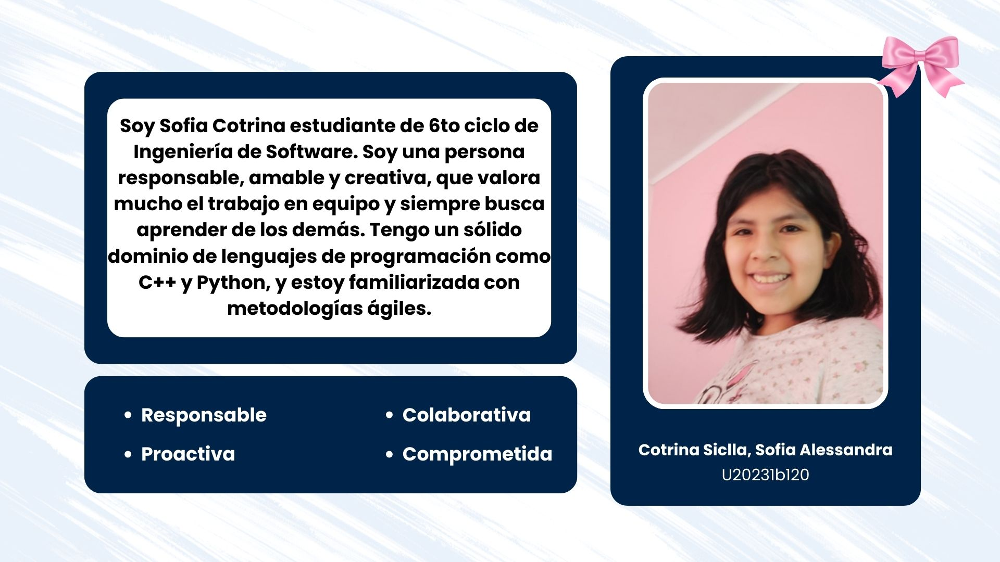
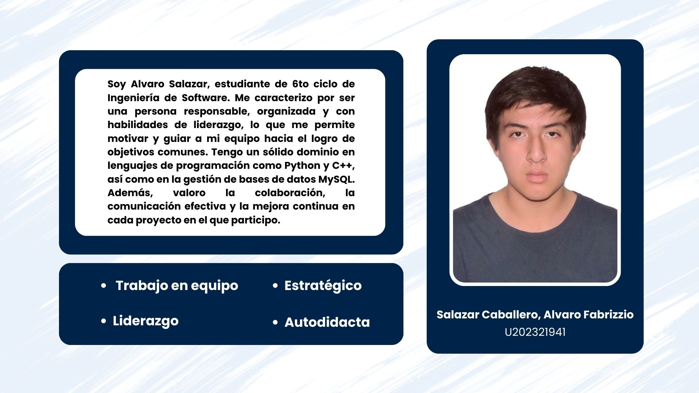
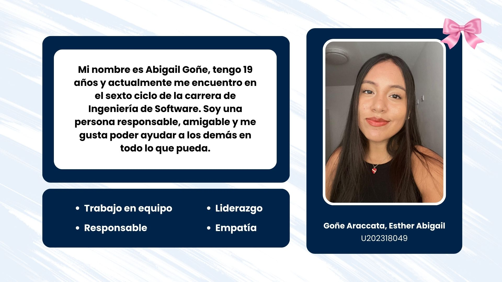
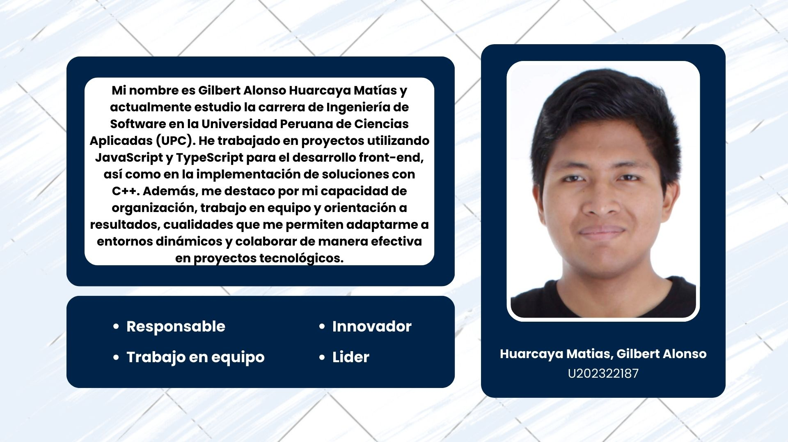
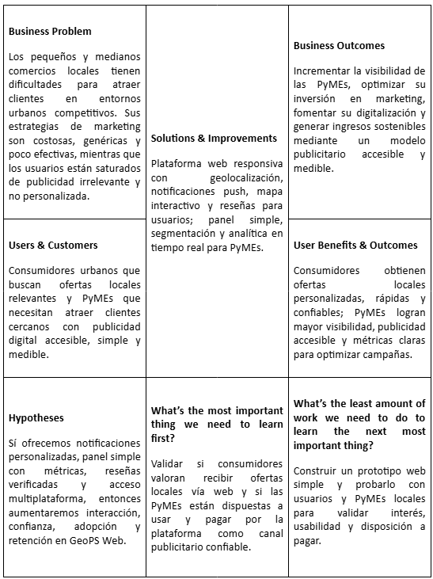

  
## Universidad Peruana de Ciencias Aplicadas

**Ingeniería de Software**

**Ciclo:** 2025-2

**Curso:** Desarrollo de Aplicaciones Open Source

**Sección:** 7391

**Profesor:** Mori Paiva, Hugo Allan

----

## Informe de Trabajo Final

**Startup:** GeoPsLabs

**Nombre del producto:** GeoPs

#### Relación de integrantes

| Integrante                              | Código         |
|-----------------------------------------|----------------|
| Huapaya Galindo, Dyaron                 | U202322855     |
| Huarcaya Matias, Gilbert Alonso         | u202322187     |
| Salazar Caballero, Alvaro Fabrizzio     | u202321941     |
|                                         |                |
|                                         |                |

 
<h3>Agosto 2025</h3>
 

  

---
### Registro de Versiones

  
|**Versión**|**Fecha**|**Autor**|**Descripción de modificación**|
| - | - | - | - |

  

---

# Project Report Collaboration Insights

URL de Organización de GitHub DevWebUPC: 
[https://github.com/OpenSourceDevUPC](https://github.com/OpenSourceDevUPC)

URL del Repositoria del Project Report:
[https://github.com/OpenSourceDevUPC/Project-Report-GeoPS](https://github.com/OpenSourceDevUPC/Project-Report-GeoPS)

<strong>*Entrega TB1:*</strong>

+ Desarrollo de Actividades:
+ Evidencias de colaboracion y commits:

---
# Contenido
- [Contenido](#contenido)
- [Student Outcome](#student-outcome)
- [Capítulo 1: Introducción](#capitulo-1-introducción)
  - [1.1. Startup Profile](#11-startup-profile)
    - [1.1.1. Descripción de la StartUp](#111-descripcion-del-startup)
    - [1.1.2. Perfiles de integrantes del equipo](#112-perfiles-de-integrantes-del-equipo)
  - [1.2. Solution Profile](#12-solution-profile)
    - [1.2.1 Antecedentes y problemática](#121-antecedentes-y-problemática)
    - [1.2.2 Lean UX Process](#122-lean-ux-process)
      - [1.2.2.1 Lean UX Problem Statement](#1221-lean-ux-problem-statements)
      - [1.2.2.2 Lean UX Assumptions](#1222-lean-ux-assumptions)
      - [1.2.2.3 Lean UX Hypothesis Statements](#1223-lean-ux-hypothesis-statements)
      - [1.2.2.4 Lean UX Canvas](#1224-lean-ux-canvas)
  - [1.3. Segmentos Objetivo](#13-segmentos-objetivos)
  
- [Capítulo 2: Requirements Elicitation & Analysis](#capitulo-2-requirements-elicitation--analysis)
  - [2.1. Competidores](#21-competidores)
    - [2.1.1. Análisis competitivo](#211-analisis-competitivo)
    - [2.1.2. Estrategias y tácticas frente a competidores](#212-estrategias-y-tácticas-frente-a-competidores)
  - [2.2 Entrevistas](#22-entrevistas)
    - [2.2.1 Diseño de entrevistas](#221-diseño-de-entrevistas)
    - [2.2.2 Registro de Entrevistas](#222-registro-de-entrevistas)
    - [2.2.3. Análisis de entrevistas](#223-análisis-de-entrevistas)
  - [2.3. Needfinding](#23-needfinding)
    - [2.3.1. User Personas](#231-user-personas)
    - [2.3.2 User Task Matrix](#232--user-task-matrix)
    - [2.3.3. User Journey Mapping](#233-user-journey-mapping)
    - [2.3.4. Empathy Mapping](#234-empathy-mapping)
    - [2.3.5. As-is Scenario Mapping](#235-as-is-scenario-mapping)
  - [2.4. Ubiquitous Language](#24-ubiquitous-language)
    
- [Capítulo 3: Requirements Specification](#capitulo-3-requirements-specification)
  - [3.1. To-Be Scenario Mapping](#31-to-be-scenario-mapping)
  - [3.2. User Stories](#32-user-stories)
  - [3.3. Impact Mapping](#33-impact-mapping)
  - [3.4. Product Backlog](#34-product-backlog)

- [Capítulo 4: Product Design](#capítulo-4-product-design)
  - [4.1 Style Guidelines](#41-style-guidelines)
    - [4.1.1. General Style Guidelines](#411-general-style-guidelines)
    - [4.1.2. Web Style Guidelines](#412-web-style-guidelines)
  - [4.2. Information Architecture](#42-information-architecture)
    - [4.2.1. Organization Systems](#421-organization-systems)
    - [4.2.2. Labeling Systems](#422-labeling-systems)
    - [4.2.3. SEO Tags and Meta Tags](#423-seo-tags-and-meta-tags)
    - [4.2.4. Searching Systems](#424-searching-systems)
    - [4.2.5. Navigation Systems](#425-navigation-systems)
  - [4.3 Landing Page UI Design](#43-landing-page-ui-design)
    - [4.3.1. Landing Page Wireframe](#431-landing-page-wireframe)
    - [4.3.2. Landing Page Mock-up](#432-landing-page-mock-up)
  - [4.4 Web Applications UX/UI Design](#44-web-applications-uxui-design)
    - [4.4.1. Web Applications Wireframes](#441-web-applications-wireframes)
    - [4.4.2. Web Applications Wireflow Diagrams](#442-web-applications-wireflow-diagrams)
    - [4.4.3. Web Applications Mock-ups](#443-web-applications-mock-ups)
    - [4.4.4. Web Applications User Flow Diagrams](#444-web-applications-user-flow-diagrams)
  - [4.5. Web Applications Prototyping](#45-web-applications-prototyping)
  - [4.6. Domain-Driven Software Architecture](#46-domain-driven-software-architecture)
    - [4.6.1. Software Architecture Context Diagram](#461-software-architecture-context-diagram)
    - [4.6.2. Software Architecture Container Diagrams](#462-software-architecture-container-diagrams)
    - [4.6.3. Software Architecture Components Diagrams](#463-software-architecture-components-diagrams)
  - [4.7. Software Object-Oriented Design](#47-software-object-oriented-design)
    - [4.7.1. Class Diagrams](#471-class-diagrams)
    - [4.7.2. Class Dictionary](#472-class-dictionary)
  - [4.8. Database Design](#48-database-design)
    - [4.8.1. Database Diagram](#481-database-diagram)
    
- [Capítulo 5: Product Implementation, Validation & Deployment](#capítulo-5-product-implementation-validation--deployment)
  - [5.1. Software Configuration Management](#51-software-configuration-management)
    - [5.1.1. Software Development Environment Configuration](#511-software-development-environment-configuration)
    - [5.1.2. Source Code Management](#512-source-code-management)
    - [5.1.3. Source Code Style Guide & Conventions](#513-source-code-style-guide--conventions)
    - [5.1.4. Software Deployment Configuration](#514-software-deployment-configuration)
  - [5.2. Landing Page, Services & Applications Implementation](#52-landing-page-services--applications-implementation)
    - [5.2.1. Sprint 1](#521-sprint-1)
      - [5.2.1.1. Sprint Planning 1](#5211-sprint-planning-1)
      - [5.2.1.2. Aspect Leaders and Collaborators](#5212-aspect-leaders-and-collaborators)
      - [5.2.1.3. Sprint Backlog 1](#5213-sprint-backlog-1)
      - [5.2.1.4. Development Evidence for Sprint Review ](#5214-development-evidence-for-sprint-review)
      - [5.2.1.5. Execution Evidence for Sprint Review](#5215-execution-evidence-for-sprint-review)
      - [5.2.1.6. Services Documentation Evidence for Sprint Review](#5216-services-documentation-evidence-for-sprint-review)
      - [5.2.1.7. Software Deployment Evidence for Sprint Review](#5217-software-deployment-evidence-for-sprint-review)
      - [5.2.1.8. Team Collaboration Insights during Sprint](#5218-team-collaboration-insights-during-sprint)
      
- [Conclusiones](#conclusiones)
- [Bibliografía](#bibliografía)
- [Anexos](#anexos)

# Student Outcome
 

   
   |Criterio Específico|Acciones Realizadas|Conclusiones|
   |-------------------|-------------------|------------|
   
 

## Capitulo 1: Introducción
### 1.1. Startup Profile
  #### 1.1.1. Descripcion del Startup
  
  **GeoPS Labs** es una startup enfocada en el desarrollo de soluciones tecnológicas que conectan comercios locales con usuarios mediante publicidad **hiperlocalizada** basada en análisis de **geolocalización inteligente**. A través de una **plataforma web accesible** desde cualquier navegador, los usuarios pueden visualizar ofertas en tiempo real, mientras que los comercios acceden a un **panel de gestión de campañas** con herramientas de marketing basadas en proximidad y perfil de   movimiento. Esto permite aumentar la conversión de sus estrategias publicitarias con un menor costo y mayor control de resultados. **GeoPS Labs** apuesta por combinar **tecnología, datos y experiencia de usuario** para generar beneficios reales, priorizando siempre la **privacidad** y la **relevancia** en la entrega de contenidos.
  
  ---
  
  #### Misión
  Conectar personas y comercios de manera inteligente y relevante, mejorando la experiencia de compra diaria mediante tecnología web de geolocalización respetuosa y personalizada.
  
  #### Visión
  Ser la **plataforma web líder en publicidad hiperlocalizada en Latinoamérica**, revolucionando la manera en que los comercios y usuarios interactúan en el entorno digital urbano.
  
  #### 1.1.2. Perfiles de Integrantes del equipo

  <h2 align="center">Nuestro Equipo</h2>

  

  
   
  **Alessandra**
  
   
  **Álvaro**
  
   
  **Dyron**
  
   
  **Esther**
  
   
  **Gilbert**
  
  

  ---

### 1.2. Solution Profile

**GeoPS Labs (Geo Publicity Service)** es una plataforma web que conecta comercios locales con consumidores mediante **geolocalización inteligente** y **notificaciones web push**, ofreciendo promociones y publicidad relevante en tiempo real.  

La solución permite a los negocios gestionar **campañas digitales** de manera sencilla y accesible desde un navegador, mientras que los usuarios disfrutan de una **experiencia rápida y personalizada** sin necesidad de descargar aplicaciones.  

Con un **diseño responsive** que se adapta a cualquier dispositivo, **GeoPS Labs** busca:  

- Mejorar la experiencia de compra diaria.  
- Impulsar la **digitalización de las PyMEs**.  
- Fortalecer la conexión entre negocios y clientes en el **entorno urbano peruano**.  

  #### 1.2.1 Antecedentes y problemática
  Las pequeñas y medianas empresas (PyMEs) en el Perú, que representan más del 99% del sector empresarial, enfrentan barreras para implementar marketing digital debido a costos, falta de conocimiento y complejidad tecnológica, lo que las mantiene dependientes de métodos tradicionales poco medibles (PCM, 2023). A la par, los consumidores urbanos muestran fatiga publicitaria, pues más del 60% desconfía de anuncios genéricos y exige mensajes relevantes y auténticos (Reyes et al., 2021). Aunque existen plataformas como Groupon o Tiendeo, estas suelen centrarse en cupones generales sin personalización profunda, dejando un vacío en la conexión real entre negocios y clientes locales. Este problema se intensifica considerando que los peruanos pasan más de 5 horas diarias en internet (Loza, 2024), pero carecen de un espacio centralizado para acceder a ofertas verificadas. Así, mientras las PyMEs pierden oportunidades por no poder digitalizarse con eficiencia (OECD, 2020), los consumidores ignoran promociones valiosas por falta de confianza y saturación. GeoPS Web busca cerrar esta brecha ofreciendo una plataforma responsiva y accesible desde cualquier navegador, que conecte de manera transparente y personalizada a usuarios y negocios locales.

  ##### 1.2.1.1. What
  ##### 1.2.1.1.1. ¿Cuál es el problema?
  Las PyMEs latinoamericanas enfrentan barreras estructurales para implementar estrategias de marketing digital: altos costos de inversión, falta de conocimiento técnico y dificultad para medir resultados. El Banco Interamericano de Desarrollo (BID, 2020) reporta que el 74% de las micro y pequeñas empresas de la región carece de capacidades para adoptar herramientas digitales que mejoren su competitividad. Por otro lado, los consumidores manifiestan una creciente fatiga publicitaria: un estudio de Nielsen (2021) indica que el 64% de los usuarios en América Latina considera los anuncios en línea excesivos o irrelevantes, lo que genera desconfianza y menor efectividad en la comunicación comercial.

  ##### 1.2.1.1.2. ¿Cuál es la relación con la persona en cuestión?
  Para los consumidores urbanos, la problemática se traduce en frustración: reciben publicidad genérica que no responde a su contexto ni necesidades inmediatas, lo que significa pérdida de oportunidades de ahorro y tiempo. Para las PyMEs, implica ineficiencia: continúan invirtiendo en publicidad tradicional o redes sociales sin métricas claras, lo que reduce su retorno de inversión y limita su capacidad de competir con grandes empresas (World Bank, 2019). Ante este panorama, GeoPS Web surge como una solución que, a través de una plataforma accesible desde cualquier navegador, conecta directamente a negocios locales con usuarios mediante publicidad hiperlocal y ofertas contextualizadas en tiempo real.

  ##### 1.2.1.2. When
  ##### 1.2.1.2.1. ¿Cuándo sucede el problema?
  El problema se hace más evidente en los momentos de decisión de compra, cuando los consumidores buscan información sobre productos o servicios cercanos y la publicidad que reciben no es contextual ni personalizada. Según el Informe Digital 2023 de DataReportal (Kemp, 2023), los usuarios peruanos pasan en promedio 5 horas y 28 minutos al día conectados a internet, gran parte de ese tiempo navegando en buscadores, redes sociales y plataformas de comercio electrónico. Sin embargo, en esos momentos clave, la publicidad que encuentran suele ser masiva y poco segmentada, lo que disminuye su utilidad y su capacidad de influir en la decisión de compra.

  #### 1.2.1.2.2. ¿Cuándo utiliza el cliente el producto?
  Los consumidores pueden acceder a GeoPS Web en cualquier momento de su jornada digital, ya sea desde la computadora en el trabajo, la laptop en casa o el smartphone en movilidad. A diferencia de las aplicaciones móviles que requieren instalación, la versión web elimina fricciones y permite un acceso inmediato, especialmente en instantes donde la proximidad y la oportunidad son factores decisivos. Esto resulta clave porque, de acuerdo con Think with Google (2019), el 76% de las personas que buscan algo cercano en su dispositivo visitan un negocio relacionado en el plazo de 24 horas, y el 28% de esas búsquedas resultan en una compra. Con GeoPS Web, se busca que esas oportunidades no se pierdan por falta de visibilidad o relevancia.

  ##### 1.2.1.3. Where
  ##### 1.2.1.3.1. ¿Dónde está el cliente cuando usa el producto?
  El cliente puede acceder a GeoPS Web desde cualquier lugar con conexión a internet: en casa, en el trabajo o en movilidad desde un dispositivo con navegador. Gracias a la geolocalización habilitada en navegadores modernos, la plataforma identifica la ubicación en tiempo real y muestra ofertas relevantes al contexto inmediato. Este acceso multiplataforma permite que la experiencia sea consistente sin importar si se navega desde una computadora, una laptop o un teléfono. Según el Pew Research Center (2021), más del 90% de usuarios en economías emergentes usan varios dispositivos para conectarse a internet, lo que refuerza la necesidad de soluciones responsivas como GeoPS Web.

  ##### 1.2.1.3.2. ¿A dónde se dirige?
  Generalmente, el usuario se desplaza hacia lugares de trabajo, estudio, compras u ocio, y es en esos trayectos donde las ofertas cercanas adquieren mayor valor. GeoPS Web aprovecha estos desplazamientos para recomendar promociones en comercios ubicados a lo largo de las rutas habituales o en zonas de tránsito frecuente. Este enfoque se justifica porque, de acuerdo con Think with Google (2019), el 76% de las personas que realizan búsquedas locales en su dispositivo visitan un negocio relacionado en las siguientes 24 horas, lo que demuestra la relevancia de la publicidad contextualizada por proximidad.

  ##### 1.2.1.3.3. ¿Dónde surge el problema?
  La problemática surge principalmente en entornos urbanos, donde existe una amplia variedad de comercios pero los consumidores no cuentan con un canal digital centralizado que organice y personalice la información. Los usuarios suelen recibir anuncios masivos y dispersos, mientras que las PyMEs carecen de herramientas accesibles para llegar a clientes cercanos. Según el Banco Mundial (2019), esta desconexión limita la competitividad de los pequeños negocios en América Latina y genera pérdidas tanto para comerciantes como para consumidores que buscan opciones relevantes. GeoPS Web busca resolver esta brecha mediante publicidad hiperlocal y transparente desde el navegador.

  ##### 1.2.1.4. Who
  ##### 1.2.1.4.1. ¿Quiénes están involucrados?
  En el ecosistema de GeoPS Web intervienen principalmente tres actores: los consumidores urbanos, que buscan ofertas relevantes y verificadas; las PyMEs locales, que requieren herramientas accesibles para digitalizar su publicidad; y los administradores de la plataforma, responsables de garantizar la seguridad, usabilidad y transparencia del servicio. Según el Banco Interamericano de Desarrollo (2020), la digitalización de las PyMEs es un factor clave para el crecimiento económico regional, pero necesita de intermediarios tecnológicos que faciliten el acceso. GeoPS Web cumple este rol de puente al conectar intereses complementarios.

  ##### 1.2.1.4.2. ¿A quiénes les sucede el problema?
  El problema afecta directamente a los consumidores que reciben publicidad genérica e irrelevante, lo que genera desconfianza y pérdida de oportunidades de ahorro. También impacta en las PyMEs, que no logran competir en igualdad de condiciones frente a grandes empresas con mayores recursos en marketing digital. Un estudio de Nielsen (2021) reveló que el 64% de los usuarios en Latinoamérica considera que los anuncios digitales no se ajustan a sus necesidades, lo que refuerza la brecha entre lo que las PyMEs ofrecen y lo que los consumidores esperan encontrar.
  
  ##### 1.2.1.4.3. ¿Quién lo utilizará?
  La plataforma será usada por dos públicos principales: los usuarios finales, que accederán desde el navegador para descubrir promociones locales personalizadas en tiempo real, y las PyMEs afiliadas, que utilizarán el panel web para crear, gestionar y medir campañas de manera sencilla. A diferencia de una app móvil que requiere instalación, el formato web permite un acceso inmediato y multiplataforma, eliminando barreras técnicas. De acuerdo con Statista (2022), más del 70% de los consumidores valoran soluciones digitales fáciles de usar y sin procesos complejos de instalación, lo que refuerza el valor de GeoPS como aplicación web responsiva.
  
  ##### 1.2.1.5. Why
  ##### 1.2.1.5.1. ¿Cuál es la causa del problema?
  Las causas se dividen entre consumidores y negocios. En el caso de las PyMEs, la principal barrera es la falta de recursos financieros, conocimientos técnicos y personal especializado para ejecutar campañas digitales, lo que las mantiene atadas a métodos tradicionales poco medibles (BID, 2020). Para los usuarios, la saturación de publicidad genérica y la baja credibilidad de los anuncios en línea generan desconfianza y reducen el interés en interactuar con ofertas (Nielsen, 2021). A nivel estructural, el Banco Mundial (2019) identifica que la limitada adopción tecnológica en América Latina frena la competitividad de los pequeños negocios frente a grandes cadenas con mayor inversión digital. En conjunto, estas causas alimentan una brecha: comercios que no logran llegar a sus clientes cercanos y consumidores que no encuentran información relevante en el momento oportuno.

  ##### 1.2.1.6. How
  ##### 1.2.1.6.1. ¿En qué condiciones los clientes usan nuestro producto?
  Los usuarios acceden a GeoPS Web desde navegadores en momentos de necesidad inmediata, cuando buscan ofertas cercanas o planean una compra. Requieren rapidez, personalización y simplicidad, mientras que las PyMEs lo usan en condiciones de bajo costo y facilidad de gestión (Think with Google, 2019).

  ##### 1.2.1.6.2. ¿Cómo nos conocieron los compradores?
  La plataforma puede darse a conocer mediante redes sociales, buscadores y marketing de contenidos. En Perú, más del 70% de los usuarios descubre nuevas marcas en línea, principalmente a través de anuncios digitales y recomendaciones (Kemp, 2023).
  
  ##### 1.2.1.6.3. ¿Cómo prefieren los usuarios acceder a nuestro contenido?
  Prefieren una combinación de notificaciones web push (inmediatez) y búsqueda activa dentro del sitio (autonomía). Un 60% de consumidores latinoamericanos valoran la personalización contextual de la publicidad (Nielsen, 2021).
  
  ##### 1.2.1.6.4. ¿Qué llevó a la persona a llegar a esta situación?
  Los consumidores llegaron aquí por la saturación de publicidad genérica y la falta de confianza en anuncios. Las PyMEs, en cambio, por la presión de digitalizarse y las barreras económicas y técnicas que enfrentan (World Bank, 2019).
  
  ##### 1.2.1.7. How much
  El impacto económico y social de la problemática es considerable. Para las PyMEs, representa pérdidas al no captar clientes cercanos ni medir el retorno de inversión en publicidad. El BID (2020) estima que la digitalización puede aumentar en más de 30% las ventas de pequeñas empresas que adoptan herramientas tecnológicas. Para los consumidores, implica ahorro de tiempo y dinero al acceder a ofertas relevantes en el momento oportuno. GeoPS Web busca capturar ese valor mediante un modelo accesible y medible desde el navegador.

---
  #### 1.2.2. Lean UX Process
  
  ##### 1.2.2.1. Lean UX Problem Statements
  - Hemos observado que las PyMEs locales tienen dificultades para llegar a clientes cercanos de manera digital, ya que dependen de publicidad tradicional poco efectiva y costosa.  
  **¿Cómo podemos ayudar a estos negocios a atraer clientes cercanos mediante un canal web accesible y medible?**

- Hemos observado que los consumidores urbanos se sienten abrumados por publicidad genérica e irrelevante que no responde a su contexto inmediato.  
  **¿Cómo podemos ofrecerles publicidad personalizada y contextual que mejore su experiencia y confianza al buscar ofertas locales?**

- Hemos observado que muchas PyMEs no cuentan con métricas claras para evaluar la efectividad de su publicidad.  
  **¿Cómo podemos proveerles un panel web simple y con analítica en tiempo real que les permita medir y optimizar sus campañas?**

- Hemos observado que los usuarios desconfían de las ofertas online por experiencias pasadas con anuncios engañosos.  
  **¿Cómo podemos garantizar que las ofertas en GeoPS Web sean auténticas y transparentes, reforzando la credibilidad de la plataforma?**

---
  ##### 1.2.2.2. Lean UX Assumptions
  
  **Business Outcomes (Resultados de negocio que esperamos)**  
- Incrementar en al menos un 20% las ventas de las PyMEs afiliadas en los primeros 6 meses, gracias a la visibilidad que obtendrán en GeoPS Web (BID, 2020).  
- Mejorar el retorno de inversión en marketing digital de las PyMEs en un 15% durante el primer año, al reemplazar publicidad genérica por campañas segmentadas.  
- Aumentar en un 30% la adopción de herramientas digitales por parte de las PyMEs en el primer año, impulsando su transición hacia modelos de publicidad más eficientes.  
- Garantizar un crecimiento sostenido de ingresos para GeoPSLabs a través de un modelo freemium/publicidad pagada, escalable en el tiempo.  

**User Outcomes (Resultados esperados para los usuarios)**  
- Los consumidores podrán descubrir con facilidad ofertas locales verificadas desde cualquier navegador, ahorrando tiempo y dinero.  
- Los usuarios recibirán notificaciones web push con promociones relevantes según su ubicación y preferencias, reduciendo la saturación publicitaria.  
- Las PyMEs podrán crear y gestionar campañas en pocos pasos, con métricas claras (alcance, clics, conversiones) accesibles en tiempo real.  
- Se generará mayor confianza al transparentar información sobre vigencia, condiciones de ofertas y reseñas de otros usuarios.  

**Features (Características clave que lo habilitan)**  

*Para consumidores:*  
- Listado de ofertas y promociones filtrables por ubicación, categoría y distancia.  
- Mapa interactivo con geolocalización vía navegador.  
- Notificaciones web push sobre ofertas cercanas.  
- Posibilidad de guardar y compartir promociones.  
- Sistema de reseñas y calificación de comercios.  

*Para negocios:*  
- Panel web para creación y gestión de campañas publicitarias.  
- Segmentación de audiencia por ubicación y preferencias.  
- Analítica en tiempo real con métricas de conversión.  
- Opciones de campañas flexibles (costo por clic, impresiones, tiempo de vigencia).  
- Herramientas para fidelización (promociones exclusivas para clientes recurrentes).  

---
  ##### 1.2.2.3. Lean UX Hypothesis Statements

- **Si implementamos un sistema de notificaciones web push** para informar a los consumidores sobre ofertas cercanas y relevantes,  
  **entonces** observaremos que los usuarios interactúan con mayor frecuencia con la plataforma y visitan más negocios locales,  
  **porque asumimos** que los consumidores valoran información inmediata y contextual para decidir sus compras,  
  **mediremos** la tasa de apertura de notificaciones, clics en ofertas y visitas a negocios registrados.  

- **Si ofrecemos a las PyMEs un panel web intuitivo** para crear y gestionar campañas con segmentación por ubicación y categoría,  
  **entonces** aumentará la efectividad de sus campañas y mejorará el retorno de inversión,  
  **porque asumimos** que la simplicidad y la personalización harán más accesible el marketing digital,  
  **mediremos** el CTR (Click Through Rate), conversiones registradas y ROI de campañas creadas en la plataforma.  

- **Si incluimos un sistema de reseñas y valoraciones verificadas** por parte de los consumidores,  
  **entonces** aumentará la confianza del usuario en las ofertas publicadas y la reputación online de los negocios,  
  **porque asumimos** que los usuarios confían más en experiencias de otros compradores que en anuncios directos,  
  **mediremos** el número de reseñas publicadas, la calificación promedio de negocios y el impacto en la interacción con ofertas.  

- **Si integramos un mapa interactivo** con la ubicación de los negocios afiliados y la distancia desde el usuario,  
  **entonces** facilitaremos la decisión de visitar un local cercano,  
  **porque asumimos** que la ubicación y la conveniencia influyen directamente en la elección de compra,  
  **mediremos** el número de búsquedas realizadas en el mapa, clics en rutas sugeridas y visitas a negocios asociados.
---
  
  ##### 1.2.2.4. Lean UX Canvas

  

  

### 1.3. Segmentos objetivos

#### Segmento Objetivo #1: Consumidores de ofertas locales

**Aspectos Demográficos**  
- Sexo: Todos los géneros.  
- Edad: 18 a 45 años.  
- Nivel Socioeconómico: Medio y medio–alto (jóvenes profesionales, estudiantes, familias).  

**Aspectos Geográficos**  
- Nacionalidad: Peruana.  
- Zona Geográfica: Áreas urbanas con alta concentración de comercios.  

**Aspectos Psicográficos**  
- Dolor Principal: Dificultad para encontrar promociones relevantes y confiables en el momento de compra.  
- Objetividad: Consumidores que buscan ahorrar tiempo y dinero accediendo a ofertas locales actualizadas.  
- Nuestra Solución: Proveer una plataforma web con notificaciones personalizadas, mapa interactivo y reseñas verificadas para facilitar el descubrimiento de promociones cercanas.  

---

#### Segmento Objetivo #2: Dueños de negocios locales

**Aspectos Demográficos**  
- Sexo: Todos los géneros.  
- Edad: 25 años a más.  
- Nivel Socioeconómico: Medio (propietarios o administradores de pequeños y medianos negocios).  

**Aspectos Geográficos**  
- Nacionalidad: Peruana.  
- Zona Geográfica: Áreas urbanas con alta competencia comercial.  

**Aspectos Psicográficos**  
- Dolor Principal: No poder atraer clientes fácilmente debido a la saturación de publicidad tradicional y digital poco efectiva.  
- Objetividad: Pequeños y medianos empresarios que buscan aumentar su visibilidad y atraer clientes cercanos con bajo costo.  
- Nuestra Solución: Brindar un panel web intuitivo con campañas segmentadas, métricas en tiempo real y opciones de publicidad accesible para aumentar la competitividad.  

---

## Capitulo 2: Requirements Elicitation & Analysis
### 2.1. Competidores
  #### 2.1.1. Analisis competitivo
  #### 2.1.2. Estrategias y tácticas frente a competidores 
### 2.2. Entrevistas
  #### 2.2.1. Diseño de entrevistas
  #### 2.2.2. Registro de entrevistas
  #### 2.2.3. Análisis de entrevistas
### 2.3. Needfinding
  #### 2.3.1. User Personas
  #### 2.3.2  User Task Matrix
  #### 2.3.3. User Journey Mapping
  #### 2.3.4. Empathy Mapping
  #### 2.3.5. As-is Scenario Mapping
### 2.4. Ubiquitous Language   

## Capitulo 3: Requirements Specification 
### 3.1. To-Be Scenario Mapping
### 3.2. User Stories
### 3.3. Impact Mapping
### 3.4. Product Backlog

## Capítulo 4: Product Design
### 4.1. Style Guidelines
  #### 4.1.1. General Style Guidelines  
  #### 4.1.2. Web Style Guidelines
### 4.2. Information Architecture
  #### 4.2.1. Organization Systems 
  #### 4.2.2. Labeling Systems 
  #### 4.2.3. SEO Tags and Meta Tags
  #### 4.2.4. Searching Systems
  #### 4.2.5. Navigation Systems  
### 4.3. Landing Page UI Design
  #### 4.3.1. Landing Page Wireframe  
  #### 4.3.2. Landing Page Mock-up 
### 4.4. Web Applications UX/UI Design
  #### 4.4.1. Web Applications Wireframes  
  #### 4.4.2. Web Applications Wireflow Diagrams  
  #### 4.4.3. Web Applications Mock-ups  
  #### 4.4.4. Web Applications User Flow Diagrams  
### 4.5. Web Applications Prototyping.
### 4.6. Domain-Driven Software Architecture
  #### 4.6.1. Software Architecture Context Diagram  
  #### 4.6.2. Software Architecture Container Diagrams  
  #### 4.6.3. Software Architecture Components Diagrams
### 4.7. Software Object-Oriented Design
  #### 4.7.1. Class Diagrams  
  #### 4.7.2. Class Dictionary 
### 4.8. Database Design
  #### 4.8.1. Database Diagram 

  ## Capítulo 5: Product Implementation, Validation & Deployment
### 5.1. Software Configuration Management
  #### 5.1.1. Software Development Environment Configuration  
  #### 5.1.2. Source Code Management  
  #### 5.1.3. Source Code Style Guide & Conventions  
  #### 5.1.4. Software Deployment Configuration
### 5.2. Landing Page, Services & Applications Implementation
### 5.2.1. Sprint 1
#### 5.2.1.1. Sprint Planning 1  
#### 5.2.1.2. Aspect Leaders and Collaborators  
#### 5.2.1.3. Sprint Backlog 1  
#### 5.2.1.4. Development Evidence for Sprint Review  
#### 5.2.1.5. Execution Evidence for Sprint Review  
#### 5.2.1.6. Services Documentation Evidence for Sprint Review  
#### 5.2.1.7. Software Deployment Evidence for Sprint Review  
#### 5.2.1.8. Team Collaboration Insights during Sprint

## Conclusiones
## Anexos
## Bibliografía
