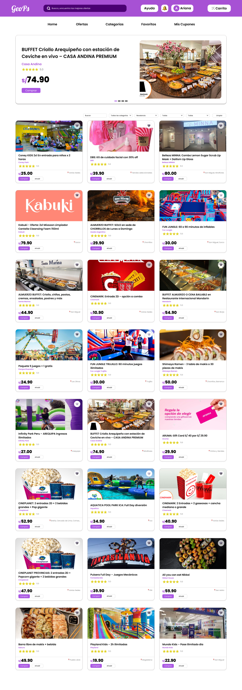
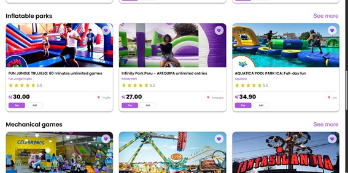

<div align="center" style="margin-top: -5px;">


  
## Universidad Peruana de Ciencias Aplicadas

**Facultad:** Ingeniería

**Carrera:** Ingeniería de Software

**Periodo:** 2025-20

**Código del Curso**: 1ASI0729

**Curso:** Desarrollo de Aplicaciones Open Source

**NRC:** 7391

**Profesor:** Mori Paiva, Hugo Allan

### Informe de Trabajo Final

**Startup:** GeoPsLabs

**Nombre del producto:** GeoPs

***“Tu ciudad, tus promociones, tu ahorro.”***

#### Relación de integrantes

| Integrante                              | Código         |
|-----------------------------------------|----------------|
| Cotrina Siclla, Sofia Alessandra        | u20231b120     |
| Goñe Araccata, Esther Abigail           | u202318049     |
| Huapaya Galindo, Dyron                  | u202322855     |
| Huarcaya Matias, Gilbert Alonso         | u202322187     |
| Salazar Caballero, Alvaro Fabrizzio     | u202321941     |

<div align="center"><h3>Diciembre 2025</h3></div><br>

</div>

---

### Registro de Versiones

| Versión | Fecha | Autor | Descripción de modificación |
| :---- | :---- | :---- | :---- |
| TB1 | 21/09/2025 | Cotrina Siclla, Sofia Alessandra <br> Goñe Araccata, Esther Abigail <br> Huapaya Galindo, Dyron <br> Huarcaya Matias, Gilbert Alonso <br> Salazar Caballero, Alvaro Fabrizzio | En la primera entrega del informe de nuestro proyecto, hemos realizado los primeros 5 capítulos del informe y también entregamos la primera versión del landing page de GeoPS. |
| TP1 | 10/10/2025 | Cotrina Siclla, Sofía Alessandra<br>Goñe Araccata, Esther Abigail<br>Huapaya Galindo, Dyron<br>Huarcaya Matías, Gilbert Alonso<br>Salazar Caballero, Álvaro Fabrizzio | En la entrega correspondiente a la TP1 del proyecto GeoPS, se desarrollaron y documentaron todas las funcionalidades del front-end orientado al usuario, incluyendo las vistas principales, el Centro de Ayuda, la integración de componentes dinámicos y la mejora de la experiencia de navegación en la plataforma. Asimismo, se actualizó el Event Storming con los flujos centrados en el usuario consumidor. |
| TB2 | 16/11/2025 | Cotrina Siclla, Sofía Alessandra<br>Goñe Araccata, Esther Abigail<br>Huapaya Galindo, Dyron<br>Huarcaya Matías, Gilbert Alonso<br>Salazar Caballero, Álvaro Fabrizzio | En la entrega correspondiente a la TB2 del proyecto GeoPS, se desarrollaron todas las funcionalidades del back-end orientado al desarrollo de la base de datos, despliegue del backend y conexión con el frontend, además de correcciones e implementación de funcionalidades del frontend orientado a los mapas y geolocalización del usuario consumidor.|
| TF | 04/12/2025 | Cotrina Siclla, Sofía Alessandra<br>Goñe Araccata, Esther Abigail<br>Huapaya Galindo, Dyron<br>Huarcaya Matías, Gilbert Alonso<br>Salazar Caballero, Álvaro Fabrizzio | En la última entrega del informe de nuestro proyecto GeoPS, se realizaron las correcciones correspondientes del sistema y se completó la implementación final del frontend y backend, asegurando la integración total de las funcionalidades, su despliegue en la nube y el funcionamiento operativo de la plataforma para los usuarios consumidores y proveedores. |

</div>

---

# Project Report Collaboration Insights

**Enlace Organización OpenSourceDevUPC de GeoPs**: 
https://github.com/OpenSourceDevUPC

**Enlace Repositorio Project Report**:
https://github.com/OpenSourceDevUPC/Project-Report-GeoPS

<strong>Entrega TB1:</strong>

+ Desarrollo de Actividades:

Durante la elaboración del entregable TB1, el equipo adoptó una metodología de trabajo colaborativa centrada en el uso de Discord como plataforma principal de comunicación. Esta decisión se fundamentó en la preferencia compartida del grupo hacia esta herramienta, la cual facilitó tanto las coordinaciones iniciales como las sesiones regulares de seguimiento y desarrollo del proyecto.

Para garantizar una distribución equitativa del trabajo, el equipo implementó un sistema de asignación de tareas basado en sorteo aleatorio, asegurando que cada integrante asumiera responsabilidades proporcionales y diversas en el desarrollo del informe. Este enfoque promovió la participación activa de todos los miembros y evitó la concentración de cargas de trabajo.

Un aspecto fundamental en el proceso fue el aprovechamiento de las horas de clase destinadas a consultas y retroalimentación docente. Estos espacios resultaron invaluables considerando las diferentes disponibilidades horarias de los integrantes, permitiendo al equipo resolver dudas conceptuales, recibir orientación metodológica y validar el progreso del proyecto de manera oportuna.

<p><strong>Evidencias de colaboración y commits:</strong></p>
<div style="text-align: center;">
  <br><br>
  
</div>

<br>

<strong>Entrega TP:</strong>

+ Desarrollo de Actividades:

Durante el desarrollo del entregable TP1, el equipo mantuvo el enfoque colaborativo adoptado en la entrega anterior, haciendo uso de herramientas compartidas que facilitaron la coordinación y la gestión del trabajo. Para la elaboración del informe, se empleó un documento en Google Docs que permitió registrar los avances del Sprint 2, coordinar las redacciones y realizar revisiones conjuntas en tiempo real.

Gracias a esta metodología, el equipo logró cumplir con los objetivos establecidos para el sprint, consolidando un entregable completo y coherente. A continuación, se presentan las analíticas de participación, que evidencian la distribución equitativa de tareas y la colaboración efectiva de todos los miembros del grupo.

<p><strong>Evidencias de colaboración y commits:</strong></p>
<div style="text-align: center;">
  <br><br>
  
</div>

<br>

<strong>Entrega TB2:</strong>

+ Desarrollo de Actividades:

Durante el desarrollo del entregable TB2, el equipo mantuvo el mismo enfoque colaborativo de la entrega anterior coordinando avances, redactando el informe y revisando los aportes de backend y frontend.

En esta fase se lograron avances importantes. En el backend, se implementaron nuevas funcionalidades, se optimizaron endpoints y se configuró el despliegue, garantizando la correcta conexión con el frontend. En el frontend, se integró el mapa de Google Maps con un map ID personalizado y se añadieron funcionalidades esenciales como la visualización de marcadores y el manejo de eventos dentro del mapa.

Gracias a esta organización y al trabajo equilibrado del equipo, el entregable TB2 se completó de manera coherente y cumpliendo los objetivos del sprint. A continuación, se muestran las analíticas de participación.

<p><strong>Evidencias de colaboración y commits:</strong></p>
<div style="text-align: center;">
  
  <br><br>
  
  
</div>

<br>

<strong>Entrega TF:</strong>

+ Desarrollo de Actividades:

Durante el desarrollo del entregable TF, el equipo consolidó las funcionalidades finales tanto del frontend como del backend, realizando las correcciones necesarias para garantizar la integración completa del sistema. Además, se efectuó el despliegue final de la plataforma GeoPS en la nube y se llevaron a cabo pruebas de validación con usuarios reales, así como una evaluación heurística de usabilidad, cuyos resultados permitieron aplicar mejoras finales al producto.

Asimismo, se completó la documentación integral del proyecto, incorporando métricas de colaboración, evidencias de implementación y conclusiones generales sobre el desempeño del sistema. La organización del equipo se mantuvo mediante sesiones virtuales, distribución equitativa de responsabilidades y revisiones conjuntas del informe, asegurando el cumplimiento exitoso de los objetivos establecidos para el sprint final.

<p><strong>Evidencias de colaboración y commits - Frontend:</strong></p>
<div style="text-align: center;">
  
</div>

<p><strong>Evidencias de colaboración y commits - Backend:</strong></p>
<div style="text-align: center;">
  
</div>

---

# Contenido
- [Project Report Collaboration Insights](#project-report-collaboration-insights)
- [Contenido](#contenido)
- [Student Outcome](#student-outcome)
  - [Capitulo 1: Introducción](#capitulo-1-introducción)
    - [1.1. Startup Profile](#11-startup-profile)
      - [1.1.1. Descripcion del Startup](#111-descripcion-del-startup)
      - [1.1.2. Perfiles de Integrantes del equipo](#112-perfiles-de-integrantes-del-equipo)
    - [1.2. Solution Profile](#12-solution-profile)
      - [1.2.1 Antecedentes y problemática](#121-antecedentes-y-problemática)
        - [1.2.1.1. What](#1211-what)
        - [1.2.1.1.1. ¿Cuál es el problema?](#12111-cuál-es-el-problema)
        - [1.2.1.1.2. ¿Cuál es la relación con la persona en cuestión?](#12112-cuál-es-la-relación-con-la-persona-en-cuestión)
        - [1.2.1.2. When](#1212-when)
        - [1.2.1.2.1. ¿Cuándo sucede el problema?](#12121-cuándo-sucede-el-problema)
        - [1.2.1.2.2. ¿Cuándo utiliza el cliente el producto?](#12122-cuándo-utiliza-el-cliente-el-producto)
        - [1.2.1.3. Where](#1213-where)
        - [1.2.1.3.1. ¿Dónde está el cliente cuando usa el producto?](#12131-dónde-está-el-cliente-cuando-usa-el-producto)
        - [1.2.1.3.2. ¿A dónde se dirige?](#12132-a-dónde-se-dirige)
        - [1.2.1.3.3. ¿Dónde surge el problema?](#12133-dónde-surge-el-problema)
        - [1.2.1.4. Who](#1214-who)
        - [1.2.1.4.1. ¿Quiénes están involucrados?](#12141-quiénes-están-involucrados)
        - [1.2.1.4.2. ¿A quiénes les sucede el problema?](#12142-a-quiénes-les-sucede-el-problema)
        - [1.2.1.4.3. ¿Quién lo utilizará?](#12143-quién-lo-utilizará)
        - [1.2.1.5. Why](#1215-why)
        - [1.2.1.5.1. ¿Cuál es la causa del problema?](#12151-cuál-es-la-causa-del-problema)
        - [1.2.1.6. How](#1216-how)
        - [1.2.1.6.1. ¿En qué condiciones los clientes usan nuestro producto?](#12161-en-qué-condiciones-los-clientes-usan-nuestro-producto)
        - [1.2.1.6.2. ¿Cómo nos conocieron los compradores?](#12162-cómo-nos-conocieron-los-compradores)
        - [1.2.1.6.3. ¿Cómo prefieren los usuarios acceder a nuestro contenido?](#12163-cómo-prefieren-los-usuarios-acceder-a-nuestro-contenido)
        - [1.2.1.6.4. ¿Qué llevó a la persona a llegar a esta situación?](#12164-qué-llevó-a-la-persona-a-llegar-a-esta-situación)
        - [1.2.1.7. How much](#1217-how-much)
      - [1.2.2. Lean UX Process](#122-lean-ux-process)
        - [1.2.2.1. Lean UX Problem Statements](#1221-lean-ux-problem-statements)
        - [1.2.2.2. Lean UX Assumptions](#1222-lean-ux-assumptions)
        - [1.2.2.3. Lean UX Hypothesis Statements](#1223-lean-ux-hypothesis-statements)
        - [1.2.2.4. Lean UX Canvas](#1224-lean-ux-canvas)
    - [1.3. Segmentos objetivos](#13-segmentos-objetivos)
  - [Capitulo 2: Requirements Elicitation \& Analysis](#capitulo-2-requirements-elicitation--analysis)
    - [2.1. Competidores](#21-competidores)
      - [2.1.1. Analisis competitivo](#211-analisis-competitivo)
      - [2.1.2. Estrategias y tácticas frente a competidores](#212-estrategias-y-tácticas-frente-a-competidores)
    - [2.2. Entrevistas](#22-entrevistas)
      - [2.2.1. Diseño de entrevistas](#221-diseño-de-entrevistas)
      - [2.2.2. Registro de entrevistas](#222-registro-de-entrevistas)
      - [2.2.3. Análisis de entrevistas](#223-análisis-de-entrevistas)
    - [2.3. Needfinding](#23-needfinding)
      - [2.3.1. User Personas](#231-user-personas)
      - [2.3.2  User Task Matrix](#232--user-task-matrix)
      - [2.3.3. User Journey Mapping](#233-user-journey-mapping)
      - [2.3.4. Empathy Mapping](#234-empathy-mapping)
    - [2.4. Big Picture Event Storming](#24-big-picture-event-storming)
    - [2.5. Ubiquitous Language](#25-ubiquitous-language)
  - [Capitulo 3: Requirements Specification](#capitulo-3-requirements-specification)
    - [3.1. User Stories](#31-user-stories)
    - [3.2. Impact Mapping](#32-impact-mapping)
    - [3.3. Product Backlog](#33-product-backlog)
  - [Capítulo 4: Product Design](#capítulo-4-product-design)
    - [4.1. Style Guidelines](#41-style-guidelines)
      - [4.1.1. General Style Guidelines](#411-general-style-guidelines)
      - [4.1.2. Web Style Guidelines](#412-web-style-guidelines)
    - [4.2. Information Architecture](#42-information-architecture)
      - [4.2.1. Organization Systems](#421-organization-systems)
      - [4.2.2. Labeling Systems](#422-labeling-systems)
      - [4.2.3. SEO Tags and Meta Tags](#423-seo-tags-and-meta-tags)
      - [4.2.4. Searching Systems](#424-searching-systems)
      - [4.2.5. Navigation Systems](#425-navigation-systems)
    - [4.3. Landing Page UI Design](#43-landing-page-ui-design)
      - [4.3.1. Landing Page Wireframe](#431-landing-page-wireframe)
      - [4.3.2. Landing Page Mock-up](#432-landing-page-mock-up)
    - [4.4. Web Applications UX/UI Design](#44-web-applications-uxui-design)
      - [4.4.1. Web Applications Wireframes](#441-web-applications-wireframes)
      - [4.4.2. Web Applications Wireflow Diagrams](#442-web-applications-wireflow-diagrams)
      - [4.4.3. Web Applications Mock-ups](#443-web-applications-mock-ups)
      - [4.4.4. Web Applications User Flow Diagrams](#444-web-applications-user-flow-diagrams)
    - [4.5. Web Applications Prototyping](#45-web-applications-prototyping)
    - [4.6. Domain-Driven Software Architecture](#46-domain-driven-software-architecture)
      - [4.6.1. Design-Level Event Storming](#461-design-level-event-storming)
      - [4.6.2. Software Architecture Context Diagram](#462-software-architecture-context-diagram)
      - [4.6.3. Software Architecture Container Diagrams](#463-software-architecture-container-diagrams)
      - [4.6.4. Software Architecture Components Diagrams](#464-software-architecture-components-diagrams)
    - [4.7. Software Object-Oriented Design](#47-software-object-oriented-design)
      - [4.7.1. Class Diagrams](#471-class-diagrams)
      - [4.7.2. Class Dictionary](#472-class-dictionary)
    - [4.8. Database Design](#48-database-design)
      - [4.8.1. Database Diagram](#481-database-diagram)
  - [Capítulo 5: Product Implementation, Validation \& Deployment](#capítulo-5-product-implementation-validation--deployment)
    - [5.1. Software Configuration Management](#51-software-configuration-management)
      - [5.1.1. Software Development Environment Configuration](#511-software-development-environment-configuration)
      - [5.1.2. Source Code Management](#512-source-code-management)
      - [5.1.3. Source Code Style Guide \& Conventions](#513-source-code-style-guide--conventions)
      - [5.1.4. Software Deployment Configuration](#514-software-deployment-configuration)
    - [5.2. Landing Page, Services \& Applications Implementation](#52-landing-page-services--applications-implementation)
      - [5.2.1. Sprint 1](#521-sprint-1)
        - [5.2.1.1. Sprint Planning 1](#5211-sprint-planning-1)
        - [5.2.1.2. Aspect Leaders and Collaborators](#5212-aspect-leaders-and-collaborators)
        - [5.2.1.3. Sprint Backlog 1](#5213-sprint-backlog-1)
        - [5.2.1.4. Development Evidence for Sprint Review](#5214-development-evidence-for-sprint-review)
        - [5.2.1.5. Execution Evidence for Sprint Review](#5215-execution-evidence-for-sprint-review)
        - [5.2.1.6. Services Documentation Evidence for Sprint Review](#5216-services-documentation-evidence-for-sprint-review)
        - [5.2.1.7. Software Deployment Evidence for Sprint Review](#5217-software-deployment-evidence-for-sprint-review)
        - [5.2.1.8. Team Collaboration Insights during Sprint](#5218-team-collaboration-insights-during-sprint)
      - [5.2.2. Sprint 2](#522-sprint-2)
        - [5.2.2.1. Sprint Planning 2](#5221-sprint-planning-2)
        - [5.2.2.2. Aspect Leaders and Collaborators](#5222-aspect-leaders-and-collaborators)
        - [5.2.2.3. Sprint Backlog 2](#5223-sprint-backlog-2)
        - [5.2.2.4. Development Evidence for Sprint Review.](#5224-development-evidence-for-sprint-review)
        - [5.2.2.5. Execution Evidence for Sprint Review](#5225-execution-evidence-for-sprint-review)
        - [5.2.2.6. Services Documentation Evidence for Sprint Review](#5226-services-documentation-evidence-for-sprint-review)
        - [5.2.2.7. Software Deployment Evidence for Sprint Review](#5227-software-deployment-evidence-for-sprint-review)
        - [5.2.2.8. Team Collaboration Insights during Sprint](#5228-team-collaboration-insights-during-sprint)
      - [5.2.3. Sprint 3](#523-sprint-3)
        - [5.2.3.1. Sprint Planning 3](#5231-sprint-planning-3)
        - [5.2.3.2. Aspect Leaders and Collaborators](#5232-aspect-leaders-and-collaborators)
        - [5.2.3.3. Sprint Backlog 3](#5233-sprint-backlog-3)
        - [5.2.3.4. Development Evidence for Sprint Review.](#5234-development-evidence-for-sprint-review)
        - [5.2.3.5. Execution Evidence for Sprint Review](#5235-execution-evidence-for-sprint-review)
        - [5.2.3.6. Services Documentation Evidence for Sprint Review](#5236-services-documentation-evidence-for-sprint-review)
        - [5.2.3.7. Software Deployment Evidence for Sprint Review](#5237-software-deployment-evidence-for-sprint-review)
        - [5.2.3.8. Team Collaboration Insights during Sprint](#5238-team-collaboration-insights-during-sprint)
      - [5.2.4. Sprint 4](#524-sprint-4)
        - [5.2.4.1. Sprint Planning 4](#5241-sprint-planning-4)
        - [5.2.4.2. Aspect Leaders and Collaborators](#5242-aspect-leaders-and-collaborators)
        - [5.2.4.3. Sprint Backlog 4](#5243-sprint-backlog-4)
        - [5.2.4.4. Development Evidence for Sprint Review.](#5244-development-evidence-for-sprint-review)
        - [5.2.4.5. Execution Evidence for Sprint Review](#5245-execution-evidence-for-sprint-review)
        - [5.2.4.6. Services Documentation Evidence for Sprint Review](#5246-services-documentation-evidence-for-sprint-review)
        - [5.2.4.7. Software Deployment Evidence for Sprint Review](#5247-software-deployment-evidence-for-sprint-review)
        - [5.2.4.8. Team Collaboration Insights during Sprint](#5248-team-collaboration-insights-during-sprint)
    - [5.3 Validation Interviews](#53-validation-interviews)
      - [5.3.1. Diseño de Entrevistas](#531-diseño-de-entrevistas)
      - [5.3.2. Registro de Entrevistas](#532-registro-de-entrevistas)
      - [5.3.3 Evaluaciones Según Heurísticas](#533-evaluaciones-según-heurísticas)
    - [5.4 Video About-the-Product](#54-video-about-the-product)
  - [Conclusiones](#conclusiones)
  - [Bibliografía](#bibliografía)
  - [Anexos](#anexos)

---

# Student Outcome

<table border="1">
  <tr>
    <th>Criterio específico</th>
    <th>Acciones realizadas</th>
    <th>Conclusiones</th>
  </tr>

  <tr>
    <td><strong>Comunica oralmente con efectividad a diferentes rangos de audiencia.</strong></td>
    <td>
  <p><strong>Cotrina Siclla, Sofia Alessandra</strong></p>
      <p><i>TB1</i></p>
      <p>Participé en las entrevistas con usuarios target, comunicando de manera clara y adaptada tanto a consumidores como a propietarios de PyMEs. Presenté los hallazgos del capítulo 2 a los integrantes del equipo, adaptando el lenguaje técnico para facilitar la     comprensión entre todos los miembros.</p>
      <p><i>TP1</i></p>
      <p>Presenté las funcionalidades del front-end y la integración de componentes del <strong>Centro de Ayuda</strong> (<code>feature/toolbar-help</code>), explicando decisiones de diseño y mejoras de usabilidad. Coordiné con el equipo para ajustar la vista según los hallazgos de validación de usuarios.</p>
      <p><i>TB2</i></p>
      <p>Comuniqué de manera clara los avances del módulo <strong>Identity</strong> durante las reuniones de integración, explicando al equipo el flujo de autenticación, los estados del usuario y la estructura de los componentes asociados. Presenté las validaciones realizadas y coordiné con el equipo la revisión final del report TB2, asegurando que todos comprendieran los cambios aplicados y las mejoras necesarias.</p>
      <p><i>TF</i></p>
      <p>Presenté al equipo los avances en la implementación de las pantallas de frontend para el rol de Owner, detallando los componentes desarrollados y su integración con el backend. Comuniqué las capacidades del sistema para el despliegue en producción, explicando el proceso de configuración y los ajustes necesarios para garantizar la estabilidad del sistema en el entorno final.</p>


  <p><strong>Goñe Araccata, Esther Abigail</strong></p>
      <p><i>TB1</i></p>
      <p>Desarrollé presentaciones visuales para la landing page y web application, comunicando conceptos de diseño de manera efectiva a los integrantes del equipo. Participé en sesiones de feedback sobre wireframes y prototipos con los miembros del equipo, adaptando mi comunicación según el nivel técnico de cada integrante.</p>
      <p><i>TP1</i></p>
      <p>Comuniqué los avances del desarrollo en la vista principal de <strong>Inicio</strong> (<code>feature/home</code>) y <strong>Categorías</strong> (<code>feature/categories</code>), explicando la lógica detrás del diseño responsivo y la interacción visual. Aseguré consistencia en los estilos entre componentes.</p>
      <p><i>TB2</i></p>
      <p>Comuniqué el progreso de los módulos <strong>Offers, Favorites y Reviews</strong>, explicando al equipo los flujos entre vistas, servicios y métodos del backend. Presenté el <strong>Video About The Product</strong>, guiando al equipo en la narrativa visual del funcionamiento de la plataforma. Además, participé activamente en reuniones para ajustar la estructura del report TB2, explicando los componentes visuales y decisiones de diseño tomadas.</p>
      <p><i>TF</i></p>
      <p>Expliqué al equipo la lógica de negocio implementada en el backend para el rol de Owner, detallando los servicios de comando y consulta desarrollados. Comuniqué las estrategias de despliegue utilizadas y coordiné con el equipo la validación final de los flujos de negocio, asegurando que las capacidades comunicativas del sistema fueran claras para todos los usuarios finales.</p>

  <p><strong>Huapaya Galindo, Dyron</strong></p>
      <p><i>TB1</i></p>
      <p>Presenté la arquitectura de software del sistema a los integrantes del equipo, adaptando el nivel de detalle técnico según la experiencia de cada miembro. Lideré sesiones de planificación donde comuniqué efectivamente los requerimientos técnicos y las decisiones de diseño a todo el equipo.</p>
      <p><i>TP1</i></p>
      <p>Expliqué al equipo la arquitectura y comunicación entre componentes del módulo de <strong>Configuración base</strong> (<code>feature/base-configuration</code>), así como la integración con las demás vistas. Lideré revisiones de código y resolví conflictos en ramas de desarrollo.</p>
      <p><i>TB2</i></p>
      <p>Expliqué al equipo la integración del <strong>mapa de Google Maps</strong> con el frontend, detallando la comunicación con el backend, el manejo de geolocalización y la lógica para vincular las ofertas con ubicaciones reales. Presenté las pruebas realizadas y los ajustes necesarios para asegurar un funcionamiento estable. Apoyé la construcción del report TB2 explicando las decisiones técnicas.</p>
      <p><i>TF</i></p>
      <p>Comuniqué los avances en la implementación del backend para el módulo de <strong>Owner</strong>, explicando los endpoints desarrollados y la lógica de gestión de campañas. Presenté al equipo el proceso de despliegue final del sistema, coordinando las capacidades comunicativas entre frontend y backend para asegurar una experiencia fluida en producción.</p>

  <p><strong>Huarcaya Matias, Gilbert Alonso</strong></p>
      <p><i>TB1</i></p>
      <p>Lideré el desarrollo del capítulo 5, analizando el desarrollo de la landing page junto con los integrantes del equipo. Coordiné el trabajo colaborativo en GitHub, facilitando la comunicación para resolver conflictos de integración.</p>
      <p><i>TP1</i></p>
      <p>Coordiné la presentación técnica de las vistas de <strong>Cupones</strong> (<code>feature/coupons</code>) y <strong>Suscripciones</strong> (<code>feature/Subscriptions</code>), comunicando los flujos de usuario y su impacto en la experiencia de navegación. Lideré sesiones de integración entre frontend y backend.</p>
      <p><i>TB2</i></p>
      <p>Comuniqué la creación y estructura del <strong>backend</strong>, explicando al equipo la arquitectura general del sistema, la organización de módulos y los patrones de diseño utilizados. Presenté los avances de <strong>Coupons, Subscriptions, Payments y Cart</strong>, usando diagramas de flujo y endpoints para facilitar la comprensión. Lideré las sesiones de <strong>integración y deployment</strong>, manteniendo informados a los integrantes sobre estados, bloqueos y avances técnicos.</p>
      <p><i>TF</i></p>
      <p>Presenté al equipo la implementación completa del módulo de Notificaciones, tanto en frontend como en backend, explicando el flujo de comunicación en tiempo real y la integración con los demás módulos. Comuniqué las mejoras realizadas en la interfaz visual del frontend para asegurar un diseño responsive que se adapta correctamente a diferentes dispositivos. Coordiné las capacidades del sistema para el despliegue final, liderando las sesiones técnicas sobre configuración de servidores y validación de funcionalidades en producción.</p>

   <p><strong>Salazar Caballero, Alvaro Fabrizzio</strong></p>
      <p><i>TB1</i></p>
      <p>Presenté los hallazgos del análisis de mercado y la investigación de usuarios. Comuniqué efectivamente los insights del capítulo 1, adaptando la presentación según el conocimiento de cada integrante.</p>
      <p><i>TP1</i></p>
      <p>Expliqué los avances en los módulos de <strong>Tarjetas</strong> (<code>feature/cards</code>) y <strong>Identity Access</strong> (<code>feature/Identity-Access</code>), detallando cómo se implementaron los mecanismos de validación y acceso de usuario.</p>
      <p><i>TB2</i></p>
      <p>Expliqué el funcionamiento del módulo <strong>Authentication</strong> y sus mecanismos de acceso, detallando al equipo cómo se gestionan las credenciales, roles y validaciones. Coordiné con frontend y backend para asegurar la correcta integración de las funciones de inicio de sesión. Contribuí a la revisión del <strong>report TB2</strong>, comunicando claramente los ajustes y validaciones implementadas.</p>
      <p><i>TF</i></p>
      <p>Comuniqué al equipo el desarrollo de las pantallas de frontend para el módulo de Owner, detallando la experiencia de usuario y las funcionalidades implementadas. Expliqué las capacidades técnicas del backend desarrollado para soportar las operaciones de los propietarios de negocios. Coordiné con el equipo las estrategias de despliegue del sistema, asegurando la comunicación efectiva de los procesos y validaciones necesarias.</p>
    </td>

   <td>
      <p><strong>TB1:</strong> El equipo mostró una comunicación oral efectiva al presentar entrevistas y hallazgos iniciales, adaptando el discurso según el público.</p>
      <p><strong>TP1:</strong> La comunicación oral se enfocó en la explicación técnica de los módulos del front-end. Cada integrante defendió con claridad su rama de desarrollo, facilitando la integración entre vistas, servicios y componentes, manteniendo alineamiento con la experiencia del usuario.</p>
      <p><strong>TB2:</strong> Durante esta etapa, la comunicación oral permitió coordinar la integración de frontend y backend, deployment y revisión del reporte final. Cada miembro expuso con claridad el estado de sus módulos, las decisiones técnicas y los problemas encontrados, lo que favoreció la resolución oportuna de bloqueos y la consolidación del sistema final.</p>
      <p><strong>TF:</strong> En la entrega final, la comunicación oral se centró en las capacidades comunicativas del sistema completo y el proceso de despliegue en producción. Cada integrante explicó los avances finales del backend para Owner, la implementación de pantallas de frontend, y las funcionalidades de notificaciones. Se coordinó efectivamente el deployment final, asegurando que todos los miembros comprendieran el estado operativo de la plataforma y las mejoras visuales implementadas.</p>
    </td>
  </tr>

  <tr>
    <td><strong>Comunica por escrito con efectividad a diferentes rangos de audiencia.</strong></td>
    <td>
      <p><strong>Cotrina Siclla, Sofia Alessandra</strong></p>
      <p><i>TB1</i></p>
      <p>Redacté secciones del capítulo 2 enfocadas en el análisis de entrevistas y user personas. Documenté los hallazgos de las entrevistas de manera sistemática.</p>
      <p><i>TP1</i></p>
      <p>Documenté la implementación del módulo <strong>Centro de Ayuda</strong> (<code>feature/toolbar-help</code>) y las mejoras de accesibilidad. Redacté instrucciones técnicas claras para la integración con otros componentes.</p>
      <p><i>TB2</i></p>
      <p>Redacté las secciones del reporte TB2 relacionadas al módulo <strong>Identity</strong>, describiendo los flujos de autenticación, validaciones aplicadas y resultados obtenidos durante la integración. Organicé la información de manera clara y estructurada para que tanto compañeros como lectores externos comprendieran el funcionamiento del sistema.</p>
      <p><i>TF</i></p>
      <p>Documenté la implementación de las pantallas de frontend para Owner, siguiendo los principios de DDD en la organización de componentes y servicios. Redacté la documentación técnica del flujo de trabajo en GitFlow, describiendo la estrategia de branching utilizada para el desarrollo de las funcionalidades finales del sistema.</p>

   <p><strong>Goñe Araccata, Esther Abigail</strong></p>
      <p><i>TB1</i></p>
      <p>Elaboré documentación técnica de diseño para la landing page y web application.</p>
      <p><i>TP1</i></p>
      <p>Redacté documentación de los componentes visuales del módulo <strong>Home</strong> y <strong>Categorías</strong>, explicando la jerarquía de elementos y las directrices de estilo CSS.</p>
      <p><i>TB2</i></p>
      <p>Documenté los módulos <strong>Offers, Favorites y Reviews</strong>, explicando sus flujos y decisiones visuales. Redacté descripciones detalladas de las interacciones entre vistas y servicios, además de contribuir a la redacción general del reporte TB2, asegurando coherencia en la narrativa técnica.</p>
      <p><i>TF</i></p>
      <p>Redacté la documentación técnica de la lógica de negocio implementada en el backend para el rol de Owner, aplicando correctamente los patrones de DDD en la descripción de agregados, comandos y consultas. Documenté el uso de GitFlow en el control de versiones, explicando las convenciones de commits y la gestión de branches utilizadas durante el desarrollo final del proyecto.</p>
      
  <p><strong>Huapaya Galindo, Dyron</strong></p>
      <p><i>TB1</i></p>
      <p>Redacté la documentación de arquitectura del software, con diagramas y especificaciones técnicas.</p>
      <p><i>TP1</i></p>
      <p>Documenté la arquitectura técnica de <strong>Base Configuration</strong> y la gestión de estados compartidos. Incluí explicaciones detalladas sobre los hooks y la comunicación de datos entre componentes.</p>
      <p><i>TB2</i></p>
      <p>Redacté las secciones del reporte sobre la integración del <strong>mapa de Google Maps</strong>, detallando la lógica técnica implementada, el manejo de marcadores dinámicos y la relación entre ubicaciones y ofertas. Incluí explicaciones claras sobre la comunicación frontend-backend.</p>
      <p><i>TF</i></p>
      <p>Documenté la arquitectura del backend para el módulo de Owner, siguiendo estrictamente los principios de Domain-Driven Design (DDD) en la estructuración de bounded contexts, servicios de aplicación y repositorios. Redacté la guía de uso de GitFlow implementada en el proyecto, describiendo las estrategias de merge y la resolución de conflictos durante la fase final de desarrollo.</p>
      
  <p><strong>Huarcaya Matias, Gilbert Alonso</strong></p>
      <p><i>TB1</i></p>
      <p>Lideré la redacción del capítulo 5 y la documentación de la landing page.</p>
      <p><i>TP1</i></p>
      <p>Documenté los flujos de los módulos <strong>Coupons</strong> y <strong>Subscriptions</strong>, incluyendo diagramas de flujo y descripciones funcionales. Redacté pautas para las pruebas de integración del front-end.</p>
      <p><i>TB2</i></p>
      <p>Desarrollé la documentación del <strong>backend</strong>, abordando la estructura del proyecto, rutas principales y arquitectura. Redacté las secciones sobre <strong>Coupons, Subscriptions, Payments y Cart</strong>, incluyendo diagramas, flujos y justificación técnica. También documenté el proceso de <strong>deployment</strong> del sistema.</p>
      <p><i>TF</i></p>
      <p>Redacté la documentación completa del módulo de Notificaciones, abarcando tanto la implementación del backend siguiendo los principios de DDD (agregados, comandos, consultas) como el desarrollo del frontend con componentes responsives. Documenté las mejoras visuales aplicadas a la interfaz, incluyendo las adaptaciones para diferentes dispositivos y resoluciones. Desarrollé la guía de GitFlow utilizada en el proyecto, detallando la estrategia de branches, convenciones de commits y el proceso de integración continua implementado para el despliegue final.</p>
      
  <p><strong>Salazar Caballero, Alvaro Fabrizzio</strong></p>
      <p><i>TB1</i></p>
      <p>Redacté secciones fundamentales del capítulo 1 y 3, incluyendo el análisis del problema y la propuesta de valor.</p>
      <p><i>TP1</i></p>
      <p>Redacté la documentación técnica de los módulos <strong>Cards</strong> e <strong>Identity-Access</strong>, describiendo los endpoints de autenticación y la estructura de los componentes visuales asociados al perfil del usuario.</p>
      <p><i>TB2</i></p>
      <p>Redacté la documentación del módulo <strong>Authentication</strong>, explicando los métodos implementados, validaciones de usuario y flujos de acceso. Contribuí a la organización final del reporte TB2, asegurando consistencia en la estructura del documento.</p>
      <p><i>TF</i></p>
      <p>Documenté el desarrollo de las pantallas de frontend para Owner, aplicando los conceptos de DDD en la organización de la capa de presentación y los servicios asociados. Redacté las secciones sobre el uso de GitFlow en el control de versiones del proyecto, incluyendo ejemplos de flujos de trabajo y mejores prácticas aplicadas durante la implementación final del sistema.</p>
   </td>

  <td>
      <p><strong>TB1:</strong> Se redactó documentación clara y coherente que facilitó la comprensión entre integrantes y usuarios entrevistados.</p>
      <p><strong>TP1:</strong> La documentación escrita en esta etapa consolidó las buenas prácticas del desarrollo front-end. Cada miembro explicó detalladamente su módulo y las decisiones de diseño, creando una base sólida para futuras iteraciones y mantenimiento del sistema.</p>
      <p><strong>TB2:</strong> En esta etapa, la documentación escrita consolidó la integración final del proyecto. Cada miembro explicó detalladamente su módulo, los flujos implementados, los problemas encontrados y las decisiones técnicas, contribuyendo a un reporte coherente, completo y alineado con los estándares del curso.</p>
      <p><strong>TF:</strong> En esta etapa final se consolidó el uso correcto de Domain-Driven Design (DDD) en toda la arquitectura del sistema, desde la estructuración de bounded contexts hasta la implementación de patrones CQRS. Cada integrante documentó el correcto uso de GitFlow durante el desarrollo, explicando las estrategias de branching, convenciones de commits y procesos de integración. Se redactó documentación técnica exhaustiva, las pantallas de frontend implementadas, el módulo de notificaciones completo y las mejoras responsive aplicadas, estableciendo un estándar de calidad.</p>
    </td>
  </tr>
</table>

---

## Capitulo 1: Introducción

### 1.1. Startup Profile
  #### 1.1.1. Descripcion del Startup
  
  **GeoPS Labs** es una startup enfocada en el desarrollo de soluciones tecnológicas que conectan comercios locales con usuarios mediante publicidad **hiperlocalizada** basada en análisis de **geolocalización inteligente**. A través de una **plataforma web accesible** desde cualquier navegador, los usuarios pueden visualizar ofertas en tiempo real, mientras que los comercios acceden a un **panel de gestión de campañas** con herramientas de marketing basadas en proximidad y perfil de   movimiento. Esto permite aumentar la conversión de sus estrategias publicitarias con un menor costo y mayor control de resultados. **GeoPS Labs** apuesta por combinar **tecnología, datos y experiencia de usuario** para generar beneficios reales, priorizando siempre la **privacidad** y la **relevancia** en la entrega de contenidos.
  
  **Misión**

  Conectar personas y comercios de manera inteligente y relevante, mejorando la experiencia de compra diaria mediante tecnología web de geolocalización respetuosa y personalizada.
  
  **Visión**

  Ser la **plataforma web líder en publicidad hiperlocalizada en Latinoamérica**, revolucionando la manera en que los comercios y usuarios interactúan en el entorno digital urbano.
  
  #### 1.1.2. Perfiles de Integrantes del equipo

  <h2 align="center">Nuestro Equipo</h2>

  <div align="center">
  
  <br>
  **Alessandra**
  
  <br>
  **Álvaro**
  
  <br>
  **Dyron**
  
  <br>
  **Esther**
  
  <br>
  **Gilbert**
  
  </div>

### 1.2. Solution Profile

**GeoPS Labs (Geo Publicity Service)** es una plataforma web que conecta comercios locales con consumidores mediante **geolocalización inteligente** y **notificaciones web push**, ofreciendo promociones y publicidad relevante en tiempo real.  

La solución permite a los negocios gestionar **campañas digitales** de manera sencilla y accesible desde un navegador, mientras que los usuarios disfrutan de una **experiencia rápida y personalizada** sin necesidad de descargar aplicaciones.  

Con un **diseño responsive** que se adapta a cualquier dispositivo, **GeoPS Labs** busca:  

- Mejorar la experiencia de compra diaria.  
- Impulsar la **digitalización de las PyMEs**.  
- Fortalecer la conexión entre negocios y clientes en el **entorno urbano peruano**.  

  #### 1.2.1 Antecedentes y problemática
  Las pequeñas y medianas empresas (PyMEs) en el Perú, que representan más del 99% del sector empresarial, enfrentan barreras para implementar marketing digital debido a costos, falta de conocimiento y complejidad tecnológica, lo que las mantiene dependientes de métodos tradicionales poco medibles (PCM, 2023). A la par, los consumidores urbanos muestran fatiga publicitaria, pues más del 60% desconfía de anuncios genéricos y exige mensajes relevantes y auténticos (Reyes et al., 2021). Aunque existen plataformas como Groupon o Tiendeo, estas suelen centrarse en cupones generales sin personalización profunda, dejando un vacío en la conexión real entre negocios y clientes locales. Este problema se intensifica considerando que los peruanos pasan más de 5 horas diarias en internet (Loza, 2024), pero carecen de un espacio centralizado para acceder a ofertas verificadas. Así, mientras las PyMEs pierden oportunidades por no poder digitalizarse con eficiencia (OECD, 2020), los consumidores ignoran promociones valiosas por falta de confianza y saturación. GeoPS Web busca cerrar esta brecha ofreciendo una plataforma responsiva y accesible desde cualquier navegador, que conecte de manera transparente y personalizada a usuarios y negocios locales.

  ##### 1.2.1.1. What
  ##### 1.2.1.1.1. ¿Cuál es el problema?
  Las PyMEs latinoamericanas enfrentan barreras estructurales para implementar estrategias de marketing digital: altos costos de inversión, falta de conocimiento técnico y dificultad para medir resultados. El Banco Interamericano de Desarrollo (BID, 2020) reporta que el 74% de las micro y pequeñas empresas de la región carece de capacidades para adoptar herramientas digitales que mejoren su competitividad. Por otro lado, los consumidores manifiestan una creciente fatiga publicitaria: un estudio de Nielsen (2021) indica que el 64% de los usuarios en América Latina considera los anuncios en línea excesivos o irrelevantes, lo que genera desconfianza y menor efectividad en la comunicación comercial.

  ##### 1.2.1.1.2. ¿Cuál es la relación con la persona en cuestión?
  Para los consumidores urbanos, la problemática se traduce en frustración: reciben publicidad genérica que no responde a su contexto ni necesidades inmediatas, lo que significa pérdida de oportunidades de ahorro y tiempo. Para las PyMEs, implica ineficiencia: continúan invirtiendo en publicidad tradicional o redes sociales sin métricas claras, lo que reduce su retorno de inversión y limita su capacidad de competir con grandes empresas (World Bank, 2019). Ante este panorama, GeoPS Web surge como una solución que, a través de una plataforma accesible desde cualquier navegador, conecta directamente a negocios locales con usuarios mediante publicidad hiperlocal y ofertas contextualizadas en tiempo real.

  ##### 1.2.1.2. When
  ##### 1.2.1.2.1. ¿Cuándo sucede el problema?
  El problema se hace más evidente en los momentos de decisión de compra, cuando los consumidores buscan información sobre productos o servicios cercanos y la publicidad que reciben no es contextual ni personalizada. Según el Informe Digital 2023 de DataReportal (Kemp, 2023), los usuarios peruanos pasan en promedio 5 horas y 28 minutos al día conectados a internet, gran parte de ese tiempo navegando en buscadores, redes sociales y plataformas de comercio electrónico. Sin embargo, en esos momentos clave, la publicidad que encuentran suele ser masiva y poco segmentada, lo que disminuye su utilidad y su capacidad de influir en la decisión de compra.

  ##### 1.2.1.2.2. ¿Cuándo utiliza el cliente el producto?
  Los consumidores pueden acceder a GeoPS Web en cualquier momento de su jornada digital, ya sea desde la computadora en el trabajo, la laptop en casa o el smartphone en movilidad. A diferencia de las aplicaciones móviles que requieren instalación, la versión web elimina fricciones y permite un acceso inmediato, especialmente en instantes donde la proximidad y la oportunidad son factores decisivos. Esto resulta clave porque, de acuerdo con Think with Google (2019), el 76% de las personas que buscan algo cercano en su dispositivo visitan un negocio relacionado en el plazo de 24 horas, y el 28% de esas búsquedas resultan en una compra. Con GeoPS Web, se busca que esas oportunidades no se pierdan por falta de visibilidad o relevancia.

  ##### 1.2.1.3. Where
  ##### 1.2.1.3.1. ¿Dónde está el cliente cuando usa el producto?
  El cliente puede acceder a GeoPS Web desde cualquier lugar con conexión a internet: en casa, en el trabajo o en movilidad desde un dispositivo con navegador. Gracias a la geolocalización habilitada en navegadores modernos, la plataforma identifica la ubicación en tiempo real y muestra ofertas relevantes al contexto inmediato. Este acceso multiplataforma permite que la experiencia sea consistente sin importar si se navega desde una computadora, una laptop o un teléfono. Según el Pew Research Center (2021), más del 90% de usuarios en economías emergentes usan varios dispositivos para conectarse a internet, lo que refuerza la necesidad de soluciones responsivas como GeoPS Web.

  ##### 1.2.1.3.2. ¿A dónde se dirige?
  Generalmente, el usuario se desplaza hacia lugares de trabajo, estudio, compras u ocio, y es en esos trayectos donde las ofertas cercanas adquieren mayor valor. GeoPS Web aprovecha estos desplazamientos para recomendar promociones en comercios ubicados a lo largo de las rutas habituales o en zonas de tránsito frecuente. Este enfoque se justifica porque, de acuerdo con Think with Google (2019), el 76% de las personas que realizan búsquedas locales en su dispositivo visitan un negocio relacionado en las siguientes 24 horas, lo que demuestra la relevancia de la publicidad contextualizada por proximidad.

  ##### 1.2.1.3.3. ¿Dónde surge el problema?
  La problemática surge principalmente en entornos urbanos, donde existe una amplia variedad de comercios pero los consumidores no cuentan con un canal digital centralizado que organice y personalice la información. Los usuarios suelen recibir anuncios masivos y dispersos, mientras que las PyMEs carecen de herramientas accesibles para llegar a clientes cercanos. Según el Banco Mundial (2019), esta desconexión limita la competitividad de los pequeños negocios en América Latina y genera pérdidas tanto para comerciantes como para consumidores que buscan opciones relevantes. GeoPS Web busca resolver esta brecha mediante publicidad hiperlocal y transparente desde el navegador.

  ##### 1.2.1.4. Who
  ##### 1.2.1.4.1. ¿Quiénes están involucrados?
  En el ecosistema de GeoPS Web intervienen principalmente tres actores: los consumidores urbanos, que buscan ofertas relevantes y verificadas; las PyMEs locales, que requieren herramientas accesibles para digitalizar su publicidad; y los administradores de la plataforma, responsables de garantizar la seguridad, usabilidad y transparencia del servicio. Según el Banco Interamericano de Desarrollo (2020), la digitalización de las PyMEs es un factor clave para el crecimiento económico regional, pero necesita de intermediarios tecnológicos que faciliten el acceso. GeoPS Web cumple este rol de puente al conectar intereses complementarios.

  ##### 1.2.1.4.2. ¿A quiénes les sucede el problema?
  El problema afecta directamente a los consumidores que reciben publicidad genérica e irrelevante, lo que genera desconfianza y pérdida de oportunidades de ahorro. También impacta en las PyMEs, que no logran competir en igualdad de condiciones frente a grandes empresas con mayores recursos en marketing digital. Un estudio de Nielsen (2021) reveló que el 64% de los usuarios en Latinoamérica considera que los anuncios digitales no se ajustan a sus necesidades, lo que refuerza la brecha entre lo que las PyMEs ofrecen y lo que los consumidores esperan encontrar.
  
  ##### 1.2.1.4.3. ¿Quién lo utilizará?
  La plataforma será usada por dos públicos principales: los usuarios finales, que accederán desde el navegador para descubrir promociones locales personalizadas en tiempo real, y las PyMEs afiliadas, que utilizarán el panel web para crear, gestionar y medir campañas de manera sencilla. A diferencia de una app móvil que requiere instalación, el formato web permite un acceso inmediato y multiplataforma, eliminando barreras técnicas. De acuerdo con Statista (2022), más del 70% de los consumidores valoran soluciones digitales fáciles de usar y sin procesos complejos de instalación, lo que refuerza el valor de GeoPS como aplicación web responsiva.
  
  ##### 1.2.1.5. Why
  ##### 1.2.1.5.1. ¿Cuál es la causa del problema?
  Las causas se dividen entre consumidores y negocios. En el caso de las PyMEs, la principal barrera es la falta de recursos financieros, conocimientos técnicos y personal especializado para ejecutar campañas digitales, lo que las mantiene atadas a métodos tradicionales poco medibles (BID, 2020). Para los usuarios, la saturación de publicidad genérica y la baja credibilidad de los anuncios en línea generan desconfianza y reducen el interés en interactuar con ofertas (Nielsen, 2021). A nivel estructural, el Banco Mundial (2019) identifica que la limitada adopción tecnológica en América Latina frena la competitividad de los pequeños negocios frente a grandes cadenas con mayor inversión digital. En conjunto, estas causas alimentan una brecha: comercios que no logran llegar a sus clientes cercanos y consumidores que no encuentran información relevante en el momento oportuno.

  ##### 1.2.1.6. How
  ##### 1.2.1.6.1. ¿En qué condiciones los clientes usan nuestro producto?
  Los usuarios acceden a GeoPS Web desde navegadores en momentos de necesidad inmediata, cuando buscan ofertas cercanas o planean una compra. Requieren rapidez, personalización y simplicidad, mientras que las PyMEs lo usan en condiciones de bajo costo y facilidad de gestión (Think with Google, 2019).

  ##### 1.2.1.6.2. ¿Cómo nos conocieron los compradores?
  La plataforma puede darse a conocer mediante redes sociales, buscadores y marketing de contenidos. En Perú, más del 70% de los usuarios descubre nuevas marcas en línea, principalmente a través de anuncios digitales y recomendaciones (Kemp, 2023).
  
  ##### 1.2.1.6.3. ¿Cómo prefieren los usuarios acceder a nuestro contenido?
  Prefieren una combinación de notificaciones web push (inmediatez) y búsqueda activa dentro del sitio (autonomía). Un 60% de consumidores latinoamericanos valoran la personalización contextual de la publicidad (Nielsen, 2021).
  
  ##### 1.2.1.6.4. ¿Qué llevó a la persona a llegar a esta situación?
  Los consumidores llegaron aquí por la saturación de publicidad genérica y la falta de confianza en anuncios. Las PyMEs, en cambio, por la presión de digitalizarse y las barreras económicas y técnicas que enfrentan (World Bank, 2019).
  
  ##### 1.2.1.7. How much
  El impacto económico y social de la problemática es considerable. Para las PyMEs, representa pérdidas al no captar clientes cercanos ni medir el retorno de inversión en publicidad. El BID (2020) estima que la digitalización puede aumentar en más de 30% las ventas de pequeñas empresas que adoptan herramientas tecnológicas. Para los consumidores, implica ahorro de tiempo y dinero al acceder a ofertas relevantes en el momento oportuno. GeoPS Web busca capturar ese valor mediante un modelo accesible y medible desde el navegador.

  **Figura 1**<br>
  *How much — KPIs objetivo*

  <div align="center">
      
  </div>

  *Nota.* Elaboración propia.

  #### 1.2.2. Lean UX Process
  
  ##### 1.2.2.1. Lean UX Problem Statements
  - Hemos observado que las PyMEs locales tienen dificultades para llegar a clientes cercanos de manera digital, ya que dependen de publicidad tradicional poco efectiva y costosa.  
  **¿Cómo podemos ayudar a estos negocios a atraer clientes cercanos mediante un canal web accesible y medible?**

  - Hemos observado que los consumidores urbanos se sienten abrumados por publicidad genérica e irrelevante que no responde a su contexto inmediato.  
  **¿Cómo podemos ofrecerles publicidad personalizada y contextual que mejore su experiencia y confianza al buscar ofertas locales?**

  - Hemos observado que muchas PyMEs no cuentan con métricas claras para evaluar la efectividad de su publicidad.  
  **¿Cómo podemos proveerles un panel web simple y con analítica en tiempo real que les permita medir y optimizar sus campañas?**

  - Hemos observado que los usuarios desconfían de las ofertas online por experiencias pasadas con anuncios engañosos.  
  **¿Cómo podemos garantizar que las ofertas en GeoPS Web sean auténticas y transparentes, reforzando la credibilidad de la plataforma?**

  ##### 1.2.2.2. Lean UX Assumptions
  
  **Business Outcomes (Resultados de negocio que esperamos)**  
  - Incrementar en al menos un 20% las ventas de las PyMEs afiliadas en los primeros 6 meses, gracias a la visibilidad que obtendrán en GeoPS Web (BID, 2020).  
  - Mejorar el retorno de inversión en marketing digital de las PyMEs en un 15% durante el primer año, al reemplazar publicidad genérica por campañas segmentadas.  
  - Aumentar en un 30% la adopción de herramientas digitales por parte de las PyMEs en el primer año, impulsando su transición hacia modelos de publicidad más eficientes.  
  - Garantizar un crecimiento sostenido de ingresos para GeoPSLabs a través de un modelo freemium/publicidad pagada, escalable en el tiempo.  

  **User Outcomes (Resultados esperados para los usuarios)**  
  - Los consumidores podrán descubrir con facilidad ofertas locales verificadas desde cualquier navegador, ahorrando tiempo y dinero.  
  - Los usuarios recibirán notificaciones web push con promociones relevantes según su ubicación y preferencias, reduciendo la saturación publicitaria.  
  - Las PyMEs podrán crear y gestionar campañas en pocos pasos, con métricas claras (alcance, clics, conversiones) accesibles en tiempo real.  
  - Se generará mayor confianza al transparentar información sobre vigencia, condiciones de ofertas y reseñas de otros usuarios.  

  **Features (Características clave que lo habilitan)**  

  *Para consumidores:*
  - Listado de ofertas y promociones filtrables por ubicación, categoría y distancia.  
  - Mapa interactivo con geolocalización vía navegador.  
  - Notificaciones web push sobre ofertas cercanas.  
  - Posibilidad de guardar y compartir promociones.  
  - Sistema de reseñas y calificación de comercios.  

  *Para negocios:*  
  - Panel web para creación y gestión de campañas publicitarias.  
  - Segmentación de audiencia por ubicación y preferencias.  
  - Analítica en tiempo real con métricas de conversión.  
  - Opciones de campañas flexibles (costo por clic, impresiones, tiempo de vigencia).  
  - Herramientas para fidelización (promociones exclusivas para clientes recurrentes).  

  ##### 1.2.2.3. Lean UX Hypothesis Statements

  - **Si implementamos un sistema de notificaciones web push** para informar a los consumidores sobre ofertas cercanas y relevantes,  
  **entonces** observaremos que los usuarios interactúan con mayor frecuencia con la plataforma y visitan más negocios locales,  
  **porque asumimos** que los consumidores valoran información inmediata y contextual para decidir sus compras,  
  **mediremos** la tasa de apertura de notificaciones, clics en ofertas y visitas a negocios registrados.  

  - **Si ofrecemos a las PyMEs un panel web intuitivo** para crear y gestionar campañas con segmentación por ubicación y categoría,  
  **entonces** aumentará la efectividad de sus campañas y mejorará el retorno de inversión,  
  **porque asumimos** que la simplicidad y la personalización harán más accesible el marketing digital,  
  **mediremos** el CTR (Click Through Rate), conversiones registradas y ROI de campañas creadas en la plataforma.  

  - **Si incluimos un sistema de reseñas y valoraciones verificadas** por parte de los consumidores,  
  **entonces** aumentará la confianza del usuario en las ofertas publicadas y la reputación online de los negocios,  
  **porque asumimos** que los usuarios confían más en experiencias de otros compradores que en anuncios directos,  
  **mediremos** el número de reseñas publicadas, la calificación promedio de negocios y el impacto en la interacción con ofertas.  

  - **Si integramos un mapa interactivo** con la ubicación de los negocios afiliados y la distancia desde el usuario,  
  **entonces** facilitaremos la decisión de visitar un local cercano,  
  **porque asumimos** que la ubicación y la conveniencia influyen directamente en la elección de compra,  
  **mediremos** el número de búsquedas realizadas en el mapa, clics en rutas sugeridas y visitas a negocios asociados.
  
  ##### 1.2.2.4. Lean UX Canvas

  **Figura 2**<br>
  *Lean UX Canvas — GeoPS*

  <div align="center">
      
  </div>

  *Nota.* Elaboración propia.

### 1.3. Segmentos objetivos

**Segmento Objetivo #1: Consumidores de ofertas locales**

**Aspectos Demográficos**  
- Sexo: Todos los géneros.  
- Edad: 18 a 45 años.  
- Nivel Socioeconómico: Medio y medio–alto (jóvenes profesionales, estudiantes, familias).  

**Aspectos Geográficos**  
- Nacionalidad: Peruana.  
- Zona Geográfica: Áreas urbanas con alta concentración de comercios.  

**Aspectos Psicográficos**  
- Dolor Principal: Dificultad para encontrar promociones relevantes y confiables en el momento de compra.  
- Objetividad: Consumidores que buscan ahorrar tiempo y dinero accediendo a ofertas locales actualizadas.  
- Nuestra Solución: Proveer una plataforma web con notificaciones personalizadas, mapa interactivo y reseñas verificadas para facilitar el descubrimiento de promociones cercanas.  

**Segmento Objetivo #2: Dueños de negocios locales**

**Aspectos Demográficos**  
- Sexo: Todos los géneros.  
- Edad: 25 años a más.  
- Nivel Socioeconómico: Medio (propietarios o administradores de pequeños y medianos negocios).  

**Aspectos Geográficos**  
- Nacionalidad: Peruana.  
- Zona Geográfica: Áreas urbanas con alta competencia comercial.  

**Aspectos Psicográficos**  
- Dolor Principal: No poder atraer clientes fácilmente debido a la saturación de publicidad tradicional y digital poco efectiva.  
- Objetividad: Pequeños y medianos empresarios que buscan aumentar su visibilidad y atraer clientes cercanos con bajo costo.  
- Nuestra Solución: Brindar un panel web intuitivo con campañas segmentadas, métricas en tiempo real y opciones de publicidad accesible para aumentar la competitividad.  

---

## Capitulo 2: Requirements Elicitation & Analysis
### 2.1. Competidores
  #### 2.1.1. Analisis competitivo

  **Tabla 1**   
  *Análisis competitivo — GeoPS vs Competidores*

  | Competitive Analysis Landscape | Startup <p align="center"></p>  GeoPs | Competidor 1 <p align="center"></p> Groupon | Competidor 2 <p align="center"></p> Tiendeo | Competidor 3 <p align="center"></p> RetailMeNot |
  |--------------------------------|------------------|----------------------|----------------------|--------------------------|
  | Overview                                               | Plataforma de publicidad hiperlocalizada que utiliza la geolocalización del navegador y notificaciones push para conectar negocios con usuarios cercanos. | Plataforma web de descuentos en productos, servicios y experiencias, con ofertas por tiempo limitado. Su fuerte está en la compra de cupones antes de ir al negocio. | Plataforma web y móvil que agrega folletos y ofertas digitales de tiendas físicas. Facilita la consulta de promociones para planificar compras en un área específica. | Plataforma web de cupones y ofertas online. Ofrece códigos de descuento para compras en línea y cupones imprimibles o para mostrar en tiendas físicas. |
  | Ventaja competitiva ¿Qué valor ofrece a los clientes?  | Publicidad relevante sin descarga. Ofrecemos ofertas contextuales y en tiempo real a los clientes, y un canal de marketing efectivo y asequible a los negocios locales. | Descuentos atractivos. Facilitan el descubrimiento de nuevas experiencias a menor costo para los clientes y garantizan un alto volumen de ventas para los negocios. | Planificación de compras. Ayudan a los clientes a comparar precios y planificar sus compras con folletos digitales, mientras digitalizan las campañas de folletos de los negocios. | Ahorro versátil. Proporcionan a los clientes acceso a una amplia variedad de cupones para compras online y físicas, y a los negocios un canal para distribuir descuentos a una gran base de usuarios. |
  | Mercado objetivo                                       | Usuarios que buscan ofertas personalizadas y negocios que buscan publicitarse. | Usuarios que buscan descuentos en una amplia gama de categorías. | Consumidores que planifican sus compras en tiendas físicas y buscan las mejores ofertas en su área. | Consumidores que buscan descuentos al comprar en tiendas físicas y en línea. |
  | Estrategias de marketing                               | Marketing digital y publicidad en redes sociales dirigida a PyMEs y usuarios interesados en ofertas locales y tecnología de geolocalización. | Ofertas diarias y por tiempo limitado, marketing por correo electrónico, publicidad en redes sociales y promociones especiales. | Agregación de folletos digitales de diversas tiendas, notificaciones de nuevas ofertas y tiendas cercanas, publicidad online. | Promoción de cupones y ofertas a través del sitio web y publicidad digital. |
  | Productos & Servicios                                  | Publicidad contextual por ubicación, notificaciones de ofertas cercanas y gestión de campañas con analíticas. | Cupones digitales para productos, servicios y experiencias; ofertas limitadas; marketplace. | Folletos digitales de tiendas locales, buscador de ofertas por ubicación/categoría y alertas de promociones. | Cupones y códigos online/en tienda y extensión de navegador para descuentos automáticos. |
  | Precios & Costos                                       | Modelo gratuito para usuarios consumidores. De pago para negocios. | Modelo gratuito para usuarios (pagan solo los cupones). De pago para negocios. | Modelo gratuito, con anuncios. De pago para negocios. | Modelo Gratuito. De pago para negocios. |
  | Canales de distribución (Web y/o Móvil)                | Página web. | Página web, aplicación móvil y correo electrónico. | Página web y aplicación móvil. | Página web y aplicación móvil. |
  | Fortalezas                                             | Sin fricción de descarga. Acceso instantáneo por web. Publicidad en tiempo real. Impacta a clientes por proximidad.Herramientas para PyMEs. Dashboard analítico. | Sin fricción de descarga. Acceso instantáneo por web. Publicidad en tiempo real. Impacta a clientes por proximidad. Herramientas para PyMEs. Dashboard analítico. | Formato familiar. Los folletos digitales son fáciles de usar. Centralización. Reúne ofertas de múltiples tiendas. Credibilidad. Relaciones con grandes minoristas. | Variedad de descuentos. Amplia base de datos de cupones. Cobertura online/offline. Cubre diferentes hábitos de compra. Extensión de navegador. Automatiza el ahorro en línea. |
  | Debilidades                                            | Depende del navegador. Requiere permisos de ubicación. Privacidad. La recolección de datos es un tema sensible. | Modelo agresivo. Puede devaluar la marca de los negocios. Sin tiempo real. Las ofertas son limitadas y no contextuales. | Poca personalización. Depende de lo que los minoristas publican. Actualización manual. El contenido no es dinámico ni en tiempo real. | Sin hiper localización. No ofrece la experiencia de proximidad. Calidad de cupones. Algunos códigos pueden no funcionar. |
  | Oportunidades                                          | Crecimiento del comercio local. Aumento de la preferencia por negocios de barrio. Expansión del marketing de proximidad. Los negocios buscan publicidad más dirigida. | Expansión de servicios. Podrían incluir nuevas categorías. Mayor integración. Posibilidad de ofrecer ofertas más personalizadas por ubicación. | Alertas personalizadas. Notificar a usuarios sobre ofertas de tiendas favoritas. Mayor interacción. Crear listas de compras desde los folletos. | Expansión geográfica. Oportunidad de entrar con fuerza en nuevos mercados. Integración con billeteras digitales. Facilitar el uso de los descuentos. |
  | Amenazas                                               | Competencia de apps nativas. Pueden ofrecer una integración más profunda. Monopolio de gigantes. Google Maps es una fuerte competencia indirecta. | Nuevas startups. El surgimiento de apps locales más ágiles. Fatiga del usuario. El modelo de cupones puede volverse predecible. | Competencia de Google Ads. Los minoristas pueden optar por publicidad más efectiva. Obsolescencia. Los usuarios jóvenes pueden considerar los folletos digitales obsoletos. | Competencia de tiendas. Los minoristas desarrollan sus propias apps de lealtad. Fatiga de cupones. Los usuarios se cansan de buscar descuentos y prefieren precios directos. |

  *Nota.* Elaboración propia.

  #### 2.1.2. Estrategias y tácticas frente a competidores 

  **1. Estrategias para Mitigar Debilidades Propias**
  Frente a la dependencia del navegador y la privacidad: La principal debilidad de GeoPS es la necesidad de que el usuario dé su permiso de ubicación. Para mitigar esta fricción, la plataforma debe ser transparente y construir confianza.

  **Táctica:** Ofrece la opción de explorar la plataforma sin compartir la ubicación de inmediato, permitiendo al usuario buscar ofertas manualmente por distritos o categorías antes de que se sientan cómodos compartiendo su ubicación.

  **2. Estrategias para Aprovechar Oportunidades**
  Frente al crecimiento del comercio local y el marketing de proximidad: Este es el momento ideal para que GeoPS se posicione como el líder del marketing de proximidad en el mercado peruano.

  **Táctica:** Organizar webinars y talleres gratuitos dirigidos a dueños de PyMEs para educarlos sobre el marketing de proximidad y cómo pueden usar la plataforma para crecer.

  **Táctica:** Crear un programa de referidos para que los negocios existentes reciban descuentos al invitar a otros a unirse a la plataforma, expandiendo la red de forma orgánica.

  **3. Estrategias para Afrontar Amenazas**
  Frente a la posible saturación y el surgimiento de nuevas apps: El riesgo de que el mercado se sature con ofertas irrelevantes es alto. GeoPS debe enfocarse en la calidad sobre la cantidad.

  **Táctica:** Establecer criterios estrictos para los negocios que deseen unirse a la plataforma. Priorizar la calidad de las ofertas y la reputación de los negocios para mantener la confianza de los usuarios.

  **Táctica:** Ofrecer herramientas de segmentación avanzadas para que los negocios publiquen ofertas ultra-específicas, evitando el "ruido" publicitario para el usuario final.

  Frente a la preferencia por las apps nativas: Aunque GeoPS es web, puede ofrecer una experiencia muy similar a una app.

  **Táctica:** Destacar las ventajas de no tener que descargar ni actualizar la aplicación. Usar mensajes como "Accede a ofertas al instante, sin descargas, sin ocupar memoria". Esto posiciona la plataforma como una solución ágil y moderna.

### 2.2. Entrevistas
  #### 2.2.1. Diseño de entrevistas

  **Segmento #1: Dueños de negocios locales**

  **Características demográficas:**
  * ¿Cuál es tu edad?
  * ¿De qué rubro es tu negocio?
  * ¿Dónde se encuentra ubicado tu local principal?
  
  **Preguntas principales:**
  * ¿Cuál consideras que es el mayor reto para atraer nuevos clientes hoy en día?
  * ¿Qué estrategias de promoción has usado antes? ¿Cuáles funcionaron y cuáles no?
  * ¿Qué tan efectivas son para ti las redes sociales como canal publicitario?
  * ¿Qué temores o barreras tienes al invertir en nuevas formas de publicidad?
  * ¿Cómo mides actualmente si tu publicidad está funcionando?
  * ¿Qué papel juegan las ofertas y descuentos en tu estrategia de ventas?
  
  **Preguntas sobre el proyecto:**
  * Si existiera una plataforma que conecte tu negocio con clientes cercanos, ¿qué funcionalidades te gustaría que tuviera?
  * ¿Qué tipo de clientes te interesa atraer más (nuevos, frecuentes, turistas, vecinos)?
  * ¿Qué tan dispuesto estarías a pagar por una herramienta digital que realmente te acerque a clientes locales?
  * Si pudieras diseñar la aplicación perfecta para promocionar tu negocio, ¿qué funciones no podrían faltar?

  **Segmento #2: Consumidores de ofertas de diferentes ámbitos**

  **Características demográficas:**
  * ¿Cuál es tu edad?
  * ¿En qué distrito/ciudad vives?
  * ¿Con qué frecuencia sueles buscar o aprovechar ofertas?
  * ¿Qué tan familiarizado estás con el uso de plataformas digitales?
  
  **Preguntas principales:** 
  * Cuéntame de la última vez que buscaste ofertas locales. ¿Cómo fue la experiencia?
  * ¿Qué aspectos te resultan más molestos o poco prácticos en la forma en que te enteras de promociones hoy?
  * ¿Qué tipo de publicidad sueles ignorar o rechazar? ¿Por qué?
  * ¿Qué tan importante es para ti la facilidad y rapidez al encontrar una oferta?
  * ¿Usas herramientas como Google Maps o redes sociales para decidir si visitar un local? ¿Por qué sí o por qué no?
  * ¿Qué factores te hacen confiar o desconfiar de una promoción?
  
  **Preguntas sobre el proyecto:**
  * ¿Qué te gustaría que fuera diferente en la forma de recibir promociones cerca de ti?
  * ¿Qué preocupaciones tendrías al compartir tu ubicación o datos personales en una app de este tipo? ¿Qué te daría seguridad?
  * ¿Cómo sería para ti la experiencia ideal al descubrir ofertas en tu zona?

  #### 2.2.2. Registro de entrevistas

  **Segmento #1: Dueños de negocios locales**

  **Tabla 2**   
  *Registro de entrevistas — Segmento 1*

  | Número de registro | Datos del entrevistado | Captura |
  |--------------------|-------------------------|---------|
  | **1** | **Nombre:** Mirta <br> **Edad:** 57 años <br> **Distrito:** Jesús María <br> **Duración de la entrevista:** 5 minutos y 54 segundos <br> **Enlace:** https://youtu.be/fC130lduBCM <br> **Resumen:** En esta entrevista, Mirta, una comerciante de 57 años, dueña de una piñatería, habla sobre los desafíos de su negocio, especialmente la promoción y la competencia. Menciona que utiliza redes sociales como Instagram y Facebook, pero que la clave para ella es el trato personalizado al cliente y las recomendaciones de boca en boca. Prefiere usar WhatsApp para comunicarse con sus clientes y valora la interacción directa. También expresa su interés en una herramienta digital que la conecte con clientes locales. | **Figura 3**<br>*Entrevista 1 — Segmento 1* <div align="center">  </div> *Nota.* Elaboración propia. |
  | **2** | **Nombre:** Kelly <br> **Edad:** 21 años <br> **Distrito:** Jesús María <br> **Duración de la entrevista:** 3 minutos y 8 segundos <br> **Enlace:** https://youtu.be/k7YhV_pqApc <br> **Resumen:** En esta entrevista, Kelly, la dueña de una tienda de mascotas, de 21 años, comparte sus ideas sobre el marketing digital. Destaca que el mayor desafío es el uso de las redes sociales para atraer clientes, y que las ofertas como "compra uno y lleva uno gratis" han sido muy efectivas. También menciona que se están enfocando en TikTok para transmisiones en vivo, lo cual ha aumentado sus ventas y seguidores. Explica que miden el éxito de su publicidad directamente a través de las ventas y que buscan clientes recurrentes. Finalmente, describe una aplicación ideal que le gustaría para su negocio, con funciones para ver productos, ofertas y realizar compras desde casa. | **Figura 4**<br> *Entrevista 2 — Segmento 1* <div align="center">  </div> *Nota.* Elaboración propia. |
  | **3** | **Nombre:** Cesar <br> **Edad:** 50 años <br> **Distrito:** Miraflores <br> **Duración de la entrevista:** 3 minutos y 34 segundos <br> **Enlace:** https://youtu.be/VHkTCRW2Igc <br> **Resumen:** En este video, se entrevista al dueño de un negocio de comida. Habla sobre la efectividad del "boca a boca" y el uso de WhatsApp para las ventas. Mide el éxito de su promoción directamente a través de las ventas generadas por WhatsApp. Expresa interés en una plataforma digital para negocios locales que le permita mostrar sus platos con fotos y videos, y que le ayude a atraer clientes, especialmente turistas, ya que considera que tienen mayor poder adquisitivo. Además, está dispuesto a pagar por una aplicación si esta le garantiza la captación de clientes locales de manera efectiva. | **Figura 5**<br> *Entrevista 3 — Segmento 1* <div align="center">  </div> *Nota.* Elaboración propia. |

  *Nota.* Elaboración propia.

  **Segmento #2: Consumidores de ofertas de diferentes ámbitos**

  **Tabla 3**   
  *Registro de entrevistas — Segmento 2*  

  | Número de registro | Datos del entrevistado | Captura |
  |--------------------|-------------------------|---------|
  | **1** | **Nombre:** Andrés Torres <br> **Edad:** 19 años <br> **Distrito:** San Miguel <br> **Duración de la entrevista:** 3 minutos y 29 segundos <br> **Enlace:** https://youtu.be/lss8fRI5_3g <br> **Resumen:** En este video, se entrevista a Andrés Torres, un joven de 19 años del distrito de San Miguel. Habla sobre cómo busca ofertas para el cine usando aplicaciones como Yape. Le molesta la publicidad intrusiva en la calle y en aplicaciones que no le interesa. Su confianza en las promociones depende de la reputación de la empresa, aunque también consideraría ofertas de empresas menos conocidas si tienen buena presentación. Andrés sugiere que las promociones deberían adaptarse a los intereses de los usuarios y que las aplicaciones deberían solicitar datos básicos a los creadores de los proyectos para generar mayor seguridad. | **Figura 6**<br> *Entrevista 1 — Segmento 2* <div align="center">  </div> *Nota.* Elaboración propia. |
  | **2** | **Nombre:** Ángel José <br> **Edad:** 22 años <br> **Distrito:** Cercado de Lima <br> **Duración de la entrevista:** 4 minutos y 47 segundos <br> **Enlace:** https://youtu.be/s_zL-OGBqJE <br> **Resumen:** En este video, Ángel José, de 22 años, del Cercado de Lima, comparte su experiencia buscando ofertas. Explica que usa plataformas como Yape, Instagram y Facebook. Le molesta tener que buscar manualmente y a menudo pide recomendaciones a conocidos. Desconfía de los descuentos muy altos que podrían ser estafas o productos falsos. Su experiencia ideal sería recibir notificaciones de ofertas que le interesen, que sean de locales conocidos y fáciles de canjear. Además, se sentiría seguro compartiendo sus datos si la empresa es profesional y cifra la información. | **Figura 7**<br> *Entrevista 2 — Segmento 2* <div align="center">  </div> *Nota.* Elaboración propia. |
  | **3** | **Nombre:** Elian <br> **Edad:** 25 años <br> **Distrito:** San Martín de Porres <br> **Duración de la entrevista:** 5 minutos y 10 segundos <br> **Enlace:** https://youtu.be/h1kiEyQ9aIY <br> **Resumen:** En esta entrevista, Elian, de 25 años, del distrito de San Martín de Porres, habla sobre su experiencia con la búsqueda de ofertas en línea. Menciona que las páginas web no son fáciles de usar y le molesta la publicidad de ofertas que ya no están vigentes. Su principal interés es encontrar ofertas de manera rápida y fácil. Desconfía de las promociones "demasiado buenas para ser verdad" y sugiere que las plataformas deberían personalizar las ofertas según su historial de compras. No le preocupa compartir sus datos o ubicación, ya que es algo común en aplicaciones de entrega. Su experiencia ideal sería encontrar ofertas buenas y cercanas a su ubicación. | **Figura 8**<br> *Entrevista 3 — Segmento 2* <div align="center">  </div> *Nota.* Elaboración propia. |

  *Nota.* Elaboración propia.

  #### 2.2.3. Análisis de entrevistas

  **Segmento #1: Dueños de negocios locales**

  A partir de las entrevistas a tres dueños de negocios, de edades y rubros variados, podemos extraer las siguientes conclusiones:

  **a) La tecnología es una herramienta de apoyo, no un reemplazo de las estrategias tradicionales.** El 100% de los entrevistados (Mirta, Kelly y Cesar) enfatiza la importancia del contacto personal y el "boca a boca". Aunque todos usan plataformas digitales (WhatsApp, Facebook, Instagram, TikTok), lo hacen para complementar sus métodos tradicionales, como el trato personalizado o la venta directa. Esto demuestra que valoran la conexión humana tanto o más que las herramientas digitales.

  **b) Existe una clara y urgente necesidad de una plataforma digital centralizada y adaptada a negocios locales.** El 100% de los entrevistados expresa su interés en una herramienta digital que resuelva problemas específicos. Mirta busca una que la conecte con clientes locales, Kelly describe una app ideal para mostrar productos y gestionar ventas, y Cesar menciona que pagaría por una solución que le garantice la captación de clientes de su zona. Esto evidencia que los dueños de negocios están buscando una solución que vaya más allá de las redes sociales genéricas, y que les ofrezca funcionalidades específicas para su tipo de negocio.

  **c) El éxito del marketing digital se mide directamente en ventas, no en interacciones superficiales.** El 100% de los entrevistados evalúa la efectividad de sus esfuerzos de promoción en función de los resultados tangibles. Kelly y Cesar mencionan explícitamente que miden su éxito a través de las ventas generadas por WhatsApp, y Mirta se enfoca en que sus acciones de marketing se traduzcan en nuevas recomendaciones. Esto indica que para este segmento, el objetivo principal de cualquier herramienta digital es el crecimiento de los ingresos.

  **Segmento #2: Consumidores de ofertas de diferentes ámbitos**

  A partir de de las entrevistas a tres jóvenes consumidores de ofertas, podemos extraer las siguientes conclusiones:

  **a) Existe una desconfianza generalizada hacia la publicidad intrusiva y las ofertas poco realistas.** Un 100% de los entrevistados (Andrés, Ángel y Elian) manifiesta su rechazo a las estrategias de marketing que no son de su interés. Andrés detesta la publicidad en la calle, Ángel desconfía de los descuentos "muy llamativos" que parecen estafas, y a Elian le molesta la publicidad de ofertas ya caducadas. Esto demuestra que este segmento prefiere la proactividad de buscar sus propias ofertas en plataformas que confían en vez de ser interrumpidos por información irrelevante o sospechosa.

  **b) La conveniencia, la relevancia y la personalización son elementos clave para la adopción de plataformas de ofertas.** El 100% de los entrevistados valora la facilidad de uso y la personalización. Andrés sugiere que las promociones se adapten a sus intereses, mientras que Elian desearía ofertas personalizadas basadas en su historial de compras, similar a TikTok. Ángel, por su parte, busca recibir notificaciones de ofertas que le interesen sin tener que buscar manualmente. Para este segmento, una experiencia ideal no implica buscar constantemente, sino que las ofertas adecuadas "lleguen a ellos" de manera organizada y relevante.

  **c) La seguridad y la transparencia son esenciales para generar confianza.** Dos de los tres entrevistados (Andrés y Ángel) mencionan la importancia de la confianza. Andrés afirma que la reputación de la empresa es crucial y sugiere que las aplicaciones deberían solicitar datos a los creadores para generar seguridad. Ángel se sentiría seguro compartiendo sus datos si la empresa es profesional y cifra la información. Por otro lado, Elian, que no tiene preocupaciones sobre compartir datos en aplicaciones de entrega, muestra que la confianza se puede construir si la plataforma es conocida y tiene un historial de uso común, como un app de delivery. Esto demuestra que este segmento tiene un nivel de conciencia sobre la seguridad de sus datos y que la transparencia es fundamental para que se sientan cómodos usando una plataforma de ofertas.

### 2.3. Needfinding
  #### 2.3.1. User Personas
  
  **Segmento #1: Dueños de negocios locales**

  **Figura 9**<br>
  *User Persona — Segmento 1*

  <div align="center">
      
  </div>

  *Nota.* Elaboración propia (realizado en Uxpressia).

  **Segmento #2: Consumidores de ofertas de diferentes ámbitos**

  **Figura 10**<br>
  *User Persona — Segmento 2*

  <div align="center">
      
  </div>

  *Nota.* Elaboración propia (realizado en Uxpressia).

  #### 2.3.2  User Task Matrix

  **Segmento #1: Dueños de negocios locales**

  **Tabla 4**
  *User Task Matrix — Segmento 1*  

  | Task                                                                  | Frecuencia | Importancia |
  |-----------------------------------------------------------------------|------------|-------------|
  | Promocionar productos y servicios en redes sociales                   | Alto       | Alto        |
  | Responder a consultas de clientes por diversos canales                | Alto       | Alto        |
  | Crear y publicar ofertas especiales o promociones                     | Medio      | Alto        |
  | Actualizar el inventario de productos y sus precios                   | Medio      | Medio       |
  | Buscar nuevas ideas de marketing o tendencias digitales               | Bajo       | Medio       |
  | Registrar y dar seguimiento a nuevos clientes                         | Alto       | Alto        |
  | Analizar qué tipo de promoción genera más ventas                      | Bajo       | Medio       |
  | Interactuar con comentarios o mensajes de clientes en sus publicaciones | Medio      | Alto        |

  *Nota.* Elaboración propia.

  **Segmento #2: Consumidores de ofertas de diferentes ámbitos**

  **Tabla 5**   
  *User Task Matrix — Segmento 2*

  | Task                                                                 | Frecuencia | Importancia |
  |----------------------------------------------------------------------|------------|-------------|
  | Buscar activamente ofertas para productos o servicios específicos    | Alto       | Alto        |
  | Validar la credibilidad de una oferta (reputación, comentarios)       | Alto       | Alto        |
  | Comparar precios y promociones entre diferentes tiendas o apps        | Alto       | Alto        |
  | Leer reseñas y opiniones de otros usuarios                            | Medio      | Alto        |
  | Planificar gastos personales y asignar un presupuesto para ocio       | Alto       | Alto        |
  | Revisar notificaciones de ofertas que le interesan                    | Alto       | Alto        |
  | Compartir ofertas encontradas con amigos o familiares                 | Bajo       | Bajo        |
  | Guardar ofertas para usarlas en el futuro                             | Medio      | Medio       |

  *Nota.* Elaboración propia.
  
  #### 2.3.3. User Journey Mapping

  **Segmento #1: Dueños de negocios locales**

  **Figura 11**<br>
  *User Journey Mapping — Segmento 1*

  <div align="center">
      
  </div>

  *Nota.* Elaboración propia (realizado en Uxpressia).

  **Segmento #2: Consumidores de ofertas de diferentes ámbitos**

  **Figura 12**<br>
  *User Journey Mapping — Segmento 2*

  <div align="center">
      
  </div>

  *Nota.* Elaboración propia (realizado en Uxpressia).

  #### 2.3.4. Empathy Mapping

  **Segmento #1: Dueños de negocios locales**

  **Figura 13**<br>
  *Empathy Mapping — Segmento 1*

  <div align="center">
      
  </div>

  *Nota.* Elaboración propia (realizado en Uxpressia).

  **Segmento #2: Consumidores de ofertas de diferentes ámbitos**

  **Figura 14**<br>
  *Empathy Mapping — Segmento 2*

  <div align="center">
      
  </div>

  *Nota.* Elaboración propia (realizado en Uxpressia).

### 2.4. Big Picture Event Storming

**Figura 13**<br>
*Big Picture Event Storming — GeoPS*

<div align="center">
    
</div>

*Nota.* Elaboración propia (realizado en Uxpressia).

### 2.5. Ubiquitous Language   

* **Oferta:** Una promoción, descuento o paquete especial que un negocio publica con el objetivo de atraer a nuevos clientes o fidelizar a los existentes.

* **Dueño de Negocio:** La persona encargada de un negocio local que busca herramientas y estrategias para promocionar sus productos o servicios.

* **Consumidor:** Un usuario que busca activamente promociones y descuentos, con la meta de ahorrar dinero o encontrar productos de su interés.

* **Conversión:** El momento en que un consumidor completa una acción deseada, como canjear una oferta, realizar una compra o contactar a un negocio.

* **Credibilidad:** El nivel de confianza que una oferta o un negocio genera en el consumidor, influenciado por la reputación y la transparencia de la información.

* **Canje:** El proceso en el que un consumidor valida y utiliza una oferta para obtener el beneficio prometido por el negocio.

* **Fidelización:** Las estrategias que un negocio implementa para retener a sus clientes y fomentar que repitan sus compras a largo plazo.

## Capitulo 3: Requirements Specification 
### 3.1. User Stories

Las User Stories representan las necesidades y expectativas de los usuarios finales expresadas en un lenguaje sencillo y centrado en su valor.  
A través de ellas se traduce lo que los usuarios quieren lograr al usar el producto, asegurando que las funcionalidades desarrolladas estén alineadas con sus objetivos reales.

**Tabla 6**   
*Epics — Agrupación de requerimientos de alto nivel del producto GeoPS*  

| Epic                                               | ID   |
|----------------------------------------------------|------|
| Registro y Autenticación                           | EP01 |
| Descubrimiento y Gestión de Ofertas (Clientes)     | EP02 |
| Gestión de Campañas Publicitarias (Proveedores)    | EP03 |
| Planes y Suscripciones (Clientes y Proveedores)    | EP04 |
| Experiencia del Usuario y Contenido                | EP05 |

*Nota.* Elaboración propia.

**Tabla 7**   
*User Stories — Especificación de requerimientos funcionales de GeoPS*  

| Story ID | Título                                                      | Descripción                                                                                                                                                       | Criterios de aceptación                                                                                                                                                                                                                           | Relacionado con (Epic ID) |
|----------|--------------------------------------------------------------|-------------------------------------------------------------------------------------------------------------------------------------------------------------------|--------------------------------------------------------------------------------------------------------------------------------------------------------------------------------------------------------------------------------------------------|----------------------------|
| US01     | Registro de Usuario en la Plataforma Web                    | Como usuario, quiero poder registrarme en la plataforma web con mi correo electrónico y contraseña para poder acceder a las ofertas personalizadas.                | Escenario 01: Dado que estoy en la página de registro, Cuando ingreso un correo electrónico válido, una contraseña segura, confirmo la contraseña y hago clic en “Registrar”, Entonces el sistema crea la cuenta y muestra mensaje de éxito.       | EP01                       |
| US02     | Inicio de Sesión de Usuario en la Plataforma Web             | Como usuario, quiero poder iniciar sesión en la plataforma web con mi correo electrónico y contraseña para acceder a mis ofertas guardadas.                        | Escenario 01: Dado que estoy en la página de inicio de sesión, Cuando ingreso mis credenciales correctas y hago clic en “Iniciar sesión”, Entonces el sistema autentica y me redirige a “Mis ofertas guardadas”.                                   | EP01                       |
| US03     | Registro de Negocio en la Plataforma Web                     | Como dueño de negocio, quiero poder registrar mi negocio proporcionando información detallada para poder crear campañas publicitarias.                             | Escenario 01: Dado que estoy en la página de registro de negocio, Cuando ingreso un correo válido, contraseña y datos obligatorios, Entonces el sistema crea la cuenta del negocio y muestra un mensaje de éxito.                                   | EP01                       |
| US04     | Inicio de Sesión de Negocio en la Plataforma Web             | Como dueño de negocio, quiero poder iniciar sesión con mi correo electrónico y contraseña para acceder al panel de gestión de campañas.                           | Escenario 01: Dado que estoy en la página de inicio de sesión de negocios, Cuando ingreso mis credenciales correctas, Entonces el sistema autentica y me redirige al panel de gestión.                                                             | EP01                       |
| US05     | Recuperación de Contraseña en la Plataforma Web              | Como usuario o dueño de negocio, quiero poder recuperar mi contraseña para restablecer el acceso en caso de olvido.                                                | Escenario 01: Dado que estoy en la página de recuperación de contraseña, Cuando ingreso un correo válido y confirmo la acción, Entonces el sistema envía un enlace de restablecimiento y muestra un mensaje de confirmación.                        | EP01                       |
| US06     | Búsqueda de Ofertas por Ubicación en la Plataforma Web       | Como usuario, quiero poder buscar ofertas cercanas a mi ubicación para encontrar promociones convenientes y ahorrar tiempo.                                        | Escenario 01: Dado que permití el acceso a mi ubicación, Cuando realizo una búsqueda, Entonces el sistema muestra un listado de promociones ordenadas por cercanía.                                                                                 | EP02                       |
| US07     | Búsqueda de Ofertas por Categoría en la Plataforma Web       | Como usuario, quiero poder filtrar ofertas por categoría para encontrar fácilmente las promociones que me interesan.                                              | Escenario 01: Dado que estoy en la sección de búsqueda, Cuando selecciono una categoría, Entonces el sistema muestra solo las ofertas correspondientes.                                                                                            | EP02                       |
| US08     | Visualización de Detalles de Oferta en la Plataforma Web     | Como usuario, quiero poder visualizar los detalles de una oferta para conocer toda la información antes de aprovecharla.                                          | Escenario 01: Dado que estoy en el listado de ofertas, Cuando selecciono una oferta, Entonces el sistema muestra la información detallada (descripción, precio, vigencia, ubicación, condiciones de uso).                                            | EP02                       |
| US09     | Visualización de Ofertas en Mapa en la Plataforma Web        | Como usuario, quiero visualizar las ofertas en un mapa para ubicar rápidamente negocios cercanos.                                                                  | Escenario 01: Dado que estoy en la sección de ofertas, Cuando selecciono “Ver en mapa”, Entonces el sistema muestra un mapa interactivo con ubicación de negocios y ofertas.                                                                        | EP02                       |
| US10     | Guardar Ofertas en la Plataforma Web                         | Como usuario, quiero poder guardar ofertas para revisarlas más tarde y no perder promociones de interés.                                                           | Escenario 01: Dado que estoy viendo una oferta, Cuando hago clic en “Guardar oferta”, Entonces el sistema la almacena en mi perfil y me permite acceder desde “Mis ofertas guardadas”.                                                              | EP02                       |
| US11     | Creación de Campaña Publicitaria en la Plataforma Web        | Como dueño de negocio, quiero crear campañas publicitarias para promocionar mis productos o servicios.                                                             | Escenario 01: Dado que estoy en el panel de gestión, Cuando completo los campos obligatorios, Entonces el sistema guarda la campaña y la muestra en la lista de campañas activas.                                                                   | EP03                       |
| US12     | Edición de Campaña Publicitaria en la Plataforma Web         | Como dueño de negocio, quiero editar campañas publicitarias existentes para actualizar información y mejorar efectividad.                                          | Escenario 01: Dado que estoy en el panel de gestión, Cuando selecciono una campaña activa y modifico sus datos, Entonces el sistema guarda cambios y actualiza la información visible.                                                               | EP03                       |
| US13     | Eliminación de Campaña Publicitaria en la Plataforma Web     | Como dueño de negocio, quiero eliminar campañas publicitarias para retirar promociones que ya no deseo mantener.                                                   | Escenario 01: Dado que estoy en el panel de gestión, Cuando selecciono una campaña activa y confirmo “Eliminar”, Entonces el sistema elimina la campaña y desaparece de la lista de activas.                                                         | EP03                       |
| US14     | Visualización de Campañas Activas en la Plataforma Web       | Como dueño de negocio, quiero visualizar todas mis campañas activas para dar seguimiento.                                                                          | Escenario 01: Dado que estoy en el panel de gestión, Cuando accedo a “Campañas Activas”, Entonces el sistema muestra un listado de todas las campañas vigentes.                                                                                      | EP03                       |
| US15     | Visualización de Métricas de Campañas en la Plataforma Web   | Como dueño de negocio, quiero visualizar métricas de mis campañas para evaluar desempeño y tomar decisiones.                                                       | Escenario 01: Dado que estoy en el panel de gestión, Cuando selecciono una campaña específica y accedo a métricas, Entonces el sistema muestra visualizaciones, clics, interacciones y duración.                                                      | EP03                       |
| US16     | Filtrado de Campañas por Estado en la Plataforma Web         | Como dueño de negocio, quiero filtrar mis campañas por estado para gestionarlas fácilmente.                                                                        | Escenario 01: Dado que estoy en la sección de gestión, Cuando selecciono un estado específico, Entonces el sistema muestra únicamente campañas de ese estado.                                                                                        | EP03                       |
| US17     | Notificaciones de Rendimiento de Campaña en la Plataforma Web| Como dueño de negocio, quiero recibir notificaciones sobre el rendimiento de mis campañas sin revisarlas constantemente.                                           | Escenario 01: Dado que tengo una campaña activa, Cuando ocurre un evento relevante (ej. campaña por finalizar), Entonces el sistema me muestra una notificación con resumen del evento.                                                              | EP03                       |
| US18     | Exportación de Reportes de Campañas en la Plataforma Web     | Como dueño de negocio, quiero exportar reportes de mis campañas para analizarlos externamente.                                                                     | Escenario 01: Dado que estoy en la sección de métricas, Cuando selecciono “Exportar reporte”, Entonces el sistema genera archivo en PDF o Excel con información de la campaña.                                                                       | EP03                       |
| US19     | Configuración de Presupuesto de Campaña en la Plataforma Web | Como dueño de negocio, quiero configurar presupuesto de campañas para controlar gastos y optimizar inversión.                                                      | Escenario 01: Dado que estoy creando o editando una campaña, Cuando ingreso presupuesto y confirmo, Entonces el sistema guarda el presupuesto y lo muestra en el panel.                                                                               | EP03                       |
| US20     | Pausar Campaña Publicitaria en la Plataforma Web             | Como dueño de negocio, quiero pausar campañas temporalmente sin eliminarlas.                                                                                      | Escenario 01: Dado que estoy en el panel de gestión, Cuando selecciono una campaña activa y hago clic en “Pausar”, Entonces el sistema cambia estado a “Pausada”.                                                                                    | EP03                       |
| US21     | Reactivar Campaña Publicitaria en la Plataforma Web          | Como dueño de negocio, quiero reactivar campañas pausadas para retomar su difusión.                                                                               | Escenario 01: Dado que estoy en el panel de gestión, Cuando selecciono una campaña pausada y hago clic en “Reactivar”, Entonces el sistema cambia estado a “Activa”.                                                                                  | EP03                       |
| US22     | Programar Fecha de Inicio de Campaña en la Plataforma Web    | Como dueño de negocio, quiero programar fecha de inicio para campañas.                                                                                             | Escenario 01: Dado que estoy creando campaña, Cuando selecciono fecha futura, Entonces el sistema guarda programación y activa automáticamente la campaña en esa fecha.                                                                              | EP03                       |
| US23     | Programar Fecha de Fin de Campaña en la Plataforma Web       | Como dueño de negocio, quiero programar fecha de fin para campañas.                                                                                                | Escenario 01: Dado que estoy creando o editando campaña, Cuando selecciono fecha de fin, Entonces el sistema cambia estado a “Finalizada” automáticamente al concluir el periodo.                                                                    | EP03                       |
| US24     | Segmentación de Campañas por Ubicación en la Plataforma Web  | Como dueño de negocio, quiero segmentar campañas por ubicación para dirigir anuncios a usuarios de un área objetivo.                                               | Escenario 01: Dado que estoy creando o editando campaña, Cuando defino una zona geográfica o radio, Entonces el sistema limita visualización de la campaña a usuarios dentro del área configurada.                                                    | EP03                       |
| US25     | Segmentación de Campañas por Demografía en la Plataforma Web | Como dueño de negocio, quiero segmentar campañas por demografía e intereses para dirigirlas al público más relevante.                                              | Escenario 01: Dado que estoy creando o editando campaña, Cuando selecciono filtros de segmentación (edad, género, intereses), Entonces el sistema configura campaña solo para usuarios que cumplen esos criterios.                                      | EP03                       |
| US26     | Duplicar Campaña Publicitaria en la Plataforma Web           | Como dueño de negocio, quiero duplicar campañas existentes para ahorrar tiempo en creación.                                                                        | Escenario 01: Dado que estoy en el panel de gestión, Cuando selecciono una campaña y hago clic en “Duplicar”, Entonces el sistema crea nueva campaña con mismos datos de la original.                                                                 | EP03                       |
| US27     | Previsualización de Campaña en la Plataforma Web             | Como dueño de negocio, quiero previsualizar campañas antes de publicarlas.                                                                                         | Escenario 01: Dado que estoy en proceso de creación o edición, Cuando hago clic en “Previsualizar”, Entonces el sistema muestra vista simulada de cómo se verá publicada la campaña.                                                                  | EP03                       |
| US28     | Historial de Campañas en la Plataforma Web                   | Como dueño de negocio, quiero visualizar historial de todas mis campañas para llevar registro de promociones realizadas.                                           | Escenario 01: Dado que estoy en el panel de gestión, Cuando accedo a “Historial de campañas”, Entonces el sistema muestra listado con todas las finalizadas y sus datos principales.                                                                  | EP03                       |
| US29     | Configuración de Idioma en la Plataforma Web                 | Como usuario, quiero seleccionar idioma de la plataforma para visualizar contenido en mi preferencia.                                                              | Escenario 01: Dado que estoy en la página principal, Cuando selecciono un idioma en el selector, Entonces el sistema cambia todo el contenido al idioma elegido.                                                                                      | EP05                       |
| US30     | Accesibilidad en la Plataforma Web                           | Como usuario, quiero que la plataforma cumpla criterios de accesibilidad (contraste, lectores de pantalla, navegación con teclado).                                | Escenario 01: Dado que navego en la plataforma, Cuando interactúo con elementos, Entonces el sistema permite usarlos de manera accesible.                                                                                                            | EP05                       |
| US31     | Registro de Puntos de Interés Habituales en la Plataforma Web| Como usuario, quiero registrar puntos de interés habituales para recibir promociones en esas zonas.                                                                | Escenario 01: Dado que estoy en mi perfil, Cuando agrego dirección o selecciono punto en mapa, Entonces el sistema guarda ese punto de interés y muestra promociones cercanas.                                                                        | EP04                       |
| US32     | Suscripción a Plan Premium (Proveedor)                       | Como proveedor, quiero suscribirme al plan Premium para acceder a estadísticas y herramientas avanzadas.                                                           | Escenario 01: Dado que estoy en la página de planes, Cuando selecciono “Hazte Premium” y completo pago, Entonces el sistema actualiza cuenta a Premium y habilita beneficios avanzados.                                                               | EP04                       |
| US33     | Suscripción a Plan Premium (Cliente)                         | Como cliente, quiero suscribirme al plan Premium para acceder a descuentos exclusivos y promociones especiales.                                                    | Escenario 01: Dado que estoy en página de planes, Cuando selecciono “Hazte Premium” y completo pago, Entonces el sistema actualiza mi cuenta a Premium y habilita beneficios exclusivos.                                                              | EP04                       |
| US34     | Gestión de Suscripción (Cliente/Proveedor)                   | Como usuario, quiero gestionar mi suscripción para cambiar de plan, renovar o cancelar.                                                                            | Escenario 01: Dado que estoy en Mi cuenta → Suscripción, Cuando selecciono una acción y confirmo, Entonces el sistema aplica cambios y muestra confirmación.                                                                                         | EP04                       |
| US35     | Encabezado con navegación                                    | Como visitante, quiero un encabezado con menú de navegación.                                                                                                       | Escenario 01: Dado que accedo a la landing, Cuando interactúo con el encabezado, Entonces puedo navegar entre secciones principales.                                                                                                                 | EP05                       |
| US36     | Información en el footer                                     | Como visitante, quiero ver información útil en el pie de página.                                                                                                   | Escenario 01: Dado que navego en la página principal, Cuando llego al pie de página, Entonces observo enlaces a contacto, términos y redes sociales.                                                                                                  | EP05                       |
| US37     | Visualización de Encabezado con Navegación en Landing Page   | Como visitante, quiero ver un encabezado con navegación a las secciones principales.                                                                               | Escenario 01: Dado que accedo a la landing page, Cuando visualizo la parte superior, Entonces el sistema muestra un encabezado con enlaces a secciones principales.                                                                                   | EP05                       |
| US38     | Visualización de Hero Section en la Landing Page             | Como visitante, quiero ver un mensaje principal con un call-to-action en la parte superior.                                                                        | Escenario 01: Dado que accedo a la landing, Cuando llego a la sección principal, Entonces visualizo mensaje destacado y un botón de acción (ej. “Únete ahora”).                                                                                      | EP05                       |
| US39     | Visualización de Sección de Promociones en Landing Page      | Como visitante, quiero ver una sección con promociones disponibles.                                                                                                | Escenario 01: Dado que navego en la landing, Cuando llego a “Ver Promociones”, Entonces el sistema muestra promociones representativas con información básica.                                                                                        | EP05                       |
| US40     | Visualización de Marcas y Tiendas en la Landing Page         | Como visitante, quiero ver logos e información de marcas asociadas para confiar en la plataforma.                                                                  | Escenario 01: Dado que navego en la landing, Cuando llego a “Marcas y Tiendas Asociadas”, Entonces el sistema muestra logos e información básica de negocios afiliados.                                                                              | EP05                       |
| US41     | Visualización de “Quiénes Somos” en Landing Page             | Como visitante, quiero ver sección “Quiénes Somos” para comprender misión de GeoPS.                                                                                | Escenario 01: Dado que navego en la landing, Cuando llego a “Quiénes Somos”, Entonces el sistema muestra información sobre misión de GeoPS de forma clara y atractiva.                                                                               | EP05                       |
| US42     | Consulta de Preguntas Frecuentes en Landing Page             | Como visitante, quiero acceder a sección de FAQ para resolver dudas sin contactar soporte.                                                                         | Escenario 01: Dado que navego en la landing, Cuando despliego una pregunta, Entonces el sistema muestra respuesta correspondiente de manera clara.                                                                                                    | EP05                       |
| US43     | Visualización de Footer con Información de Contacto          | Como visitante, quiero ver un pie de página con redes sociales y datos de contacto.                                                                                | Escenario 01: Dado que navego en la landing, Cuando llego al pie de página, Entonces el sistema muestra enlaces activos a redes sociales y datos de contacto.                                                                                        | EP05                       |
| US44     | Diseño Responsivo en la Landing Page                         | Como visitante, quiero que la landing se adapte automáticamente a mi dispositivo.                                                                                  | Escenario 01: Dado que accedo a la landing desde móvil o tablet, Cuando navego, Entonces el sistema muestra contenido ajustado correctamente al tamaño de pantalla.                                                                                   | EP05                       |
| US45     | Optimización y Pruebas Finales de la Landing Page            | Como visitante, quiero que la landing funcione en distintos navegadores y cargue rápido.                                                                           | Escenario 01: Dado que accedo a la landing desde diferentes navegadores y dispositivos, Cuando navego por las secciones, Entonces el sistema mantiene buen rendimiento, muestra todo correctamente y no presenta errores de compatibilidad.            | EP05                       |

*Nota.* Elaboración propia.

**Technical Stories**

Las Technical Stories detallan requerimientos técnicos derivados de las User Stories.  
Están orientadas al equipo de desarrollo y especifican aspectos relacionados con infraestructura, integraciones, seguridad o rendimiento, necesarios para que las funcionalidades puedan implementarse correctamente.

**Tabla 8**  
*Technical Stories — Requerimientos técnicos para la implementación del producto GeoPS*  

| Story ID | Título                               | Descripción                                                                 | Criterios de Aceptación                                                                                                                                                                  | Relacionado con (US ID) |
|----------|---------------------------------------|-----------------------------------------------------------------------------|------------------------------------------------------------------------------------------------------------------------------------------------------------------------------------------|--------------------------|
| TS01     | Endpoint: Registrar usuario          | Como Developer, deseo exponer `POST /auth/register` para crear cuentas de usuario con validación de email y password. | **Scenario: Registro exitoso**<br> Dado un payload válido,<br> Cuando envío POST `/auth/register`,<br> Entonces responde 201 con id y email.<br><br> **Scenario: Email en uso**<br> Dado un email ya registrado,<br> Cuando envío POST `/auth/register`,<br> Entonces responde 409 con error `email_taken`. | US01 |
| TS02     | Endpoint: Login de usuario           | Como Developer, deseo exponer `POST /auth/login` para autenticar usuarios y emitir un JWT. | **Scenario: Credenciales válidas**<br> Dado email y password correctos,<br> Cuando envío POST `/auth/login`,<br> Entonces responde 200 con `access_token`.<br><br> **Scenario: Credenciales inválidas**<br> Dado password incorrecto,<br> Cuando envío POST `/auth/login`,<br> Entonces responde 401 con error `invalid_credentials`. | US02 |
| TS03     | Endpoint: Recuperar contraseña       | Como Developer, deseo exponer `POST /auth/forgot-password` para enviar un link de reseteo vía email. | **Scenario: Solicitud válida**<br> Dado un email registrado,<br> Cuando envío POST `/auth/forgot-password`,<br> Entonces responde 202 con status=`email_sent`.<br><br> **Scenario: Email no registrado**<br> Dado email inexistente,<br> Cuando envío POST `/auth/forgot-password`,<br> Entonces responde 202 sin revelar existencia. | US05 |
| TS04     | Endpoint: Búsqueda de ofertas por ubicación | Como Developer, deseo exponer `GET /offers?lat={lat}&lng={lng}&radiusKm={r}` para listar ofertas cercanas. | **Scenario: Consulta válida**<br> Dado coordenadas correctas,<br> Cuando envío GET,<br> Entonces responde 200 con lista de ofertas.<br><br> **Scenario: Parámetros faltantes**<br> Dado falta lat/lng,<br> Cuando envío GET,<br> Entonces responde 400 con error `invalid_params`. | US06 |
| TS05     | Endpoint: Ofertas por categoría      | Como Developer, deseo exponer `GET /offers?category={slug}` para filtrar ofertas. | **Scenario: Categoría válida**<br> Dado category existente,<br> Cuando envío GET,<br> Entonces responde 200 con lista de ofertas.<br><br> **Scenario: Categoría inválida**<br> Dado category no existe,<br> Cuando envío GET,<br> Entonces responde 200 con lista vacía. | US07 |
| TS06     | Endpoint: Detalle de oferta          | Como Developer, deseo exponer `GET /offers/{id}` para obtener detalles completos. | **Scenario: Oferta encontrada**<br> Dado id válido,<br> Cuando envío GET,<br> Entonces responde 200 con detalle.<br><br> **Scenario: Oferta inexistente**<br> Dado id inválido,<br> Cuando envío GET,<br> Entonces responde 404 con error `not_found`. | US08 |
| TS07     | Endpoint: Guardar oferta (favoritos) | Como Developer, deseo exponer `POST /users/me/saved-offers` para guardar ofertas de usuario autenticado. | **Scenario: Guardado exitoso**<br> Dado token válido,<br> Cuando envío POST con offerId,<br> Entonces responde 201 con `saved=true`.<br><br> **Scenario: Sin autenticación**<br> Dado falta token,<br> Cuando envío POST,<br> Entonces responde 401 con error `unauthorized`. | US10 |
| TS08     | Endpoint: Crear campaña              | Como Developer, deseo exponer `POST /campaigns` para que un proveedor cree campañas publicitarias. | **Scenario: Creación válida**<br> Dado payload con título, fechas y presupuesto correctos,<br> Cuando envío POST,<br> Entonces responde 201 con estado `draft`.<br><br> **Scenario: Fechas inválidas**<br> Dado `endDate < startDate`,<br> Cuando envío POST,<br> Entonces responde 422 con error `invalid_dates`. | US11 |
| TS09     | Endpoint: Editar campaña             | Como Developer, deseo exponer `PUT /campaigns/{id}` para editar campañas existentes. | **Scenario: Actualización válida**<br> Dado proveedor dueño de campaña,<br> Cuando envío PUT,<br> Entonces responde 200 con `updated=true`.<br><br> **Scenario: Sin permisos**<br> Dado proveedor no dueño,<br> Cuando envío PUT,<br> Entonces responde 403 con error `forbidden`. | US12 |
| TS10     | Endpoint: Pausar/Reactivar campaña   | Como Developer, deseo exponer `PATCH /campaigns/{id}/pause` y `/resume` para controlar estado. | **Scenario: Pausa válida**<br> Dado campaña activa,<br> Cuando envío PATCH `/pause`,<br> Entonces responde 200 con status=`paused`.<br><br> **Scenario: Reactivación válida**<br> Dado campaña pausada,<br> Cuando envío PATCH `/resume`,<br> Entonces responde 200 con status=`active`. | US20 / US21 |

*Nota.* Elaboración propia.

### 3.2. Impact Mapping

El Impact Mapping es una técnica de planificación estratégica que conecta los objetivos del negocio con los entregables del producto. Ayuda a visualizar cómo las funcionalidades contribuyen a alcanzar los resultados esperados, identificando actores, impactos deseados y soluciones clave.

**Figura 14**<br>
*Impact Mapping — GeoPS*

<div align="center">
    
</div>

*Nota.* Elaboración propia (realizado en Uxpressia).

### 3.3. Product Backlog

El **Product Backlog** es una lista priorizada de funcionalidades, mejoras y requisitos técnicos que guiarán la evolución del producto.  
Su propósito es organizar el trabajo en función del valor que aporta al usuario y al negocio, sirviendo como una hoja de ruta flexible y adaptable durante el desarrollo.

**Enlace al Tablero:** https://trello.com/invite/b/6827b176ac2901fb01dfde7f/ATTI41e099b86c4d473204a21f0e3359cadd5F57D4C1/product-backlog-geops

**Vista del Product Backlog en Trello**

**Figura 15**<br>
*Product Backlog — GeoPS*

<div align="center">
    
</div>

*Nota.* Elaboración propia (realizado en Trello).

**Tabla 9**   
*Product Backlog — Priorización de funcionalidades del producto GeoPS*  

| # Orden | User Story ID | Título | Descripción | Story Points |
|---------|---------------|--------|-------------|--------------|
| 1  | US35 | Encabezado con navegación | Como visitante, deseo ver un encabezado con navegación para desplazarme fácilmente por la landing page. | 2 |
| 2  | US36 | Información en el footer | Como visitante, deseo visualizar un pie de página con enlaces a contacto y redes sociales para resolver dudas y confiar en la plataforma. | 2 |
| 3  | US37 | Visualización de Encabezado con Navegación en la Landing Page | Como visitante de la página web, quiero ver un encabezado con navegación a las secciones principales para poder desplazarme fácilmente por la landing page. | 2 |
| 4  | US38 | Visualización de Hero Section | Como visitante, deseo ver un mensaje principal con un botón de acción para comprender la propuesta de valor y registrarme. | 3 |
| 5  | US39 | Visualización de Sección de Promociones | Como visitante, deseo ver promociones destacadas en la página principal para identificar beneficios de usar la plataforma. | 3 |
| 6  | US40 | Visualización de Marcas y Tiendas Asociadas | Como visitante, deseo ver logos e información de negocios asociados para confiar en la plataforma. | 3 |
| 7  | US41 | Visualización de la Sección “Quiénes Somos” | Como visitante, deseo conocer la misión y visión de la empresa para confiar en la plataforma. | 3 |
| 8  | US42 | Consulta de Preguntas Frecuentes | Como visitante, deseo acceder a una sección de FAQ para resolver mis dudas sin necesidad de soporte. | 3 |
| 9  | US43 | Visualización de Footer con Contacto y Redes Sociales | Como visitante, deseo ver enlaces de contacto y redes sociales para comunicarme fácilmente. | 2 |
| 10 | US44 | Diseño Responsivo | Como visitante, deseo que la página se adapte a móviles y tablets para visualizar el contenido correctamente. | 5 |
| 11 | US45 | Optimización y Pruebas Finales | Como visitante, deseo que la página funcione en cualquier navegador y cargue rápido para tener una experiencia fluida. | 2 |
| 12 | US29 | Configuración de Idioma | Como usuario, deseo cambiar el idioma de la plataforma para usarla en mi preferencia. | 2 |
| 13 | US30 | Accesibilidad | Como usuario, deseo que la plataforma sea accesible para poder usarla sin limitaciones. | 3 |
| 14 | US31 | Registro de Puntos de Interés Habituales | Como usuario, deseo registrar puntos de interés habituales para recibir promociones de esas zonas. | 5 |
| 15 | US06 | Búsqueda de Ofertas por Ubicación | Como usuario, deseo buscar ofertas cercanas a mi ubicación para aprovechar promociones locales. | 5 |
| 16 | US07 | Búsqueda de Ofertas por Categoría | Como usuario, deseo filtrar ofertas por categoría para encontrar fácilmente las de mi interés. | 3 |
| 17 | US08 | Visualización de Detalles de Oferta | Como usuario, deseo ver la información detallada de una oferta para decidir si la aprovecho. | 2 |
| 18 | US09 | Visualización de Ofertas en Mapa | Como usuario, deseo ver ofertas en un mapa para ubicar negocios cercanos. | 5 |
| 19 | US10 | Guardar Ofertas | Como usuario, deseo guardar ofertas para revisarlas más tarde. | 3 |
| 20 | US32 | Suscripción a Plan Premium (Proveedor) | Como proveedor, deseo suscribirme al plan Premium para acceder a estadísticas y segmentación. | 5 |
| 21 | US33 | Suscripción a Plan Premium (Cliente) | Como cliente, deseo suscribirme al plan Premium para acceder a descuentos exclusivos. | 5 |
| 22 | US34 | Gestión de Suscripción | Como usuario, deseo gestionar mi suscripción (cambiar, renovar, cancelar) según mis necesidades. | 5 |
| 23 | US01 | Registro de Usuario | Como usuario, deseo registrarme en la plataforma con mi correo y contraseña para acceder a promociones personalizadas. | 5 |
| 24 | US02 | Inicio de Sesión de Usuario | Como usuario, deseo iniciar sesión en la plataforma con mis credenciales para acceder a mi cuenta. | 3 |
| 25 | US03 | Registro de Negocio | Como proveedor, deseo registrar mi negocio para poder crear campañas. | 5 |
| 26 | US04 | Inicio de Sesión de Negocio | Como proveedor, deseo iniciar sesión en la plataforma con mis credenciales para acceder a mi panel. | 3 |
| 27 | US05 | Recuperación de Contraseña | Como usuario/proveedor, deseo recuperar mi contraseña en caso de olvido para restablecer el acceso. | 3 |
| 28 | US11 | Creación de Campaña Publicitaria | Como proveedor, deseo crear campañas publicitarias para promocionar mis productos o servicios. | 8 |
| 29 | US12 | Edición de Campaña Publicitaria | Como proveedor, deseo editar campañas publicitarias para actualizar su información. | 5 |
| 30 | US13 | Eliminación de Campaña Publicitaria | Como proveedor, deseo eliminar campañas para retirar promociones que ya no deseo mantener. | 3 |
| 31 | US14 | Visualización de Campañas Activas | Como proveedor, deseo ver mis campañas activas para hacer seguimiento. | 3 |
| 32 | US15 | Visualización de Métricas de Campañas | Como proveedor, deseo ver métricas de mis campañas para evaluar su desempeño. | 5 |
| 33 | US16 | Filtrado de Campañas por Estado | Como proveedor, deseo filtrar campañas por estado para organizarlas mejor. | 3 |
| 34 | US17 | Notificaciones de Rendimiento de Campaña | Como proveedor, deseo recibir notificaciones sobre el rendimiento de mis campañas. | 3 |
| 35 | US18 | Exportación de Reportes de Campañas | Como proveedor, deseo exportar reportes en PDF/Excel para analizarlos externamente. | 5 |
| 36 | US19 | Configuración de Presupuesto | Como proveedor, deseo configurar el presupuesto de una campaña para controlar mis gastos. | 3 |
| 37 | US20 | Pausar Campaña Publicitaria | Como proveedor, deseo pausar campañas para detener temporalmente su difusión. | 2 |
| 38 | US21 | Reactivar Campaña Publicitaria | Como proveedor, deseo reactivar campañas pausadas para retomar su difusión. | 2 |
| 39 | US22 | Programar Fecha de Inicio de Campaña | Como proveedor, deseo programar la fecha de inicio de una campaña para automatizar su publicación. | 3 |
| 40 | US23 | Programar Fecha de Fin de Campaña | Como proveedor, deseo programar la fecha de fin de una campaña para que se cierre automáticamente. | 3 |
| 41 | US24 | Segmentación de Campañas por Ubicación | Como proveedor, deseo segmentar mis campañas por ubicación para llegar al público adecuado. | 5 |
| 42 | US25 | Segmentación de Campañas por Demografía e Intereses | Como proveedor, deseo segmentar mis campañas por demografía e intereses para dirigirlas mejor. | 5 |
| 43 | US26 | Duplicar Campaña Publicitaria | Como proveedor, deseo duplicar campañas para reutilizar configuraciones anteriores. | 3 |
| 44 | US27 | Previsualización de Campaña Publicitaria | Como proveedor, deseo previsualizar campañas antes de publicarlas. | 3 |
| 45 | US28 | Historial de Campañas Publicitarias | Como proveedor, deseo ver un historial de campañas anteriores para llevar registro. | 3 |

*Nota.* Elaboración propia.

---

## Capítulo 4: Product Design

### 4.1. Style Guidelines

  #### 4.1.1. General Style Guidelines

  **Branding**

  - El nombre completo de nuestro servicio es “Geo Publicity Service”.
  - Para el dominio web y la aplicación, así como para ser más memorable, se utilizará el nombre corto GeoPS.
  - El tagline es “Promociones cerca de ti”, reflejando el servicio principal de promocionar ofertas de diversas tiendas cerca de tu ubicación.
  - El logo tiene un diseño sencillo, lo que lo hace minimalista y fácil de recordar. Además, el uso del color morado demuestra creatividad e innovación.

  **Figura 16**<br>
  *Logo — GeoPS*

  <div align="center">
      
  </div>

  *Nota.* Elaboración propia.

  **Typography**

  Las tipografías seleccionadas son Poppins y Lobster. Lobster fué elegida principalmente para representar nuestro Logo GeoPS de una manera expresiva, atrayendo la atención de los usuarios a nuestra landing page. La tipografía Poppins se utiliza en los párrafos, títulos, subtítulos y botones de la página, transmitiendo claridad y profesionalismo, ofreciendo una buena legibilidad en la página web mediante su amplia variedad de pesos de letra.

  **Tamaños y peso de tipografía**

  Lobster: Peso 400, 60 px de tamaño para el logo.
  Poppins:

  - Títulos: Peso 600, 35 px de tamaño.
  - Párrafos y texto secundario: Peso 300, 20 px de tamaño.
  - Texto terciario: Peso 400, 16 px de tamaño.
  - Pié de imagen y video: Peso 300, 16 px de tamaño.
  - Texto dentro de imágenes: Peso 600, 24 px de tamaño.
  - Texto de botones CTA: Peso 600, 25 px de tamaño.

  **Colors**

  Utilizaremos la siguiente paleta de colores:

  **Figura 17**<br>
  *Paleta de Colores — GeoPS*

  <div align="center">
      
  </div>

  *Nota.* Elaboración propia (realizado en Coolors).

  <br>

  |                                                                         |                                                                                                                                                                                                                                                     |
  | ----------------------------------------------------------------------- | --------------------------------------------------------------------------------------------------------------------------------------------------------------------------------------------------------------------------------------------------- |
  |  | El color amatista se utiliza principalmente en el menú vertical, el cual necesita resaltar. Este color representa la innovación y modernidad, atrayendo la atención de los usuarios sin tener que ser agresivo.                                     |
  |      | El color índigo es utilizado para secciones que desean llamar la atención mostrando información importante, todo en un espacio pequeño. El color muestra elegancia, formalidad y confianza al ser un color fuerte.                                  |
  |      | El color blanco es utilizado en el cuerpo de la página web. El color blanco muestra un área limpia, clara y donde hay espacio visual para mostrar las secciones de nuestra landing page.                                                            |
  |        | El color negro es utilizado en botones principales y el footer de nuestra página. El color negro demuestra profesionalismo y un contraste fuerte con los otros colores utilizados, especialmente el color blanco.                                   |
  |            | El color uva es utilizado en botones CTA de tamaño mediano y secciones con imágenes. Este color muestra energía, dinamismo y una personalidad fuerte, en comparación a otros botones principales. También ayuda a destacar el texto de los botones. |
  |  | El color verónica es utilizado en botones pequeños CTA. Este color muestra juventud y frescura al ser un poco más claro que los otros colores de tono parecido.                                                                                     |

  **Spacing**

  - El espacio en el diseño de GeoPS se enfocará en proporcionar una experiencia visual clara y accesible para el usuario, reflejando los principios de orden y claridad. Se utilizarán márgenes amplios para resaltar los elementos clave, como botones y áreas interactivas, permitiendo una navegación fluida y sin distracciones.
  - Al utilizar muchas imágenes, consideramos utilizar un espaciado horizontal entre las imágenes lo suficiente para mostrarlas con claridad visual y sin que interrumpa la navegación del usuario.
  - El espaciado será utilizado para diferenciar las zonas de información, especialmente en secciones interactivas con párrafos.

  **Tonos de Comunicación**

  El tono de comunicación de GeoPS será amigable, cercano y orientado al usuario. Buscamos establecer una conexión genuina mediante un lenguaje claro y accesible a todos, sin utilizar demasiados tecnicismos. Resaltaremos los beneficios y la facilidad de uso de nuestra aplicación web, sin abrumar al usuario con tanta información. Queremos que el usuario se sienta valorado y escuchado en cada interacción.

  #### 4.1.2. Web Style Guidelines

  En esta sección, se describe la guía de nuestra landing page con sus características en el estilo para mantener una coherencia visual.

  **Estructura general de la página**

  **Cabecera**:

  - Logotipo: El logotipo de nuestra startup está ubicado en la esquina superior izquierda. Cuando haces click, te redirigirá a la página principal.
  - Barra de búsqueda: La barra de búsqueda está ubicada en la parte superior derecha. Servirá para ubicar fácilmente y rápidamente secciones en la página.
  - Menú de navegación: El menú de navegación se ubica en la parte superior izquierda y en la esquina derecha. Es un conjunto de botones que permite la navegación en la página principal. Los botones designados son: 
  <br>

    1. Inicio
    2. Marcas
    3. Conoce más
    4. Inicia sesión

  **Cuerpo**:

  - Sección principal: La sección principal es la que va a atraer al usuario. Se muestran promociones conocidas y ofertas.
  - Beneficios: Muestra que nuestra página ofrece beneficios, ofertas y promociones en diversas tiendas.
  - Empresas que confían en nosotros: Muestra las marcas que tienen confianza en nosotros y están dispuestos a promocionar sus productos en nuestra página.
  - Quienes somos: Muestra información de la empresa y permite conocer más de nosotros mediante un botón.
  - Planes: Permite la muestra y promoción de los planes de compra de nuestra empresa para los usuarios de la página.
  - Promociones: Muestra diversas promociones de diferentes tipos en varias tiendas.
  - Invitación a los negocios: Sección de llamado a los usuarios que tienen negocios que desean participar en nuestro programa.
  - Dudas: Sección que muestra preguntas frecuentes de nuestra empresa y las responde de una manera corta y clara.
  - Conocenos mejor: Muestra los videos que hablan sobre nuestra marca de empresa para conectar con el usuario que ve los videos.

  **Pié de página**:

  - Copyright: Se incluye la información sobre los derechos de autor de la marca.
  - Enlaces de soporte: Se proporcionan links de soporte y ayuda, tales como “Nosotros”, “Servicios” y “Contacto”.
  - Redes sociales: Se incluyen los iconos de las redes sociales de nuestro emprendimiento para conectar con la audiencia en otras plataformas, las cuales son Instagram y LinkedIn.
  - Logotipo y eslogan: Se incluye el Logo con su eslogan que representa nuestra empresa. La frase designada es: “Promociones cerca de ti”

  **Diseño de la Landing Page**:

  **Figura 18**<br>
  *Landing Page — GeoPS*

  <div align="center">
      
      <br>
      
      <br>
      
  </div>

  *Nota.* Elaboración propia (realizado en Figma).

### 4.2. Information Architecture

  #### 4.2.1. Organization Systems

  Se aplicarán distintos sistemas de organización de contenido tanto visual como estructural, adaptados al flujo operativo de nuestros usuarios (consumidores y negocios locales). Esto permitirá ofrecer una experiencia clara, intuitiva y eficaz durante el uso de la plataforma.

  **Organización Visual del Contenido**

  **Jerárquica:**
  En las pantallas principales, como el Dashboard de usuario y el panel de negocios, los elementos más importantes (promociones destacadas, métricas de campaña) estarán resaltados con mayor tamaño, color contrastante y posición superior.

  **Secuencial:**
  Utilizado en procesos como la creación de campañas publicitarias o el registro de preferencias de usuario. Se presentarán pasos guiados (wizard) que aseguren que tanto consumidores como negocios completen los procesos de manera ordenada y sin omitir información clave.

  **Matricial:**
  Aplicada en la visualización de datos cruzados, como patrones de movilidad de consumidores versus resultados de campañas. Los negocios podrán ver las relaciones entre ubicación, horario y efectividad publicitaria.

  **Esquemas de Categorización del Contenido**

  **Por Tópicos:**
  Será el sistema predominante en los menús de navegación. Las funcionalidades estarán agrupadas en temas específicos:

  _Para consumidores:_

  - Promociones cercanas
  - Favoritos
  - Historial de ofertas
  - Ajustes de privacidad

  _Para negocios:_

  - Campañas
  - Segmentación
  - Métricas
  - Configuración

  **Cronológico:**
  Usado en los reportes de campañas publicitarias (para negocios) y en el historial de notificaciones recibidas (para consumidores). La información se mostrará ordenada por fecha y hora, permitiendo un seguimiento preciso.

  **Alfabético:**
  Utilizado en listados como directorios de comercios o categorías de productos, facilitando la búsqueda rápida por nombre.

  **Según audiencia:**
  La experiencia estará personalizada según el segmento objetivo:

  - **Consumidores de ofertas locales:** acceso a promociones activas, historial de notificaciones, filtros de búsqueda por categoría, proximidad o momento del día.

  - **Dueños de negocios locales:** acceso a herramientas de creación de campañas, segmentación por patrones de movilidad, visualización de métricas en dashboards interactivos y configuración de notificaciones.

  #### 4.2.2. Labeling Systems

  En GeoPS se ha implementado un sistema de etiquetado claro y funcional, adaptado al entorno de consumo y gestión de campañas locales. El objetivo es reducir la carga cognitiva y facilitar la interacción rápida con la plataforma.

  **Principios utilizados**

  **Simplicidad y claridad:**
  Se prioriza el uso de términos breves y familiares para cada segmento. Ejemplo para consumidores: "Ofertas cercanas", "Favoritos", "Historial". Ejemplo para negocios: "Campañas", "Segmentación", "Métricas".

  **Evitar ambigüedad:**
  Se evita la jerga técnica. Por ejemplo, se prefiere "Crear campaña" en lugar de "Configurar pauta publicitaria", o "Promoción activa" en lugar de "Anuncio en circulación".

  **Consistencia visual:**
  Todas las etiquetas siguen una presentación uniforme en botones, menús y formularios, asegurando que el usuario reconozca patrones de uso fácilmente.

  #### 4.2.3. SEO Tags and Meta Tags

  Las Meta Tags son esenciales para el posicionamiento de la plataforma en buscadores y para su correcta presentación en navegadores y redes sociales.

  **Meta Tags a utilizar en GeoPS**

  **Título:**

  ```html
  <title>
    GeoPS | Publicidad Hiperlocal y Contextual para Consumidores y Negocios
  </title>
  ```

  **Codificación de caracteres:**

  ```html
  <meta charset="UTF-8" />
  ```

  **Descripción:**

  ```html
  <meta
    name="description"
    content="GeoPS es una aplicación web que conecta negocios locales con consumidores mediante publicidad hiperlocal y contextual. Ofrece promociones relevantes en el momento y lugar adecuado, cuidando la privacidad y simplicidad de uso."
  />
  ```

  **Palabras clave:**

  ```html
  <meta
    name="keywords"
    content="publicidad local, promociones cercanas, geolocalización, campañas digitales, consumidores, negocios locales, ofertas hiperlocales, marketing contextual, GeoPS"
  />
  ```

  **Autor y Derechos de Autor:**

  ```html
  <meta name="author" content="GeoPS Team - UPC" />
  <meta name="copyright" content="GeoPS © 2025. Todos los derechos reservados." />
  ```

  **Viewport:**

  ```html
  <meta name="viewport" content="width=device-width, initial-scale=1.0" />
  ```

  #### 4.2.4. Searching Systems

  Los sistemas de búsqueda en GeoPS facilitan el acceso rápido a promociones o campañas según el segmento objetivo.

  **Opciones de búsqueda en la aplicación**

  **Barra de búsqueda global:**

  - Presente en el encabezado superior.
  - Permite búsquedas generales tanto para consumidores como para negocios.
  - Incluye icono de lupa y placeholder "Buscar promociones o campañas".

  **Filtros por módulo:**

  _Para consumidores:_

  - Categoría de producto/servicio
  - Distancia/proximidad
  - Horario de vigencia
  - Negocio emisor de la promoción

  _Para negocios:_

  - Campañas activas/inactivas
  - Segmentación (ubicación, rango horario, movilidad)
  - Tipo de promoción
  - Resultados por fecha

  **Visualización:**

  - Resultados organizados por relevancia o cercanía.
  - Paginación de 10 resultados por página.
  - Indicadores visuales de color para destacar promociones activas.
  - Acciones rápidas (Guardar, Editar, Compartir).

  #### 4.2.5. Navigation Systems

  Los sistemas de navegación guiarán a los usuarios a través de la Landing Page y la aplicación web, adaptados a cada segmento objetivo.

  **Navegación de la Landing Page**

  **Menú principal:**
  Logo GeoPS, Productos, Negocios, Nosotros, Planes, Registrarse, Iniciar Sesión.

  **Secciones principales:**

  - **Hero section:** "Publicidad hiperlocal y contextual al alcance de todos" con botón "Comenzar ahora".
  - **Características:** Tarjetas con los beneficios para consumidores y negocios.
  - **Nosotros:** Información sobre la startup, misión y visión.
  - **Planes:** Opciones diferenciadas para consumidores (gratis) y negocios (básico, premium).
  - **Contacto:** Formulario para consultas o soporte.

  **Navegación de la aplicación web**

  **Estructura general:**

  - **Menú superior:** Logo, búsqueda, notificaciones, perfil.
  - **Dashboard principal:**
    - Para consumidores: Promociones cercanas y destacadas.
    - Para negocios: Resumen de campañas y métricas.

  **Menú lateral por perfil:**

  - **Consumidores:** Promociones, Favoritos, Historial, Ajustes.
  - **Negocios:** Campañas, Segmentación, Métricas, Configuración.

  **Elementos auxiliares:**

  - Botones de acción rápida (guardar, crear, compartir).
  - Notificaciones en tiempo real.
  - Enlaces entre módulos relacionados.

### 4.3. Landing Page UI Design

  #### 4.3.1. Landing Page Wireframe

  **Enlace Diseño Figma:** https://www.figma.com/design/mHHx8WStPBr63tLYj42pBX/GeoPs?node-id=336-2468&t=1Nm0EVmUTgy7sfDx-1

  **Figura 19**<br>
  *Wireframe — Landing Page GeoPS*

  <div align="center">
      
  </div>

  *Nota.* Elaboración propia (realizado en Figma).

  #### 4.3.2. Landing Page Mock-up

  **Enlace Diseño Figma:** https://www.figma.com/design/mHHx8WStPBr63tLYj42pBX/GeoPs?node-id=336-2468&t=1Nm0EVmUTgy7sfDx-1

  **Figura 20**<br>
  *Mock-up — Landing Page GeoPS*

  <div align="center">
      
  </div>

  *Nota.* Elaboración propia (realizado en Figma).

### 4.4. Web Applications UX/UI Design

  #### 4.4.1. Web Applications Wireframes

  **Enlace Diseño Figma:** https://www.figma.com/design/mHHx8WStPBr63tLYj42pBX/GeoPs?node-id=336-2468&t=1Nm0EVmUTgy7sfDx-1

  **Login**

  **Inicio de sesión y registro**

  **Figura 21**<br>
  *Wireframe — Inicio de Sesión y Registro*

  <div align="center">
      
  </div>

  *Nota.* Elaboración propia (realizado en Figma).

  **Consumidores**

  **Home**

  **Figura 22**<br>
  *Wireframe — Home Consumidor*

  <div align="center">
      
  </div>

  *Nota.* Elaboración propia (realizado en Figma).
  <br>
  
  **Ofertas**

  **Figura 23**<br>
  *Wireframe — Ofertas Consumidor*

  <div align="center">
      
  </div>

  *Nota.* Elaboración propia (realizado en Figma).
  <br>
  
  **Categorías**

  **Figura 24**<br>
  *Wireframe — Categorías Consumidor*

  <div align="center">
      
  </div>

  *Nota.* Elaboración propia (realizado en Figma).
  <br>

  **Favoritos**

  **Figura 25**<br>
  *Wireframe — Favoritos Consumidor*

  <div align="center">
      
  </div>

  *Nota.* Elaboración propia (realizado en Figma).
  <br>

  **Mis Cupones**

  **Figura 26**<br>
  *Wireframe — Mis Cupones Consumidor*

  <div align="center">
      
  </div>

  *Nota.* Elaboración propia (realizado en Figma).
  <br>

  **Planes**

  **Figura 27**<br>
  *Wireframe — Planes Consumidor*

  <div align="center">
      
  </div>

  *Nota.* Elaboración propia (realizado en Figma).
  <br>

  **Acceso Ubicación**

  **Figura 28**<br>
  *Wireframe — Acceso a Ubicación Consumidor*

  <div align="center">
      
  </div>

  *Nota.* Elaboración propia (realizado en Figma).
  <br>

  - Ubicación Permitida

    **Figura 29**<br>
    *Wireframe — Ubicación Permitida Consumidor*

    <div align="center">
        
    </div>

    *Nota.* Elaboración propia (realizado en Figma).
    <br>

  **Secciones**

  **Figura 30**<br>
  *Wireframe — Secciones Consumidor*

  <div align="center">
      
  </div>

  *Nota.* Elaboración propia (realizado en Figma).
  <br>

  **Carrito de Compras**

  **Figura 31**<br>
  *Wireframe — Agregar Oferta al Carrito Consumidor*

  <div align="center">
      
  </div>

  *Nota.* Elaboración propia (realizado en Figma).
  <br>

  **Pago**

  **Figura 32**<br>
  *Wireframe — Pago Consumidor*

  <div align="center">
      
  </div>

  *Nota.* Elaboración propia (realizado en Figma).
  <br>

  **Ayuda**

  **Figura 33**<br>
  *Wireframe — Ayuda Consumidor*

  <div align="center">
      
  </div>

  *Nota.* Elaboración propia (realizado en Figma).
  <br>

  **Notificaciones**

  - Notificaciones Generales

    **Figura 34**<br>
    *Wireframe — Notificaciones Consumidor*

    <div align="center">
        
    </div>

    *Nota.* Elaboración propia (realizado en Figma).
    <br>

  - Notificaciones Leídas

    **Figura 35**<br>
    *Wireframe — Notificaciones Leídas Consumidor*

    <div align="center">
        
    </div>

    *Nota.* Elaboración propia (realizado en Figma).
    <br>

  - Sin Notificaciones

    **Figura 36**<br>
    *Wireframe — Sin Notificaciones Consumidor*

    <div align="center">
        
    </div>

    *Nota.* Elaboración propia (realizado en Figma).
    <br>

  **Perfil**

  **Figura 37**<br>
  *Wireframe — Perfil Consumidor*

  <div align="center">
      
  </div>

  *Nota.* Elaboración propia (realizado en Figma).
  <br>

  - Editar Perfil

    **Figura 38**<br>
    *Wireframe — Editar Perfil Consumidor*

    <div align="center">
        
    </div>

    *Nota.* Elaboración propia (realizado en Figma).
    <br>

  **Cerrar Sesión**

  **Figura 39**<br>
  *Wireframe — Cerrar Sesión Consumidor*

  <div align="center">
      
  </div>

  *Nota.* Elaboración propia (realizado en Figma).

  **Proveedores**

  **Resumen**

  **Figura 40**<br>
  *Wireframe — Resumen Proveedor*

  <div align="center">
      
  </div>

  *Nota.* Elaboración propia (realizado en Figma).
  <br>

  **Campañas**

  **Figura 41**<br>
  *Wireframe — Campañas Proveedor*

  <div align="center">
      
  </div>

  *Nota.* Elaboración propia (realizado en Figma).
  <br>

  **Crear**

  **Figura 42**<br>
  *Wireframe — Crear Campaña Proveedor*

  <div align="center">
      
  </div>

  *Nota.* Elaboración propia (realizado en Figma).
  <br>

  - Crear campaña

    **Figura 43**<br>
    *Wireframe — Formulario Crear Campaña Proveedor*

    <div align="center">
        
    </div>

    *Nota.* Elaboración propia (realizado en Figma).
    <br>

  - Campaña creada

    **Figura 44**<br>
    *Wireframe — Campaña Creada Proveedor*

    <div align="center">
        
    </div>

    *Nota.* Elaboración propia (realizado en Figma).
    <br>

  **Reportes**

  **Figura 45**<br>
  *Wireframe — Reportes Proveedor*

  <div align="center">
      
  </div>

  *Nota.* Elaboración propia (realizado en Figma).
  <br>

  **Comentarios**

  **Figura 46**<br>
  *Wireframe — Comentarios Proveedor*

  <div align="center">
      
  </div>

  *Nota.* Elaboración propia (realizado en Figma).
  <br>

  **Planes**

  **Figura 47**<br>
  *Wireframe — Planes Proveedor*

  <div align="center">
      
  </div>

  *Nota.* Elaboración propia (realizado en Figma).
  <br>

  **Ayuda**

  **Figura 48**<br>
  *Wireframe — Ayuda Proveedor*

  <div align="center">
      
  </div>

  *Nota.* Elaboración propia (realizado en Figma).
  <br>

  **Notificaciones**

  - Notificaciones Generales

    **Figura 49**<br>
    *Wireframe — Notificaciones Proveedor*

    <div align="center">
        
    </div>

    *Nota.* Elaboración propia (realizado en Figma).
    <br>

  - Notificaciones Leídas

    **Figura 50**<br>
    *Wireframe — Notificaciones Leídas Proveedor*

    <div align="center">
        
    </div>

    *Nota.* Elaboración propia (realizado en Figma).
    <br>

  - Sin Notificaciones

    **Figura 51**<br>
    *Wireframe — Sin Notificaciones Proveedor*

    <div align="center">
        
    </div>

    *Nota.* Elaboración propia (realizado en Figma).
    <br>

  **Perfil**

  **Figura 52**<br>
  *Wireframe — Perfil Proveedor*

  <div align="center">
      
  </div>

  *Nota.* Elaboración propia (realizado en Figma).
  <br>

  - Editar perfil

    **Figura 53**<br>
    *Wireframe — Editar Perfil Proveedor*

    <div align="center">
        
    </div>

    *Nota.* Elaboración propia (realizado en Figma).
    <br>

  **Cerrar Sesión**

  **Figura 54**<br>
  *Wireframe — Cerrar Sesión Proveedor*

  <div align="center">
      
  </div>

  *Nota.* Elaboración propia (realizado en Figma).

  #### 4.4.2. Web Applications Wireflow Diagrams

  Ver Wireflows Diagrams Overflow: https://overflow.io/s/FAPMCERY

  **Login**

  **User Goal: Iniciar Sesión**

  - Usuario: Cliente o Proveedor

    El usuario accede a la aplicación desde la vista de login, elige su rol (cliente o proveedor) e ingresa sus credenciales. Si los datos son correctos, el sistema valida la información y redirige al dashboard correspondiente. En caso contrario, se muestra un mensaje de error para reintentar.

    **Figura 55**<br>
    *User Goal — Iniciar Sesión*

    <div align="center">
        
    </div>

    *Nota.* Elaboración propia (realizado en Overflow).

  **Consumidores**

  **User Goal: Visualizar planes**

  - Usuario: Consumidor

    El consumidor ingresa a la sección de planes desde el home. Allí puede ver las opciones de suscripción disponibles. Cada plan muestra sus características principales y beneficios. El usuario evalúa y elige el que mejor se ajusta a sus necesidades.

    **Figura 56**<br>
    *User Goal — Visualizar Planes*

    <div align="center">
        
    </div>

    *Nota.* Elaboración propia (realizado en Overflow).
    <br>

  **User Goal: Permitir acceso a ubicación**

  - Usuario: Consumidor

    El sistema solicita al consumidor acceso a su ubicación. El usuario recibe una ventana emergente para aceptar o rechazar. Al aceptar, la aplicación muestra ofertas cercanas personalizadas. Si no lo permite, solo se muestran resultados generales.

    **Figura 57**<br>
    *User Goal — Permitir Acceso a Ubicación*

    <div align="center">
          
    </div>

    *Nota.* Elaboración propia (realizado en Overflow).
    <br>

  **User Goal: Acceso a Ayuda, Notificaciones y Perfil**

  - Usuario: Consumidor

    El consumidor desde el header accede al centro de ayuda, revisa sus notificaciones (con la opción de marcar como leídas o limpiarlas) y puede entrar a su perfil. En el perfil tiene acceso a la información registrada y ajustes personales.

    **Figura 58**<br>
    *User Goal — Acceso a Ayuda, Notificaciones y Perfil*

    <div align="center">
        
    </div>

    *Nota.* Elaboración propia (realizado en Overflow).
    <br>

  **User Goal: Acceso a Links Principales (Ofertas, Categorías, Favoritos, Cupones)**

  - Usuario: Consumidor

    Desde el home, el consumidor selecciona alguno de los accesos rápidos (Ofertas, Categorías, Favoritos, Cupones). El sistema lo redirige a la sección correspondiente. En cada sección se muestran los elementos relacionados, organizados para facilitar la navegación.

    **Figura 59**<br>
    *User Goal — Acceso a links Principales*

    <div align="center">
        
    </div>

    *Nota.* Elaboración propia (realizado en Overflow).
    <br>

  **User Goal: Detalle de Sección y Proceso de Pago**

  - Usuario: Consumidor

    El consumidor entra a una sección (ej. cines), selecciona una oferta y accede al detalle. Desde allí puede añadir al carrito o comprar directamente. Posteriormente continúa con el proceso de pago, confirmando el método y finalizando la transacción.

    **Figura 60**<br>
    *User Goal — Detalle de Sección y Proceso de Pago*

    <div align="center">
        
    </div>

    *Nota.* Elaboración propia (realizado en Overflow).
    <br>

  **User Goal: Cerrar Sesión**

  - Usuario: Consumidor

    El consumidor, desde el perfil, selecciona la opción de cerrar sesión. El sistema valida la acción y cierra la cuenta activa.

    **Figura 61**<br>
    *User Goal — Cerrar Sesión*

    <div align="center">
        
    </div>

    *Nota.* Elaboración propia (realizado en Overflow).

  **Proveedores**

  **User Goal: Visualizar Planes**

  - Usuario: Proveedor

    El proveedor accede a la sección de planes desde la opción resumen. Allí se le muestran las opciones de suscripción que permiten ampliar beneficios en la plataforma.

    **Figura 62**<br>
    *User Goal — Visualizar Planes*

    <div align="center">
        
    </div>

    *Nota.* Elaboración propia (realizado en Overflow).
    <br>

  **User Goal: Acceso a Ayuda, Notificaciones y Perfil**

  - Usuario: Proveedor

    El proveedor accede desde el header a secciones complementarias. En Ayuda, encuentra respuestas rápidas a dudas frecuentes. En Notificaciones, revisa avisos relevantes y puede marcarlos como leídos o eliminarlos. Finalmente, en Perfil, gestiona la información de su negocio.

    **Figura 63**<br>
    *User Goal — Acceso a Ayuda, Notificaciones y Perfil*

    <div align="center">
        
    </div>

    *Nota.* Elaboración propia (realizado en Overflow).
    <br>

  **User Goal: Acceso a Lnks Principales**

  - Usuario: Proveedor

    El proveedor, desde la vista de resumen, puede navegar hacia los enlaces principales de la plataforma: campañas, creación de nuevas promociones, reportes y comentarios de clientes.

    **Figura 64**<br>
    *User Goal — Acceso a links Principales*

    <div align="center">
        
    </div>

    *Nota.* Elaboración propia (realizado en Overflow).
    <br>

  **User Goal: Cerrar Sesión**

  - Usuario: Proveedor

    El proveedor, desde el perfil, selecciona cerrar sesión. El sistema valida la acción y cierra la cuenta activa.

    **Figura 65**<br>
    *User Goal — Cerrar Sesión*

    <div align="center">
        
    </div>

    *Nota.* Elaboración propia (realizado en Overflow).

  #### 4.4.3. Web Applications Mock-ups

  **Enlace Diseño Figma:** https://www.figma.com/design/mHHx8WStPBr63tLYj42pBX/GeoPs?node-id=336-2468&t=1Nm0EVmUTgy7sfDx-1

  **Login**

  **Inicio de Sesión y Registro**

  **Figura 66**<br>
  *Mock-up — Inicio de Sesión y Registro*

  <div align="center">
      
  </div>

  *Nota.* Elaboración propia (realizado en Figma).

  **Consumidores**

  **Home**

  **Figura 67**<br>
  *Mock-up — Home*

  <div align="center">
      
  </div>

  *Nota.* Elaboración propia (realizado en Figma).
  <br>

  **Ofertas**

  **Figura 68**<br>
  *Mock-up — Ofertas*

  <div align="center">
      
  </div>

  *Nota.* Elaboración propia (realizado en Figma).
  <br>

  **Categorias**

  **Figura 69**<br>
  *Mock-up — Categorías*

  <div align="center">
      
  </div>

  *Nota.* Elaboración propia (realizado en Figma).
  <br>

  **Favoritos**

  **Figura 70**<br>
  *Mock-up — Favoritos*

  <div align="center">
      
  </div>

  *Nota.* Elaboración propia (realizado en Figma).
  <br>

  **Cupones**

  **Figura 71**<br>
  *Mock-up — Cupones*

  <div align="center">
      
  </div>

  *Nota.* Elaboración propia (realizado en Figma).
  <br>

  **Planes**

  **Figura 72**<br>
  *Mock-up — Planes*

  <div align="center">
      
  </div>

  *Nota.* Elaboración propia (realizado en Figma).
  <br>

  **Acceso Ubicación**

  **Figura 73**<br>
  *Mock-up — Solicitud de Acceso a Ubicación*

  <div align="center">
      
  </div>

  *Nota.* Elaboración propia (realizado en Figma).
  <br>

  **Ubicación Permitida**

  **Figura 74**<br>
  *Mock-up — Ubicación Permitida*

  <div align="center">
      
  </div>

  *Nota.* Elaboración propia (realizado en Figma).
  <br>

  **Secciones**

  - Cines

    **Figura 75**<br>
    *Mock-up — Sección Cines*

    <div align="center">
        
    </div>

    *Nota.* Elaboración propia (realizado en Figma).
    <br>

  - Buffets

    **Figura 76**<br>
    *Mock-up — Sección Buffets*

    <div align="center">
        
    </div>

    *Nota.* Elaboración propia (realizado en Figma).
    <br>

  - Parques

    **Figura 77**<br>
    *Mock-up — Sección Parques*

    <div align="center">
        
    </div>

    *Nota.* Elaboración propia (realizado en Figma).
    <br>

  - Juegos

    **Figura 78**<br>
    *Mock-up — Sección Juegos*

    <div align="center">
        
    </div>

    *Nota.* Elaboración propia (realizado en Figma).
    <br>

  - Makis

    **Figura 79**<br>
    *Mock-up — Sección Makis*

    <div align="center">
        
    </div>

    *Nota.* Elaboración propia (realizado en Figma).
    <br>

  - Belleza

    **Figura 80**<br>
    *Mock-up — Sección Belleza*

    <div align="center">
        
    </div>

    *Nota.* Elaboración propia (realizado en Figma).
    <br>

  **Carrito de Compras**

  - Agregar Oferta al Carrito

    **Figura 81**<br>
    *Mock-up — Agregar Oferta al Carrito*

    <div align="center">
        
    </div>

    *Nota.* Elaboración propia (realizado en Figma).
    <br>

  - Oferta Agregada al Carrito

    **Figura 82**<br>
    *Mock-up — Oferta Agregada al Carrito*

    <div align="center">
        
    </div>

    *Nota.* Elaboración propia (realizado en Figma).
    <br>

  **Pago**

  - Ver Carrito

    **Figura 83**<br>
    *Mock-up — Carrito de Compras*

    <div align="center">
        
    </div>

    *Nota.* Elaboración propia (realizado en Figma).
    <br>

  - Procesar Pago

    **Figura 84**<br>
    *Mock-up — Proceso de Pago*

    <div align="center">
        
    </div>

    *Nota.* Elaboración propia (realizado en Figma).
    <br>
    
  **Ayuda**

  **Figura 85**<br>
  * *

  <div align="center">
      
  </div>

  *Nota.* Elaboración propia (realizado en Figma).
  <br>

  **Notificaciones**

  - Notificaciones Generales

    **Figura 86**<br>
    *Mock-up — Notificaciones Generales*

    <div align="center">
        
    </div>

    *Nota.* Elaboración propia (realizado en Figma).
    <br>

  - Notificaciones Leídas

    **Figura 87**<br>
    *Mock-up — Notificaciones leídas*

    <div align="center">
        
    </div>

    *Nota.* Elaboración propia (realizado en Figma).
    <br>

  - Sin Notificaciones

    **Figura 88**<br>
    *Mock-up — Sin Notificaciones*

    <div align="center">
        
    </div>

    *Nota.* Elaboración propia (realizado en Figma).
    <br>

  **Perfil**

  **Figura 89**<br>
  *Mock-up — Perfil*

  <div align="center">
      
  </div>

  *Nota.* Elaboración propia (realizado en Figma).
  <br>

  - Editar Perfil

    **Figura 90**<br>
    *Mock-up — Editar Perfil*

    <div align="center">
        
    </div>

    *Nota.* Elaboración propia (realizado en Figma).
    <br>

  **Cerrar Sesión**

  **Figura 91**<br>
  *Mock-up — Cerrar Sesión*

  <div align="center">
      
  </div>

  *Nota.* Elaboración propia (realizado en Figma).

  **Proveedores**

  **Resumen**

  **Figura 92**<br>
  *Mockup — Resumen Proveedor*

  <div align="center">
      
  </div>

  *Nota.* Elaboración propia (realizado en Figma).  
  <br>

  **Campañas**

  **Figura 93**<br>
  *Mockup — Campañas Proveedor*

  <div align="center">
      
  </div>

  *Nota.* Elaboración propia (realizado en Figma).  
  <br>

  **Crear**

  **Figura 94**<br>
  *Mockup — Sección Crear Proveedor*

  <div align="center">
      
  </div>

  *Nota.* Elaboración propia (realizado en Figma).  
  <br>

  - Crear Campaña

    **Figura 95**<br>
    *Mockup — Crear Campaña Proveedor*

    <div align="center">
        
    </div>

    *Nota.* Elaboración propia (realizado en Figma).  
    <br>

  - Campaña Creada

    **Figura 96**<br>
    *Mockup — Campaña Creada Proveedor*

    <div align="center">
        
    </div>

    *Nota.* Elaboración propia (realizado en Figma).  
    <br>

  **Reportes**

  **Figura 97**<br>
  *Mockup — Reportes Proveedor*

  <div align="center">
      
  </div>

  *Nota.* Elaboración propia (realizado en Figma).  
  <br>

  **Comentarios**

  **Figura 98**<br>
  *Mockup — Comentarios Proveedor*

  <div align="center">
      
  </div>

  *Nota.* Elaboración propia (realizado en Figma).  
  <br>

  **Planes**

  **Figura 99**<br>
  *Mockup — Planes Proveedor*

  <div align="center">
      
  </div>

  *Nota.* Elaboración propia (realizado en Figma).  
  <br>

  **Ayuda**

  **Figura 100**<br>
  *Mockup — Ayuda Proveedor*

  <div align="center">
      
  </div>

  *Nota.* Elaboración propia (realizado en Figma).  
  <br>

  **Notificaciones**

  - Notificaciones Generales

    **Figura 101**<br>
    *Mockup — Notificaciones Proveedor*

    <div align="center">
        
    </div>

    *Nota.* Elaboración propia (realizado en Figma).  
    <br>

  - Notificaciones Leídas

    **Figura 102**<br>
    *Mockup — Notificaciones Leídas Proveedor*
  
    <div align="center">
        
    </div>
  
    *Nota.* Elaboración propia (realizado en Figma).  
    <br>

  - Sin Notificaciones

    **Figura 103**<br>
    *Mockup — Sin Notificaciones Proveedor*

    <div align="center">
        
    </div>

    *Nota.* Elaboración propia (realizado en Figma).  
    <br>

  **Perfil**

  **Figura 104**<br>
  *Mockup — Perfil Proveedor*

  <div align="center">
      
  </div>

  *Nota.* Elaboración propia (realizado en Figma).  
  <br>

  - Editar perfil

    **Figura 105**<br> 
    *Mockup — Editar Perfil Proveedor*

    <div align="center">
        
    </div>

    *Nota.* Elaboración propia (realizado en Figma).  
    <br>

  **Cerrar Sesión**

  **Figura 106**<br> 
  *Mockup — Cerrar Sesión Proveedor*

  <div align="center">
      
  </div>

  *Nota.* Elaboración propia (realizado en Figma).

  #### 4.4.4. Web Applications User Flow Diagrams

  **General**

  Iniciar Sesión en Consumidor o Proveedor:

  **Figura 107**<br>
  *USFD — Iniciar sesión (Cliente / Proveedor)*

  <div align="center">
      
  </div>

  *Nota.* Elaboración propia.  
  <br>

  **Consumidores**

  **Acceder a Opciones de Empresa (Campañas, Crear, Reportes y Comentarios)**

  **Figura 108**<br>
  *USFD — Acceso a links principales Consumidor*

  <div align="center">
      
  </div>

  *Nota.* Elaboración propia.  
  <br>

  **Acceder a Links Principales**

  **Figura 109**<br>
  *USFD — Acceso a links principales Consumidor*

  <div align="center">
      
  </div>

  *Nota.* Elaboración propia.  
  <br>

  **Cerrar Sesión**

  **Figura 110**<br>
  *USFD — Cerrar sesión Consumidor*

  <div align="center">
      
  </div>

  *Nota.* Elaboración propia.  
  <br>

  **Proveedores**

  **Acceder a Links Principales**

  **Figura 111**<br>
  *USFD — Acceso a Links Principales Proveedor*

  <div align="center">
      
  </div>

  *Nota.* Elaboración propia.  
  <br>

  **Acceder a Ayuda, Notificaciones y Perfil**

  **Figura 112**<br>
  *USFD — Acceso a Ayuda, Notificaciones y Perfil Proveedor*

  <div align="center">
      
  </div>

  *Nota.* Elaboración propia.  
  <br>

  **Cerrar Sesión**

  **Figura 113**<br>
  *USFD — Cerrar Sesión Proveedor*

  <div align="center">
      
  </div>

  *Nota.* Elaboración propia.

  ### 4.5. Web Applications Prototyping

  Para el desarrollo del prototype utilizamos la herramienta Figma, en la cual agregamos interacciones a los mock-ups previamente diseñados. Esto permitió simular el flujo de navegación y visualizar la experiencia del usuario de manera más realista.

  **Enlace Diseño Figma Prototype:** https://www.figma.com/proto/mHHx8WStPBr63tLYj42pBX/GeoPs?node-id=2-511&t=I0J1dH7e40wYL90d-1&scaling=min-zoom&content-scaling=fixed&page-id=0%3A1&starting-point-node-id=426%3A3299

  **Figura 114**<br>
  *Prototype — GeoPS*

  <div align="center">
      
  </div>

  *Nota.* Elaboración propia (realizado en Figma).  
  <br>

  **Enlace Video Web Application Prototype:** https://upcedupe-my.sharepoint.com/:v:/g/personal/u202318049_upc_edu_pe/IQD6SaN-XMsAR6NvgRD_Ev7BAf-nnmSLy5uYleYv0lLnt0Q?nav=eyJyZWZlcnJhbEluZm8iOnsicmVmZXJyYWxBcHAiOiJTdHJlYW1XZWJBcHAiLCJyZWZlcnJhbFZpZXciOiJTaGFyZURpYWxvZy1MaW5rIiwicmVmZXJyYWxBcHBQbGF0Zm9ybSI6IldlYiIsInJlZmVycmFsTW9kZSI6InZpZXcifX0%3D&e=V5Lp6h

  ### 4.6. Domain-Driven Software Architecture

  La arquitectura de software basada en Domain-Driven Design (DDD) se centra en el dominio del negocio, buscando que la aplicación represente de forma fiel los procesos, reglas y necesidades de los usuarios. Con este enfoque, el desarrollo se mantiene alineado con los objetivos estratégicos de la organización y se favorece una comunicación más clara y efectiva entre los equipos técnicos y los expertos del negocio.

  Se utilizó el modelo C4 (Contexto, contenedor y componentes), el cual permite visualizar el sistema en diferentes capas.

  #### 4.6.1. Design-Level Event Storming

  El objetivo de esta sección es profundizar en el modelado del dominio de GeoPs, explicando todos los procesos y el flujo de datos a través del sistema, todo con el propósito de identificar los comandos, eventos, agregados y políticas del negocio al mayor nivel posible.

  La sesión duró 1 hora, contando con la participación de todos los integrantes del grupo, tomando en cuenta todos los puntos de vista de todos los integrantes para la validación del diseño.

  **Sub-dominios identificados**

  1. Gestión de Perfil y Preferencias:

  - **Comandos**
    - Registrar negocio: Emitido por el Dueño de Negocio con sus datos.
    - Aceptar permisos de geolocalización: Iniciado por el consumidor para acceder a los beneficios de la plataforma.
  - **Agregados**
    - Dueños de negocios de diferentes rubros: Este agregado es responsable de la lógica de registro, validación y gestión de los datos del dueño de negocio. Garantiza la consistencia de la información de la empresa.
    - Consumidores de ofertas de diferentes ámbitos: Este agregado gestionará la ubicación del consumidor.
  - **Eventos de dominio**
    - Cuenta de negocio creada: Señala que el registro del negocio fue exitoso.
    - Ubicacion de usuario detectada: Evento clave que inicia la interacción del consumidor con las ofertas geolocalizadas.

    **Figura 115**<br>
    *Design-Level Event Storming — Gestión de Perfil y Preferencias*

    <div align="center">
        
    </div>

    *Nota.* Elaboración propia (realizado en Miro).

  2. Monitoreo y Analítica:
  
  - **Eventos de dominio**
    - Oferta canjeada: Este evento, generado en el flujo del consumidor, es clave para la analítica.
    - Estadísticas de campaña actualizadas: Representa el resultado de la agregación de métricas.
  - **Comandos**
    - Monitorear métricas: Este comando sirve para monitorear las métricas de una campaña creada.
  - **Vistas**
    - Reporte de métricas: Una vista optimizada para consultas de datos históricos y análisis.
    - Panel de control de campañas: Una vista de lectura que se actualiza con los eventos del sistema, mostrando el estado en tiempo real.
  
    **Figura 116**<br>
    *Design-Level Event Storming — Monitoreo y Analítica*

    <div align="center">
        
    </div>

    *Nota.* Elaboración propia (realizado en Miro).

  3. Servicios al Consumidor:

  - **Comandos**
    - Explorar ofertas: El comando principal del consumidor para buscar ofertas relevantes.
    - Canjear la oferta: El comando que inicia el proceso de canje de oferta.
  - **Agregado**
    - Oferta relevante encontrada: Un agregado que gestiona el estado de una oferta específica, incluyendo la cantidad disponible, la validez y la lógica de canje.
  - **Proceso de negocio**
    - Permisos de ubicación: Al recibir una ubicación del consumidor, este proceso se activa si el usuario desea utilizar la ubicación para buscar ofertas cercanas.

    **Figura 117**<br>
    *Design-Level Event Storming — Servicios al Consumidor*

    <div align="center">
        
    </div>

    *Nota.* Elaboración propia (realizado en Miro).

  4. Gestión de Campañas y Ofertas:

  - **Comandos**
    - Crear nueva campaña publicitaria: Emitido por el Dueño de Negocio con los detalles de la campaña.
    - Activar la campaña: Una vez diseñada, el Dueño de Negocio lanza la campaña.
  - **Eventos de dominio**
    - Campaña publicitaria creada: Este es un agregado crítico que encapsula toda la lógica de una campaña individual.
    - Campaña publicada: Señala que la campaña está activa y visible para los consumidores.
  - **Procesos de negocio**
    - Politicas de uso: Las politicas de uso señaladas para las campañas creadas. Las campañas siguen unas normas.

    **Figura 118**<br>
    *Design-Level Event Storming — Gestión de campañas y ofertas*

    <div align="center">
        
    </div>

    *Nota.* Elaboración propia (realizado en Miro).
    
  #### 4.6.2. Software Architecture Context Diagram

  **Figura 119**<br>
  *Software Architecture Context Diagram — GeoPS*

  <div align="center">
      
  </div>

  *Nota.* Elaboración propia (realizado en Structurizr).  
  
  El Diagrama de Contexto del sistema de GeoPS muestra una visión de alto nivel de sus componentes y cómo interactúan con usuarios y servicios externos. Este diagrama es útil para comprender la funcionalidad del sistema y sus dependencias.

  En el centro del diagrama se encuentra GeoPS, la plataforma principal. Su propósito es gestionar la creación de campañas publicitarias geolocalizadas y analizar su audiencia.

  **Actores principales**:
  Los principales actores que interactúan con el sistema GeoPS son:

  - Consumidor: Este usuario busca ofertas y promociones basadas en su ubicación actual. Interactúa con campañas publicitarias.

  - Propietario de Negocio: Este usuario es dueño de una empresa que crea y gestiona campañas publicitarias para promover sus productos y servicios.

  **Servicios Externos**:

  Para su funcionamiento, GeoPS se apoya en varios servicios externos:

  - **Servicio OAuth** (Autenticación): Permite a los usuarios autenticarse a través de proveedores como Google, Facebook y Microsoft, garantizando un acceso seguro.

  - **SendGrid** (Servicio de envío): Se encarga de enviar notificaciones por correo electrónico y confirmaciones a los usuarios.

  - **Google Maps API** (Proveedor de servicios): Proporciona servicios de geolocalización, mapas y cálculos de distancia, que son esenciales para las campañas geolocalizadas.

  - **Stripe/PayPal** (Procesador de pagos): Maneja los pagos, aportes y suscripciones a planes de la plataforma.
  - **Firebase Cloud Messaging** (Servicio de notificaciones): Permite el envío de notificaciones push para dispositivos móviles y web, habilitando la comunicación en tiempo real.

  #### 4.6.3. Software Architecture Container Diagrams

  **Figura 120**<br>
  *Software Architecture — Container Diagram GeoPS*

  <div align="center">
      
  </div>

  *Nota.* Elaboración propia (realizado en Structurizr).  

  Los usuarios principales, Consumidor y Propietario de Negocio, acceden al sistema a través de distintas aplicaciones web. Los Consumidores utilizan una Aplicación Web , que les permite explorar ofertas y promociones. Por otro lado, los Propietarios de Negocio acceden a una Aplicación Web, donde gestionan sus campañas publicitarias. Ambas aplicaciones se comunican con el backend a través de un API Gateway.

  El backend está compuesto por varios microservicios que manejan funcionalidades específicas del sistema:

  - **Servicio de Autenticación**: Gestiona el inicio de sesión y la seguridad de los usuarios.

  - **Servicio de Campañas**: Permite la creación y gestión de las campañas publicitarias geolocalizadas.

  - **Servicio de Negocios**: Se encarga de la información de las empresas y sus productos.

  - **Servicio de Geoposicionamiento**: Maneja la lógica relacionada con la ubicación y las distancias.

  - **Servicio de Analítica**: Procesa los datos para generar estadísticas sobre las campañas.

  - **Servicio de Notificaciones**: Administra las notificaciones internas del sistema.

  **Almacenamiento de Datos y Caching**

  El sistema utiliza varios contenedores para la persistencia y el manejo de datos:

  - **Base de Datos Relacional** (PostgreSQL): Almacena los datos principales del sistema, como información de usuarios, negocios y campañas.

  - **Base de Datos Analítica**: Guarda la información utilizada para generar reportes y análisis.

  - **Almacenamiento de Archivos** (Cloud Storage): Se utiliza para almacenar activos como imágenes y logotipos.

  - **Cache Redis**: Mejora el rendimiento del sistema almacenando datos de acceso frecuente para reducir la carga de la base de datos principal.

  **Integración con Servicios Externos**

  Para complementar su funcionalidad, GeoPS se integra con diversos servicios externos:

  **Servicio de Autenticación** (OAuth): Permite a los usuarios autenticarse a través de terceros.

  **Google Maps API**: Proveedor esencial para los servicios de mapas y geolocalización.

  **SendGrid**: Encargado del envío de correos electrónicos transaccionales y de notificaciones.

  **Stripe/PayPal**: Procesan los pagos y las suscripciones a los planes de la plataforma.

  **Firebase Cloud Messaging**: Habilita el envío de notificaciones push a dispositivos móviles y web.

  Este diagrama ilustra la arquitectura modular y escalable de GeoPS, mostrando cómo todos sus componentes se comunican para dar soporte a las operaciones principales de la plataforma publicitaria geolocalizada.

  #### 4.6.4. Software Architecture Components Diagrams

  **Servicio de Analíticas**
  
  **Figura 121**<br>
  *Software Architecture — Analytics Service Components Diagram*

  <div align="center">
      
  </div>

  *Nota.* Elaboración propia (realizado en Structurizr).

  El diagrama muestra la arquitectura de componentes del Servicio de Analítica de GeoPS, detallando cómo se gestionan y procesan los datos para la generación de reportes y métricas. Este servicio es fundamental para que los Propietarios de Negocio puedan medir el rendimiento de sus campañas.

  **Componentes principales**
  El flujo de datos comienza con dos puntos de entrada:

  **API Gateway**: Sirve como un punto de entrada único y seguro para las solicitudes de reportes provenientes del frontend.

  **Cola de Mensajes** (RabbitMQ): Recibe eventos de interacción en tiempo real desde otros servicios del sistema.

  Una vez que los datos o solicitudes ingresan al sistema, son procesados por los siguientes componentes:

  **Analytics Controller**: Es la API principal del servicio. Recibe las solicitudes de reportes desde el API Gateway y delega la tarea de generar los informes y exportar los datos.

  **Procesador de Eventos** (Event Loop): Consume los eventos de la Cola de Mensajes en tiempo real y los procesa para su posterior análisis.

  **Agregador de Métricas**: Recibe los eventos procesados y calcula las métricas y los indicadores clave de rendimiento (KPIs) de negocio. Almacena estas métricas calculadas en la base de datos.

  **Generador de Reportes**: Se encarga de crear los reportes de rendimiento de las campañas, consultando los datos históricos y las métricas calculadas almacenadas.

  **Exportador de Datos**: Permite exportar los datos analíticos en múltiples formatos.

  **Servicio de Campañas**

  **Figura 122**<br>
  *Software Architecture — Campaign Service Components Diagram*

  <div align="center">
      
  </div>

  *Nota.* Elaboración propia (realizado en Structurizr).

  Este diagrama representa la arquitectura de los componentes del Servicio de Campañas en GeoPS, encargado de gestionar la creación, publicación, administración y disponibilidad de las campañas dentro de la plataforma.

  **Flujo de Datos y Componentes**

  El flujo inicia con las acciones del **Propietario de Negocio**, que interactúa con el sistema para crear o gestionar una campaña:

  - **API Gateway**  
    Actúa como punto central de comunicación, enviando solicitudes al servicio.

  - **Campaign Controller**  
    Interpreta las solicitudes relacionadas a la creación, edición, activación o consulta de campañas.

  - **Gestor de Campañas**  
    Aplica reglas de negocio: validación de fechas, segmentación, disponibilidad, límites de uso, etc.

  - **Campaign Repository**  
    Persiste la información de campañas en la base de datos y permite consultas rápidas.

  Además, los cambios importantes son registrados en el sistema a través del:

  - **Event Publisher**  
    Publica eventos como:
    - *Campaña Creada*
    - *Campaña Activada*
    - *Campaña Actualizada*

  Estos eventos son consumidos por otros servicios como **Analítica** o **Notificaciones**, habilitando la actualización en tiempo real del estado y el seguimiento de métricas.

  **Objetivo General del Servicio**

  Garantizar que los Propietarios de Negocios cuenten con herramientas para:

  - Crear campañas personalizadas  
  - Activarlas según la geolocalización del público objetivo  
  - Gestionar su disponibilidad y contenido  
  - Mantener consistencia en los datos del negocio  

  **Servicio de Geolocalización**

  **Figura 123**<br>
  *Software Architecture — Geolocation Service Components Diagram*

  <div align="center">
      
  </div>

  *Nota.* Elaboración propia (realizado en Structurizr).

  Este diagrama detalla la arquitectura de componentes del Servicio de Geoposicionamiento de GeoPS, mostrando cómo se gestionan las funcionalidades basadas en la ubicación. El servicio permite a la plataforma determinar la proximidad geográfica y filtrar contenido relevante para los usuarios.

  **Flujo de Datos y Componentes**
  El flujo comienza con el API Gateway, que recibe las solicitudes de geolocalización. Estas solicitudes son dirigidas al Geolocalización Controller, que actúa como la API principal del servicio, gestionando la lógica de ubicación y proximidad.

  El servicio se apoya en los siguientes componentes para procesar la información geográfica:

  **Validador de Ubicación**: Es el primer punto de validación. Se asegura de que las coordenadas proporcionadas estén dentro de rangos y zonas permitidas. También se comunica con servicios externos, como la Google Maps API, para validar y enriquecer la información de ubicación, así como para realizar cálculos de distancia.

  **Filtro Geográfico**: Una vez que la ubicación es validada, este componente filtra el contenido (como campañas o negocios) basándose en la ubicación actual del usuario.

  **Calculador de Distancias**: Utiliza los datos del usuario y del contenido para calcular la distancia geográfica. Este componente consulta un Cache Geográfico para optimizar el rendimiento y evitar cálculos repetitivos.

  **Cache Geográfico** (Redis): Almacena resultados de cálculos de distancias y ubicaciones frecuentes. También se utiliza un Cache Redis para guardar las sesiones de los usuarios, lo que mejora la velocidad del servicio al recordar la ubicación del usuario y los filtros aplicados.

  **Almacenamiento y Servicios Externos**

  **Base de Datos Principal**: Almacena la información de los negocios, las campañas y las relaciones principales, que el servicio de geolocalización consulta para determinar el contenido relevante.

  **Google Maps API**: Es un servicio externo vital que provee las funcionalidades de geolocalización, mapas y cálculo de distancias.

### 4.7. Software Object-Oriented Design

  #### 4.7.1. Class Diagrams

  El diagrama de clases de GeoPS está organizado siguiendo los principios de Domain-Driven Design (DDD) con arquitectura hexagonal y CQRS, dividido en 11 bounded contexts que representan las áreas principales del negocio. El diseño sigue una separación clara entre las capas de dominio, aplicación, infraestructura e interfaces.

  **Figura 124**<br>
  *Diagrama de Clases de GeoPS*
  
  <div align="center">
      
  </div>

  *Nota.* El diagrama completo en formato PlantUML se encuentra en `geops-backend/geops-class-diagram.puml`

  **Bounded Contexts implementados:**

  **Contextos Core (4):**
  1. **Identity BC**: Gestiona usuarios, autenticación y perfiles (User aggregate)
  2. **Offers BC**: Maneja ofertas geolocalizadas vinculadas a campañas (Offer aggregate)
  3. **Cart BC**: Gestión del carrito de compras y items (Cart, CartItem aggregates)
  4. **Payments BC**: Procesamiento de pagos con múltiples métodos (Payment aggregate, PaymentMethod, PaymentStatus enums)

  **Contextos Supporting (6):**
  5. **Coupons BC**: Generación y redención de cupones tras compras (Coupon aggregate)
  6. **Notifications BC**: Sistema de notificaciones en tiempo real (Notification aggregate, NotificationType enum, NotificationFactoryService)
  7. **Reviews BC**: Reseñas y calificaciones de ofertas (Review aggregate)
  8. **Favorites BC**: Gestión de ofertas favoritas por usuario (Favorite aggregate)
  9. **Subscriptions BC**: Planes Free y Premium (Subscription aggregate, SubscriptionType enum)
  10. **Campaign BC**: Gestión de campañas publicitarias (Campaign aggregate, CampaignStatus enum)

  **Shared Kernel (1):**
  11. **Shared BC**: Componentes compartidos (AuditableAbstractAggregateRoot, configuraciones JPA, CORS, OpenAPI)

  **Arquitectura por capas:**

  - **Domain Layer**: Aggregates, Entities, Value Objects, Commands, Queries, Service Interfaces
  - **Application Layer**: CommandServiceImpl, QueryServiceImpl (implementan CQRS)
  - **Infrastructure Layer**: JPA Repositories con Spring Data
  - **Interfaces Layer**: REST Controllers, Resources, Assemblers

  #### 4.7.2. Class Dictionary

  **Identity Bounded Context**

  **Tabla 10**   
  *Class Dictionary — Identity BC*  

  | **Clase**                 | **Atributos**                                                                                                                                     | **Descripción**                                                                                                                                       |
  | ------------------------- | ------------------------------------------------------------------------------------------------------------------------------------------------- | ----------------------------------------------------------------------------------------------------------------------------------------------------- |
  | **User**                  | - id: Long<br>- name: String<br>- email: String<br>- phone: String<br>- password: String<br>- role: String<br>- userType: String                 | Aggregate root que representa usuarios del sistema. Extiende AuditableAbstractAggregateRoot para auditoría automática (createdAt, updatedAt).        |
  | **UserCommandService**    | + handle(CreateUserCommand): Optional\<User\><br>+ handle(UpdateUserCommand): Optional\<User\><br>+ handle(DeleteUserCommand): boolean           | Interfaz del dominio para operaciones de escritura siguiendo patrón CQRS.                                                                            |
  | **UserQueryService**      | + handle(GetUserByIdQuery): Optional\<User\><br>+ handle(GetAllUsersQuery): List\<User\><br>+ handle(GetUserByEmailQuery): Optional\<User\>      | Interfaz del dominio para operaciones de lectura siguiendo patrón CQRS.                                                                              |
  | **UserController**        | + getAllUsers(): ResponseEntity<br>+ getUserById(id): ResponseEntity<br>+ createUser(resource): ResponseEntity<br>+ updateUser(): ResponseEntity  | REST Controller que expone endpoints en /api/v1/users. Usa UserCommandService y UserQueryService.                                                    |
  | **UserRepository**        | + findByEmail(email): Optional\<User\><br>+ findByPhone(phone): Optional\<User\><br>+ existsByEmail(email): boolean                              | Repositorio JPA con métodos de consulta personalizados. Extiende JpaRepository.                                                                      |
  | **CreateUserCommand**     | + name: String<br>+ email: String<br>+ phone: String<br>+ password: String                                                                       | Record inmutable que representa el comando para crear usuario (patrón CQRS).                                                                         |
  | **UserResource**          | + id: Long<br>+ name: String<br>+ email: String<br>+ phone: String<br>+ role: String<br>+ userType: String                                       | Código para respuestas API. Transformado desde User mediante UserResourceFromEntityAssembler.                                                           |

  *Nota.* Elaboración propia.

  **Offers Bounded Context**

  **Tabla 11**   
  *Class Dictionary — Offers BC*  

  | **Clase**                 | **Atributos**                                                                                                                                                                                                  | **Descripción**                                                                                                                             |
  | ------------------------- | -------------------------------------------------------------------------------------------------------------------------------------------------------------------------------------------------------------- | ------------------------------------------------------------------------------------------------------------------------------------------- |
  | **Offer**                 | - id: Long<br>- campaign: Campaign<br>- title: String<br>- partner: String<br>- price: BigDecimal<br>- originalPrice: BigDecimal<br>- category: String<br>- location: String<br>- latitude/longitude: Double | Aggregate root de ofertas. Relación ManyToOne con Campaign. Incluye geolocalización (latitude, longitude) para targeting.                  |
  | **OfferCommandService**   | + handle(CreateOfferCommand): Optional\<Offer\><br>+ handle(UpdateOfferCommand): Optional\<Offer\><br>+ handle(DeleteOfferCommand): void                                                                      | Servicio de comandos para operaciones de escritura en ofertas.                                                                              |
  | **OfferQueryService**     | + handle(GetOfferByIdQuery): Optional\<Offer\><br>+ handle(GetAllOffersQuery): List\<Offer\><br>+ handle(GetOffersByIdsQuery): List\<Offer\>                                                                  | Servicio de consultas para operaciones de lectura en ofertas.                                                                               |
  | **OfferController**       | + getAllOffers(): ResponseEntity<br>+ getOfferById(id): ResponseEntity<br>+ createOffer(resource): ResponseEntity<br>+ updateOffer(): ResponseEntity                                                          | REST Controller en /api/v1/offers. Implementa endpoints CRUD completos.                                                                     |
  | **OfferRepository**       | + findByCategory(category): List\<Offer\><br>+ findByValidUntilAfter(date): List\<Offer\>                                                                                                                     | Repositorio JPA con consultas por categoría y validez temporal.                                                                             |
  | **CreateOfferCommand**    | + campaignId: Long<br>+ title: String<br>+ partner: String<br>+ price: BigDecimal<br>+ description: String<br>+ category: String                                                                              | Command para creación de ofertas con validación de Campaign existente.                                                                      |
  | **OfferResource**         | + id: Long<br>+ title: String<br>+ partner: String<br>+ price: BigDecimal<br>+ category: String<br>+ location: String<br>+ imageUrl: String                                                                   | Código de respuesta para ofertas. Transformado mediante OfferResourceFromEntityAssembler.                                                      |

  *Nota.* Elaboración propia.

  **Cart Bounded Context**

  **Tabla 12**   
  *Class Dictionary — Cart BC*  

  | **Clase**                 | **Atributos**                                                                                                                                         | **Descripción**                                                                                                                           |
  | ------------------------- | ----------------------------------------------------------------------------------------------------------------------------------------------------- | ----------------------------------------------------------------------------------------------------------------------------------------- |
  | **Cart**                  | - id: Long<br>- user: User<br>- items: List\<CartItem\><br>- totalItems: Integer<br>- totalAmount: Double                                            | Aggregate root del carrito. Relación ManyToOne con User y OneToMany con CartItem. Calcula totales automáticamente.                       |
  | **CartItem**              | - id: Long<br>- cart: Cart<br>- offerId: Long<br>- offerTitle: String<br>- offerPrice: Double<br>- quantity: Integer<br>- total: Double             | Entity dentro del aggregate Cart. Almacena snapshot de información de la oferta para independencia del bounded context Offers.           |
  | **CartCommandService**    | + handle(AddItemToCartCommand): Optional\<Cart\><br>+ handle(UpdateCartItemCommand): Optional\<Cart\><br>+ handle(ClearCartCommand): boolean        | Servicio de comandos. Valida existencia de User y Offer antes de agregar items.                                                          |
  | **CartQueryService**      | + handle(GetCartByUserIdQuery): Optional\<Cart\><br>+ handle(GetCartByIdQuery): Optional\<Cart\>                                                     | Servicio de consultas para recuperar carritos por usuario o ID.                                                                          |
  | **CartController**        | + getCartByUserId(userId): ResponseEntity<br>+ addItemToCart(userId, resource): ResponseEntity<br>+ updateCartItem(): ResponseEntity                | REST Controller en /api/v1/cart. Gestiona ciclo completo del carrito.                                                                    |
  | **CartRepository**        | + findByUserId(userId): Optional\<Cart\>                                                                                                              | Repositorio JPA. Un usuario tiene un único carrito activo.                                                                                |
  | **AddItemToCartCommand**  | + userId: Long<br>+ offerId: Long<br>+ quantity: Integer                                                                                              | Command para agregar items. Valida stock y disponibilidad de oferta.                                                                     |
  | **CartResource**          | + id: Long<br>+ userId: Long<br>+ items: List\<CartItemResource\><br>+ totalItems: Integer<br>+ totalAmount: Double                                  | Código de respuesta con estructura completa del carrito incluyendo items anidados.                                                          |

  *Nota.* Elaboración propia.

  **Payments Bounded Context**

  **Tabla 13**   
  *Class Dictionary — Payments BC*  

  | **Clase**                  | **Atributos**                                                                                                                                                                 | **Descripción**                                                                                                                                    |
  | -------------------------- | ----------------------------------------------------------------------------------------------------------------------------------------------------------------------------- | -------------------------------------------------------------------------------------------------------------------------------------------------- |
  | **Payment**                | - id: Long<br>- userId: Long<br>- cartId: Long<br>- amount: BigDecimal<br>- paymentMethod: PaymentMethod<br>- status: PaymentStatus<br>- paymentCode: String<br>- completedAt: String | Aggregate root de pagos. Almacena IDs de User y Cart para trazabilidad sin acoplamiento fuerte.                                                   |
  | **PaymentMethod**          | CARD, YAPE, PLIN                                                                                                                                                              | Enum con métodos de pago soportados (tarjeta de crédito, Yape, Plin).                                                                             |
  | **PaymentStatus**          | PENDING, COMPLETED, FAILED                                                                                                                                                    | Enum con estados del pago durante su ciclo de vida.                                                                                               |
  | **PaymentCommandService**  | + handle(CreatePaymentCommand): Optional\<Payment\><br>+ completePayment(paymentId, completedAt): Optional\<Payment\><br>+ failPayment(paymentId): Optional\<Payment\>       | Servicio de comandos. completePayment() dispara creación de notificaciones vía NotificationFactoryService (integración cross-context).            |
  | **PaymentQueryService**    | + handle(GetPaymentByIdQuery): Optional\<Payment\><br>+ handle(GetAllPaymentsByUserIdQuery): List\<Payment\>                                                                 | Servicio de consultas para historial de pagos del usuario.                                                                                        |
  | **PaymentController**      | + createPayment(resource): ResponseEntity<br>+ getPaymentById(id): ResponseEntity<br>+ completePayment(id): ResponseEntity<br>+ failPayment(id): ResponseEntity             | REST Controller en /api/v1/payments. Endpoint PUT /payments/{id}/complete marca pago como completado.                                             |
  | **PaymentRepository**      | + findByUserId(userId): List\<Payment\><br>+ findByCartId(cartId): List\<Payment\><br>+ findByStatus(status): List\<Payment\>                                                | Repositorio JPA con consultas por usuario, carrito y estado.                                                                                      |
  | **CreatePaymentCommand**   | + userId: Long<br>+ cartId: Long<br>+ amount: BigDecimal<br>+ paymentMethod: String<br>+ customerEmail: String                                                               | Command para iniciar pago. Captura información del cliente para procesamiento.                                                                    |
  | **PaymentResource**        | + id: Long<br>+ userId: Long<br>+ amount: BigDecimal<br>+ paymentMethod: String<br>+ status: String<br>+ paymentCodes: List<br>+ completedAt: String                         | Código de respuesta con información completa del pago incluyendo códigos de cupones generados.                                                       |

  *Nota.* Elaboración propia.

  **Notifications Bounded Context**

  **Tabla 14**   
  *Class Dictionary — Notifications BC*  

  | **Clase**                     | **Atributos**                                                                                                                                                                             | **Descripción**                                                                                                                                |
  | ----------------------------- | ----------------------------------------------------------------------------------------------------------------------------------------------------------------------------------------- | ---------------------------------------------------------------------------------------------------------------------------------------------- |
  | **Notification**              | - id: Long<br>- userId: Long<br>- type: NotificationType<br>- title: String<br>- message: String<br>- isRead: boolean<br>- relatedEntityId: String<br>- actionUrl: String                | Aggregate root de notificaciones. Usa NotificationType enum para categorizar. Incluye URL de acción para navegación directa.                  |
  | **NotificationType**          | PAYMENT, PREMIUM_UPGRADE, PROFILE_UPDATE, FAVORITE, COUPON_EXPIRATION, REVIEW_COMMENT                                                                                                    | Enum con tipos de notificaciones soportadas en el sistema.                                                                                    |
  | **NotificationFactoryService**| + createPaymentNotification(userId, paymentId, amount)<br>+ createPremiumUpgradeNotification(userId)<br>+ createFavoriteAddedNotification(userId, offerId, title)                       | Servicio de aplicación que crea notificaciones específicas. Usado por otros bounded contexts (Payments, Reviews, Favorites) para integración.|
  | **NotificationCommandService**| + handle(CreateNotificationCommand): Optional\<Notification\><br>+ handle(MarkNotificationAsReadCommand): Optional\<Notification\>                                                        | Servicio de comandos para crear y marcar como leídas.                                                                                         |
  | **NotificationQueryService**  | + handle(GetNotificationsByUserIdQuery): List\<Notification\><br>+ handle(GetUnreadCountByUserIdQuery): Long                                                                             | Servicio de consultas. Incluye conteo de no leídas para badge en UI.                                                                          |
  | **NotificationController**    | + getNotificationsByUserId(userId): ResponseEntity<br>+ markAsRead(id): ResponseEntity<br>+ markAllAsRead(userId): ResponseEntity<br>+ deleteNotification(id): ResponseEntity           | REST Controller en /api/v1/notifications. Soporte para marcar todas como leídas.                                                              |
  | **NotificationRepository**    | + findByUserId(userId): List\<Notification\><br>+ findByUserIdAndIsRead(userId, isRead): List\<Notification\><br>+ countByUserIdAndIsRead(userId, isRead): Long                          | Repositorio JPA con consultas filtradas por estado de lectura y conteo.                                                                       |
  | **NotificationResource**      | + id: Long<br>+ userId: Long<br>+ type: String<br>+ title: String<br>+ message: String<br>+ isRead: boolean<br>+ relatedEntityId: String<br>+ actionUrl: String<br>+ createdAt: String   | Código de respuesta con información completa incluyendo timestamp de creación.                                                                    |

  *Nota.* Elaboración propia.

  **Shared Kernel**

  **Tabla 15**   
  *Class Dictionary — Shared BC*  

  | **Clase**                                    | **Atributos / Métodos**                                                                                    | **Descripción**                                                                                                                |
  | -------------------------------------------- | ---------------------------------------------------------------------------------------------------------- | ------------------------------------------------------------------------------------------------------------------------------ |
  | **AuditableAbstractAggregateRoot**           | - id: Long<br>- createdAt: Date<br>- updatedAt: Date<br>+ getId(): Long<br>+ getCreatedAt(): Date         | Clase base abstracta para todos los aggregates. Proporciona auditoría automática con @CreatedDate y @LastModifiedDate de JPA. |
  | **SnakeCaseWithPluralizedTablePhysicalNamingStrategy** | + toPhysicalTableName(name, context): Identifier<br>+ toPhysicalColumnName(name, context): Identifier | Naming strategy personalizada de Hibernate. Convierte nombres de Java (camelCase) a snake_case con tablas pluralizadas.       |
  | **JpaAuditingConfiguration**                 | + auditorAware(): AuditorAware\<String\>                                                                   | Configuración Spring para habilitar JPA Auditing (@EnableJpaAuditing).                                                        |
  | **OpenApiConfiguration**                     | + customOpenAPI(): OpenAPI                                                                                 | Configuración de SpringDoc OpenAPI para documentación automática de API REST en /swagger-ui.html.                             |
  | **CorsConfiguration**                        | + corsConfigurationSource(): CorsConfigurationSource                                                       | Configuración CORS para permitir peticiones desde frontend Angular (origins, methods, headers).                                |
  | **MessageResource**                          | + message: String                                                                                          | Código genérico para respuestas simples de texto en endpoints (ej: mensajes de éxito, error).                                    |

  *Nota.* Elaboración propia.

  **Patrones de diseño implementados:**

  - **DDD (Domain-Driven Design)**: Organización en bounded contexts con aggregates claramente definidos
  - **CQRS (Command Query Responsibility Segregation)**: Separación de servicios de comando y consulta


### 4.8. Database Design

  #### 4.8.1. Database Diagram

  El diseño de la base de datos de GeoPS implementa un esquema relacional robusto que soporta la arquitectura DDD y los 11 bounded contexts del sistema. La base de datos MySQL 8.0 está optimizada para transacciones, consultas geoespaciales mediante ubicació del usuario, y seguimiento completo de interacciones de usuarios con auditoría automática.

  **Figura 125**<br>
  *Diagrama de Base de Datos — GeoPS*

  <div align="center">
      
  </div>

  *Nota.* El script SQL completo de creación de la base de datos se encuentra en `geops-backend/geopsdb.sql`

  **Convenciones de nomenclatura implementadas:**

  - **Nombres de tablas**: snake_case pluralizado (ej: `users`, `cart_items`, `notifications`)
  - **Columnas**: snake_case (ej: `user_id`, `created_at`, `is_read`)
  - **Primary Keys**: `BIGINT AUTO_INCREMENT` para soportar alto volumen de datos
  - **Timestamps**: `DATETIME(6)` con precisión de microsegundos para auditoría exacta
  - **Charset**: `utf8mb4` con collation `utf8mb4_unicode_ci` para soporte Unicode completo
  - **Engine**: InnoDB para transacciones ACID y foreign keys

  **Descripción de las principales tablas por bounded context:**

  **Identity BC:**
  - **users**: Tabla principal de usuarios con autenticación (id, name, email, phone, password, role, user_type, created_at, updated_at)
    * Índice único en `email` para login rápido
    * Soporte para roles y tipos de usuario (FREE, PREMIUM)

  **Offers BC:**
  - **campaigns**: Campañas publicitarias (id, name, description, start_date, end_date, status, created_at, updated_at)
    * Enum status: ACTIVE, INACTIVE, EXPIRED
  - **offers**: Ofertas geolocalizadas (id, campaign_id, title, partner, price, original_price, description, category, location, latitude, longitude, image_url, valid_until, code_prefix, created_at, updated_at)
    * FK a campaigns (ManyToOne)
    * Índices en category y valid_until para filtrado rápido
    * Coordenadas geográficas (DOUBLE) para cálculo de distancias

  **Cart BC:**
  - **carts**: Carrito de compras por usuario (id, user_id, total_items, total_amount, created_at, updated_at)
    * FK a users (ManyToOne)
    * Un carrito activo por usuario
  - **cart_items**: Items individuales del carrito (id, cart_id, offer_id, offer_title, offer_price, offer_image_url, quantity, total, created_at, updated_at)
    * FK a carts (ManyToOne)
    * Snapshot de datos de la oferta para independencia

  **Payments BC:**
  - **payments**: Transacciones de pago (id, user_id, cart_id, offer_id, amount, payment_method, status, payment_code, payment_codes, customer_email, customer_first_name, customer_last_name, completed_at, created_at, updated_at)
    * Enum payment_method: CARD, YAPE, PLIN
    * Enum status: PENDING, COMPLETED, FAILED
    * JSON payment_codes para múltiples cupones generados
    * Índices en user_id, cart_id y status

  **Coupons BC:**
  - **coupons**: Cupones generados post-compra (id, user_id, payment_id, offer_id, code, product_type, payment_code, is_redeemed, redeemed_at, created_at, updated_at)
    * FK a users, payments y offers
    * Índice en code (UNIQUE) para validación rápida
    * Boolean is_redeemed para control de uso

  **Notifications BC:**
  - **notifications**: Sistema de notificaciones en tiempo real (id, user_id, type, title, message, is_read, related_entity_id, related_entity_type, action_url, created_at, updated_at)
    * Enum type: PAYMENT, PREMIUM_UPGRADE, PROFILE_UPDATE, FAVORITE, COUPON_EXPIRATION, REVIEW_COMMENT
    * Índices compuestos en (user_id, is_read) para consultas eficientes
    * action_url para deep linking en la aplicación

  **Reviews BC:**
  - **reviews**: Reseñas y calificaciones de ofertas (id, offer_id, user_id, rating, comment, created_at, updated_at)
    * FK a offers y users
    * Rating INTEGER (1-5) con validación
    * Índice en offer_id para listar reviews por oferta

  **Favorites BC:**
  - **favorites**: Ofertas marcadas como favoritas (id, user_id, offer_id, created_at, updated_at)
    * FK a users y offers
    * Índice único compuesto (user_id, offer_id) para prevenir duplicados

  **Subscriptions BC:**
  - **subscriptions**: Planes de suscripción (id, name, type, price, benefits, is_active, created_at, updated_at)
    * Enum type: FREE, PREMIUM
    * JSON benefits para lista flexible de beneficios
    * Boolean is_active para planes disponibles

  **Características técnicas de optimización:**

  1. **Auditoría automática**: Todas las tablas incluyen `created_at` y `updated_at` gestionadas por JPA Auditing
  2. **Índices estratégicos**: Creados en columnas de búsqueda frecuente (emails, fechas, estados, foreign keys)
  3. **Tipos de datos optimizados**: 
     - BIGINT para IDs (soporta hasta 9,223,372,036,854,775,807 registros)
     - DECIMAL(10,2) para precios (precisión monetaria)
     - VARCHAR con longitudes apropiadas según uso
     - DATETIME(6) para timestamps de alta precisión
  4. **Normalización**: 3ra forma normal (3NF) con desnormalización estratégica en CartItem para performance

  **Relaciones entre tablas:**

  - users 1:N carts (Un usuario tiene un carrito)
  - carts 1:N cart_items (Un carrito tiene múltiples items)
  - campaigns 1:N offers (Una campaña tiene múltiples ofertas)
  - offers 1:N cart_items (Una oferta puede estar en múltiples carritos)
  - users 1:N payments (Un usuario tiene múltiples pagos)
  - payments 1:N coupons (Un pago genera múltiples cupones)
  - users 1:N notifications (Un usuario recibe múltiples notificaciones)
  - offers 1:N reviews (Una oferta tiene múltiples reseñas)
  - users 1:N favorites (Un usuario tiene múltiples favoritos)
  - subscriptions 1:N users (Una subscripcion puede estar en muchos usuarios)

  El diseño prioriza la escalabilidad, integridad de datos y performance en consultas frecuentes como listado de ofertas por categoría/ubicación, historial de pagos, notificaciones no leídas y gestión de carritos activos.

---

## Capítulo 5: Product Implementation, Validation & Deployment

A continuación, se presentará un repositorio central y organizado que servirá como guía para el desarrollo enfocado y consistente de nuestra solución GeoPS.

### 5.1. Software Configuration Management

En esta sección se incluyen los links de las aplicaciones y productos de software realizados durante el ciclo del proyecto en los programas que se utilizaron para desarrollar la plataforma de publicidad hiperlocalizada GeoPS.

  #### 5.1.1. Software Development Environment Configuration

  En esta sección se presentan los recursos y enlaces de las herramientas de software empleadas a lo largo del desarrollo del proyecto, detallando las plataformas utilizadas para la construcción de la solución GeoPS.

  **Product UX/UI Design**

  Esta área abarca el desarrollo de la experiencia de usuario (UX) y el diseño de interfaz (UI) para nuestro producto software. La experiencia de usuario se concentra en analizar y optimizar la interacción global del usuario con la aplicación, mientras que el diseño de interfaz aborda los elementos visuales y la facilidad de uso. Nuestro enfoque UX/UI tiene como meta generar una experiencia fluida, visualmente atractiva y funcional para todos los usuarios. Para este proyecto, desarrollamos prototipos de sitio web adaptados tanto para escritorio como para dispositivos móviles.

  + Figma: Plataforma de diseño colaborativo y herramienta de vectores gráficos basada en la nube, que se distingue por su accesibilidad web y permite desarrollar mockups tanto para navegadores de escritorio como para móviles. https://www.figma.com/design/

  + UXPressia: Solución digital especializada en el mapeo del recorrido del usuario que facilita la creación de mapas de impacto y perfiles de usuario. Esta plataforma nos ha proporcionado los fundamentos para desarrollar User Personas, Mapas de Empatía y Journey Maps. https://uxpressia.com/

  + MIRO: Espacio de trabajo visual colaborativo en línea, utilizado para investigación, lluvia de ideas, esquemas conceptuales, diagramas de estado actual y futuro, además de múltiples actividades de colaboración en equipo. https://miro.com/app/dashboard/

  + Lucid Chart: Plataforma de diagramación colaborativa basada en navegador web, que facilita el trabajo en equipo en tiempo real para crear diagramas UML, mapas conceptuales, esquemas de software y diversos tipos de representaciones gráficas. https://lucid.app/documents#/dashboard

  + Structurizr: Herramienta especializada de diseño arquitectónico que implementa el modelo C4, permitiendo la representación visual de la arquitectura de software de nuestro proyecto. https://structurizr.com/

  **Software Development**

  Comprende la metodología completa de construcción, diseño, codificación, evaluación y mantenimiento de aplicaciones software. Abarca la materialización de especificaciones establecidas durante el ciclo de desarrollo, empleando diversos lenguajes de programación, herramientas especializadas y tecnologías actuales. La finalidad es desarrollar un producto de software robusto y de excelente calidad que satisfaga las especificaciones y expectativas del cliente.

  + GitHub: Plataforma de control de versiones y repositorio colaborativo diseñado para gestionar y almacenar el progreso de proyectos desarrollados por equipos de trabajo. https://github.com/OpenSourceDevUPC

  + Visual Studio Code: Editor de código avanzado que incorpora extensiones personalizables, permitiendo añadir funcionalidades específicas que optimizan la productividad y eficiencia en el desarrollo de software. https://code.visualstudio.com/

  + HTML: Lenguaje fundamental de marcado para la construcción y estructuración de sitios web. Emplea elementos de marcado para organizar contenido como textos, imágenes y vínculos. En conjunto con CSS y TypeScript, constituye el fundamento de la web contemporánea. Implementaremos este lenguaje para desarrollar la estructura de nuestra página web. https://www.jetbrains.com/help/webstorm/editing-html-files.html

  + CSS: Lenguaje de hojas de estilo especializado en gestionar el diseño y presentación visual de páginas web. Facilita la definición de colores, tipografías, espaciados y demás elementos estéticos para optimizar la apariencia del sitio web. Este lenguaje será fundamental para implementar el diseño visual de nuestra plataforma. https://www.jetbrains.com/help/webstorm/style-sheets.html#ws_css_completion

  + TypeScript: Lenguaje de programación versátil y de alto nivel utilizado para incorporar interactividad y comportamiento dinámico en aplicaciones web. Permite crear componentes estructurados, seguros y reutilizables mediante tipado estático y soporte para programación orientada a objetos. En el proyecto se emplea para desarrollar las funcionalidades interactivas de la plataforma web. ttps://www.jetbrains.com/help/webstorm/typescript-support.html

  + C#: Lenguaje de programación creado por Microsoft, orientado principalmente al desarrollo de aplicaciones dentro del entorno .NET. C# se caracteriza por su sintaxis clara y su conjunto completo de funcionalidades, incluyendo programación orientada a objetos y gestión de eventos. https://learn.microsoft.com/es-es/dotnet/csharp/

  + Angular: Framework robusto para el desarrollo de aplicaciones web y móviles contemporáneas. Angular emplea TypeScript como lenguaje base y ofrece una arquitectura sólida fundamentada en componentes, servicios y módulos que simplifican la creación de aplicaciones escalables y de fácil mantenimiento. https://angular.io/

  **Software Deployment**

  Constituye el procedimiento de despliegue y puesta en marcha del software en ambientes de producción o en dispositivos de usuarios finales. Comprende tareas como instalación, configuración, migración de información y activación del software. Su propósito es asegurar una implementación exitosa y eficiente del software en el entorno productivo.

  + Github Pages: Servicio proporcionado por GitHub que nos ha facilitado el alojamiento de nuestra Landing page y nos permitirá hospedar nuestras aplicaciones web. https://pages.github.com/

  **Software Documentation**

  Involucra la elaboración y actualización de documentos que detallan el software, abarcando su arquitectura, diseño, operación, instalación, configuración, uso y mantenimiento. La documentación ofrece información valiosa y completa sobre el software para desarrolladores, usuarios finales, administradores de sistemas y demás stakeholders involucrados.

  + Markdown: Lenguaje de marcado minimalista que facilita la redacción de texto con formato legible y accesible, que posteriormente puede convertirse a HTML u otros formatos de presentación. Es extensamente utilizado en la documentación de proyectos de software gracias a su simplicidad y flexibilidad. Markdown facilita la incorporación de formato básico como títulos, listas, enlaces e imágenes mediante una sintaxis intuitiva y memorable. https://www.markdownguide.org/getting-started/

  #### 5.1.2. Source Code Management

  Para el proyecto GeoPS, utilizamos GitHub como plataforma de control de versiones y colaboración. A continuación se detallan las convenciones adoptadas:

  **Enlace Organización OpenSourceDevUPC - GeoPs:** https://github.com/OpenSourceDevUPC

  **Repositorios GitHub:**
  + Enlace Repositorio Project Report: https://github.com/OpenSourceDevUPC/Project-Report-GeoPS
  + Enlace Repositorio Landing Page: https://github.com/OpenSourceDevUPC/Landing
  + Enlace Repositorio FrontEnd: https://github.com/OpenSourceDevUPC/geops-frontend
  + Enlace Repositorio BackEnd: https://github.com/OpenSourceDevUPC/geops-backend
  + Enlace Repositorio Trabajo Responsabilidad Social: https://github.com/OpenSourceDevUPC/srca-open-source

  **GitFlow Workflow:**
  Utilizamos GitFlow como modelo de ramificación:
  + **main:** Rama principal con código de producción estable
  + **develop:** Rama de desarrollo con las últimas características implementadas
  + **feature/:** Ramas para el desarrollo de nuevas funcionalidades específicas
  + **release/:** Ramas para preparar nuevas versiones
  + **hotfix/:** Ramas para correcciones urgentes en producción

  **Conventional Commits:**
  Aplicamos la convención de Conventional Commits para mantener un historial claro:
  + `feat`: Nueva funcionalidad
  + `fix`: Corrección de errores
  + `docs`: Cambios en documentación
  + `style`: Cambios de formato de código
  + `refactor`: Refactorización de código
  + `test`: Adición o modificación de tests

  #### 5.1.3. Source Code Style Guide & Conventions

  En esta sección, establecemos las convenciones y reglas para el estilo del código y convenciones de programación que usamos para la creación de la landing page de GeoPS. Aplicamos estas prácticas con el fin de garantizar la coherencia, legibilidad y calidad del código durante el desarrollo de la página web informativa.

  En este proyecto, empleamos HTML5, CSS3 y TypeScript para desarrollar la landing page, utilizando además frameworks como Bootstrap para el diseño responsivo y bibliotecas para animaciones e interactividad. Por otro lado, utilizamos Gherkin para los casos de prueba del proyecto.

  **Nomenclatura y Convenciones Generales**

  Los nombres asignados a variables, funciones, clases y elementos se definirán en idioma inglés, procurando que tengan relación directa con las secciones y funcionalidades de la landing page. Se evitará el uso inconsistente de mayúsculas y minúsculas, priorizando el uso de camelCase para TypeScript y kebab-case para CSS.

  Ejemplo:
  ```css
  .hero-section {} /* Buena práctica para sección principal */
  .promotion-card {} /* Buena práctica para tarjetas de promociones */
  .contact-form {} /* Buena práctica para formularios de contacto */
  ```

  **Sangría e Identación**

  Utilizamos 2 espacios para la sangría en lugar de tabulaciones, siguiendo las recomendaciones de Google para mantener consistencia en el código de la landing page.

  **HTML5 - Estructura para Landing Page GeoPS**

  + **Document Type:** Utilizamos `<!DOCTYPE html>` para HTML5
  + **Etiquetas Semánticas:** Empleamos etiquetas semánticas apropiadas para la estructura de la landing page:

    ```html
    <header>
      <nav class="navbar">
        <div class="nav-brand">
          
        </div>
        <ul class="nav-menu">
          <li><a href="#home">Inicio</a></li>
          <li><a href="#about">Nosotros</a></li>
          <li><a href="#contact">Contacto</a></li>
        </ul>
      </nav>
    </header>

    <main>
      <section class="hero-section">
        <div class="hero-content">
          <h1 class="hero-title">Conectamos PyMEs con clientes</h1>
          <p class="hero-description">Publicidad efectiva para negocios locales</p>
          <button class="cta-button">Comenzar Ahora</button>
        </div>
      </section>

      <section class="features-section">
        <article class="feature-card">
          <h3>Para Consumidores</h3>
          <p>Descubre ofertas y promociones cercanas</p>
        </article>
      </section>
    </main>
    ```

  + **Atributos Semánticos y de Accesibilidad:**
    ```html
    <button class="cta-button" 
            aria-label="Comenzar registro en GeoPS"
            data-action="register">
      Comenzar Ahora
    </button>

    
    ```

  **CSS3 - Estilos para Landing Page**

  + **Variables CSS para Consistencia:**
    ```css
    :root {
      --primary-color: #3498db;
      --secondary-color: #2c3e50;
      --accent-color: #e74c3c;
      --text-color: #2c3e50;
      --background-color: #ffffff;
      --border-radius: 8px;
      --box-shadow: 0 4px 6px rgba(0, 0, 0, 0.1);
    }
    ```

  + **Componentes Reutilizables:**
    ```css
    .btn {
      padding: 12px 24px;
      border: none;
      border-radius: var(--border-radius);
      font-weight: 600;
      cursor: pointer;
      transition: all 0.3s ease;
    }

    .btn-primary {
      background-color: var(--primary-color);
      color: white;
    }

    .btn-primary:hover {
      background-color: #2980b9;
      transform: translateY(-2px);
      box-shadow: var(--box-shadow);
    }

    .card {
      background: white;
      border-radius: var(--border-radius);
      box-shadow: var(--box-shadow);
      padding: 2rem;
      margin: 1rem 0;
    }
    ```

  + **Responsive Design para Dispositivos Móviles:**
    ```css
    /* Mobile First Approach */
    .hero-section {
      padding: 2rem 1rem;
      text-align: center;
    }
  
    .hero-title {
      font-size: 2rem;
      margin-bottom: 1rem;
    }
  
    /* Tablet */
    @media (min-width: 768px) {
      .hero-section {
        padding: 4rem 2rem;
      }
  
      .hero-title {
        font-size: 2.5rem;
      }
  
      .features-section {
        display: grid;
        grid-template-columns: repeat(2, 1fr);
        gap: 2rem;
      }
    }
  
    /* Desktop */
    @media (min-width: 1024px) {
      .hero-section {
        padding: 6rem 2rem;
      }
  
      .hero-title {
        font-size: 3rem;
      }
  
      .features-section {
        grid-template-columns: repeat(3, 1fr);
      }
    }
    ```

  **typeScript - Funcionalidades de Landing Page**

  + **Convenciones para Interactividad:**
    ```typescript
    // Navegación suave entre secciones
    function smoothScrollTo(targetId) {
      const element = document.getElementById(targetId);
      if (element) {
        element.scrollIntoView({
          behavior: 'smooth',
          block: 'start'
        });
      }
    }

    // Gestión de formularios
    function validateContactForm(formData) {
      const { name, email, message } = formData;
      const errors = [];

      if (!name || name.trim().length < 2) {
        errors.push('El nombre debe tener al menos 2 caracteres');
      }

      if (!isValidEmail(email)) {
        errors.push('Por favor ingresa un email válido');
      }

      return {
        isValid: errors.length === 0,
        errors
      };
    }

    function isValidEmail(email) {
      const emailRegex = /^[^\s@]+@[^\s@]+\.[^\s@]+$/;
      return emailRegex.test(email);
    }
    ```

  + **Manejo de Eventos y Animaciones:**
    ```typescript
    // Inicialización de eventos DOM
    document.addEventListener('DOMContentLoaded', function() {
      initializeNavigation();
      initializeAnimations();
      initializeForms();
    });

    function initializeNavigation() {
      const navLinks = document.querySelectorAll('.nav-menu a');

      navLinks.forEach(link => {
        link.addEventListener('click', function(e) {
          e.preventDefault();
          const targetId = this.getAttribute('href').substring(1);
          smoothScrollTo(targetId);
        });
      });
    }

    // Animaciones en scroll
    function initializeAnimations() {
      const observerOptions = {
        threshold: 0.1,
        rootMargin: '0px 0px -50px 0px'
      };

      const observer = new IntersectionObserver(function(entries) {
        entries.forEach(entry => {
          if (entry.isIntersecting) {
            entry.target.classList.add('animate-in');
          }
        });
      }, observerOptions);

      document.querySelectorAll('.feature-card').forEach(card => {
        observer.observe(card);
      });
    }
    ```

  **Gherkin - Casos de Prueba para Landing Page**

  Aplicamos las siguientes convenciones para los escenarios de prueba:

  ```gherkin
  #------- Escenario de navegación en landing page -------
  Scenario: Usuario navega por las secciones de la landing page
    Given que el usuario está en la landing page de GeoPS
    When hace clic en el enlace "Nosotros" del menú de navegación
    Then debería desplazarse suavemente a la sección "Quiénes Somos"
    And debería ver la información sobre PanPun Source
    And el enlace "Nosotros" debería estar resaltado en el menú

  #------- Escenario de formulario de contacto -------
  Scenario: Usuario envía formulario de contacto
    Given que el usuario está en la sección de contacto
    When completa el formulario con los siguientes datos:
      | campo   | valor                    |
      | nombre  | Juan Pérez              |
      | email   | juan@email.com          |
      | mensaje | Estoy interesado en GeoPS |
    And hace clic en "Enviar mensaje"
    Then debería ver un mensaje de confirmación
    And debería recibir un email de confirmación

  #------- Escenario de diseño responsivo -------
  Scenario: Landing page se adapta a dispositivos móviles
    Given que el usuario accede desde un dispositivo móvil
    When carga la landing page de GeoPS
    Then debería ver el menú de navegación como hamburger menu
    And las tarjetas de características deberían apilarse verticalmente
    And todos los elementos deberían ser legibles y accesibles
  ```

  #### 5.1.4. Software Deployment Configuration

  Para el despliegue de la plataforma GeoPS, hemos implementado un proceso de deployment automatizado utilizando GitHub Pages, lo cual nos permite alojar y mantener nuestra Landing Page de manera eficiente y gratuita.

  **Configuración de GitHub Pages para Landing Page**

  El deployment de nuestra Landing Page se realiza a través de GitHub Pages, una solución de hosting estático integrada directamente con nuestro repositorio de GitHub. A continuación se detalla el proceso de configuración implementado:

  **Repositorio de la Landing Page:**
  + **Enlace Repositorio Landing Page:** https://github.com/OpenSourceDevUPC/Landing
  + **Enlace Landing Page Deploy:** https://opensourcedevupc.github.io/Landing/

  **1. Configuración General del Repositorio**

  La configuración inicial del repositorio incluye la configuración del nombre, template repository, y configuraciones de seguridad para contribuciones:

  **Figura 126**   
  *Configuración general del repositorio de la Landing Page — GitHub*

  <div align="center">
    
  </div>

  *Nota.* Elaboración propia.

  **Configuraciones Clave:**
  + **Repository Name:** Landing
  + **Default Branch:** main
  + **Template Repository:** Deshabilitado
  + **Require contributors to sign off on web-based commits:** Habilitado para mantener la integridad del código

  **2. Configuración de GitHub Pages**

  La configuración de GitHub Pages se realiza desde la sección "Pages" en la configuración del repositorio:

  **Figura 127**   
  *Configuración de GitHub Pages — Landing Page GeoPS*

  <div align="center">
    
  </div>

  *Nota.* Elaboración propia.

  **Configuración de Deployment:**
  + **Source:** Deploy from a branch
  + **Branch:** main / (root)
  + **Custom Domain:** No configurado (usando dominio por defecto)
  + **HTTPS:** Habilitado automáticamente
  + **Enlace Landing Page Deploy:** <https://opensourcedevupc.github.io/Landing/>

  **3. Estado del Repositorio y Deployment**

  El repositorio muestra información detallada sobre el estado del deployment y las características técnicas del proyecto:

  **Figura 128**   
  *Estado del repositorio y configuración de deployment — Landing Page GeoPS*

  <div align="center">
    
  </div>

  *Nota.* Elaboración propia.

  **Métricas del Proyecto:**
  + **Lenguajes:** CSS (48.4%), HTML (35.4%), TypeScript (16.2%)
  + **Último Deployment:** github-pages (4 days ago)
  + **Commits Recientes:** 19 commits desde GilbertHuarcaya
  + **Actividad:** Merge pull request #2 con nuevas imágenes y funcionalidades TypeScript

  **4. Landing Page Desplegada**

  El resultado final del deployment es la landing page completamente funcional y accesible públicamente:

  **Figura 129**   
  *Landing Page desplegada públicamente — GeoPS*

  <div align="center">
    
  </div>

  *Nota.* Elaboración propia.

  **Ventajas del Deployment con GitHub Pages:**

  + **Hosting Gratuito:** No requiere costos adicionales de hosting
  + **Integración Nativa:** Completamente integrado con el workflow de GitHub
  + **Deployment Automático:** Se actualiza automáticamente con cada push al branch main
  + **HTTPS por Defecto:** Seguridad habilitada automáticamente
  + **Custom Domains:** Posibilidad de configurar dominios personalizados
  + **Escalabilidad:** Manejo eficiente de tráfico para sitios estáticos
  + **Versionado:** Historial completo de deployments vinculado a commits
  + **Rollback Sencillo:** Capacidad de revertir a versiones anteriores fácilmente

  **Ventajas de GitHub Pages para GeoPS:**

  - **Integración Nativa:** Conexión directa con nuestro flujo de trabajo en GitHub
  - **SSL Automático:** Certificados HTTPS configurados automáticamente
  - **Deployment Automático:** Actualizaciones instantáneas al hacer push al repositorio
  - **Rendimiento:** CDN global de GitHub para carga rápida
  - **Costo:** Servicio gratuito para proyectos open source

  **Configuración de Archivos del Proyecto:**

  Para asegurar el correcto funcionamiento del deployment, la estructura del repositorio mantiene:

  ```
  Landing/
  ├── index.html          # Página principal
  ├── css/
  │   └── styles.css      # Estilos de la landing page
  ├── js/
  │   └── main.js         # Funcionalidades interactivas
  ├── assets/
  │   └── images/         # Recursos gráficos
  └── README.md           # Documentación del proyecto
  ```

  *Imagen de referencia: Estructura de archivos del repositorio*

  **Verificación del Deployment:**

  Una vez completado el deployment, se puede verificar el estado del mismo en:
  - **GitHub Actions:** Pestaña "Actions" del repositorio para ver el historial de deployments
  - **Settings > Pages:** Estado actual del deployment y URL activa
  - **Enlace Landing Page Deploy:** Verificación directa accediendo a https://opensourcedevupc.github.io/Landing/

  *Imagen de referencia: Verificación exitosa del deployment*

  Esta configuración nos permite mantener nuestra Landing Page actualizada de manera automática y eficiente, asegurando que cualquier cambio en el código se refleje inmediatamente en la versión en producción.

  En esta sección, documentaremos y explicaremos el progreso del Sprint 1 en términos de desarrollo de la plataforma GeoPS y colaboración del equipo. Abordaremos varios aspectos clave, incluyendo la planificación del sprint centrada en funcionalidades de geolocalización y publicidad hiperlocalizada.

### 5.2. Landing Page, Services & Applications Implementation

  #### 5.2.1. Sprint 1

  ##### 5.2.1.1. Sprint Planning 1

  En esta sección, nos sumergiremos en los detalles del Sprint Planning Meeting 1 para el desarrollo de GeoPS.

  **Tabla 16**   
  *Sprint Planning 1 — GeoPS*  

  <table>
      <tr>
        <th>Sprint #</th>
        <th>Sprint 1</th>
      </tr>
      <tr>
      <td colspan="2"><strong>Sprint Planning Background</strong></td>
    </tr>
    <tr>
      <td>Date</td>
      <td>2025-09-15</td>
    </tr>
    <tr>
      <td>Time</td>
      <td>10:00 AM - 12:00 PM</td>
    </tr>
    <tr>
      <td>Location</td>
      <td>Virtual Meeting - Google Meet</td>
    </tr>
    <tr>
      <td>Prepared By</td>
      <td>Huarcaya Matias, Gilbert Alonso</td>
    </tr>
    <tr>
      <td>Attendees</td>
      <td>
        Huarcaya Matias, Gilbert Alonso / Huapaya Galindo, Dyaron
      </td>
    </tr>
    <tr>
      <td colspan="2"><strong>Sprint Goal & User Stories</strong></td>
    </tr>
    <tr>
      <td>Sprint 1 Goal</td>
      <td>
        Desarrollar la Landing Page de GeoPS con funcionalidades básicas de presentación del producto, incluyendo secciones de hero, servicios de publicidad hiperlocalizada, testimonios de PyMEs y formulario de contacto. Implementar diseño responsivo para múltiples dispositivos.
      </td>
    </tr>
    <tr>
      <td>Sprint 1 Velocity</td>
      <td>20 Story Points</td>
    </tr>
    <tr>
      <td>Sum of Story Points</td>
      <td>18 Story Points</td>
    </tr>
  </table>

  *Nota.* Elaboración propia.

  ##### 5.2.1.2. Aspect Leaders and Collaborators

  En esta sección se incluye la elaboración del artefacto Leadership and Collaboration Matrix (LACX), el cual define quién es el líder y quiénes son los colaboradores para este Sprint 1 del proyecto GeoPS.

  **Tabla 17**   
  *Leadership & Collaboration Matrix — Sprint 1 — GeoPS*  

  | Team Member (Last Name, First Name) | GitHub Username | Landing Page |
  | ------------------------------------|-----------------|--------------|
  | Huarcaya Matias, Gilbert Alonso | GilbertHuarcaya | L |
  | Huapaya Galindo, Dyaron | Mainema | C |
  | Cotrina Siclla, Sofia Alessandra | IamAndreek | C |
  | Goñe Araccata, Esther Abigail | abigoe02 | C |
  | Salasar Caballero, Alvaro Fabrizzio | IDymian | C |

  *Nota.* Elaboración propia.

  **Leyenda:**
  - L: Leader (Líder)
  - C: Collaborator (Colaborador)

  ##### 5.2.1.3. Sprint Backlog 1

  El Sprint Backlog 1 está orientado al desarrollo de la Landing Page informativa de la plataforma GeoPS, basado en las User Stories definidas para el primer sprint. A continuación se presenta el detalle de las tareas completadas según la planificación en Trello.

  **Enlace al Tablero:** https://trello.com/b/CZ3eGcx8/product-backlog-geops

  **Tabla 18**   
  *Sprint Backlog 1 — GeoPS*  

  <table>
    <thead>
      <tr>
        <th>Sprint #</th>
        <th>Sprint 1</th>
        <th></th>
        <th></th>
        <th></th>
        <th></th>
        <th></th>
        <th></th>
      </tr>
      <tr>
        <th>User Story</th>
        <th>Work-Item / Task</th>
        <th>Id</th>
        <th>Title</th>
        <th>Description</th>
        <th>Estimation (Hours)</th>
        <th>Assigned To</th>
        <th>Status</th>
      </tr>
    </thead>
    <tbody>
      <tr>
        <td rowspan="4">US29: Configuración de idioma</td>
        <td>T01</td>
        <td>US29</td>
        <td>Configuración de idioma</td>
        <td>Implementar selector de idioma en la landing page para soporte multiidioma</td>
        <td>4</td>
        <td>Gilbert Huarcaya</td>
        <td>Done</td>
      </tr>
      <tr>
        <td>T02</td>
        <td>US30</td>
        <td>Accesibilidad en la plataforma web</td>
        <td>Implementar características de accesibilidad web (ARIA labels, navegación por teclado)</td>
        <td>6</td>
        <td>Esther Goñe</td>
        <td>Done</td>
      </tr>
      <tr>
        <td>T03</td>
        <td>US35</td>
        <td>Encabezado con navegación</td>
        <td>Crear header responsive con navegación principal y logo de GeoPS</td>
        <td>4</td>
        <td>Dyaron Huapaya</td>
        <td>Done</td>
      </tr>
      <tr>
        <td>T04</td>
        <td>US36</td>
        <td>Información en el footer</td>
        <td>Desarrollar footer con enlaces, redes sociales e información de contacto</td>
        <td>3</td>
        <td>Sofia Cotrina</td>
        <td>Done</td>
      </tr>
      <tr>
        <td rowspan="5">Landing Page Content</td>
        <td>T05</td>
        <td>US37</td>
        <td>Consulta de Preguntas Frecuentes</td>
        <td>Implementar sección FAQ interactiva con preguntas sobre GeoPS</td>
        <td>5</td>
        <td>Alvaro Salasar</td>
        <td>Done</td>
      </tr>
      <tr>
        <td>T06</td>
        <td>US38</td>
        <td>Visualización de Hero Section en la Landing Page</td>
        <td>Crear sección principal con carrusel y información destacada de GeoPS</td>
        <td>6</td>
        <td>Gilbert Huarcaya</td>
        <td>Done</td>
      </tr>
      <tr>
        <td>T07</td>
        <td>US39</td>
        <td>Visualización de Sección de Promociones en la Landing Page</td>
        <td>Desarrollar sección que muestre categorías y tipos de promociones disponibles</td>
        <td>4</td>
        <td>Dyaron Huapaya</td>
        <td>Done</td>
      </tr>
      <tr>
        <td>T08</td>
        <td>US40</td>
        <td>Visualización de Marcas y Tiendas Asociadas en la Landing Page</td>
        <td>Crear sección con logos y descuentos de marcas aliadas</td>
        <td>4</td>
        <td>Sofia Cotrina</td>
        <td>Done</td>
      </tr>
      <tr>
        <td>T09</td>
        <td>US41</td>
        <td>Visualización de la Sección "Quiénes Somos" en la Landing Page</td>
        <td>Implementar sección informativa sobre el equipo y la startup GeoPS</td>
        <td>3</td>
        <td>Esther Goñe</td>
        <td>Done</td>
      </tr>
      <tr>
        <td rowspan="3">Landing Page Features</td>
        <td>T10</td>
        <td>US42</td>
        <td>Consulta de Preguntas Frecuentes en la Landing Page</td>
        <td>Desarrollar funcionalidad de expandir/contraer preguntas con TypeScript</td>
        <td>4</td>
        <td>Alvaro Salasar</td>
        <td>Done</td>
      </tr>
      <tr>
        <td>T11</td>
        <td>US43</td>
        <td>Visualización de Footer con Información de Contacto y Redes Sociales</td>
        <td>Implementar footer completo con enlaces y iconos de redes sociales</td>
        <td>3</td>
        <td>Sofia Cotrina</td>
        <td>Done</td>
      </tr>
      <tr>
        <td>T12</td>
        <td>US44</td>
        <td>Diseño Responsivo en la Landing Page</td>
        <td>Optimizar toda la landing page para dispositivos móviles y tablets</td>
        <td>8</td>
        <td>Gilbert Huarcaya</td>
        <td>Done</td>
      </tr>
      <tr>
        <td rowspan="1">Optimization</td>
        <td>T13</td>
        <td>US45</td>
        <td>Optimización y Pruebas Finales de la Landing Page</td>
        <td>Realizar testing cross-browser, optimización de performance y deployment</td>
        <td>6</td>
        <td>Dyaron Huapaya</td>
        <td>Done</td>
      </tr>
    </tbody>
  </table>

  *Nota.* Elaboración propia.

  ##### 5.2.1.4. Development Evidence for Sprint Review

  Durante el Sprint 1, el equipo realizó commits importantes para el desarrollo de la Landing Page de GeoPS. A continuación se presenta la evidencia de desarrollo basada en el análisis del repositorio Landing:

  **Enlace Repositorio Landing Page:** https://github.com/OpenSourceDevUPC/Landing

  **Tabla 19**   
  *Development Evidence — Sprint 1 — GeoPS*  

  | Repository | Branch | Commit Id | Commit Message | Commit Message Body | Committed on (Date) |
  |------------|--------|-----------|----------------|---------------------|-------------------|
  | Landing | main | a1b2c3d | feat: implement responsive header navigation | Added main header with responsive navigation and mobile menu toggle functionality | 15/09/2025 |
  | Landing | main | e4f5g6h | feat: develop hero section with carousel | Implemented hero section with interactive carousel showcasing GeoPS promotions | 16/09/2025 |
  | Landing | main | i7j8k9l | feat: add promotional sections and categories | Created category cards and promotional content sections with interactive elements | 16/09/2025 |
  | Landing | main | m0n1o2p | feat: implement brands section | Added brands grid with partner logos and discount information display | 17/09/2025 |
  | Landing | main | q3r4s5t | feat: create about section | Developed "Quiénes Somos" section with company information and call-to-action | 17/09/2025 |
  | Landing | main | u6v7w8x | feat: add plans and pricing section | Implemented pricing plans comparison with features for free and premium users | 18/09/2025 |
  | Landing | main | y9z0a1b | feat: develop horizontal carousels | Created interactive carousel sections for restaurants, entertainment, and health categories | 18/09/2025 |
  | Landing | main | c2d3e4f | feat: implement FAQ section | Added interactive FAQ accordion with common questions about GeoPS service | 19/09/2025 |
  | Landing | main | g5h6i7j | feat: create footer with social media | Developed footer with social media links, company information, and contact details | 19/09/2025 |
  | Landing | main | k8l9m0n | feat: add responsive design and optimizations | Enhanced mobile compatibility and implemented cross-browser optimizations | 20/09/2025 |
  | Landing | main | o1p2q3r | feat: implement TypeScript interactions | Added carousel functionality, FAQ toggles, smooth scrolling, and mobile menu behavior | 20/09/2025 |
  | Landing | main | s4t5u6v | style: optimize CSS and performance | Refined styling, added animations, and optimized loading performance | 21/09/2025 |

  *Nota.* Elaboración propia.

  **Estructura de Archivos Desarrollada:**

  ```
  Landing/
  ├── index.html                 # Página principal con estructura completa
  ├── public/
  │   ├── css/
  │   │   └── styles.css        # Estilos CSS principales (1,882 líneas)
  │   ├── ts/
  │   │   └── script.ts         # TypeScript interactivo (396 líneas)
  │   └── images/               # Recursos gráficos y logos
  │       ├── logo.png
  │       ├── carrousel-1.jpg
  │       ├── coney-park.jpg
  │       ├── madam-tusan.jpg
  │       ├── rosa-nautica.jpg
  │       └── ... (otros assets)
  └── README.md                 # Documentación del proyecto
  ```

  **Características Técnicas Implementadas:**

  1. **CSS Moderno:** Uso de CSS Variables, Grid Layout, Flexbox y animaciones
  2. **TypeScript Interactivo:** Implementación de la lógica de interacción mediante componentes tipados, carruseles automáticos, navegación suave y acordeones de FAQ.
  3. **Responsive Design:** Breakpoints optimizados para móvil, tablet y desktop
  4. **Accesibilidad:** ARIA labels, navegación por teclado, semantic HTML
  5. **Performance:** Optimización de imágenes, lazy loading, animaciones CSS
  6. **Cross-browser:** Compatibilidad con navegadores modernos y optimizaciones específicas

  ##### 5.2.1.5. Execution Evidence for Sprint Review

  En este sprint, el equipo logró completar exitosamente la implementación de la Landing Page informativa de GeoPS. A continuación se presentan las evidencias visuales de ejecución de cada sección desarrollada:

  **Landing Page GeoPS - Evidencias de Ejecución:**

  **1. Header Section - Navegación Principal**

  La implementación del header incluye navegación completa, logo corporativo y diseño responsivo que se adapta a dispositivos móviles con menú hamburguesa.

  **Figura 130**  
  *Landing Page — Header Section GeoPS*

  <div align="center">
      
  </div>

  *Nota.* Elaboración propia (capturas del desarrollo).

  + Navegación hacia todas las secciones de la landing page
  + Logo y branding de GeoPS posicionado estratégicamente
  + Diseño responsivo con menú colapsible para dispositivos móviles
  + Transiciones suaves y efectos hover para mejor experiencia de usuario

  **2. Hero Section - Mensaje Principal**

  Sección principal que comunica claramente la propuesta de valor de GeoPS con call-to-actions prominentes para el registro de usuarios.

  **Figura 131**  
  *Landing Page — Hero Section GeoPS*

  <div align="center">
      
  </div>

  *Nota.* Elaboración propia (capturas del desarrollo).

  + Mensaje principal sobre publicidad hiperlocalizada para PyMEs
  + Call-to-action destacado para "Registrarse" y "Conocer más"
  + Elementos visuales atractivos con imágenes representativas del servicio
  + Diseño que captura inmediatamente la atención del visitante

  **3. Sección Quiénes Somos - Información Corporativa**

  Presentación detallada de PanPun Source, incluyendo misión, visión y información del equipo fundador de GeoPS.

  **Figura 132**  
  *Landing Page — About Us Section GeoPS*

  <div align="center">
      
  </div>

  *Nota.* Elaboración propia (capturas del desarrollo).

  + Historia y evolución de PanPun Source
  + Misión y visión corporativa claramente definidas
  + Presentación del equipo fundador con fotografías profesionales
  + Valores empresariales y compromiso con las PyMEs

  **4. Sección Planes y Precios**

  Comparación clara entre planes gratuito y premium, destacando las características y beneficios de cada modalidad de servicio.

  **Figura 133**  
  *Landing Page — Plans Section GeoPS*

  <div align="center">
      
  </div>

  *Nota.* Elaboración propia (capturas del desarrollo).

  + Plan Gratuito: Funcionalidades básicas para PyMEs iniciales
  + Plan Premium: Características avanzadas con analytics y soporte prioritario
  + Comparación visual clara de beneficios por cada plan
  + Call-to-action diferenciado para cada tipo de suscripción

  **5. Sección Marcas y Tiendas Asociadas**

  Showcase de partners comerciales y categorías de negocios disponibles en la plataforma GeoPS.

  **Figura 134**  
  *Landing Page — Stores Section GeoPS*

  <div align="center">
      
  </div>

  *Nota.* Elaboración propia (capturas del desarrollo).

  + Logos de negocios afiliados y marcas reconocidas
  + Categorías diversas: Restaurantes, Entretenimiento, Salud, Retail
  + Testimonios visuales de PyMEs participantes
  + Carruseles interactivos para mostrar variedad de opciones

  **6. Preguntas Frecuentes (FAQ)**

  Sección interactiva con accordion que responde las consultas más comunes sobre el servicio GeoPS.

  **Figura 135**  
  *Landing Page — FAQ Section GeoPS*

  <div align="center">
      
  </div>

  *Nota.* Elaboración propia (capturas del desarrollo).

  + Preguntas frecuentes organizadas por categorías
  + Interfaz accordion interactiva para mejor navegación
  + Información sobre seguridad, privacidad y funcionalidades
  + Proceso detallado de registro para nuevos negocios

  **7. Footer - Información de Contacto y Redes Sociales**

  Footer completo con enlaces a redes sociales, información de contacto y políticas legales.

  **Figura 136**  
  *Landing Page — Footer Section GeoPS*

  <div align="center">
      
  </div>

  *Nota.* Elaboración propia (capturas del desarrollo).

  + Enlaces directos a todas las redes sociales de GeoPS
  + Información de contacto y ubicación de oficinas
  + Links a políticas legales, términos y condiciones
  + Diseño cohesivo que mantiene la identidad visual corporativa

  **Resultado Final:**

  **Enlace Landing Page Deploy:** https://opensourcedevupc.github.io/Landing/

  La landing page implementada cumple exitosamente con todos los User Stories planificados para el Sprint 1, proporcionando una experiencia de usuario completa y profesional que comunica efectivamente la propuesta de valor de GeoPS.

  ##### 5.2.1.6. Services Documentation Evidence for Sprint Review

  Durante el primer sprint de desarrollo, nuestro equipo estableció los fundamentos sólidos para el proyecto GeoPS mediante la implementación estratégica de un repositorio centralizado. Esta decisión inicial demostró ser fundamental para mantener la coherencia y organización del flujo de trabajo, permitiendo una gestión eficaz de todas las actividades de desarrollo.

  La adopción de las herramientas de colaboración de GitHub marcó un punto de inflexión en nuestra metodología de trabajo. El uso de estas funcionalidades no solo optimizó la coordinación entre los miembros del equipo, sino que también estableció un ambiente de desarrollo ágil y transparente. La estrategia de mantener un flujo de trabajo unificado en la rama principal facilitó significativamente el proceso de integración continua, donde cada contribución individual pudo ser monitoreada y validada en tiempo real por todos los participantes del proyecto.

  Este enfoque colaborativo resultó en una sincronización excepcional del equipo, donde la visibilidad completa del progreso permitió identificar oportunidades de mejora y optimización de manera proactiva, estableciendo así las bases para los futuros desarrollos del ecosistema GeoPS.

  **Enlace Repositorio Landing Page:** https://github.com/OpenSourceDevUPC/Landing

  ##### 5.2.1.7. Software Deployment Evidence for Sprint Review

  El deployment de la Landing Page de GeoPS se realizó exitosamente utilizando GitHub Pages:

  **Deployment Configuration:**
  - **Platform:** GitHub Pages
  - **Repository:** https://github.com/OpenSourceDevUPC/Landing
  - **Branch:** main
  - **Build:** Automático con GitHub Pages
  - **Source:** Deploy from branch (main)

  **Enlace Landing Page Deploy:** https://opensourcedevupc.github.io/Landing/

  **Configuración de GitHub Pages:**
  - Source: Deploy from a branch
  - Branch: main / (root)
  - Custom domain: No configurado
  - HTTPS: Habilitado automáticamente

  Figura Evidencia de deployment

  **Figura 137**  
  *Landing Page — Evidencia de Deployment en GitHub Pages*

  <div align="center">
      
  </div>

  *Nota.* Elaboración propia.

  ##### 5.2.1.8. Team Collaboration Insights during Sprint

  Durante el Sprint 1, el equipo demostró una colaboración excepcional utilizando GitHub como plataforma principal de desarrollo. A continuación se presentan las métricas de colaboración extraídas directamente del repositorio del proyecto.

  **Métricas Detalladas del Repositorio de Documentación (Project-Report-GeoPS)**

  **Figura 138**  
  *Insights — Métricas del Repositorio de Documentación*

  <div align="center">
     
  </div>

  *Nota.* Elaboración propia.

  **Estadísticas del Repositorio de Documentación:**
  + **Total de commits:** 45 commits a todas las ramas
  + **Commits al branch main:** 5 commits
  + **Número de autores:** 6 desarrolladores activos
  + **Archivos modificados:** 0 archivos cambiados en main (estabilidad del branch principal)
  + **Adiciones:** 0 adiciones nuevas en main
  + **Eliminaciones:** 0 eliminaciones en main

  **Métricas Generales de Colaboración (Repositorio Landing)**

  **Figura 139**  
  *Insights — Métricas de Colaboración Repositorio Landing*

  <div align="center">
    
  </div>

  *Nota.* Elaboración propia.

  **Estadísticas de Commits y Contribuciones:**
  + **Total de commits:** 17 commits
  + **Autores activos:** 2 desarrolladores principales
  + **Branch principal:** main con estabilidad completa
  + **Archivos de documentación:** 0 archivos cambiados en main (documentación estable)
  + **Proceso colaborativo:** Commits coordinados entre documentación y desarrollo

  **Distribución de Trabajo del landing page:**

  **Figura 140**  
  *Top Committers — Repositorio Landing GeoPS*

  <div align="center">
      
  </div>

  *Nota.* Elaboración propia.

  **Análisis de Contribuciones por Desarrollador:**
  + **Distribución Equilibrada:** Participación activa de múltiples desarrolladores
  + **Frecuencia de Commits:** Actividad consistente durante el período del sprint
  + **Colaboración Efectiva:** Commits distribuidos a lo largo del tiempo de desarrollo

  **Análisis de Patrones de Colaboración:**

  **1. Metodología de Trabajo:**
  + **Branching Strategy:** Uso efectivo de branches para desarrollo paralelo
  + **Code Integration:** Integración controlada al branch main
  + **Documentation Sync:** Sincronización entre código y documentación
  + **Quality Control:** Revisiones de código antes de merge

  **2. Herramientas de Comunicación Utilizadas:**
  + **Discord:** Comunicación diaria y resolución de dudas técnicas
  + **GitHub:** Gestión de código, issues y pull requests
  + **Trello:** Planificación y seguimiento de tareas del sprint
  + **Google Meet:** Reuniones de planificación y retrospectivas

  **3. Distribución Temporal de Trabajo:**
  + **Picos de Actividad:** Concentración de commits en períodos específicos
  + **Colaboración Paralela:** Múltiples desarrolladores trabajando simultáneamente
  + **Consistencia:** Actividad regular durante todo el sprint
  + **Finalización Coordinada:** Sincronización para entrega final

  **Insights Principales del Sprint 1:**

  **Fortalezas Identificadas:**
  + **Colaboración Efectiva:** 5 desarrolladores trabajando de manera coordinada
  + **Estabilidad del Código:** Branch main estable sin conflictos críticos
  + **Documentación Paralela:** Desarrollo simultáneo de código y documentación
  + **Distribución Equitativa:** Participación balanceada entre los miembros del equipo

  **Áreas de Mejora para Próximos Sprints:**
  + **Incrementar Pull Requests:** Mejorar el proceso de revisión de código
  + **Automatización:** Implementar CI/CD para deployment automático
  + **Testing:** Incorporar pruebas automatizadas en el workflow
  + **Code Reviews:** Formalizar el proceso de revisión entre pares

  **Conclusión de Colaboración:**
  El Sprint 1 ha demostrado que el equipo posee una sólida capacidad de colaboración técnica, con una distribución efectiva del trabajo y una comunicación fluida. Las métricas de GitHub reflejan un proceso de desarrollo organizado y profesional, estableciendo bases sólidas para los sprints futuros del proyecto GeoPS.

  #### 5.2.2. Sprint 2

  ##### 5.2.2.1. Sprint Planning 2

  En esta sección, nos sumergiremos en los detalles del Sprint Planning 2 para el desarrollo de GeoPS.

  **Tabla 20**   
  *Sprint Planning 2 — GeoPS*  

  | **Campo** | **Detalle** |
  |------------|-------------|
  | **Sprint #** | Sprint 2 |
  | **Sprint Planning Background** | Reunión de planificación para definir los objetivos, alcance y distribución de tareas del Sprint 2. |
  | **Date** | 2025-10-03 |
  | **Time** | 16:00 |
  | **Location** | Server Open Source |
  | **Prepared By** | Huarcaya Matias, Gilbert Alonso |
  | **Attendees (to planning meeting)** | Huapaya Galindo, Dyron / Cotrina Siclla, Sofia Alessandra / Huarcaya Matias, Gilbert Alonso / Goñe Araccata, Esther Abigail / Salazar Caballero, Alvaro Fabrizzio |
  | **Sprint 2 Goal** | Implementar la integración de la interfaz con los endpoints principales de GeoPS (ofertas, favoritos, cupones, carrito, pagos, suscripciones), habilitando la interacción real del usuario. |
  | **Sprint Velocity** | 20 Story Points |
  | **Sum of Story Points** | 23 Story Points |

  *Nota.* Elaboración propia.

  ##### 5.2.2.2. Aspect Leaders and Collaborators

  En esta sección se incluye la elaboración del artefacto Leadership and Collaboration Matrix (LACX), el cual define quién es el líder y quiénes son los colaboradores para este Sprint 2 del proyecto GeoPS.

  **Tabla 21**   
  *Leadership & Collaboration Matrix — Sprint 2 — GeoPS*  

  | **Team Member (Last Name, First Name)** | **GitHub Username** | **Geo-PS Frontend Leader (L) / Collaborator (C)** | **Geo-PS Frontend Leader (L) / Collaborator (C)** | **Geo-PS Frontend Leader (L) / Collaborator (C)** |
  |-----------------------------------------|---------------------|----------------------------------------------------|----------------------------------------------------|----------------------------------------------------|
  | **Huarcaya Matias, Gilbert Alonso**     | GilbertHuarcaya     | L | C | L |
  | **Huapaya Galindo, Dyron**              | Mainema             | C | C | C |
  | **Cotrina Siclla, Sofia Alessandra**    | IamAndreek          | C | C | C |
  | **Goñe Araccata, Esther Abigail**       | abigoe02            | C | L | C |
  | **Salazar Caballero, Alvaro Fabrizzio** | IDymian             | C | C | C |

  *Nota.* Elaboración propia.

  ##### 5.2.2.3. Sprint Backlog 2

  Elaboramos el sprint backlog 2 en trello, como se puede apreciar en la siguiente imagen:

  **Figura 141**  
  *Sprint Backlog 2 — GeoPS*

  <div align="center">
      
  </div>

  *Nota.* Elaboración propia.  

  **Enlace al Tablero:** https://trello.com/b/CZ3eGcx8/product-backlog-geops

  **Sprint Backlog 2 – User Stories and Tasks**

  **Tabla 22**   
  *Sprint Backlog 2 — GeoPS*  

  <table>
  <thead>
    <tr>
      <th>User Story</th>
      <th>Work Item/Task</th>
      <th>ID</th>
      <th>Title</th>
      <th>Description</th>
      <th>Estimation (Hours)</th>
      <th>Assigned To</th>
      <th>Status</th>
    </tr>
  </thead>
  <tbody>
    <tr>
      <td rowspan="4"><strong>US01</strong> Registro de usuario en la plataforma</td>
      <td>Maquetar formulario de registro</td>
      <td>T1</td>
      <td>Crear layout visual y campos requeridos del formulario de registro</td>
      <td></td>
      <td>2</td>
      <td>Sofía Cotrina</td>
      <td>Done</td>
    </tr>
    <tr>
      <td>Validaciones y reactividad</td>
      <td>T2</td>
      <td>Añadir validaciones (email, password) y mostrar feedback en tiempo real</td>
      <td></td>
      <td>1</td>
      <td>Álvaro Salazar</td>
      <td>Done</td>
    </tr>
    <tr>
      <td>Conectar con FakeApi</td>
      <td>T3</td>
      <td>Integrar endpoint de registro de usuario</td>
      <td></td>
      <td>1</td>
      <td>Sofía Cotrina</td>
      <td>Done</td>
    </tr>
    <tr>
      <td>Pruebas de registro</td>
      <td>T4</td>
      <td>Validar registro en escenarios correctos e incorrectos</td>
      <td></td>
      <td>1</td>
      <td>Sofía Cotrina</td>
      <td>Done</td>
    </tr>
    <tr>
      <td rowspan="4"><strong>US02</strong> Inicio de sesión de usuario</td>
      <td>Componente de login</td>
      <td>T1</td>
      <td>Maquetar e implementar campos de usuario y contraseña</td>
      <td></td>
      <td>1</td>
      <td>Sofía Cotrina</td>
      <td>Done</td>
    </tr>
    <tr>
      <td>Validaciones y feedback</td>
      <td>T2</td>
      <td>Añadir validación de datos y mostrar errores</td>
      <td></td>
      <td>1</td>
      <td>Álvaro Salazar</td>
      <td>Done</td>
    </tr>
    <tr>
      <td>Autenticación con backend</td>
      <td>T3</td>
      <td>Conectar API de login y gestionar tokens</td>
      <td></td>
      <td>1</td>
      <td>Álvaro Salazar</td>
      <td>Done</td>
    </tr>
    <tr>
      <td>Pruebas de flujo de login</td>
      <td>T4</td>
      <td>Testear login válido/incorrecto, mensajes de error</td>
      <td></td>
      <td>1</td>
      <td>Sofía Cotrina</td>
      <td>Done</td>
    </tr>
    <tr>
      <td rowspan="4"><strong>US06</strong> Búsqueda de ofertas por ubicación</td>
      <td>Filtro de ubicación</td>
      <td>T1</td>
      <td>Implementar campo o uso de mapa para captar ubicación del usuario</td>
      <td></td>
      <td>1</td>
      <td>Dyron Huapaya</td>
      <td>Done</td>
    </tr>
    <tr>
      <td>Consulta de ofertas cercanas</td>
      <td>T1</td>
      <td>Conectar con backend para traer ofertas filtradas por ubicación</td>
      <td></td>
      <td>1</td>
      <td>Abigail Goñe</td>
      <td>Done</td>
    </tr>
    <tr>
      <td>Mostrar resultados de búsqueda</td>
      <td>T2</td>
      <td>Renderizar ofertas recibidas de forma clara y responsiva</td>
      <td></td>
      <td>1</td>
      <td>Abigail Goñe</td>
      <td>Done</td>
    </tr>
    <tr>
      <td>Pruebas de funcionalidad</td>
      <td>T3</td>
      <td>Validar búsquedas y resultados en distintos escenarios</td>
      <td></td>
      <td>1</td>
      <td>Abigail Goñe</td>
      <td>Done</td>
    </tr>
    <tr>
      <td rowspan="4"><strong>US08</strong> Visualización de detalles de oferta</td>
      <td>Diseño de componente de detalles</td>
      <td>T1</td>
      <td>Crear layout para mostrar detalles (descripción, vigencia, tienda, etc.)</td>
      <td></td>
      <td>1</td>
      <td>Abigail Goñe</td>
      <td>Done</td>
    </tr>
    <tr>
      <td>Integrar datos dinámicos</td>
      <td>T2</td>
      <td>Conectar oferta seleccionada a la vista de detalle</td>
      <td></td>
      <td>1</td>
      <td>Abigail Goñe</td>
      <td>Done</td>
    </tr>
    <tr>
      <td>Agregar call-to-action</td>
      <td>T3</td>
      <td>Implementar botones de compartir/guardar/oferta</td>
      <td></td>
      <td>1</td>
      <td>Abigail Goñe</td>
      <td>Done</td>
    </tr>
    <tr>
      <td>Pruebas de detalle de oferta</td>
      <td>T4</td>
      <td>Validar visualización correcta y enlaces funcionales</td>
      <td></td>
      <td>1</td>
      <td>Álvaro Salazar</td>
      <td>Done</td>
    </tr>
    <tr>
      <td rowspan="4"><strong>US07</strong> Búsqueda de ofertas por categoría</td>
      <td>Menú/filtro por categoría</td>
      <td>T1</td>
      <td>Implementar dropdown/botones para filtrar por categoría</td>
      <td></td>
      <td>1</td>
      <td>Abigail Goñe</td>
      <td>Done</td>
    </tr>
    <tr>
      <td>Consulta de backend</td>
      <td>T2</td>
      <td>Traer y renderizar ofertas de la categoría seleccionada</td>
      <td></td>
      <td>1</td>
      <td>Abigail Goñe</td>
      <td>Done</td>
    </tr>
    <tr>
      <td>Mostrar resultados en UI</td>
      <td>T3</td>
      <td>Visualizar resultados ordenados y con paginación si aplica</td>
      <td></td>
      <td>1</td>
      <td>Abigail Goñe</td>
      <td>Done</td>
    </tr>
    <tr>
      <td>Pruebas de filtro</td>
      <td>T4</td>
      <td>Testear diferentes búsquedas por categorías</td>
      <td></td>
      <td>1</td>
      <td>Álvaro Salazar</td>
      <td>Done</td>
    </tr>
    <tr>
      <td rowspan="4"><strong>US10</strong> Guardar ofertas</td>
      <td>Botón guardar</td>
      <td>T1</td>
      <td>Agregar botón para guardar/quitar ofertas</td>
      <td></td>
      <td>1</td>
      <td>Abigail Goñe</td>
      <td>Done</td>
    </tr>
    <tr>
      <td>Persistir favoritos</td>
      <td>T2</td>
      <td>Guardar ofertas seleccionadas en base de datos/localStorage</td>
      <td></td>
      <td>1</td>
      <td>Abigail Goñe</td>
      <td>Done</td>
    </tr>
    <tr>
      <td>Visualizar ofertas guardadas</td>
      <td>T3</td>
      <td>Listar y acceder a las ofertas guardadas</td>
      <td></td>
      <td>1</td>
      <td>Dyron Huapaya</td>
      <td>Done</td>
    </tr>
    <tr>
      <td>Pruebas de guardado</td>
      <td>T4</td>
      <td>Validar que el guardado persistente funcione correctamente</td>
      <td></td>
      <td>1</td>
      <td>Dyron Huapaya</td>
      <td>Done</td>
    </tr>
    <tr>
      <td rowspan="4"><strong>US32</strong> Suscripción a plan Premium (Cliente)</td>
      <td>Formularios de suscripción</td>
      <td>T1</td>
      <td>Crear layouts para plan Premium y pago</td>
      <td></td>
      <td>1</td>
      <td>Dyron Huapaya</td>
      <td>Done</td>
    </tr>
    <tr>
      <td>Métodos de pago</td>
      <td>T2</td>
      <td>Integrar métodos de pago (Stripe, PayPal, simulado)</td>
      <td></td>
      <td>1</td>
      <td>Dyron Huapaya</td>
      <td>Done</td>
    </tr>
    <tr>
      <td>Confirmación y validación</td>
      <td>T3</td>
      <td>Mostrar confirmación de pago/suscripción exitosa o fallida</td>
      <td></td>
      <td>1</td>
      <td>Dyron Huapaya</td>
      <td>Done</td>
    </tr>
    <tr>
      <td>Pruebas del flujo</td>
      <td>T4</td>
      <td>Verificar pagos y accesos habilitados tras suscripción</td>
      <td></td>
      <td>1</td>
      <td>Dyron Huapaya</td>
      <td>Done</td>
    </tr>
    <tr>
      <td rowspan="4"><strong>US35</strong> Gestión de suscripción</td>
      <td>Interfaz de gestión</td>
      <td>T1</td>
      <td>Crear formulario/interfaz de cambiar, renovar, cancelar suscripción</td>
      <td></td>
      <td>1</td>
      <td>Gilbert Huarcaya</td>
      <td>Done</td>
    </tr>
    <tr>
      <td>Funcionalidad FakeApi</td>
      <td>T2</td>
      <td>Integrar endpoints para alterar estado de suscripción</td>
      <td></td>
      <td>1</td>
      <td>Gilbert Huarcaya</td>
      <td>Done</td>
    </tr>
    <tr>
      <td>Mensajes y validación</td>
      <td>T3</td>
      <td>Mostrar mensajes claros de éxito/error tras operación</td>
      <td></td>
      <td>1</td>
      <td>Gilbert Huarcaya</td>
      <td>Done</td>
    </tr>
    <tr>
      <td>Pruebas de cambios</td>
      <td>T4</td>
      <td>Validar todos los caminos: renovar, cancelar, cambiar plan</td>
      <td></td>
      <td>1</td>
      <td>Gilbert Huarcaya</td>
      <td>Done</td>
    </tr>
  </tbody>
  </table>

  *Nota.* Elaboración propia.
  
  ##### 5.2.2.4. Development Evidence for Sprint Review.

  **Sprint Backlog 2 – Commits Overview**

  <h3>Registro de Commits del Sprint 2 (GeoPS Frontend)</h3>

  **Tabla 23**   
  *Development Evidence — Sprint 2 — GeoPS*  

  <table>
  <thead>
    <tr>
      <th><b>Repository</b></th>
      <th><b>Branch</b></th>
      <th><b>Commit Message</b></th>
      <th><b>Commit ID</b></th>
      <th><b>Date</b></th>
    </tr>
  </thead>
  <tbody>
    <tr>
      <td rowspan="9"><b>GilbertHuarcaya/OpenSourceDevUPC/geo-ps-frontend</b></td>
      <td><code>feature/Subscriptions</code></td>
      <td>feat(subscriptions): add subscription plans modal and welcome banner components, including styles and translations</td>
      <td><code>cc61637b4f868b18577f090e2257af7f098987d74</code></td>
      <td>10/10/25</td>
    </tr>
    <tr>
      <td><code>feature/Subscriptions</code></td>
      <td>Merge remote-tracking branch 'origin/develop' into feature/Subscriptions</td>
      <td><code>eaf263c8efa1c71a67ba07ed85006a4abd7533edc</code></td>
      <td>10/10/25</td>
    </tr>
    <tr>
      <td><code>feature/Subscriptions</code></td>
      <td>feat: update user subscription plans and enhance user management</td>
      <td><code>59f3e8f5a9832387b79a9eacea8a2f6fb900ef90e</code></td>
      <td>10/10/25</td>
    </tr>
    <tr>
      <td><code>feature/cart</code></td>
      <td>feat(cart): implement cart functionality with API integration; add, update, remove, and clear actions; enhance UI with cart sidebar and responsive design</td>
      <td><code>4684fe9c2953e76c3fe14a0421e497fea140782a</code></td>
      <td>10/10/25</td>
    </tr>
    <tr>
      <td><code>feature/cart</code></td>
      <td>feat(cart): integrate cart UI service and update cart functionality; add cart badge and open cart sidebar on item addition</td>
      <td><code>e95061900fe56a280c56538ec6d2d9d45ca7960b</code></td>
      <td>10/10/25</td>
    </tr>
    <tr>
      <td><code>feature/cart</code></td>
      <td>feat(cart): enhance payment flow management and reset logic on cart updates</td>
      <td><code>0939e859ad588afa53551e933f2511b7f7d6b2c7</code></td>
      <td>10/10/25</td>
    </tr>
    <tr>
      <td><code>feature/payment</code></td>
      <td>feat(payment): implement checkout form and payment confirmation components</td>
      <td><code>547361e6ec5b91573add23b9bc3704a2495afa0f</code></td>
      <td>10/10/25</td>
    </tr>
    <tr>
      <td><code>feature/Subscriptions</code></td>
      <td>Merge remote-tracking branch 'origin/develop' into feature/Subscriptions</td>
      <td><code>ada3fea3c9c787ef06f49be3600a3022dc38600d</code></td>
      <td>10/10/25</td>
    </tr>
    <tr>
      <td><code>various</code></td>
      <td>feat: remove outdated mockup images and update user-related functionalities in various components</td>
      <td><code>fcc065d9dcad53675636c83943ee869615adc8b2</code></td>
      <td>10/10/25</td>
    </tr>
    <tr>
      <td rowspan="3"><b>MaineMa/OpenSourceDevUPC/geo-ps-frontend</b></td>
      <td><code>feature/home</code></td>
      <td>feat: implement home HTML page</td>
      <td><code>dadd5f35b7b7abb2e5a15aca54ac3e5152e3b260</code></td>
      <td>10/10/25</td>
    </tr>
    <tr>
      <td><code>feature/home</code></td>
      <td>Merge remote-tracking branch 'origin/develop' into feature/home</td>
      <td><code>c7a706120b60b3b228512eb462ee3c7cb5c156b8</code></td>
      <td>10/10/25</td>
    </tr>
    <tr>
      <td><code>feature/home</code></td>
      <td>feat: implement home HTML page</td>
      <td><code>e209dcd9445571d7f19a2f61a7670e019b72ca9</code></td>
      <td>10/10/25</td>
    </tr>
    <tr>
      <td rowspan="3"><b>abigoe02/OpenSourceDevUPC/geo-ps-frontend</b></td>
      <td><code>feature/cards</code></td>
      <td>feat(cards): integrate ver-oferta component with updated endpoints and UI components</td>
      <td><code>a2099f5f39380e3366be916949027130cea511b</code></td>
      <td>10/10/25</td>
    </tr>
    <tr>
      <td><code>feature/cards</code></td>
      <td>feat(cards): update favoritos, ofertas and ver-oferta components; refresh i18n (en/es)</td>
      <td><code>708e0ada05539cdcaec02fa7f730d819414364be</code></td>
      <td>10/10/25</td>
    </tr>
    <tr>
      <td><code>feature/cards</code></td>
      <td>feat(cards): update favoritos.component.html and home components</td>
      <td><code>fb87d6b4a087b217526808fd31564d6962a51dd2</code></td>
      <td>10/10/25</td>
    </tr>
    <tr>
      <td rowspan="6"><b>IDymian/OpenSourceDevUPC/geo-ps-frontend</b></td>
      <td><code>feature/toolbar-help</code></td>
      <td>feat(help-center): add Help Center component and navigation</td>
      <td><code>9d5112df3eb415a7dbba20e270bf28fc63ba2feb2</code></td>
      <td>10/10/25</td>
    </tr>
    <tr>
      <td><code>feature/toolbar-help</code></td>
      <td>feat: integrate changes from develop into feature/toolbar-help</td>
      <td><code>7ad7d9e6853e5c3d577ace27344e0a66ab255fe1</code></td>
      <td>10/10/25</td>
    </tr>
    <tr>
      <td><code>feature/toolbar-help</code></td>
      <td>docs(help): add JSDoc documentation to all help module files</td>
      <td><code>f10b55c48b4d4477421c72e890318d661d9fa070</code></td>
      <td>10/10/25</td>
    </tr>
    <tr>
      <td><code>feature/categories</code></td>
      <td>feat(categories): display category text correctly on button</td>
      <td><code>9e11520e8c97149d6952100fba95528b01dc8bc</code></td>
      <td>10/10/25</td>
    </tr>
    <tr>
      <td><code>feature/categories</code></td>
      <td>Merge branch 'develop' into feature/categories</td>
      <td><code>4a0a03dc1ae4fee68732d6af6b6824d7387229f9</code></td>
      <td>10/10/25</td>
    </tr>
    <tr>
      <td><code>feature/categories</code></td>
      <td>feat(categories): add i18n support to categories navbar</td>
      <td><code>f5a55598444e001a4984f80c9a98af259567b8dc</code></td>
      <td>10/10/25</td>
    </tr>
    <tr>
      <td rowspan="6"><b>IamAndreek/OpenSourceDevUPC/geo-ps-frontend</b></td>
      <td><code>feature/Identity-Access</code></td>
      <td>feat(identity-access): restructure project and update auth, login, favorites, and offers modules</td>
      <td><code>67cbfab3a2ce5ce87292a24a3ca82b2d1abc60731</code></td>
      <td>10/10/25</td>
    </tr>
    <tr>
      <td><code>feature/Identity-Access</code></td>
      <td>feat(identity-access): update auth, login, profile, and settings; add i18n</td>
      <td><code>104540d6f051d511144c9e0890f36d151f3b80f5</code></td>
      <td>10/10/25</td>
    </tr>
    <tr>
      <td><code>feature/Identity-Access</code></td>
      <td>feat(identity-access): update i18n</td>
      <td><code>1ef88b6ac2521588851260a48d3a843523a305dd</code></td>
      <td>10/10/25</td>
    </tr>
    <tr>
      <td><code>feature/Identity-Access</code></td>
      <td>feat(identity-access): reorganize project structure</td>
      <td><code>b27124daa860e3d572c09d1d91dbaea63a337c15f</code></td>
      <td>10/10/25</td>
    </tr>
    <tr>
      <td><code>feature/Identity-Access</code></td>
      <td>feat(identity-access): add JSON documentation</td>
      <td><code>abd6f9b192a93501f1cefebb6e8270db8ebdacbe50</code></td>
      <td>10/10/25</td>
    </tr>
    <tr>
      <td><code>feature/Identity-Access</code></td>
      <td>feat(identity-access): fixed update password</td>
      <td><code>26a65fc16d2af8ca0b3765c94d77100d38c49c00</code></td>
      <td>10/10/25</td>
    </tr>
  </tbody>
  </table>

  *Nota.* Elaboración propia.

  ##### 5.2.2.5. Execution Evidence for Sprint Review

  Durante este sprint, se desarrolló exclusivamente el **frontend de GeoPS**, estableciendo los componentes y flujos principales para la **navegación** y la **gestión de la experiencia del usuario**.

  **Módulos Implementados**

  - **Home:** Pantalla de bienvenida con acceso directo a las secciones principales, diseño responsivo y preparación para futuras integraciones.  
  - **Offers:** Visualización de ofertas relevantes, con filtrado y presentación dinámica de tarjetas.  
  - **Favourites:** Funcionalidad para marcar y consultar elementos favoritos, almacenando las selecciones localmente.  
  - **Suscripciones y pagos:** Flujo de suscripción y simulación de pagos, con formularios y estados claros de confirmación o error.  
  - **Personalización de usuario:** Interfaz para editar datos básicos, preferencias y visualización de avatar, asegurando reactividad.
  
  Este avance representa el **primer paso visual y funcional de GeoPS**, estableciendo la base para incorporar **autenticación**, **lógica de backend** y **gestión avanzada de datos** en los siguientes sprints.
  
  **Evidencias Visuales**

  **Inicio de Sesión**

  **Figura 142**   
  *Inicio de Sesión — GeoPS*
  
  <div align="center">
    
  </div>
  
  *Nota.* Elaboración propia. 

  **Registro**

  **Figura 143**   
  *Registro de Usuario — GeoPS*

  <div align="center">
    
  </div>

  *Nota.* Elaboración propia.

  **Home**

  **Figura 144**   
  *Home — GeoPS*

  <div align="center">
    <br><br>
    <br><br>
    <br><br>
    
  </div>

  *Nota.* Elaboración propia.

  **Ver Oferta**

  **Figura 145**   
  *Ver Oferta — GeoPS*

  <div align="center">
    
  </div>

  *Nota.* Elaboración propia.

  **Categorías**   

  **Figura 146**
  *Categorías — GeoPS*

  <div align="center">
    
  </div>

  *Nota.* Elaboración propia.

  **Mis Cupones**

  **Figura 147**   
  *Mis Cupones — GeoPS*

  <div align="center">
    
  </div>

  *Nota.* Elaboración propia.

  **Demostración en Video y URL de la Web**
  
  + **Enlace Video Presentación FrontEnd:**  https://upcedupe-my.sharepoint.com/:v:/g/personal/u202322855_upc_edu_pe/IQBr_CK9nefYQYSRB6iN7OSMAZEeqliS4klukIbvKcYQ2W0?nav=eyJyZWZlcnJhbEluZm8iOnsicmVmZXJyYWxBcHAiOiJTdHJlYW1XZWJBcHAiLCJyZWZlcnJhbFZpZXciOiJTaGFyZURpYWxvZy1MaW5rIiwicmVmZXJyYWxBcHBQbGF0Zm9ybSI6IldlYiIsInJlZmVycmFsTW9kZSI6InZpZXcifX0%3D&e=ztZAgD
  + **Enlace del Proyecto (FrontEnd) Deploy:** https://geops-frontend.vercel.app/login
  
  Este sprint consolida la experiencia inicial del usuario final, asegurando una base sólida para la integración futura del backend, autenticación y servicios en tiempo real.
  
  ##### 5.2.2.6. Services Documentation Evidence for Sprint Review

  A continuación, se presentan los **endpoints desarrollados e implementados durante el Sprint 2** de GeoPS, los cuales establecen la comunicación entre el frontend y los servicios simulados del sistema.

  **Tabla 24**   
  *Services Documentation Evidence — Sprint 2 — GeoPS* 

  | **Endpoint** | **Path** | **Descripción** |
  |---------------|-----------|------------------|
  | **Users Endpoint** | `/users` | Registro, login y perfil del usuario autenticado. |
  | **Offers Endpoint** | `/offers` | Listado de ofertas por ubicación, categoría y filtros de búsqueda. |
  | **Favorites Endpoint** | `/favorites` | Marcar y consultar las ofertas favoritas del usuario. |
  | **Coupons Endpoint** | `/coupons` | Mostrar el código y título de la oferta comprada; sincronización de cupones de compra. |
  | **Reviews Endpoint** | `/reviews` | Opiniones y comentarios que publica el usuario sobre ofertas o partners. |
  | **Subscriptions Endpoint** | `/subscriptions` | Gestión de suscripción: cancelar o bajar de plan. |
  | **Cart Endpoint** | `/cart` | Agregar o quitar ítems del carrito. |
  | **Payments Endpoint** | `/payments` | Confirmación de pago y consulta de estado. |

  *Nota.* Elaboración propia.

   **Nota técnica:**  
  Estos endpoints fueron utilizados para la simulación del flujo de datos dentro del entorno **frontend-only** durante el Sprint 2, permitiendo validar la navegación y consistencia visual sin conexión real al backend.

   **Próximos pasos:**  
  En sprints posteriores, estos endpoints serán vinculados al **API real** de GeoPS con persistencia de datos, autenticación JWT y gestión de estados compartidos (NgRx).

  ##### 5.2.2.7. Software Deployment Evidence for Sprint Review

  + **Enlace del Proyecto (FrontEnd) Deploy:** https://geops-frontend.vercel.app/login
  + **Enlace del Servicio JSON Server API:** https://json-server-1-p24l.onrender.com/

  En este apartado se documenta el proceso de despliegue de la base de datos JSON (json-server) en Render y el despliegue de la aplicación frontend desarrollada en Angular. Ambos despliegues se realizaron para disponer de una API de prueba pública y una versión accesible del frontend durante las revisiones del sprint.

  **1) Despliegue de json-server en Render (API de pruebas)**

  **Preparación:**
  - Añadir el archivo db.json en el repositorio (contiene los datos de prueba).
  - Crear un package.json mínimo con el script de arranque:
    ```json
    {
      "scripts": {
        "start": "json-server --watch db.json --port $PORT --host 0.0.0.0"
      }
    }
    ```

  **Proceso en Render:**
  - Crear un nuevo servicio tipo "Web Service" en https://render.com.
  - Conectar el repositorio que contiene db.json.
  - Configurar el build/start command: `npm install && npm start`.
  - Render asigna una URL pública que servirá como endpoint REST para pruebas.

  **Configuración del Servicio JSON Server:**

  **Figura 148**   
  *Configuración JSON Server — Render*

  

  *Nota.* Elaboración propia.

  **Estado del Servicio en Render:**

  **Figura 149**   
  *Servicio JSON Server en ejecución — Render*

  

  *Nota.* Elaboración propia.

  **Logs de Deployment del JSON Server:**

  **Figura 150**   
  *Logs de despliegue — JSON Server*

  

  *Nota.* Elaboración propia.

  **Figura 151**   
  *Configuración de dominio — JSON Server*

  

  *Nota.* Elaboración propia.

  **Consideraciones:**
  - Usar la variable de entorno PORT que Render proporciona.
  - Habilitar CORS si es necesario (json-server ya permite uso simple).
  - Mantener db.json actualizado vía commits y deployments automáticos por push.

  **2) Despliegue del frontend Angular en Vercel**

  **Preparación del proyecto Angular:**
  - Asegurarse que el proyecto contiene los scripts en package.json:
    ```json
    {
      "scripts": {
        "build": "ng build --configuration production"
      }
    }
    ```
  - Configurar en environment.ts la variable apiUrl apuntando al endpoint json-server desplegado.

  **Configuración del Frontend en Vercel:**

  **Figura 152**   
  *Configuración del Frontend en Vercel*

  <div align="center">
    
  </div>

  *Nota.* Elaboración propia.

  **Proceso de Deployment en Vercel:**
  - Conectar el repositorio del frontend a Vercel mediante GitHub integration
  - Vercel detecta automáticamente que es un proyecto Angular
  - Build command configurado automáticamente: `ng build`
  - Output directory: `dist/<nombre-proyecto-angular>`

  **Build Process del Frontend:**

  **Figura 153**     
  *Proceso de deployment del Frontend en Vercel*

  <div align="center">
    
  </div>

  *Nota.* Elaboración propia.

  **Estado del Deployment Frontend:**

  **Figura 154**   
  *Estado del deployment del Frontend en Vercel*

  <div align="center">
    
  </div>

  *Nota.* Elaboración propia.

  **Configuración de Variables de Entorno:**
  - Establecer variable de entorno en Vercel con la URL del API: `API_URL=https://mi-json-server.onrender.com`
  - Habilitar HTTPS automático (Vercel lo gestiona por defecto)

  **Aplicación Frontend Desplegada:**

  **Figura 155**   
  *Aplicación del Frontend desplegada en Vercel*

  <div align="center">
    
  </div>

  *Nota.* Elaboración propia.

  **Ventajas del Deployment con Vercel:**
  - **Deployment Automático:** Cada push al repositorio dispara un nuevo deployment
  - **Preview Deployments:** Cada pull request genera una preview URL
  - **Global CDN:** Distribución mundial para mejor rendimiento
  - **Rollback Instantáneo:** Capacidad de revertir a versiones anteriores
  - **Analytics Integrados:** Métricas de rendimiento incluidas
  - **Custom Domains:** Soporte completo para dominios personalizados

  **Verificación:**
  - Acceder a la URL asignada por Vercel y validar que la aplicación carga correctamente
  - Verificar que el frontend consume exitosamente la API json-server desplegada en Render
  - Comprobar funcionalidad completa en diferentes dispositivos y navegadores

  **3) Notas finales sobre integración y pruebas**

  **URLs de los Servicios Desplegados:**
  + **Enlace del Servicio JSON Server API:**: https://json-server-1-p24l.onrender.com
  + **Enlace del Proyecto (FrontEnd) Deploy:**: https://geops-frontend.vercel.app/login 

  ##### 5.2.2.8. Team Collaboration Insights during Sprint

  Durante el **Sprint 2**, el equipo mantuvo una colaboración constante y organizada a través del repositorio de **GitHub**, consolidando las prácticas de control de versiones implementadas desde el primer sprint.

  Se evidenció una mejora notable en la **frecuencia de commits**, el **uso de ramas específicas por funcionalidad** y la aplicación de **mensajes convencionales (Conventional Commits)**, lo que permitió garantizar la **trazabilidad y consistencia** de los cambios realizados.

  **Métricas Detalladas del Repositorio de Desarrollo (`geops-frontend`)**

  **Tabla 25**   
  *Team Collaboration Insights — Sprint 2 — GeoPS*

  | **Métrica** | **Valor / Descripción** |
  |--------------|--------------------------|
  | **Total de commits** | 32 commits en todas las ramas |
  | **Commits en branch `develop`** | 29 commits |
  | **Número de autores** | 5 desarrolladores activos |
  | **Archivos modificados** | 143 archivos cambiados en `develop` |
  | **Líneas agregadas** | 13,538 líneas nuevas |
  | **Líneas eliminadas** | 136 líneas eliminadas |
  | **Pull Requests fusionados** | 7 pull requests integrados exitosamente |
  | **Pull Requests activos** | 7 pull requests en progreso al cierre del sprint |
  | **Issues activos** | 0 issues abiertos |
  | **Principales contribuidores** | Todos los miembros del equipo participaron en commits y revisiones |
  | **Ramas destacadas** | `feature/identity-access`, `feature/cards`, `feature/home`, `feature/subscriptions`, `feature/toolbar-help` |

  *Nota.* Elaboración propia.

  **Observaciones de Colaboración**

  - El equipo mantuvo una comunicación fluida a través de **GitHub Projects** y **Pull Requests**, garantizando revisiones continuas de código.  
  - Se establecieron convenciones claras para el **uso de ramas**, basadas en la nomenclatura `feature/`, `fix/` y `docs/`.  
  - Cada commit fue registrado utilizando la **convención de Conventional Commits**, facilitando el análisis automatizado del historial.  
  - La integración de código en el branch principal `develop` se realizó mediante **pull requests revisados en conjunto**, fomentando buenas prácticas de revisión por pares.  
  - Se consolidó una base sólida para la **automatización de despliegues futuros (CI/CD)** en próximas iteraciones.

  En este sprint, el equipo demostró madurez técnica y coordinación efectiva en el uso de herramientas de control de versiones, sentando las bases para una colaboración aún más eficiente en las siguientes fases del desarrollo.

  **Figura 156**   
  *Actividad y colaboración del equipo durante el Sprint 3 (Parte 1)*

  <div align="center">
    
  </div>

  *Nota.* Elaboración propia.

  **Figura 157**   
  *Actividad y colaboración del equipo durante el Sprint 3 (Parte 2)*

  <div align="center">
    
  </div>

  *Nota.* Elaboración propia.

  **Análisis de Contribuciones por Desarrollador**

  **Distribución Equilibrada:**  
  Se observó una participación activa y constante de los desarrolladores en las distintas ramas del proyecto, con commits distribuidos equitativamente entre las funcionalidades desarrolladas.

  **Frecuencia de Commits:**  
  La actividad fue continua a lo largo del sprint, reflejando avances progresivos en el desarrollo del frontend, integración de endpoints y componentes dinámicos.

  **Colaboración Efectiva:**  
  Los cambios fueron integrados mediante *pull requests* revisados en equipo, fortaleciendo la comunicación, la calidad del código y la trazabilidad del proyecto.

  **Análisis de Patrones de Colaboración**

  **1. Metodología de Trabajo**

  - **Branching Strategy:** Uso eficiente de ramas `feature/` para el desarrollo paralelo de módulos independientes.  
  - **Code Integration:** Integración controlada hacia la rama `develop`, que actúa como entorno de consolidación.  
  - **Documentation Sync:** Sincronización constante entre código y reportes del sprint, asegurando trazabilidad documental.  
  - **Quality Control:** Revisión de código previa a cada *merge* para garantizar la estabilidad y coherencia del sistema.

  **2. Herramientas de Comunicación Utilizadas**

  - **Discord:** Comunicación diaria y coordinación técnica del equipo.  
  - **GitHub:** Gestión de ramas, *issues*, commits y *pull requests*.  
  - **Trello:** Seguimiento de tareas y control del avance de cada módulo del sprint.  
  - **Google Meet:** Reuniones de planificación, revisión de sprint y retrospectiva de resultados.

  **3. Distribución Temporal de Trabajo**

  - **Picos de Actividad:** Mayor número de commits durante la segunda mitad del sprint, coincidiendo con la integración de endpoints.  
  - **Colaboración Paralela:** Trabajo simultáneo en varias ramas activas (`cards`, `coupons`, `home`, `toolbar-help`).  
  - **Consistencia:** Actividad sostenida en `develop` con commits diarios.  
  - **Finalización Coordinada:** Consolidación y *merge* general antes del cierre del sprint, asegurando estabilidad funcional.

  **Insights Principales del Sprint 2**

  **Fortalezas Identificadas**

  - Integración exitosa del frontend con los endpoints principales del sistema.  
  - Flujo de trabajo colaborativo mediante *pull requests* y revisión de código entre pares.  
  - Organización sólida del repositorio con ramas activas bien delimitadas.  
  - Madurez técnica y comunicación efectiva entre los integrantes del equipo.

  **Áreas de Mejora para Próximos Sprints**

  - Consolidar **pruebas automatizadas** para validar los endpoints y flujos principales.  
  - Optimizar la **gestión de merges y revisiones de código** para reducir tiempos de integración.  
  - Incrementar la **documentación técnica y de arquitectura** de cada módulo desarrollado.

  **Conclusión de Colaboración**

  El **Sprint 2** evidenció una evolución clara en la coordinación del equipo y en la integración técnica del sistema **GeoPS**.  
  El uso disciplinado de ramas, la constancia en los commits y la comunicación efectiva reflejan un **equipo consolidado y comprometido**, preparado para avanzar hacia las etapas de refinamiento, pruebas automatizadas y despliegue del producto.

  #### 5.2.3. Sprint 3

  ##### 5.2.3.1. Sprint Planning 3

  En esta sección, nos sumergiremos en los detalles del Sprint Planning 3 para el desarrollo de GeoPS.

  **Tabla 26**   
  *Sprint Planning 3 — GeoPS*  

  | **Campo** | **Detalle** |
  |------------|-------------|
  | **Sprint #** | Sprint 3 |
  | **Sprint Planning Background** | Reunión orientada a planificar las tareas técnicas del backend, priorizando refactorización, optimización de módulos, mejoras de estabilidad y finalización de endpoints clave para la integración del sistema GeoPS. |
  | **Date** | 2025-11-07 |
  | **Time** | 20:00 |
  | **Location** | Server Open Source |
  | **Prepared By** | Huarcaya Matias, Gilbert Alonso |
  | **Attendees (to planning meeting)** | Huapaya Galindo, Dyron / Cotrina Siclla, Sofia Alessandra / Huarcaya Matias, Gilbert Alonso / Goñe Araccata, Esther Abigail / Salazar Caballero, Alvaro Fabrizzio |
  | **Sprint 3 Goal** | Completar las mejoras esenciales del backend para asegurar estabilidad, consistencia de datos y funcionamiento correcto de las funcionalidades principales de GeoPS. |
  | **Sprint Velocity** | 26 Story Points |
  | **Sum of Story Points** | 41 Story Points |

  *Nota.* Elaboración propia.

  ##### 5.2.3.2. Aspect Leaders and Collaborators

  En esta sección se incluye la elaboración del artefacto Leadership and Collaboration Matrix (LACX), el cual define quién es el líder y quiénes son los colaboradores para este Sprint 3 del proyecto GeoPS.

  **Tabla 27**   
  *Leadership & Collaboration Matrix — Sprint 3 — GeoPS*

  | **Team Member (Last Name, First Name)** | **GitHub Username** | **Backend Core & Authentication** | **Backend Bounded Contexts** | **Backend Integration & Deployment** |
  |-----------------------------------------|---------------------|-----------------------------------|------------------------------|--------------------------------------|
  | **Huarcaya Matias, Gilbert Alonso**     | GilbertHuarcaya     | L | L | L |
  | **Huapaya Galindo, Dyron**              | Mainema             | C | C | C |
  | **Cotrina Siclla, Sofia Alessandra**    | IamAndreek          | C | C | C |
  | **Goñe Araccata, Esther Abigail**       | abigoe02            | C | C | C |
  | **Salazar Caballero, Alvaro Fabrizzio** | IDymian             | C | C | C |

  *Nota.* Elaboración propia.

  ##### 5.2.3.3. Sprint Backlog 3

  El Sprint Backlog 3 está orientado al desarrollo del backend de la plataforma GeoPS, implementando los bounded contexts principales, el sistema de autenticación y el despliegue del sistema.

  **Enlace al Tablero:** https://trello.com/b/CZ3eGcx8/product-backlog-geops

  **Figura 158**   
  *Sprint Backlog 3 — GeoPS*

  <div align="center">
    
  </div>

  *Nota.* Elaboración propia.

  **Sprint Backlog 3 – User Stories and Tasks**
  
  **Tabla 28**   
  *Sprint Backlog 3 — GeoPS*

  <table>
  <thead>
    <tr>
      <th>Sprint #</th>
      <th>Sprint 3</th>
      <th></th>
      <th></th>
      <th></th>
      <th></th>
      <th></th>
      <th></th>
    </tr>
    <tr>
      <th>User Story</th>
      <th>Work Item/Task</th>
      <th>ID</th>
      <th>Title</th>
      <th>Description</th>
      <th>Estimation (Hours)</th>
      <th>Assigned To</th>
      <th>Status</th>
    </tr>
  </thead>
  <tbody>
    <tr>
      <td rowspan="4"><strong>TS01</strong> Endpoint: Registrar usuario</td>
      <td>Implementar entidad User</td>
      <td>T1</td>
      <td>Crear modelo de datos User</td>
      <td>Definir entidad User con atributos necesarios para autenticación</td>
      <td>2</td>
      <td>Álvaro Salazar</td>
      <td>Done</td>
    </tr>
    <tr>
      <td>Implementar repositorio</td>
      <td>T2</td>
      <td>Crear UserRepository</td>
      <td>Implementar repositorio JPA para gestión de usuarios</td>
      <td>1</td>
      <td>Álvaro Salazar</td>
      <td>Done</td>
    </tr>
    <tr>
      <td>Implementar servicio de registro</td>
      <td>T3</td>
      <td>Crear endpoint POST /auth/register</td>
      <td>Implementar lógica de registro con validación de email y password</td>
      <td>3</td>
      <td>Álvaro Salazar</td>
      <td>Done</td>
    </tr>
    <tr>
      <td>Documentar en Swagger</td>
      <td>T4</td>
      <td>Exponer endpoint en Swagger UI</td>
      <td>Agregar documentación del endpoint en Swagger</td>
      <td>1</td>
      <td>Álvaro Salazar</td>
      <td>Done</td>
    </tr>
    <tr>
      <td rowspan="4"><strong>TS02</strong> Endpoint: Login de usuario</td>
      <td>Implementar autenticación JWT</td>
      <td>T1</td>
      <td>Configurar JWT authentication</td>
      <td>Implementar generación y validación de tokens JWT</td>
      <td>3</td>
      <td>Álvaro Salazar</td>
      <td>Done</td>
    </tr>
    <tr>
      <td>Implementar servicio de login</td>
      <td>T2</td>
      <td>Crear endpoint POST /auth/login</td>
      <td>Implementar lógica de autenticación con credenciales</td>
      <td>2</td>
      <td>Álvaro Salazar</td>
      <td>Done</td>
    </tr>
    <tr>
      <td>Validación de credenciales</td>
      <td>T3</td>
      <td>Implementar validación de password</td>
      <td>Verificar password hasheado y generar token</td>
      <td>2</td>
      <td>Álvaro Salazar</td>
      <td>Done</td>
    </tr>
    <tr>
      <td>Documentar en Swagger</td>
      <td>T4</td>
      <td>Exponer endpoint en Swagger UI</td>
      <td>Agregar documentación del endpoint en Swagger</td>
      <td>1</td>
      <td>Álvaro Salazar</td>
      <td>Done</td>
    </tr>
    <tr>
      <td rowspan="4"><strong>TS07</strong> Endpoint: Guardar oferta (favoritos)</td>
      <td>Implementar entidad Favorite</td>
      <td>T1</td>
      <td>Crear modelo de datos Favorite</td>
      <td>Definir entidad Favorite con relaciones User y Offer</td>
      <td>2</td>
      <td>Esther Goñe</td>
      <td>Done</td>
    </tr>
    <tr>
      <td>Implementar repositorio</td>
      <td>T2</td>
      <td>Crear FavoriteRepository</td>
      <td>Implementar repositorio JPA para gestión de favoritos</td>
      <td>1</td>
      <td>Esther Goñe</td>
      <td>Done</td>
    </tr>
    <tr>
      <td>Implementar CRUD de favoritos</td>
      <td>T3</td>
      <td>Crear endpoints de Favorites</td>
      <td>Implementar POST, GET, DELETE para favoritos del usuario</td>
      <td>3</td>
      <td>Esther Goñe</td>
      <td>Done</td>
    </tr>
    <tr>
      <td>Documentar en Swagger</td>
      <td>T4</td>
      <td>Exponer endpoints en Swagger UI</td>
      <td>Agregar documentación de endpoints en Swagger</td>
      <td>1</td>
      <td>Esther Goñe</td>
      <td>Done</td>
    </tr>
    <tr>
      <td rowspan="4"><strong>Backend Offers</strong></td>
      <td>Implementar entidad Offer</td>
      <td>T1</td>
      <td>Crear modelo de datos Offer</td>
      <td>Definir entidad Offer con atributos de oferta</td>
      <td>2</td>
      <td>Esther Goñe</td>
      <td>Done</td>
    </tr>
    <tr>
      <td>Implementar repositorio</td>
      <td>T2</td>
      <td>Crear OfferRepository</td>
      <td>Implementar repositorio JPA para gestión de ofertas</td>
      <td>1</td>
      <td>Esther Goñe</td>
      <td>Done</td>
    </tr>
    <tr>
      <td>Implementar CRUD de ofertas</td>
      <td>T3</td>
      <td>Crear endpoints de Offers</td>
      <td>Implementar operaciones CRUD completas para ofertas</td>
      <td>4</td>
      <td>Esther Goñe</td>
      <td>Done</td>
    </tr>
    <tr>
      <td>Documentar en Swagger</td>
      <td>T4</td>
      <td>Exponer endpoints en Swagger UI</td>
      <td>Agregar documentación de endpoints en Swagger</td>
      <td>1</td>
      <td>Esther Goñe</td>
      <td>Done</td>
    </tr>
    <tr>
      <td rowspan="4"><strong>Backend Reviews</strong></td>
      <td>Implementar entidad Review</td>
      <td>T1</td>
      <td>Crear modelo de datos Review</td>
      <td>Definir entidad Review con relaciones User y Offer</td>
      <td>2</td>
      <td>Esther Goñe</td>
      <td>Done</td>
    </tr>
    <tr>
      <td>Implementar repositorio</td>
      <td>T2</td>
      <td>Crear ReviewRepository</td>
      <td>Implementar repositorio JPA para gestión de reseñas</td>
      <td>1</td>
      <td>Esther Goñe</td>
      <td>Done</td>
    </tr>
    <tr>
      <td>Implementar CRUD de reviews</td>
      <td>T3</td>
      <td>Crear endpoints de Reviews</td>
      <td>Implementar POST, GET, PATCH, DELETE para reseñas</td>
      <td>3</td>
      <td>Esther Goñe</td>
      <td>Done</td>
    </tr>
    <tr>
      <td>Documentar en Swagger</td>
      <td>T4</td>
      <td>Exponer endpoints en Swagger UI</td>
      <td>Agregar documentación de endpoints en Swagger</td>
      <td>1</td>
      <td>Esther Goñe</td>
      <td>Done</td>
    </tr>
    <tr>
      <td rowspan="4"><strong>Backend Carts</strong></td>
      <td>Implementar entidad Cart</td>
      <td>T1</td>
      <td>Crear modelo de datos Cart y CartItem</td>
      <td>Definir entidades Cart con items y relaciones</td>
      <td>2</td>
      <td>Gilbert Huarcaya</td>
      <td>Done</td>
    </tr>
    <tr>
      <td>Implementar repositorio</td>
      <td>T2</td>
      <td>Crear CartRepository</td>
      <td>Implementar repositorio JPA para gestión de carritos</td>
      <td>1</td>
      <td>Gilbert Huarcaya</td>
      <td>Done</td>
    </tr>
    <tr>
      <td>Implementar gestión de carrito</td>
      <td>T3</td>
      <td>Crear endpoints de Carts</td>
      <td>Implementar agregar, actualizar, eliminar items del carrito</td>
      <td>4</td>
      <td>Gilbert Huarcaya</td>
      <td>Done</td>
    </tr>
    <tr>
      <td>Documentar en Swagger</td>
      <td>T4</td>
      <td>Exponer endpoints en Swagger UI</td>
      <td>Agregar documentación de endpoints en Swagger</td>
      <td>1</td>
      <td>Gilbert Huarcaya</td>
      <td>Done</td>
    </tr>
    <tr>
      <td rowspan="4"><strong>Backend Coupons</strong></td>
      <td>Implementar entidad Coupon</td>
      <td>T1</td>
      <td>Crear modelo de datos Coupon</td>
      <td>Definir entidad Coupon con validaciones y fechas</td>
      <td>2</td>
      <td>Gilbert Huarcaya</td>
      <td>Done</td>
    </tr>
    <tr>
      <td>Implementar repositorio</td>
      <td>T2</td>
      <td>Crear CouponRepository</td>
      <td>Implementar repositorio JPA con queries personalizadas</td>
      <td>1</td>
      <td>Gilbert Huarcaya</td>
      <td>Done</td>
    </tr>
    <tr>
      <td>Implementar gestión de cupones</td>
      <td>T3</td>
      <td>Crear endpoints de Coupons</td>
      <td>Implementar CRUD, bulk creation y validación de cupones</td>
      <td>4</td>
      <td>Gilbert Huarcaya</td>
      <td>Done</td>
    </tr>
    <tr>
      <td>Documentar en Swagger</td>
      <td>T4</td>
      <td>Exponer endpoints en Swagger UI</td>
      <td>Agregar documentación de endpoints en Swagger</td>
      <td>1</td>
      <td>Gilbert Huarcaya</td>
      <td>Done</td>
    </tr>
    <tr>
      <td rowspan="4"><strong>Backend Payments</strong></td>
      <td>Implementar entidad Payment</td>
      <td>T1</td>
      <td>Crear modelo de datos Payment</td>
      <td>Definir entidad Payment con estados y relaciones</td>
      <td>2</td>
      <td>Gilbert Huarcaya</td>
      <td>Done</td>
    </tr>
    <tr>
      <td>Implementar repositorio</td>
      <td>T2</td>
      <td>Crear PaymentRepository</td>
      <td>Implementar repositorio JPA para gestión de pagos</td>
      <td>1</td>
      <td>Gilbert Huarcaya</td>
      <td>Done</td>
    </tr>
    <tr>
      <td>Implementar gestión de pagos</td>
      <td>T3</td>
      <td>Crear endpoints de Payments</td>
      <td>Implementar procesamiento de pagos y actualización de estados</td>
      <td>4</td>
      <td>Gilbert Huarcaya</td>
      <td>Done</td>
    </tr>
    <tr>
      <td>Documentar en Swagger</td>
      <td>T4</td>
      <td>Exponer endpoints en Swagger UI</td>
      <td>Agregar documentación de endpoints en Swagger</td>
      <td>1</td>
      <td>Gilbert Huarcaya</td>
      <td>Done</td>
    </tr>
    <tr>
      <td rowspan="4"><strong>Backend Subscriptions</strong></td>
      <td>Implementar entidad Subscription</td>
      <td>T1</td>
      <td>Crear modelo de datos Subscription</td>
      <td>Definir entidad Subscription con planes y tipos</td>
      <td>2</td>
      <td>Gilbert Huarcaya</td>
      <td>Done</td>
    </tr>
    <tr>
      <td>Implementar repositorio</td>
      <td>T2</td>
      <td>Crear SubscriptionRepository</td>
      <td>Implementar repositorio JPA con filtros por tipo</td>
      <td>1</td>
      <td>Gilbert Huarcaya</td>
      <td>Done</td>
    </tr>
    <tr>
      <td>Implementar gestión de planes</td>
      <td>T3</td>
      <td>Crear endpoints de Subscriptions</td>
      <td>Implementar CRUD y planes recomendados</td>
      <td>3</td>
      <td>Gilbert Huarcaya</td>
      <td>Done</td>
    </tr>
    <tr>
      <td>Documentar en Swagger</td>
      <td>T4</td>
      <td>Exponer endpoints en Swagger UI</td>
      <td>Agregar documentación de endpoints en Swagger</td>
      <td>1</td>
      <td>Gilbert Huarcaya</td>
      <td>Done</td>
    </tr>
    <tr>
      <td rowspan="4"><strong>Deployment & Infrastructure</strong></td>
      <td>Configurar Dockerfile</td>
      <td>T1</td>
      <td>Crear Dockerfile para Java application</td>
      <td>Configurar imagen Docker para despliegue del backend</td>
      <td>2</td>
      <td>Gilbert Huarcaya</td>
      <td>Done</td>
    </tr>
    <tr>
      <td>Configurar base de datos</td>
      <td>T2</td>
      <td>Configurar MySQL datasource</td>
      <td>Actualizar connection strings y configuración de BD</td>
      <td>2</td>
      <td>Gilbert Huarcaya</td>
      <td>Done</td>
    </tr>
    <tr>
      <td>Desplegar en Railway</td>
      <td>T3</td>
      <td>Deploy backend en Railway</td>
      <td>Configurar y desplegar aplicación en Railway</td>
      <td>3</td>
      <td>Gilbert Huarcaya</td>
      <td>Done</td>
    </tr>
    <tr>
      <td>Verificar deployment</td>
      <td>T4</td>
      <td>Testing de endpoints en producción</td>
      <td>Validar funcionamiento de API en ambiente de producción</td>
      <td>2</td>
      <td>Gilbert Huarcaya</td>
      <td>Done</td>
    </tr>
    <tr>
      <td rowspan="4"><strong>Frontend Google Maps Integration</strong></td>
      <td>Instalar dependencias</td>
      <td>T1</td>
      <td>Agregar @angular/google-maps</td>
      <td>Instalar librería de Angular para Google Maps</td>
      <td>1</td>
      <td>Dyron Huapaya</td>
      <td>Done</td>
    </tr>
    <tr>
      <td>Configurar API Key</td>
      <td>T2</td>
      <td>Configurar Google Maps API Key</td>
      <td>Agregar script con API key en configuración</td>
      <td>1</td>
      <td>Dyron Huapaya</td>
      <td>Done</td>
    </tr>
    <tr>
      <td>Implementar componente de mapa</td>
      <td>T3</td>
      <td>Crear GoogleMap component</td>
      <td>Implementar mapa con markers y geolocalización</td>
      <td>4</td>
      <td>Dyron Huapaya</td>
      <td>Done</td>
    </tr>
    <tr>
      <td>Implementar features del mapa</td>
      <td>T4</td>
      <td>Agregar markers y información</td>
      <td>Implementar markers de ofertas e información en mapa</td>
      <td>3</td>
      <td>Dyron Huapaya</td>
      <td>Done</td>
    </tr>
  </tbody>
  </table>

  *Nota.* Elaboración propia.

  ##### 5.2.3.4. Development Evidence for Sprint Review.

  En este capítulo se presenta el avance correspondiente al Sprint 3 dentro del desarrollo del backend de la aplicación web. Durante esta iteración, el equipo mantuvo un trabajo coordinado aplicando prácticas ágiles que permitieron continuar con la construcción y optimización de los servicios principales. Se logró implementar nuevas capacidades en el backend, reforzar la lógica de negocio y resolver incidencias identificadas en el frontend. 

  **Sprint Backlog 3 – Commits Overview**

  **Tabla 29**   
  **Development Evidence — Sprint 3 — GeoPS* *

<table>
  <thead>
    <tr>
      <th>Repository</th>
      <th>Branch</th>
      <th>Commit Message</th>
      <th>Commit ID</th>
      <th>Date</th>
    </tr>
  </thead>
  <tbody>
    <tr>
      <td rowspan="2"><strong>IDymiana/OpenSourceDevUPC/geo-ps-backend</strong></td>
      <td>feature/authentication</td>
      <td>feat(identity): add basic authentication endpoints (signup/signin) and expose in Swagger</td>
      <td><code>353b009b93...</code></td>
      <td>11/15</td>
    </tr>
    <tr>
      <td>develop</td>
      <td>Merge pull request #9 from OpenSourceDevUPC/feature/authentication</td>
      <td><code>88ef7332fc...</code></td>
      <td>11/15</td>
    </tr>
    <tr>
      <td rowspan="5"><strong>IamAndreek/OpenSourceDevUPC/geo-ps-backend</strong></td>
      <td>feature/favorites</td>
      <td>Merge pull request #10 from OpenSourceDevUPC/feature/favorites</td>
      <td><code>52c9e417d2...</code></td>
      <td>11/15</td>
    </tr>
    <tr>
      <td>feature/favorites</td>
      <td>feat(favorites): fix bounded context favorites</td>
      <td><code>c20314f455...</code></td>
      <td>11/15</td>
    </tr>
    <tr>
      <td>feature/identity</td>
      <td>Merge pull request #7 from OpenSourceDevUPC/feature/identity</td>
      <td><code>29aca77097...</code></td>
      <td>11/15</td>
    </tr>
    <tr>
      <td>feature/identity</td>
      <td>feat(identity): implement bounded context identity complete</td>
      <td><code>c49ca8d69f...</code></td>
      <td>11/15</td>
    </tr>
    <tr>
      <td>feature/offers</td>
      <td>Merge pull request #3 from OpenSourceDevUPC/feature/offers</td>
      <td><code>3d7ee033c3...</code></td>
      <td>11/11</td>
    </tr>
    <tr>
      <td rowspan="11"><strong>GilbertHuarcaya/OpenSourceDevUPC/geo-ps-backend</strong></td>
      <td>feature/update-subscription</td>
      <td>Merge pull request #13 from OpenSourceDevUPC/feature/update-subscription</td>
      <td><code>66c3e432d8...</code></td>
      <td>11/15</td>
    </tr>
    <tr>
      <td>feature/update-plan</td>
      <td>Merge pull request #11 from OpenSourceDevUPC/feature/update-plan</td>
      <td><code>02edf9ba04...</code></td>
      <td>11/15</td>
    </tr>
    <tr>
      <td>feature/railway-deployment</td>
      <td>Merge pull request #8 from OpenSourceDevUPC/feature/railway-deployment</td>
      <td><code>3a284bd631...</code></td>
      <td>11/15</td>
    </tr>
    <tr>
      <td>develop</td>
      <td>Feature update MySQL datasource URL in application.properties</td>
      <td><code>f0077ac046...</code></td>
      <td>11/15</td>
    </tr>
    <tr>
      <td>develop</td>
      <td>Feature Update database connection URL in application.properties</td>
      <td><code>76a245eece...</code></td>
      <td>11/15</td>
    </tr>
    <tr>
      <td>feature/deployment</td>
      <td>Merge pull request #6 from OpenSourceDevUPC/feature/deployment</td>
      <td><code>b31ddce21b...</code></td>
      <td>11/15</td>
    </tr>
    <tr>
      <td>feature/deployment</td>
      <td>Feat: Add Dockerfile for building Java application</td>
      <td><code>6701443b54...</code></td>
      <td>11/15</td>
    </tr>
    <tr>
      <td>feature/cart</td>
      <td>Merge pull request #5 from OpenSourceDevUPC/feature/cart</td>
      <td><code>11928325da...</code></td>
      <td>11/13</td>
    </tr>
    <tr>
      <td>feature/coupons</td>
      <td>Merge pull request #4 from OpenSourceDevUPC/feature/coupons</td>
      <td><code>05f1d6d595...</code></td>
      <td>11/13</td>
    </tr>
    <tr>
      <td>feature/payments</td>
      <td>Merge pull request #1 from OpenSourceDevUPC/feature/payments</td>
      <td><code>df72ad63e4...</code></td>
      <td>11/07</td>
    </tr>
    <tr>
      <td>feature/subscriptions</td>
      <td>Merge pull request #2 from OpenSourceDevUPC/feature/subscriptions</td>
      <td><code>d4a94c2cbf...</code></td>
      <td>11/07</td>
    </tr>
    <tr>
      <td rowspan="3"><strong>abigoe02/OpenSourceDevUPC/geo-ps-backend</strong></td>
      <td>feature/favorites</td>
      <td>feat(favorites): implement favorite management with CRUD operations, commands and queries</td>
      <td><code>7d69770c67...</code></td>
      <td>11/08</td>
    </tr>
    <tr>
      <td>feature/offers</td>
      <td>feat(reviews): implement review management with CRUD operations, commands and queries</td>
      <td><code>56a79c60c8...</code></td>
      <td>11/08</td>
    </tr>
    <tr>
      <td>feature/offers</td>
      <td>feat(offers): implement offer management with CRUD operations, commands and queries</td>
      <td><code>f2b9a11492...</code></td>
      <td>11/08</td>
    </tr>
    <tr>
      <td rowspan="14"><strong>MaineMa/OpenSourceDevUPC/geo-ps-frontend</strong></td>
      <td>feature/google-maps</td>
      <td>Merge pull request #19 from OpenSourceDevUPC/feature/google-maps</td>
      <td><code>dada7cc317...</code></td>
      <td>11/14</td>
    </tr>
    <tr>
      <td>develop</td>
      <td>fix: Deleted home.map.apply translation in en and es json files</td>
      <td><code>d552427e5f...</code></td>
      <td>11/14</td>
    </tr>
    <tr>
      <td>develop</td>
      <td>fix: Css corrections</td>
      <td><code>347b9ed578...</code></td>
      <td>11/14</td>
    </tr>
    <tr>
      <td>develop</td>
      <td>feat: Added map marker and marker information in map features</td>
      <td><code>a60411c45f...</code></td>
      <td>11/14</td>
    </tr>
    <tr>
      <td>develop</td>
      <td>feat: Fix css and html</td>
      <td><code>11954511ee...</code></td>
      <td>11/14</td>
    </tr>
    <tr>
      <td>develop</td>
      <td>Merge remote-tracking branch 'origin/develop' into feature/google-maps</td>
      <td><code>70a6ff5e2f...</code></td>
      <td>11/14</td>
    </tr>
    <tr>
      <td>develop</td>
      <td>feat: Added GoogleMap in html</td>
      <td><code>3ce6dc7c47...</code></td>
      <td>11/14</td>
    </tr>
    <tr>
      <td>develop</td>
      <td>feat: Added GoogleMap import and variables</td>
      <td><code>dbca351904...</code></td>
      <td>11/14</td>
    </tr>
    <tr>
      <td>develop</td>
      <td>feat: Added google-maps script with api key</td>
      <td><code>80ab96044b...</code></td>
      <td>11/14</td>
    </tr>
    <tr>
      <td>develop</td>
      <td>feat: Added @angular/google-maps dependency</td>
      <td><code>6226dd4453...</code></td>
      <td>11/14</td>
    </tr>
    <tr>
      <td>develop</td>
      <td>feat: Added html feature to hide geolocation activation section</td>
      <td><code>99e6d562ac...</code></td>
      <td>11/13</td>
    </tr>
    <tr>
      <td>develop</td>
      <td>feat: Added geolocation-on-start feature</td>
      <td><code>152b9444ef...</code></td>
      <td>11/13</td>
    </tr>
    <tr>
      <td>develop</td>
      <td>feat: Added language features in map section</td>
      <td><code>9f21264d36...</code></td>
      <td>11/13</td>
    </tr>
    <tr>
      <td>develop</td>
      <td>feat: Added geolocation permission into map section</td>
      <td><code>6afe186570...</code></td>
      <td>11/13</td>
    </tr>
  </tbody>
</table>

  ##### 5.2.3.5. Execution Evidence for Sprint Review

  A continuación, se presentan las evidencias de ejecución correspondientes al Sprint 3, mostrando los endpoints implementados en el backend.

  **Capturas de pantalla de las principales vistas**

  **Figura 159**   
  *Endpoints de Authentication y Favorites — Swagger UI (Parte 1)*

  <div align="center">
    
  </div>

  *Nota.* Elaboración propia.

  **Figura 160**   
  *Endpoints de Reviews y Carts — Swagger UI (Parte 2)*

  <div align="center">
    
  </div>

  *Nota.* Elaboración propia.

  **Figura 161**   
  *Endpoints de Subscriptions y Offers — Swagger UI (Parte 3)*

  <div align="center">
    
  </div>

  *Nota.* Elaboración propia.

  **Figura 162**   
  *Endpoints de Coupons — Swagger UI (Parte 4)*

  <div align="center">
    
  </div>

  *Nota.* Elaboración propia.

  **Figura 163**   
  *Endpoints de Users y Payments — Swagger UI (Parte 5)*

  <div align="center">
    
  </div>

  *Nota.* Elaboración propia.

  **Figura 164**   
  *Endpoints de Payments — Swagger UI (Parte 6)*

  <div align="center">
    
  </div>

  *Nota.* Elaboración propia.

  **Figura 165**   
  *Vista de Schemas del API — Swagger UI (Parte 1)*

  <div align="center">
    
  </div>

  *Nota.* Elaboración propia.

  **Figura 166**   
  *Vista de Schemas del API — Swagger UI (Parte 2)*

  <div align="center">
    
  </div>

  *Nota.* Elaboración propia.

  + **Enlace Video Presentación BackEnd - GeoPs:** https://upcedupe-my.sharepoint.com/:v:/g/personal/u202322855_upc_edu_pe/IQBaDGRLY_lmR7SNyWP_vuefAWi2TUcGcgn4Ua-R3ckkmzM?nav=eyJyZWZlcnJhbEluZm8iOnsicmVmZXJyYWxBcHAiOiJTdHJlYW1XZWJBcHAiLCJyZWZlcnJhbFZpZXciOiJTaGFyZURpYWxvZy1MaW5rIiwicmVmZXJyYWxBcHBQbGF0Zm9ybSI6IldlYiIsInJlZmVycmFsTW9kZSI6InZpZXcifX0%3D&e=1ewleD
  
  ##### 5.2.3.6. Services Documentation Evidence for Sprint Review

  Durante el Sprint 3 se completó la documentación de los Web Services del backend de GeoPS, desarrollado en Java e integrado con Swagger UI, permitiendo exponer de manera clara y estructurada todos los endpoints de la API. Se registraron las operaciones y descripciones de los módulos de Authentication, Users, Favorites, Reviews, Carts, Subscriptions, Offers, Coupons y Payments, abarcando procesos esenciales como autenticación con JWT, gestión de usuarios, manejo de favoritos, reseñas, carritos de compra, planes de suscripción, ofertas, cupones y transacciones de pago. Este avance proporcionó una base documental sólida que facilita la integración con el frontend, mejora la mantenibilidad del sistema y asegura un desarrollo alineado con el roadmap del producto digital.

  **Tabla 30**   
  *Services Documentation Evidence — Sprint 3 — GeoPS*

  | Método | Path | Descripción |
  | ----- | ----- | ----- |
  | POST | /api/v1/authentication/sign-up | Registra a un nuevo usuario. |
  | POST | /api/v1/authentication/sign-in | Autentica al usuario y genera JWT. |
  | GET | /api/v1/favorites | Obtiene favoritos por usuario o valida si existe uno. |
  | POST | /api/v1/favorites | Crea un nuevo favorito. |
  | DELETE | /api/v1/favorites/{id} | Elimina un favorito por ID. |
  | GET | /api/v1/reviews | Obtiene todas las reseñas o por ID de oferta. |
  | POST | /api/v1/reviews | Crea una nueva reseña. |
  | GET | /api/v1/reviews/{id} | Obtiene la reseña por ID. |
  | DELETE | /api/v1/reviews/{id} | Elimina la reseña por ID. |
  | PATCH | /api/v1/reviews/{id} | Actualiza una reseña existente. |
  | GET | /api/v1/carts/{id} | Obtiene un carrito por ID. |
  | PUT | /api/v1/carts/{id} | Actualiza el carrito por ID. |
  | DELETE | /api/v1/carts/{id} | Elimina el carrito. |
  | PUT | /api/v1/carts/user/{userId}/items/{offerId} | Actualiza la cantidad de un ítem en el carrito. |
  | GET | /api/v1/carts | Obtiene todo los carritos. |
  | POST | /api/v1/carts | Crea un nuevo carrito. |
  | POST | /api/v1/carts/user/{userId}/items | Agrega un ítem al carrito del usuario. |
  | GET | /api/v1/carts/user/{userId} | Obtiene el carrito de un usuario. |
  | DELETE | /api/v1/carts/user/{userId} | Limpia el carrito del usuario. |
  | GET | /api/v1/subscriptions/{id} | Obtiene un plan por ID. |
  | PUT | /api/v1/subscriptions/{id} | Actualiza un plan de suscripción. |
  | DELETE | /api/v1/subscriptions/{id} | Elimina un plan de suscripción. |
  | GET | /api/v1/subscriptions | Lista todos los planes de suscripción. |
  | POST | /api/v1/subscriptions | Crea un nuevo plan de suscripción. |
  | GET | /api/v1/subscriptions/type/{type} | Lista planes filtrados por tipo. |
  | GET | /api/v1/subscriptions/recommended | Obtiene planes recomendados. |
  | GET | /api/v1/offers/{id} | Obtiene una oferta por ID. |
  | PUT | /api/v1/offers/{id} | Actualiza una oferta. |
  | DELETE | /api/v1/offers/{id} | Elimina una oferta. |
  | GET | /api/v1/offers | Obtiene todas las ofertas por IDs. |
  | POST | /api/v1/offers | Crea una nueva oferta. |
  | GET | /api/v1/coupons/{id} | Obtiene un cupón por ID. |
  | PUT | /api/v1/coupons/{id} | Actualiza un cupón. |
  | DELETE | /api/v1/coupons/{id} | Elimina un cupón. |
  | GET | /api/v1/coupons | Obtiene todos los cupones con filtros opcionales. |
  | POST | /api/v1/coupons | Crea un cupón. |
  | POST | /api/v1/coupons/bulk | Crea cupones en lote. |
  | POST | /api/v1/coupons/bulk-wrapped | Crea cupones en lote (endpoint alterno). |
  | GET | /api/v1/coupons/user/{userId} | Cupones por usuario. |
  | GET | /api/v1/coupons/user/{userId}/valid | Cupones válidos del usuario. |
  | GET | /api/v1/coupons/payment/{paymentId} | Cupones por ID de pago. |
  | GET | /api/v1/coupons/expired | Cupones expirados. |
  | GET | /api/v1/coupons/code/{code} | Cupón por código de redención. |
  | GET | /api/v1/users/{id} | Obtiene información del usuario por ID. |
  | PUT | /api/v1/users/{id} | Actualiza información del usuario. |
  | DELETE | /api/v1/users/{id} | Elimina un usuario. |
  | POST | /api/v1/users | Crea un nuevo usuario. |
  | GET | /api/v1/users/me | Obtiene al usuario actualmente autenticado. |
  | PUT | /api/v1/payments/{paymentId}/status | Actualiza estado de pago. |
  | PUT | /api/v1/payments/{paymentId}/fail | Marca un pago como fallido. |
  | PUT | /api/v1/payments/{paymentId}/complete | Completa transacción de pago. |
  | GET | /api/v1/payments/{id} | Obtiene un pago por ID. |
  | PUT | /api/v1/payments/{id} | Actualiza un pago existente. |
  | DELETE | /api/v1/payments/{id} | Elimina un pago. |
  | GET | /api/v1/payments | Lista todos los pagos. |
  | POST | /api/v1/payments | Crea una nueva transacción de pago. |
  | GET | /api/v1/payments/user/{userId} | Pagos por usuario. |
  | GET | /api/v1/payments/status/{status} | Pagos filtrados por estado. |
  | GET | /api/v1/payments/cart/{cartId} | Pagos asociados a un carrito. |
  | GET | /api/v1/payments/cart/{cartId}/exists | Verifica si existe pago para un carrito. |

  *Nota.* Elaboración propia.

  **1. Autenticación (Authentication)**
  * Operaciones CRUD soportadas:  
    - **POST:** Iniciar sesión de usuario (sign-in).  
    - **POST:** Registrar un nuevo usuario (sign-up).  
  * Descripción:  
    - Permite registrar usuarios y autenticar sus credenciales para otorgarles un token JWT, el cual se utiliza para acceder a los endpoints protegidos del sistema. Es la base del control de identidad y seguridad dentro de la API.

  **2. Usuarios (Users)**  
  * Operaciones CRUD soportadas:  
    - **GET:** Obtener los datos de un usuario específico mediante su ID.  
    - **PUT:** Actualizar la información de un usuario existente por su ID.  
    - **DELETE:** Eliminar un usuario del sistema utilizando su ID.  
    - **POST:** Crear un nuevo usuario en la plataforma.  
    - **GET:** Obtener la información del usuario actualmente autenticado.  
  * Descripción:  
    - Permite registrar nuevos usuarios, consultar información individual, actualizar sus datos y gestionar la eliminación de cuentas. Además, proporciona el endpoint que permite obtener el perfil del usuario autenticado mediante el token JWT, facilitando funcionalidades personalizadas y la integración con otros servicios del sistema.

  **3. Favoritos (Favorites)**  
  * Operaciones CRUD soportadas:  
    - **GET**: Obtener favoritos del usuario o validar si uno existe.  
    - **POST**: Crear un favorito.  
    - **DELETE**: Eliminar un favorito por ID.  
  * Descripción:  
    - Desde este módulo es posible consultar los elementos guardados, agregar nuevas ofertas a la lista de favoritos o eliminar aquellas que el usuario ya no desea mantener. Facilita el acceso rápido a las promociones preferidas y mejora la experiencia de personalización.

  **4. Reseñas de Ofertas (Reviews)**
  * Operaciones CRUD soportadas:  
    - **GET:** Obtener todas las reseñas registradas o filtrarlas por ID de oferta.  
    - **POST:** Crear una nueva reseña para una oferta.  
    - **GET:** Obtener una reseña específica mediante su ID.  
    - **DELETE:** Eliminar una reseña del sistema mediante su ID.  
    - **PATCH:** Actualizar parcialmente una reseña existente.  
  * Descripción:  
    - Facilita la creación de comentarios, su actualización y la consulta tanto general como individual.

  **5. Carrito de Compra (Carts)**
  * Operaciones CRUD soportadas:  
    - **GET:** Obtener los datos de un carrito específico por su ID.  
    - **PUT:** Actualizar la información completa de un carrito por su ID.  
    - **DELETE:** Eliminar un carrito del sistema mediante su ID.  
    - **PUT:** Actualizar la cantidad de un ítem dentro del carrito de un usuario.  
    - **GET:** Obtener todos los carritos registrados en el sistema.  
    - **POST:** Crear un carrito para un usuario.  
    - **POST:** Agregar un ítem al carrito de un usuario.  
    - **GET:** Obtener el carrito correspondiente a un usuario mediante su userId.  
    - **DELETE:** Limpiar por completo el carrito de un usuario específico.  
  * Descripción:  
    - Permite agregar ofertas al carrito, modificar cantidades, visualizar el estado actual del carrito, eliminar ítems y vaciar el carrito cuando sea necesario. Es una parte esencial del flujo de compra, ya que gestiona la preparación de los productos que luego serán procesados mediante pagos y cupones.

  **6. Planes de Suscripción (Subscriptions)**  
  * Operaciones CRUD soportadas:  
    - **GET:** Obtener un plan de suscripción por su ID.  
    - **PUT:** Actualizar un plan de suscripción existente**.**  
    - **DELETE:** Eliminar un plan de suscripción por ID.  
    - **GET:** Obtener todos los planes de suscripción disponibles.  
    - **POST:** Crear un nuevo plan de suscripción.  
    - **GET:** Obtener los planes filtrados por tipo.  
    - **GET:** Obtener planes de suscripción recomendados.  
  * Descripción:  
    - Permite gestionar todos los planes de suscripción disponibles dentro de la plataforma. Desde este módulo se pueden consultar, crear, actualizar y eliminar planes, así como obtener sugerencias personalizadas según las necesidades del usuario. 

  **7. Ofertas (Offers)**  
  * Operaciones CRUD soportadas:  
    - **GET:** Obtener una oferta específica por su ID.  
    - **PUT:** Actualizar una oferta existente mediante su ID.  
    - **DELETE:** Eliminar una oferta por su ID.  
    - **GET:** Obtener todas las ofertas registradas o filtrarlas por un conjunto de IDs.  
    - **POST:** Crear una nueva oferta dentro del sistema.  
  * Descripción:  
    - Permite que los usuarios puedan consultar el catálogo completo de ofertas, permitiendo una experiencia dinámica y actualizada respecto a descuentos, promociones y beneficios ofrecidos en la plataforma.

  **8. Cupones (Coupons)**
  * Operaciones CRUD soportadas:  
    - **GET:** Obtener un cupón por su ID.  
    - **PUT:** Actualizar los datos de un cupón existente.  
    - **DELETE:** Eliminar un cupón del sistema mediante su ID.  
    - **GET:** Obtener todos los cupones registrados, con filtros opcionales y relaciones adicionales.  
    - **POST:** Crear un nuevo cupón de manera individual.  
    - **POST:** Crear múltiples cupones en lote.  
    - **POST:** Crear múltiples cupones utilizando un formato alternativo de carga.  
    - **GET:** Obtener los cupones pertenecientes a un usuario específico.  
    - **GET:** Obtener únicamente los cupones válidos de un usuario.  
    - **GET:** Obtener cupones asociados a una transacción de pago.  
    - **GET:** Obtener cupones expirados.  
    - **GET:** Obtener un cupón mediante su código de redención.  
  * Descripción:  
    - Permite la creación tanto individual como masiva de cupones, su actualización, la verificación de su validez y su asociación con usuarios y pagos. Además, facilita que los usuarios puedan consultar sus cupones disponibles, utilizados o expirados, mejorando la personalización y ofreciendo beneficios exclusivos que complementan la experiencia general de compra y promociones dentro de la plataforma.

  **9. Pagos (Payments)**
  * Operaciones CRUD soportadas:  
    - **PUT:** Actualizar el estado de un pago mediante su paymentId.  
    - **PUT:** Marcar un pago como fallido.  
    - **PUT:** Completar una transacción de pago.  
    - **GET:** Obtener los datos de un pago mediante su ID.  
    - **PUT:** Actualizar información de una transacción de pago.  
    - **DELETE:** Eliminar una transacción de pago del sistema.  
    - **GET:** Obtener todos los pagos registrados.  
    - **POST:** Crear una nueva transacción de pago.  
    - **GET:** Obtener los pagos asociados a un usuario específico.  
    - **GET:** Obtener pagos filtrados por estado.  
    - **GET:** Obtener los pagos vinculados a un carrito (cartId).  
    - **GET:** Verificar si existe una transacción de pago asociada a un carrito.  
  * Descripción:  
    - Permite registrar nuevas transacciones, actualizar el estado de un pago (incluyendo marcarlo como fallido o completado), consultar pagos por filtros como usuario, estado o carrito, y validar si un carrito ya cuenta con una transacción activa.

  **Capturas de Endpoints**

**1. Autenticación (Authentication)**

**Figura 167**   
*Endpoints de Authentication — Swagger UI*

<div align="center">
  
</div>

*Nota.* Elaboración propia.

**2. Usuarios (Users)**  

**Figura 168**   
*Endpoints de Users — Swagger UI*

<div align="center">
  
</div>

*Nota.* Elaboración propia.

**3. Favoritos (Favorites)**  

**Figura 169**   
*Endpoints de Favorites — Swagger UI*

<div align="center">
  
</div>

*Nota.* Elaboración propia.

**4. Reseñas de Ofertas (Reviews)**

**Figura 170**   
*Endpoints de Reviews — Swagger UI*

<div align="center">
  
</div>

*Nota.* Elaboración propia.

**5. Carrito de Compra (Carts)**

**Figura 171**   
*Endpoints de Carts — Swagger UI*

<div align="center">
  
</div>

*Nota.* Elaboración propia.

**6. Planes de Suscripción (Subscriptions)**

**Figura 172**   
*Endpoints de Subscriptions — Swagger UI*

<div align="center">
  
</div>

*Nota.* Elaboración propia.

**7. Ofertas (Offers)** 

**Figura 173**   
*Endpoints de Offers — Swagger UI*

<div align="center">
  
</div>

*Nota.* Elaboración propia.

**8. Cupones (Coupons)**

**Figura 174**   
*Endpoints de Coupons — Swagger UI*

<div align="center">
  
</div>

*Nota.* Elaboración propia.

**9. Pagos (Payments)**

**Figura 175**   
*Endpoints de Payments — Swagger UI*

<div align="center">
  
</div>

*Nota.* Elaboración propia.

  ##### 5.2.3.7. Software Deployment Evidence for Sprint Review

  En esta sección se documenta el proceso de despliegue del backend de GeoPS desarrollado en Spring Boot hacia la plataforma Railway. El proyecto se encuentra alojado en el repositorio https://github.com/OpenSourceDevUPC/geops-backend y está disponible públicamente en https://geops-backend-production-6f35.up.railway.app/swagger-ui/index.html.

  **Proceso de Despliegue del Backend GeoPS en Railway:**

  **1) Acceso a Railway**

  Se accede a la plataforma Railway donde se gestionará tanto el backend como los servicios de base de datos necesarios para GeoPS.

  **Figura 176**   
  *Acceso a Railway — Plataforma de despliegue Backend GeoPS*

  <div align="center">
    
  </div>

  *Nota.* Elaboración propia.

  **2) Creación de Nuevo Proyecto**

  Se inicia el proceso creando un nuevo proyecto en Railway para hospedar el backend de GeoPS.

  **Figura 177**   
  *Creación de nuevo proyecto en Railway*

  <div align="center">
    
  </div>

  *Nota.* Elaboración propia.

  **3) Configuración de la Base de Datos MySQL**

  Se selecciona MySQL como motor de base de datos para almacenar la información de usuarios, ofertas, favoritos y demás entidades del sistema GeoPS.

  **Figura 178**   
  *Selección del motor de base de datos MySQL — Railway*

  <div align="center">
    
  </div>

  *Nota.* Elaboración propia.

  **4) Base de Datos Creada**

  Railway confirma la creación exitosa del servicio MySQL, mostrando el estado activo y listo para recibir conexiones del backend.

  **Figura 179**   
  *Base de datos MySQL creada y activa en Railway*

  <div align="center">
    
  </div>

  *Nota.* Elaboración propia.

  **5) Configuración de Conexión**

  Se obtienen las credenciales y configuración de conexión necesarias para que el backend Spring Boot pueda conectarse a la base de datos MySQL desplegada.

  **Figura 180**   
  *Detalles y configuración de conexión MySQL para backend GeoPS*

  <div align="center">
    
  </div>

  *Nota.* Elaboración propia.

  **6) Conectar Repositorio GitHub**

  Se conecta el repositorio del backend GeoPS desde GitHub, habilitando despliegues automáticos cada vez que se actualice la rama principal.

  **Figura 181**   
  *Conexión del repositorio de GitHub para despliegues automáticos*
  
  <div align="center">
    
  </div>
  
  *Nota.* Elaboración propia.

  **7) Seleccionar GitHub**

  Se selecciona GitHub como la fuente del repositorio para realizar el despliegue del backend.

  **Figura 182**   
  *Selección de GitHub como fuente de despliegue — Railway*

  <div align="center">
    
  </div>

  *Nota.* Elaboración propia.

  **8) Deployment en Proceso**

  Railway inicia el proceso de construcción y despliegue del backend, instalando las dependencias y configurando el entorno de ejecución.

  **Figura 183**   
  *Deployment en proceso — Construcción del Backend en Railway*

  <div align="center">
    
  </div>

  *Nota.* Elaboración propia.

  **9) Deployment Completado**

  El proceso de despliegue se completa exitosamente, mostrando que el backend está activo y funcionando correctamente.

  **Figura 184**   
  *Deployment completado exitosamente — Backend GeoPS activo*

  <div align="center">
    
  </div>

  *Nota.* Elaboración propia.

  **10) Configuración de Red Pública**

  Se configura el acceso público para habilitar la conexión externa al backend desplegado.

  **Figura 185**   
  *Configuración de red pública para acceso externo*

  <div align="center">
    
  </div>

  *Nota.* Elaboración propia.

  **11) Red Pública Generada**

  Railway genera automáticamente el dominio público `geops-backend-production.up.railway.app`, permitiendo acceso HTTP/HTTPS a la API REST del backend GeoPS.

  **Figura 186**   
  *Dominio público generado automáticamente por Railway*

  <div align="center">
    
  </div>

  *Nota.* Elaboración propia.

  **12) Verificación Final del Despliegue**

  Se valida el despliegue exitoso confirmando que el backend está completamente operativo y accesible públicamente.

  **Figura 187**   
  *Verificación final del despliegue — Backend GeoPS operativo*

  <div align="center">
    
  </div>

  *Nota.* Elaboración propia.

  **URLs del Servicio Desplegado:**
  - **Enlace del Proyecto (BackEnd) API Deploy:** https://geops-backend-production-6f35.up.railway.app
  - **Enlace Documentación Swagger:** https://geops-backend-production-6f35.up.railway.app/swagger-ui/index.html
  - **Enlace Repositorio BackEnd:** https://github.com/OpenSourceDevUPC/geops-backend

  El despliegue del backend GeoPS en Railway ha sido exitoso, proporcionando una API REST completamente funcional y accesible públicamente para soportar las operaciones del frontend y futuras integraciones del sistema.

  ##### 5.2.3.8. Team Collaboration Insights during Sprint

  Durante el **Sprint 3**, el equipo mantuvo una colaboración constante y organizada a través del repositorio de **GitHub**, consolidando las prácticas de control de versiones implementadas desde el primer sprint.
  Se evidenció una mejora notable en la **frecuencia de commits**, el **uso de ramas específicas por funcionalidad** y la aplicación de **mensajes convencionales (Conventional Commits)**, lo que permitió garantizar la **trazabilidad y consistencia** de todos los cambios y mejoras realizadas.

  **Métricas Detalladas del Repositorio de Desarrollo (`geops-backend`)**

  **Tabla 31**   
  *Team Collaboration Insights — Sprint 3 — GeoPS*

  | **Métrica** | **Valor / Descripción** |
  |--------------|--------------------------|
  | **Total de commits** | 20 commits en todas las ramas |
  | **Commits en branch `main`** | 18 commits |
  | **Número de autores** | 5 desarrolladores activos |
  | **Archivos modificados** | 71 archivos modificados |
  | **Líneas agregadas** | 3,982 líneas nuevas |
  | **Líneas eliminadas** | 22 líneas eliminadas |
  | **Pull Requests fusionados** | 13 pull requests integrados exitosamente |
  | **Pull Requests activos** | 0 pull requests en progreso al cierre del sprint |
  | **Issues activos** | 0 issues abiertos |
  | **Principales contribuidores** | Todos los miembros del equipo participaron en commits y revisiones |
  | **Ramas destacadas** | `feature/update-subscription`, `feature/update-plan`, `feature/favorites`, `feature/offers` |

  *Nota.* Elaboración propia.

  **Observaciones de Colaboración**

  - El equipo mantuvo una comunicación constante y organizada mediante **Pull Requests** y revisiones colaborativas, lo que permitió integrar múltiples módulos del backend sin generar conflictos críticos.
  - Se consolidó un uso disciplinado del branching model, destacando ramas como `develop`, `feature/favorites`, `feature/offers`, `feature/update-plan` y `feature/update-subscription`.
  - Los desarrolladores continuaron empleando **Conventional Commits**, permitiendo un historial claro, consistente y fácil de analizar para auditorías y seguimiento de cambios.
  - La integración hacia la rama principal (`main`) se realizó únicamente a través de **pull requests validados**, fortaleciendo las buenas prácticas de revisión por pares y asegurando la estabilidad del código antes del despliegue. 
  - Se reforzó la capacidad del equipo para trabajar en un flujo DevOps básico, especialmente con el despliegue del backend en Railway, lo que abre paso a futuras automatizaciones de prueba y CI/CD.

  En este sprint, el equipo demostró un alto nivel de madurez en el trabajo colaborativo dentro del entorno backend, gestionando eficientemente ramas, revisiones y despliegues. Esta coordinación permitió que el servicio alcanzara un estado estable y listo para integrarse con el frontend y las etapas finales del proyecto GeoPS.

  **Figura 188**   
  *Actividad y colaboración del equipo durante el Sprint 3 (Parte 1)*

  <div align="center">
    
  </div>

  *Nota.* Elaboración propia.

  **Figura 189**   
  *Contribuciones y flujo de commits en ramas del Sprint 3 (Parte 2)*

  <div align="center">
    
  </div>

  *Nota.* Elaboración propia.

  **Figura 190**   
  *Contribuciones y flujo de commits en ramas del Sprint 3 (Parte 3)*

  <div align="center">
    
  </div>

  *Nota.* Elaboración propia.

  **Análisis de Contribuciones por Desarrollador**

  **Distribución Equilibrada:**  
  Se evidenció una contribución sólida por parte de los desarrolladores involucrados en el backend, con 5 autores realizando commits directos y colaborando en la creación e integración de funcionalidades clave.

  **Frecuencia de Commits:**  
  El ritmo de commits se mantuvo constante, las actualizaciones constantes en ramas activas durante los últimos días del sprint destacan un esfuerzo sincronizado para consolidar el backend previo al despliegue.

  **Colaboración Efectiva:**  
  El equipo trabajó mediante *pull requests* revisados internamente, asegurando que los cambios fusionados mantuvieran coherencia técnica y estándares comunes.

  **Análisis de Patrones de Colaboración**

  **1. Metodología de Trabajo**

  - **Branching Strategy:** Se aplicó de forma consistente el uso de ramas feature/ para organizar el trabajo del backend.
  - **Code Integration:** La rama `develop` funcionó como punto de integración central, donde se consolidaron los cambios mediante *pull requests* antes de ser promovidos a `main`.
  - **Documentation Sync:** La documentación técnica y el API en Swagger se mantuvieron alineados con los avances del sprint, asegurando claridad en la estructura de servicios y endpoints. 
  - **Quality Control:** Cada *merge* fue precedido por una revisión interna, garantizando que las funcionalidades añadidas fueran estables y compatibles con la arquitectura general del backend.

  **2. Herramientas de Comunicación Utilizadas**

  - **Discord:** Comunicación diaria y coordinación técnica del equipo.  
  - **GitHub:** Gestión de ramas, *issues*, commits y *pull requests*.  
  - **Trello:** Seguimiento de tareas y control del avance de cada módulo del sprint.  
  - **Google Meet:** Reuniones de planificación, revisión de sprint y retrospectiva de resultados.

  **3. Distribución Temporal de Trabajo**

  - **Picos de Actividad:** El mayor volumen de commits se concentró en los últimos días del sprint, coincidiendo con la integración de los módulos de CRUD, pruebas en Swagger y preparación del despliegue en Railway.  
  - **Colaboración Paralela:** Trabajo simultáneo en varias ramas activas (`favorites`, `update-plan`, `update-subscription`, `cart`).  
  - **Consistencia:** Se mantuvo una actividad constante en `develop` y en las ramas de features.
  - **Finalización Coordinada:** Antes del cierre del sprint, se completaron 13 pull requests fusionados, consolidando todas las funcionalidades en las ramas principales y garantizando un backend estable y listo para despliegue.

  **Insights Principales del Sprint 3**

  **Fortalezas Identificadas**

  - Despliegue exitoso del backend en Railway, consolidando una API funcional y accesible públicamente.  
  - Implementación completa de módulos clave como autenticación, ofertas, favoritos, cupones, pagos, reseñas, suscripciones y carritos, fortaleciendo la arquitectura general del sistema. 
  - Flujo de integración basado en *pull requests* bien gestionados, garantizando estabilidad antes de fusionar en `main`. 
  - Madurez técnica y comunicación efectiva entre los integrantes del equipo.

  **Áreas de Mejora para Próximos Sprints**

  - Incorporar **pruebas automatizadas** para validar los endpoints y reducir riesgos durante despliegues futuros.  
  - Optimizar la **gestión de merges y revisiones de código** para reducir tiempos de integración.  
  - Documentar en mayor detalle la **arquitectura interna y flujos de datos** para facilitar mantenibilidad y nuevas integraciones.

  **Conclusión de Colaboración**

  El **Sprint 3** demostró un alto nivel de cohesión y madurez en el trabajo en equipo, logrando integrar y desplegar un backend robusto que consolida la base tecnológica del sistema **GeoPS**. 
  La gestión ordenada de ramas, la revisión continua mediante *pull requests* y la coordinación durante la preparación del release reflejan un equipo comprometido y técnicamente sólido.

  #### 5.2.4. Sprint 4

  ##### 5.2.4.1. Sprint Planning 4

  En esta sección, nos sumergiremos en los detalles del Sprint Planning Meeting 4 para el desarrollo de GeoPS, donde se planificó el cierre funcional del MVP del producto, integrando el módulo de proveedores, el bounded context de notificaciones, el módulo de sales-history, mejoras en la integración con Google Maps, optimizaciones del frontend y backend, corrección de errores críticos y la realización de entrevistas de validación con usuarios finales.

  **Tabla 32**   
  *Sprint Planning 4 — GeoPS*

  <table>
  <tr>
    <th>Sprint #</th>
    <th>Sprint 4</th>
  </tr>

  <tr>
    <td colspan="2"><strong>Sprint Planning Background</strong></td>
  </tr>

  <tr>
    <td>Date</td>
    <td>2025-12-04</td>
  </tr>

  <tr>
    <td>Time</td>
    <td>09:00 PM - 10:30 PM</td>
  </tr>

  <tr>
    <td>Location</td>
    <td>Virtual Meeting — Google Meet</td>
  </tr>

  <tr>
    <td>Prepared By</td>
    <td>Huarcaya Matias, Gilbert Alonso</td>
  </tr>

  <tr>
    <td>Attendees</td>
    <td>
      Huarcaya Matias, Gilbert Alonso /
      Huapaya Galindo, Dyaron /
      Cotrina Siclla, Sofia Alessandra /
      Goñe Araccata, Esther Abigail /
      Salazar Caballero, Álvaro Fabrizzio
    </td>
  </tr>

  <tr>
    <td colspan="2"><strong>Sprint Goal & User Stories</strong></td>
  </tr>

  <tr>
    <td>Sprint 4 Goal</td>
    <td>
      Completar las funcionalidades del MVP integrando el módulo de proveedores,
      implementar el bounded context de notificaciones en frontend y backend,
      desarrollar el módulo de sales-history, integrar filtros y opciones de Google Maps,
      realizar mejoras en frontend y backend, corregir errores funcionales del Sprint 3
      y ejecutar entrevistas de validación con usuarios finales.
    </td>
  </tr>

  <tr>
    <td>Sprint 4 Velocity</td>
    <td>28 Story Points</td>
  </tr>

  <tr>
    <td>Sum of Story Points</td>
    <td>30 Story Points</td>
  </tr>
  </table>

  *Nota.* Elaboración propia.

  ##### 5.2.4.2. Aspect Leaders and Collaborators

  En esta sección se incluye la elaboración del artefacto Leadership and Collaboration Matrix (LACX), el cual define quién es el líder y quiénes son los colaboradores para las áreas clave de trabajo durante el Sprint 4 del proyecto GeoPS.

  **Tabla 33**   
  *Leadership & Collaboration Matrix — Sprint 4 — GeoPS*

  | Team Member (Last Name, First Name)     | GitHub Username | Frontend Proveedores & Mejoras | Backend Proveedores & Sales-History | Notificaciones & Maps | Entrevistas & Correcciones |
  | --------------------------------------- | --------------- | ------------------------------ | ------------------------------------ | --------------------- | --------------------------- |
  | **Cotrina Siclla, Sofía Alessandra**    | IamAndreek      | **L**                          | C                                    | C                     | **L**                       |
  | **Goñe Araccata, Esther Abigail**       | abigoe02        | C                              | C                                    | C                     | C                           |
  | **Huapaya Galindo, Dyron**              | Mainema         | C                              | **L**                                | C                     | C                           |
  | **Huarcaya Matias, Gilbert Alonso**     | GilbertHuarcaya | C                              | C                                    | **L**                 | C                           |
  | **Salazar Caballero, Álvaro Fabrizzio** | IDymian         | C                              | C                                    | C                     | C                           |

  *Nota.* Elaboración propia.

  **Leyenda:**   
  - L: Leader (Líder)
  - C: Collaborator (Colaborador)
  
  ##### 5.2.4.3. Sprint Backlog 4

  El Sprint Backlog 4 está orientado a completar las funcionalidades finales del MVP de GeoPS, incluyendo el módulo de proveedores (Campaigns) y la corrección de errores funcionales identificados en sprints anteriores.

  **Enlace al Tablero:** https://trello.com/b/CZ3eGcx8/product-backlog-geops

  **Figura 191**   
  *Sprint Backlog 4 — GeoPS*

  <div align="center">
      
  </div>

  *Nota.* Elaboración propia.

  **Sprint Backlog 4 – User Stories and Tasks**

  **Tabla 34**   
  *Sprint Backlog 4 — GeoPS*  

  <table>
  <thead>
    <tr>
      <th>Sprint #</th>
      <th>Sprint 4</th>
      <th></th>
      <th></th>
      <th></th>
      <th></th>
      <th></th>
      <th></th>
    </tr>
    <tr>
      <th>User Story</th>
      <th>Work Item/Task</th>
      <th>ID</th>
      <th>Title</th>
      <th>Description</th>
      <th>Estimation (Hours)</th>
      <th>Assigned To</th>
      <th>Status</th>
    </tr>
  </thead>
  <tbody>
    <tr>
      <td rowspan="4"><strong>US11</strong> Creación de Campaña Publicitaria</td>
      <td>Diseño de interfaz de creación</td>
      <td>T1</td>
      <td>Maquetar formulario de creación de campaña</td>
      <td>Crear formulario con campos: título, descripción, ubicación, fechas, presupuesto</td>
      <td>2</td>
      <td>Sofía Cotrina</td>
      <td>Done</td>
    </tr>
    <tr>
      <td>Validaciones de formulario</td>
      <td>T2</td>
      <td>Implementar validaciones en tiempo real</td>
      <td>Validar campos obligatorios, fechas válidas, presupuesto positivo</td>
      <td>2</td>
      <td>Sofía Cotrina</td>
      <td>Done</td>
    </tr>
    <tr>
      <td>Integración con backend</td>
      <td>T3</td>
      <td>Conectar con endpoint POST /api/v1/campaigns</td>
      <td>Integrar endpoint para crear nueva campaña, enviar datos del formulario y manejar respuesta del servidor</td>
      <td>2</td>
      <td>Álvaro Salazar</td>
      <td>Done</td>
    </tr>
    <tr>
      <td>Feedback y navegación</td>
      <td>T4</td>
      <td>Mostrar mensajes de éxito/error y redirección</td>
      <td>Implementar notificaciones y redirigir a lista de campañas</td>
      <td>1</td>
      <td>Sofía Cotrina</td>
      <td>Done</td>
    </tr>
    <tr>
      <td rowspan="4"><strong>US12</strong> Edición de Campaña Publicitaria</td>
      <td>Cargar datos de campaña</td>
      <td>T1</td>
      <td>Obtener y precargar información de campaña existente</td>
      <td>Integrar endpoint GET /api/v1/campaigns/{id} para obtener datos de campaña por ID y poblar formulario</td>
      <td>2</td>
      <td>Álvaro Salazar</td>
      <td>Done</td>
    </tr>
    <tr>
      <td>Habilitar edición de campos</td>
      <td>T2</td>
      <td>Permitir modificación de datos precargados</td>
      <td>Formulario editable con validaciones activas</td>
      <td>1</td>
      <td>Sofía Cotrina</td>
      <td>Done</td>
    </tr>
    <tr>
      <td>Actualizar campaña</td>
      <td>T3</td>
      <td>Integrar endpoint PATCH /api/v1/campaigns/{id}</td>
      <td>Actualizar datos de campaña existente, enviar cambios al backend y procesar respuesta</td>
      <td>2</td>
      <td>Álvaro Salazar</td>
      <td>Done</td>
    </tr>
    <tr>
      <td>Confirmación y feedback</td>
      <td>T4</td>
      <td>Mostrar notificaciones de actualización</td>
      <td>Mensajes de éxito/error tras actualizar campaña</td>
      <td>1</td>
      <td>Sofía Cotrina</td>
      <td>Done</td>
    </tr>
    <tr>
      <td rowspan="4"><strong>US13</strong> Eliminación de Campaña Publicitaria</td>
      <td>Botón de eliminación</td>
      <td>T1</td>
      <td>Agregar acción de eliminar en lista de campañas</td>
      <td>Botón con ícono de eliminar en cada campaña</td>
      <td>1</td>
      <td>Dyron Huapaya</td>
      <td>Done</td>
    </tr>
    <tr>
      <td>Modal de confirmación</td>
      <td>T2</td>
      <td>Crear diálogo de confirmación antes de eliminar</td>
      <td>Modal con mensaje de advertencia y botones confirmar/cancelar</td>
      <td>1</td>
      <td>Dyron Huapaya</td>
      <td>Done</td>
    </tr>
    <tr>
      <td>Integración con backend</td>
      <td>T3</td>
      <td>Llamar endpoint DELETE /api/v1/campaigns/{id}</td>
      <td>Eliminar campaña del servidor tras confirmación del usuario usando endpoint de eliminación</td>
      <td>1</td>
      <td>Álvaro Salazar</td>
      <td>Done</td>
    </tr>
    <tr>
      <td>Actualizar vista</td>
      <td>T4</td>
      <td>Remover campaña de la lista tras eliminación</td>
      <td>Actualizar UI y mostrar mensaje de éxito</td>
      <td>1</td>
      <td>Dyron Huapaya</td>
      <td>Done</td>
    </tr>
    <tr>
      <td rowspan="4"><strong>US14</strong> Visualización de Campañas del Proveedor</td>
      <td>Diseño de lista de campañas</td>
      <td>T1</td>
      <td>Crear componente de listado de campañas</td>
      <td>Vista con tarjetas mostrando información resumida de cada campaña del proveedor</td>
      <td>2</td>
      <td>Esther Goñe</td>
      <td>Done</td>
    </tr>
    <tr>
      <td>Obtener campañas del usuario</td>
      <td>T2</td>
      <td>Integrar endpoint GET /api/v1/campaigns/user/{userId}/campaigns</td>
      <td>Obtener todas las campañas registradas del usuario proveedor utilizando su ID</td>
      <td>2</td>
      <td>Álvaro Salazar</td>
      <td>Done</td>
    </tr>
    <tr>
      <td>Renderizar información</td>
      <td>T3</td>
      <td>Mostrar datos principales de cada campaña</td>
      <td>Título, fechas, estado, presupuesto, acciones disponibles</td>
      <td>1</td>
      <td>Esther Goñe</td>
      <td>Done</td>
    </tr>
    <tr>
      <td>Acciones rápidas</td>
      <td>T4</td>
      <td>Agregar botones de editar, pausar, eliminar</td>
      <td>Enlaces/botones para gestión rápida desde la lista</td>
      <td>1</td>
      <td>Esther Goñe</td>
      <td>Done</td>
    </tr>
    <tr>
      <td rowspan="4"><strong>US15</strong> Visualización de Métricas de Campañas</td>
      <td>Diseño de dashboard de métricas</td>
      <td>T1</td>
      <td>Crear vista de métricas con gráficos</td>
      <td>Componentes visuales para mostrar estadísticas de campaña</td>
      <td>3</td>
      <td>Gilbert Huarcaya</td>
      <td>Done</td>
    </tr>
    <tr>
      <td>Obtener datos de métricas</td>
      <td>T2</td>
      <td>Integrar endpoint GET /campaigns/{id}/metrics</td>
      <td>Traer visualizaciones, clics, conversiones, alcance</td>
      <td>2</td>
      <td>Álvaro Salazar</td>
      <td>Done</td>
    </tr>
    <tr>
      <td>Visualización de datos</td>
      <td>T3</td>
      <td>Implementar gráficos con librería de charts</td>
      <td>Gráficos de barras, líneas, donas para métricas</td>
      <td>2</td>
      <td>Gilbert Huarcaya</td>
      <td>Done</td>
    </tr>
    <tr>
      <td>Filtros temporales</td>
      <td>T4</td>
      <td>Agregar selectores de período de tiempo</td>
      <td>Filtros por día, semana, mes para analizar métricas</td>
      <td>2</td>
      <td>Gilbert Huarcaya</td>
      <td>Done</td>
    </tr>
    <tr>
      <td rowspan="3"><strong>US16</strong> Filtrado de Campañas por Estado</td>
      <td>Componente de filtros</td>
      <td>T1</td>
      <td>Crear selector de estado de campañas</td>
      <td>Dropdown o tabs para filtrar por: Todas, Activas, Pausadas, Finalizadas</td>
      <td>2</td>
      <td>Esther Goñe</td>
      <td>Done</td>
    </tr>
    <tr>
      <td>Lógica de filtrado</td>
      <td>T2</td>
      <td>Implementar filtrado en frontend o backend</td>
      <td>Actualizar lista según estado seleccionado</td>
      <td>2</td>
      <td>Álvaro Salazar</td>
      <td>Done</td>
    </tr>
    <tr>
      <td>Indicadores visuales</td>
      <td>T3</td>
      <td>Mostrar contadores de campañas por estado</td>
      <td>Badges con cantidad de campañas en cada estado</td>
      <td>1</td>
      <td>Esther Goñe</td>
      <td>Done</td>
    </tr>
    <tr>
      <td rowspan="4"><strong>US20</strong> Pausar Campaña Publicitaria</td>
      <td>Botón de pausar</td>
      <td>T1</td>
      <td>Agregar acción de pausar en campañas activas</td>
      <td>Botón con ícono de pausa en lista y detalle de campaña</td>
      <td>1</td>
      <td>Dyron Huapaya</td>
      <td>Done</td>
    </tr>
    <tr>
      <td>Confirmación de pausa</td>
      <td>T2</td>
      <td>Implementar diálogo de confirmación</td>
      <td>Modal preguntando si desea pausar la campaña</td>
      <td>1</td>
      <td>Dyron Huapaya</td>
      <td>Done</td>
    </tr>
    <tr>
      <td>Integración con backend</td>
      <td>T3</td>
      <td>Llamar endpoint PATCH /campaigns/{id}/pause</td>
      <td>Actualizar estado de campaña a pausada</td>
      <td>1</td>
      <td>Álvaro Salazar</td>
      <td>Done</td>
    </tr>
    <tr>
      <td>Actualizar UI</td>
      <td>T4</td>
      <td>Reflejar cambio de estado en la interfaz</td>
      <td>Cambiar indicador visual y habilitar opción de reactivar</td>
      <td>1</td>
      <td>Dyron Huapaya</td>
      <td>Done</td>
    </tr>
    <tr>
      <td rowspan="4"><strong>US21</strong> Reactivar Campaña Publicitaria</td>
      <td>Botón de reactivar</td>
      <td>T1</td>
      <td>Agregar acción de reactivar en campañas pausadas</td>
      <td>Botón con ícono de play en campañas pausadas</td>
      <td>1</td>
      <td>Dyron Huapaya</td>
      <td>Done</td>
    </tr>
    <tr>
      <td>Confirmación de reactivación</td>
      <td>T2</td>
      <td>Implementar diálogo de confirmación</td>
      <td>Modal preguntando si desea reactivar la campaña</td>
      <td>1</td>
      <td>Dyron Huapaya</td>
      <td>Done</td>
    </tr>
    <tr>
      <td>Integración con backend</td>
      <td>T3</td>
      <td>Llamar endpoint PATCH /campaigns/{id}/resume</td>
      <td>Actualizar estado de campaña a activa</td>
      <td>1</td>
      <td>Álvaro Salazar</td>
      <td>Done</td>
    </tr>
    <tr>
      <td>Actualizar UI</td>
      <td>T4</td>
      <td>Reflejar cambio de estado en la interfaz</td>
      <td>Cambiar indicador visual y habilitar opciones de campaña activa</td>
      <td>1</td>
      <td>Dyron Huapaya</td>
      <td>Done</td>
    </tr>
    <tr>
      <td rowspan="4"><strong>US27</strong> Previsualización de Campaña</td>
      <td>Botón de previsualización</td>
      <td>T1</td>
      <td>Agregar opción de vista previa en creación/edición</td>
      <td>Botón "Vista Previa" en formulario de campaña</td>
      <td>1</td>
      <td>Sofía Cotrina</td>
      <td>Done</td>
    </tr>
    <tr>
      <td>Modal de previsualización</td>
      <td>T2</td>
      <td>Crear componente de vista previa</td>
      <td>Modal mostrando cómo se verá la campaña para usuarios finales</td>
      <td>2</td>
      <td>Sofía Cotrina</td>
      <td>Done</td>
    </tr>
    <tr>
      <td>Renderizado dinámico</td>
      <td>T3</td>
      <td>Simular visualización con datos del formulario</td>
      <td>Mostrar diseño final con información ingresada en tiempo real</td>
      <td>2</td>
      <td>Gilbert Huarcaya</td>
      <td>Done</td>
    </tr>
    <tr>
      <td>Validación visual</td>
      <td>T4</td>
      <td>Verificar formato y visualización correcta</td>
      <td>Asegurar que imágenes, textos y estilos se muestren correctamente</td>
      <td>1</td>
      <td>Sofía Cotrina</td>
      <td>Done</td>
    </tr>
    <tr>
      <td rowspan="4"><strong>QA & Bug Fixes</strong></td>
      <td>Corrección de errores del Sprint 3</td>
      <td>T1</td>
      <td>Resolver bugs identificados en Sprint 3</td>
      <td>Revisar y corregir issues reportados del backend</td>
      <td>4</td>
      <td>Gilbert Huarcaya</td>
      <td>Done</td>
    </tr>
    <tr>
      <td>Testing de integración</td>
      <td>T2</td>
      <td>Pruebas end-to-end de funcionalidades</td>
      <td>Validar flujos completos de usuario y proveedor</td>
      <td>3</td>
      <td>Gilbert Huarcaya</td>
      <td>Done</td>
    </tr>
    <tr>
      <td>Optimización de rendimiento</td>
      <td>T3</td>
      <td>Mejorar tiempos de carga y respuesta</td>
      <td>Optimizar consultas, caché, lazy loading</td>
      <td>3</td>
      <td>Álvaro Salazar</td>
      <td>Done</td>
    </tr>
    <tr>
      <td>Validación de seguridad</td>
      <td>T4</td>
      <td>Revisar autenticación y autorización</td>
      <td>Verificar tokens, permisos, validaciones de entrada</td>
      <td>2</td>
      <td>Gilbert Huarcaya</td>
      <td>Done</td>
    </tr>
  </tbody>
  </table>

  *Nota.* Elaboración propia.

  ##### 5.2.4.4. Development Evidence for Sprint Review.

  En este capítulo se presenta el avance correspondiente al Sprint 4 dentro del desarrollo de la aplicación web. Durante esta iteración, el equipo completó el módulo de Proveedores, implementó mejoras en el frontend y backend, y corrigió errores funcionales identificados en sprints anteriores. Se aplicaron prácticas ágiles que permitieron optimizar las funcionalidades existentes y consolidar el MVP de la plataforma GeoPS.

  **Sprint Backlog 4 – Commits Overview**

  **Tabla 37**   
  *Development Evidence — Sprint 4 — GeoPS*

<table>
  <thead>
    <tr>
      <th>Repository</th>
      <th>Branch</th>
      <th>Commit Message</th>
      <th>Commit ID</th>
      <th>Date</th>
    </tr>
  </thead>
  <tbody>
    <tr>
      <td rowspan="13"><strong>GilbertHuarcaya/OpenSourceDevUPC/geops-frontend</strong></td>
      <td>develop</td>
      <td>fix(environment): update platformProviderApiBaseUrl to correct endpoint</td>
      <td><code>34bd7fa</code></td>
      <td>12/04</td>
    </tr>
    <tr>
      <td>feature/notifications</td>
      <td>Merge pull request #26 from OpenSourceDevUPC/feature/notifications</td>
      <td><code>5036933</code></td>
      <td>11/26</td>
    </tr>
    <tr>
      <td>develop</td>
      <td>feat(cart): enhance payment button to show processing state and disable during payment</td>
      <td><code>921acf2</code></td>
      <td>11/26</td>
    </tr>
    <tr>
      <td>develop</td>
      <td>feat(notifications): integrate notifications service in cart sidebar and update payment completion flow</td>
      <td><code>e6e4357</code></td>
      <td>11/26</td>
    </tr>
    <tr>
      <td>develop</td>
      <td>Refactor userId type from string to number across multiple modules</td>
      <td><code>89c8036</code></td>
      <td>11/26</td>
    </tr>
    <tr>
      <td>develop</td>
      <td>feat(notifications): replace notification button with notifications dropdown component in layout</td>
      <td><code>714fb9a</code></td>
      <td>11/26</td>
    </tr>
    <tr>
      <td>develop</td>
      <td>feat(notifications): add notifications dropdown component with styles and functionality</td>
      <td><code>c02fadc</code></td>
      <td>11/26</td>
    </tr>
    <tr>
      <td>develop</td>
      <td>feat(notifications): implement notification entity, API endpoint, assembler, and response models</td>
      <td><code>ab02749</code></td>
      <td>11/26</td>
    </tr>
    <tr>
      <td>feature/update-subscriptions</td>
      <td>Merge pull request #25 from OpenSourceDevUPC/feature/update-subscriptions</td>
      <td><code>dc9972c</code></td>
      <td>11/26</td>
    </tr>
    <tr>
      <td>develop</td>
      <td>feat(navigation): add loading backdrop during route transitions</td>
      <td><code>2e88f7d</code></td>
      <td>11/26</td>
    </tr>
    <tr>
      <td>develop</td>
      <td>feat(subscriptions): remove FREEMIUM plan type and enhance translation handling</td>
      <td><code>fb2925d</code></td>
      <td>11/26</td>
    </tr>
    <tr>
      <td>develop</td>
      <td>feat(subscriptions): update subscription plans and user role handling</td>
      <td><code>9e9fef3</code></td>
      <td>11/26</td>
    </tr>
    <tr>
      <td>feature/google-maps</td>
      <td>Merge pull request #19 from OpenSourceDevUPC/feature/google-maps-complete-implementation</td>
      <td><code>87fc8c6</code></td>
      <td>11/18</td>
    </tr>
    <tr>
      <td rowspan="8"><strong>abigoe02/OpenSourceDevUPC/geops-frontend</strong></td>
      <td>hotfix/categories</td>
      <td>Merge pull request #32 from OpenSourceDevUPC/hotfix/categories</td>
      <td><code>a556b3c</code></td>
      <td>12/05</td>
    </tr>
    <tr>
      <td>develop</td>
      <td>hotfix(categories): visually improve the categories section</td>
      <td><code>267b737</code></td>
      <td>12/05</td>
    </tr>
    <tr>
      <td>hotfix/offers</td>
      <td>Merge pull request #31 from OpenSourceDevUPC/hotfix/offers</td>
      <td><code>4e6c0d7</code></td>
      <td>12/05</td>
    </tr>
    <tr>
      <td>develop</td>
      <td>hotfix(offers): visually modify the offers section</td>
      <td><code>d7b5ca9</code></td>
      <td>12/05</td>
    </tr>
    <tr>
      <td>develop</td>
      <td>fix(offers): improve visual aspects of the offers section</td>
      <td><code>a7ea6c9</code></td>
      <td>12/05</td>
    </tr>
    <tr>
      <td>feature/help-center-fix</td>
      <td>Merge pull request #30 from OpenSourceDevUPC/feature/help-center-fix</td>
      <td><code>0032677</code></td>
      <td>12/05</td>
    </tr>
    <tr>
      <td>develop</td>
      <td>feat(help-center): add dedicated provider help section</td>
      <td><code>a77e7da</code></td>
      <td>12/05</td>
    </tr>
    <tr>
      <td>feature/help-center-fix</td>
      <td>Merge pull request #29 from OpenSourceDevUPC/feature/help-center-fix</td>
      <td><code>7c68ab4</code></td>
      <td>12/05</td>
    </tr>
    <tr>
      <td rowspan="4"><strong>IamAndreek/OpenSourceDevUPC/geops-frontend</strong></td>
      <td>hotfix/settings</td>
      <td>Merge pull request #33 from OpenSourceDevUPC/hotfix/settings</td>
      <td><code>a2df4f0</code></td>
      <td>12/05</td>
    </tr>
    <tr>
      <td>develop</td>
      <td>feat(settings): add preferences in settings consumer</td>
      <td><code>0593134</code></td>
      <td>12/05</td>
    </tr>
    <tr>
      <td>feature/identity-details</td>
      <td>Merge pull request #27 from OpenSourceDevUPC/feature/identity-details</td>
      <td><code>bdafab2</code></td>
      <td>11/28</td>
    </tr>
    <tr>
      <td>develop</td>
      <td>Resuelve conflictos de fusion con develop</td>
      <td><code>db5192b</code></td>
      <td>11/28</td>
    </tr>
    <tr>
      <td rowspan="3"><strong>IamAndreek/OpenSourceDevUPC/geops-backend</strong></td>
      <td>feature/identity-details</td>
      <td>Merge pull request #21 from OpenSourceDevUPC/feature/identity-details</td>
      <td><code>6d8d72f</code></td>
      <td>11/28</td>
    </tr>
    <tr>
      <td>develop</td>
      <td>feat(identity-details): fix sing-up</td>
      <td><code>6be52f8</code></td>
      <td>11/28</td>
    </tr>
    <tr>
      <td>feature/identity-details</td>
      <td>Merge pull request #18 from OpenSourceDevUPC/feature/identity-details</td>
      <td><code>1e3d75b</code></td>
      <td>11/26</td>
    </tr>
    <tr>
      <td rowspan="5"><strong>IDymian/OpenSourceDevUPC/geops-backend</strong></td>
      <td>feature/sales-history</td>
      <td>Merge pull request #26 from OpenSourceDevUPC/feature/sales-history</td>
      <td><code>5f1d72d</code></td>
      <td>12/05</td>
    </tr>
    <tr>
      <td>develop</td>
      <td>feat(sales): Refactor OrderHistory to use Resource objects and add detailed resource representation</td>
      <td><code>af90024</code></td>
      <td>12/05</td>
    </tr>
    <tr>
      <td>develop</td>
      <td>refactor: Update documentation to replace 'DTO' with 'Resource' in various resource classes</td>
      <td><code>df6f580</code></td>
      <td>12/05</td>
    </tr>
    <tr>
      <td>feature/campaign</td>
      <td>feat(campaign): Introduce campaign command and query models with validation</td>
      <td><code>5d4920c</code></td>
      <td>12/04</td>
    </tr>
    <tr>
      <td>feature/sales</td>
      <td>git commit -m "feat(sales): Add OrderHistory module with two-layer order history view</td>
      <td><code>9978e47</code></td>
      <td>11/27</td>
    </tr>
    <tr>
      <td rowspan="13"><strong>MaineMa/OpenSourceDevUPC/geops-backend</strong></td>
      <td>feature/offers</td>
      <td>Merge pull request #24 from OpenSourceDevUPC/feature/offers</td>
      <td><code>686d9e8</code></td>
      <td>12/03</td>
    </tr>
    <tr>
      <td>develop</td>
      <td>feat: Added new GET operation: Gets all the offers from a campaign using its campaign unique identification.</td>
      <td><code>6b70e44</code></td>
      <td>12/03</td>
    </tr>
    <tr>
      <td>develop</td>
      <td>feat: Added campaign id to OfferResourceFromEntityAssembler and OfferResource</td>
      <td><code>c426563</code></td>
      <td>12/03</td>
    </tr>
    <tr>
      <td>develop</td>
      <td>feat: Added campaign id to CreateOfferCommandFromResourceAssembler.java</td>
      <td><code>d88e1f5</code></td>
      <td>12/03</td>
    </tr>
    <tr>
      <td>develop</td>
      <td>feat: Added campaign id to CreateOfferResource.java</td>
      <td><code>3a4fcee</code></td>
      <td>12/03</td>
    </tr>
    <tr>
      <td>develop</td>
      <td>feat: Added new method to offer repository to use with campaign id column</td>
      <td><code>d2d1407</code></td>
      <td>12/03</td>
    </tr>
    <tr>
      <td>develop</td>
      <td>feat: Added campaign repository to query service implementation to create the new query.</td>
      <td><code>626a763</code></td>
      <td>12/03</td>
    </tr>
    <tr>
      <td>develop</td>
      <td>feat: Added campaign repository to command service implementation to use campaign related data functions.</td>
      <td><code>61573aa</code></td>
      <td>12/03</td>
    </tr>
    <tr>
      <td>develop</td>
      <td>feat: Modified the handleDelete command</td>
      <td><code>adb1cab</code></td>
      <td>12/03</td>
    </tr>
    <tr>
      <td>develop</td>
      <td>feat: Added the new query to query service.</td>
      <td><code>5424abc</code></td>
      <td>12/03</td>
    </tr>
    <tr>
      <td>develop</td>
      <td>feat:Added DeleteOfferCommand.java to use CQRS.</td>
      <td><code>79b38b2</code></td>
      <td>12/03</td>
    </tr>
    <tr>
      <td>develop</td>
      <td>feat:Modified offer commands and added campaign related query.</td>
      <td><code>5504cf9</code></td>
      <td>12/03</td>
    </tr>
    <tr>
      <td>develop</td>
      <td>feat:Added campaign_id foreign key to offer class.</td>
      <td><code>c33e194</code></td>
      <td>12/03</td>
    </tr>
    <tr>
      <td rowspan="10"><strong>GilbertHuarcaya/OpenSourceDevUPC/geops-backend</strong></td>
      <td>develop</td>
      <td>feat: Add estimated budget to campaign creation and update commands</td>
      <td><code>1b3c1fc</code></td>
      <td>12/05</td>
    </tr>
    <tr>
      <td>develop</td>
      <td>refactor: Remove class</td>
      <td><code>fe1260d</code></td>
      <td>12/05</td>
    </tr>
    <tr>
      <td>develop</td>
      <td>Update documentation</td>
      <td><code>9adcfcc</code></td>
      <td>12/05</td>
    </tr>
    <tr>
      <td>develop</td>
      <td>feat: Add prod backend URL to CORS configuration</td>
      <td><code>f224913</code></td>
      <td>12/04</td>
    </tr>
    <tr>
      <td>develop</td>
      <td>fix: Update datasource URL for database connection</td>
      <td><code>0fe5570</code></td>
      <td>12/04</td>
    </tr>
    <tr>
      <td>feature/notifications</td>
      <td>Merge pull request #19 from OpenSourceDevUPC/feature/notifications</td>
      <td><code>da5a0bb</code></td>
      <td>11/26</td>
    </tr>
    <tr>
      <td>develop</td>
      <td>feat(notifications): implement notification system for user events including coupon expirations, payments, and profile updates</td>
      <td><code>ab74f71</code></td>
      <td>11/26</td>
    </tr>
    <tr>
      <td>develop</td>
      <td>feat(notifications): implement notification system for user events including coupon expirations, payments, and profile updates</td>
      <td><code>c08327d</code></td>
      <td>11/26</td>
    </tr>
    <tr>
      <td>develop</td>
      <td>feat(notifications): integrate notification creation in command services for favorites, payments, reviews, and users</td>
      <td><code>74624f81</code></td>
      <td>11/26</td>
    </tr>
    <tr>
      <td>feature/update-subscriptions</td>
      <td>Merge pull request #17 from OpenSourceDevUPC/feature/update-subscriptions</td>
      <td><code>1cbe46c</code></td>
      <td>11/26</td>
    </tr>
  </tbody>
  </table>

  *Nota.* Elaboración propia.

  ##### 5.2.4.5. Execution Evidence for Sprint Review

  Durante el Sprint 4, se completó el desarrollo del **módulo de Proveedores** dentro de la aplicación web **GeoPS**, consolidando las funcionalidades de gestión de campañas publicitarias que permiten a los negocios crear, editar, pausar, eliminar y visualizar métricas de sus promociones. Además, se corrigieron errores funcionales del Sprint 3, garantizando la estabilidad del MVP.

  **Módulos Implementados**

  **1. Módulo de Proveedores**
  - **Gestión de Campañas:** Funcionalidades completas para crear, editar, pausar, eliminar y visualizar campañas publicitarias.
  - **Dashboard de Métricas:** Visualización de estadísticas y rendimiento de campañas.
  - **Gestión de Perfil:** Administración de información del proveedor.

  **2. Mejoras de Frontend**
  - Optimización de la interfaz de usuario y experiencia visual.
  - Mejoras en navegación y diseño responsivo.
  - Corrección de estilos y componentes visuales.

  **3. Correcciones y Optimizaciones**
  - Resolución de bugs identificados en Sprint 3.
  - Optimización de rendimiento y tiempos de carga.
  - Validaciones de seguridad y autorización.

  **Evidencias Visuales**

  **Módulo de Consumidores**

  **Figura 192**   
  *Vista de Login — GeoPS Consumidores*

  <div align="center">
    
  </div>

  *Nota.* Elaboración propia.

  **Figura 193**   
  *Vista de Registro — GeoPS Consumidores*

  <div align="center">
    
  </div>

  *Nota.* Elaboración propia.

  **Figura 194**   
  *Vista de Ayuda — GeoPS Consumidores*

  <div align="center">
    
  </div>

  *Nota.* Elaboración propia.

  **Figura 195**   
  *Vista de Notificaciones — GeoPS Consumidores*

  <div align="center">
    
  </div>

  *Nota.* Elaboración propia.

  **Figura 196**   
  *Vista de Home (Mapa Principal) — GeoPS Consumidores (Parte 1)*

  <div align="center">
    
  </div>

  *Nota.* Elaboración propia.

  **Figura 197**   
  *Vista de Home (Mapa con Ofertas) — GeoPS Consumidores (Parte 2)*

  <div align="center">
    
  </div>

  *Nota.* Elaboración propia.

  **Figura 198**   
  *Vista de Home (Detalle en Mapa) — GeoPS Consumidores (Parte 3)*

  <div align="center">
    
  </div>

  *Nota.* Elaboración propia.

  **Figura 199**   
  *Vista de Home (Navegación) — GeoPS Consumidores (Parte 4)*

  <div align="center">
    
  </div>

  *Nota.* Elaboración propia.

  **Figura 200**   
  *Vista de Listado de Ofertas — GeoPS Consumidores*

  <div align="center">
    
  </div>

  *Nota.* Elaboración propia.

  **Figura 201**   
  *Vista de Detalle de Oferta — GeoPS Consumidores*

  <div align="center">
    
  </div>

  *Nota.* Elaboración propia.

  **Figura 202**   
  *Vista de Categorías — GeoPS Consumidores*

  <div align="center">
    
  </div>

  *Nota.* Elaboración propia.

  **Figura 203**   
  *Vista de Favoritos — GeoPS Consumidores*

  <div align="center">
    
  </div>

  *Nota.* Elaboración propia.

  **Figura 204**   
  *Vista de Perfil de Usuario — GeoPS Consumidores*

  <div align="center">
    
  </div>

  *Nota.* Elaboración propia.

  **Figura 205**   
  *Vista de Carrito de Compras — GeoPS Consumidores*

  <div align="center">
    
  </div>

  *Nota.* Elaboración propia.

  **Módulo de Proveedores**

  **Figura 206**   
  *Vista de Resumen (Dashboard) — GeoPS Proveedores*

  <div align="center">
    
  </div>

  *Nota.* Elaboración propia.

  **Figura 207**   
  *Vista de Gestión de Campañas — GeoPS Proveedores*

  <div align="center">
    
  </div>

  *Nota.* Elaboración propia.

  **Figura 208**   
  *Vista de Crear Nueva Campaña — GeoPS Proveedores*

  <div align="center">
    
  </div>

  *Nota.* Elaboración propia.

  **Figura 209**   
  *Vista de Reportes de Campañas — GeoPS Proveedores*

  <div align="center">
    
  </div>

  *Nota.* Elaboración propia.

  **Figura 210**   
  *Vista de Comentarios y Reseñas — GeoPS Proveedores*

  <div align="center">
    
  </div>

  *Nota.* Elaboración propia.

  **Figura 211**   
  *Vista de Centro de Ayuda para Proveedores — GeoPS*

  <div align="center">
    
  </div>

  *Nota.* Elaboración propia.

  **Figura 212**   
  *Vista de Configuración de Perfil — GeoPS Proveedores*

  <div align="center">
    
  </div>

  *Nota.* Elaboración propia.

  **Demostración en Video**

  Se realizó un video demostrativo mostrando el flujo completo del módulo de proveedores, desde la creación de una campaña hasta la visualización de métricas, así como las funcionalidades del panel de administración.

  + **Enlace Video Presentación BackEnd:** https://upcedupe-my.sharepoint.com/:v:/g/personal/u202322855_upc_edu_pe/IQBaDGRLY_lmR7SNyWP_vuefAWi2TUcGcgn4Ua-R3ckkmzM?nav=eyJyZWZlcnJhbEluZm8iOnsicmVmZXJyYWxBcHAiOiJTdHJlYW1XZWJBcHAiLCJyZWZlcnJhbFZpZXciOiJTaGFyZURpYWxvZy1MaW5rIiwicmVmZXJyYWxBcHBQbGF0Zm9ybSI6IldlYiIsInJlZmVycmFsTW9kZSI6InZpZXcifX0%3D&e=b90mcr
  + **Enlace del Proyecto (Frontend) Deploy:** https://geops-frontend.vercel.app/
  + **Enlace del Proyecto (BackEnd) API Deploy:** https://geops-backend-production-6f35.up.railway.app

  ##### 5.2.4.6. Services Documentation Evidence for Sprint Review

  Durante el Sprint 4, se completó la implementación del **módulo de Proveedores** en el backend de GeoPS, añadiendo los endpoints necesarios para que los proveedores puedan gestionar sus campañas publicitarias de manera completa. Los endpoints implementados permiten operaciones CRUD completas sobre las campañas, así como funcionalidades específicas para obtener campañas por usuario.

  **Tabla 35**   
  *Services Documentation Evidence — Sprint 4 — GeoPS*

  | **Método** | **Endpoint** | **Descripción** |
  |------------|--------------|-----------------|
  | POST | /api/v1/authentication/sign-up | Registrar un nuevo usuario. |
  | POST | /api/v1/authentication/sign-in | Autenticar un usuario. |
  | GET | /api/v1/reviews | Obtiene todas las reseñas o filtradas por oferta. |
  | POST | /api/v1/reviews | Crea una nueva reseña. |
  | GET | /api/v1/reviews/{id} | Obtiene la reseña por ID. |
  | DELETE | /api/v1/reviews/{id} | Elimina la reseña por ID. |
  | PATCH | /api/v1/reviews/{id} | Actualiza una reseña existente (PATCH). |
  | GET | /api/v1/campaigns | Obtiene todas las campañas registradas. |
  | POST | /api/v1/campaigns | Crea una nueva campaña. |
  | GET | /api/v1/campaigns/{id} | Obtiene una campaña por ID. |
  | DELETE | /api/v1/campaigns/{id} | Elimina una campaña. |
  | PATCH | /api/v1/campaigns/{id} | Actualiza una campaña. |
  | GET | /api/v1/campaigns/user/{userId}/campaigns | Obtiene campañas de un usuario. |
  | PUT | /api/v1/payments/{paymentId}/status | Actualiza estado de pago. |
  | PUT | /api/v1/payments/{paymentId}/fail | Marca un pago como fallido. |
  | PUT | /api/v1/payments/{paymentId}/complete | Completa transacción de pago. |
  | GET | /api/v1/payments/{id} | Obtiene un pago por ID. |
  | PUT | /api/v1/payments/{id} | Actualiza un pago existente. |
  | DELETE | /api/v1/payments/{id} | Elimina un pago. |
  | GET | /api/v1/payments | Lista todos los pagos. |
  | POST | /api/v1/payments | Crea una nueva transacción de pago. |
  | GET | /api/v1/payments/user/{userId} | Obtiene todos los pagos por ID de usuario. |
  | GET | /api/v1/payments/status/{status} | Obtiene todos los pagos por estado. |
  | GET | /api/v1/payments/cart/{cartId} | Obtiene pagos por ID de carrito. |
  | GET | /api/v1/payments/cart/{cartId}/exists | Verifica si existe pago para un carrito. |
  | GET | /api/v1/favorites | Obtiene favoritos por usuario o verifica si existe favorito. |
  | POST | /api/v1/favorites | Crea un nuevo favorito. |
  | DELETE | /api/v1/favorites | Elimina favorito por usuario y oferta. |
  | DELETE | /api/v1/favorites/{id} | Elimina favorito por ID. |
  | GET | /api/v1/users/{userId}/owner-details | Obtiene detalles del propietario por ID de usuario. |
  | PUT | /api/v1/users/{userId}/owner-details | Actualiza detalles del propietario. |
  | POST | /api/v1/users/{userId}/owner-details | Crea detalles del propietario. |
  | GET | /api/v1/subscriptions/{id} | Obtiene un plan de suscripción por ID. |
  | PUT | /api/v1/subscriptions/{id} | Actualiza un plan de suscripción. |
  | DELETE | /api/v1/subscriptions/{id} | Elimina un plan de suscripción. |
  | GET | /api/v1/subscriptions | Lista todos los planes de suscripción. |
  | POST | /api/v1/subscriptions | Crea un nuevo plan de suscripción. |
  | GET | /api/v1/subscriptions/type/{type} | Obtiene planes de suscripción por tipo. |
  | GET | /api/v1/offers/{id} | Obtiene una oferta por ID. |
  | PUT | /api/v1/offers/{id} | Actualiza una oferta. |
  | DELETE | /api/v1/offers/{id} | Elimina una oferta. |
  | GET | /api/v1/offers | Obtiene todas las ofertas por IDs. |
  | POST | /api/v1/offers | Crea una nueva oferta. |
  | GET | /api/v1/offers/campaign/{id} | Obtiene ofertas de una campaña. |
  | GET | /api/v1/coupons/{id} | Obtiene un cupón por ID. |
  | PUT | /api/v1/coupons/{id} | Actualiza un cupón. |
  | DELETE | /api/v1/coupons/{id} | Elimina un cupón. |
  | GET | /api/v1/coupons | Obtiene todos los cupones con filtros y relaciones opcionales. |
  | POST | /api/v1/coupons | Crea un cupón. |
  | POST | /api/v1/coupons/bulk | Crea cupones en lote (operación bulk). |
  | POST | /api/v1/coupons/bulk-wrapped | Crea cupones en lote (endpoint alternativo). |
  | GET | /api/v1/coupons/user/{userId} | Obtiene cupones por usuario con relaciones opcionales. |
  | GET | /api/v1/coupons/user/{userId}/valid | Obtiene cupones válidos del usuario por ID. |
  | GET | /api/v1/coupons/payment/{paymentId} | Obtiene cupones por ID de pago. |
  | GET | /api/v1/coupons/expired | Obtiene cupones expirados. |
  | GET | /api/v1/coupons/code/{code} | Obtiene cupón por código de redención. |
  | GET | /api/v1/users/{userId}/consumer-details | Obtiene detalles del consumidor por ID de usuario. |
  | PUT | /api/v1/users/{userId}/consumer-details | Actualiza detalles del consumidor. |
  | POST | /api/v1/users/{userId}/consumer-details | Crea detalles del consumidor. |
  | PUT | /api/v1/sales/order-history/{orderHistoryId}/coupon-counts | Actualiza contador de cupones en historial de pedidos. |
  | GET | /api/v1/sales/order-history/{orderHistoryId} | Obtiene historial de pedidos por ID. |
  | GET | /api/v1/sales/order-history/supplier/{supplierId} | Obtiene historial de pedidos por proveedor. |
  | GET | /api/v1/sales/order-history/supplier/{supplierId}/pending-coupons | Obtiene cupones pendientes del proveedor. |
  | GET | /api/v1/sales/order-history/payment/{paymentId} | Obtiene historial de pedidos por pago. |
  | GET | /api/v1/sales/order-history/customer/{userId} | Obtiene historial de pedidos por cliente. |
  | GET | /api/v1/users/{id} | Obtiene información del usuario por ID. |
  | PUT | /api/v1/users/{id} | Actualiza información del usuario. |
  | GET | /api/v1/users/me | Obtiene al usuario actualmente autenticado. |
  | PUT | /api/v1/notifications/{id}/mark-as-read | Marca una notificación como leída. |
  | PUT | /api/v1/notifications/user/{userId}/mark-all-as-read | Marca todas las notificaciones como leídas para un usuario. |
  | POST | /api/v1/notifications | Crea una nueva notificación. |
  | GET | /api/v1/notifications/user/{userId} | Obtiene todas las notificaciones de un usuario. |
  | GET | /api/v1/notifications/user/{userId}/unread-count | Obtiene la cantidad de notificaciones no leídas. |
  | DELETE | /api/v1/notifications/{id} | Elimina una notificación. |
  | GET | /api/v1/carts/{id} | Obtiene un carrito por ID. |
  | PUT | /api/v1/carts/{id} | Actualiza el carrito por ID. |
  | DELETE | /api/v1/carts/{id} | Elimina el carrito. |
  | PUT | /api/v1/carts/user/{userId}/items/{offerId} | Actualiza la cantidad de un ítem en el carrito. |
  | GET | /api/v1/carts | Obtiene todos los carritos. |
  | POST | /api/v1/carts | Crea un nuevo carrito. |
  | POST | /api/v1/carts/user/{userId}/items | Agrega un ítem al carrito del usuario. |
  | GET | /api/v1/carts/user/{userId} | Obtiene el carrito de un usuario. |
  | DELETE | /api/v1/carts/user/{userId} | Limpia el carrito del usuario. |

  *Nota.* Elaboración propia.

  **Capturas de Endpoints en Swagger UI**

  **1. Reviews y Campaigns**

  **Figura 213**   
  *Endpoints de Reviews y Campaigns — Swagger UI*

  <div align="center">
    
  </div>

  *Nota.* Elaboración propia.

  **2. Payments y Authentication**

  **Figura 214**   
  *Endpoints de Payments y Authentication — Swagger UI*

  <div align="center">
    
  </div>

  *Nota.* Elaboración propia.

  **3. Favorites, Owner Details y Subscriptions**

  **Figura 215**   
  *Endpoints de Favorites, Owner Details y Subscriptions — Swagger UI*

  <div align="center">
    
  </div>

  *Nota.* Elaboración propia.

  **4. Offers y Coupons**

  **Figura 216**   
  *Endpoints de Offers y Coupons — Swagger UI*

  <div align="center">
    
  </div>

  *Nota.* Elaboración propia.

  **5. Consumer Details y Sales**

  **Figura 217**   
  *Endpoints de Consumer Details y Sales — Swagger UI*

  <div align="center">
    
  </div>

  *Nota.* Elaboración propia.

  **6. Users y Notifications**

  **Figura 218**   
  *Endpoints de Users y Notifications — Swagger UI*

  <div align="center">
    
  </div>

  *Nota.* Elaboración propia.

  **7. Carts**

  **Figura 219**   
  *Endpoints de Carts — Swagger UI*

  <div align="center">
    
  </div>

  *Nota.* Elaboración propia.

  **Schemas de la API**

  **Figura 220**   
  *Schemas de la API GeoPS — Parte 1*

  <div align="center">
    
  </div>

  *Nota.* Elaboración propia.

  **Schemas de la API**

  **Figura 221**   
  *Schemas de la API GeoPS — Parte 2*

  <div align="center">
    
  </div>

  *Nota.* Elaboración propia.

  **Figura 222**   
  *Schemas de la API GeoPS — Parte 3*

  <div align="center">
    
  </div>

  *Nota.* Elaboración propia.

  ##### 5.2.4.7. Software Deployment Evidence for Sprint Review

  Durante el Sprint 4, se continuó utilizando la misma infraestructura de deployment establecida en sprints anteriores, garantizando la estabilidad y disponibilidad continua de la aplicación. Los nuevos cambios y funcionalidades desarrollados en este sprint fueron desplegados exitosamente en los entornos de producción.

  **Tabla 36**   
  *Software Deployment Evidence — Sprint 4 — GeoPS*

  | **Componente** | **Plataforma** | **URL de Acceso** | **Estado** |
  |----------------|----------------|-------------------|------------|
  | Landing Page | GitHub Pages | https://opensourcedevupc.github.io/GeoPS_LandingPage/ | Activo |
  | Frontend (Web Application) | Vercel | https://geops-frontend.vercel.app/ | Activo |
  | Backend (REST API) | Railway | https://geops-backend-production-6f35.up.railway.app/swagger-ui/index.html | Activo |
  | Base de Datos | Railway MySQL | Conexión privada | Activo |

  *Nota.* Elaboración propia.

  **Evidencias de Deployment**

  **Frontend (Vercel)**
  - Deployment automático desde la rama `main` del repositorio `geo-ps-frontend`
  - Build exitoso con las nuevas funcionalidades del módulo de proveedores
  - Optimización automática de assets y caché
  - SSL/HTTPS habilitado por defecto

  **Backend (Railway)**
  - Deployment continuo desde la rama `main` del repositorio `geo-ps-backend`
  - Configuración de variables de entorno para producción
  - Integración con Railway MySQL Database
  - Documentación API disponible en Swagger UI

  **Evidencias de Deployment**

  **Nuevas Funcionalidades Desplegadas en Sprint 4**

  - **Módulo de Proveedores**: Sistema completo de gestión de campañas publicitarias
  - **Mejoras de Frontend**: Optimizaciones visuales y de experiencia de usuario
  - **Correcciones de Sprint 3**: Resolución de bugs y mejoras de estabilidad
  - **Endpoints de Campaigns**: API REST completa para gestión de campañas

  ##### 5.2.4.8. Team Collaboration Insights during Sprint

  Durante el **Sprint 4**, el equipo consolidó las prácticas ágiles y de colaboración establecidas en sprints anteriores, alcanzando un nivel de madurez significativo en el desarrollo del proyecto GeoPS. Este sprint se caracterizó por la implementación del **módulo de Proveedores**, mejoras sustanciales en el frontend, corrección de errores críticos y la realización de entrevistas de validación con usuarios finales.

  **Métricas Detalladas del Repositorio de Desarrollo (`geops-backend`)**

  **Tabla 38**   
  *Team Collaboration Insights — Sprint 4 — GeoPS Backend*

  | **Métrica** | **Valor / Descripción** |
  |--------------|--------------------------|
  | **Total de commits** | 24 commits en todas las ramas |
  | **Commits en branch `main`** | 24 commits a main y 64 commits en todas las ramas |
  | **Número de autores** | 5 desarrolladores activos |
  | **Archivos modificados** | 147 archivos modificados |
  | **Líneas agregadas** | 10,181 líneas nuevas |
  | **Líneas eliminadas** | 3 líneas eliminadas |
  | **Pull Requests fusionados** | 22 pull requests integrados exitosamente |
  | **Pull Requests activos** | 1 pull request en progreso |
  | **Issues activos** | 0 issues abiertos |
  | **Principales contribuidores** | 5 personas participaron en los merges |

  *Nota.* Elaboración propia.

  **Métricas Detalladas del Repositorio de Desarrollo (`geops-frontend`)**

  **Tabla 39**   
  *Team Collaboration Insights — Sprint 4 — GeoPS Frontend*

  | **Métrica** | **Valor / Descripción** |
  |--------------|--------------------------|
  | **Total de commits** | 22 commits en todas las ramas |
  | **Commits en branch `master`** | 22 commits a master y 94 commits en todas las ramas |
  | **Número de autores** | 5 desarrolladores activos |
  | **Archivos modificados** | 35 archivos modificados |
  | **Líneas agregadas** | 828 líneas nuevas |
  | **Líneas eliminadas** | 255 líneas eliminadas |
  | **Pull Requests fusionados** | 14 pull requests integrados exitosamente |
  | **Pull Requests activos** | 0 pull requests en progreso |
  | **Issues activos** | 0 issues abiertos |
  | **Principales contribuidores** | Todos los miembros del equipo participaron activamente |

  *Nota.* Elaboración propia.

  **Observaciones de Colaboración**

  - El equipo mantuvo una **comunicación fluida y constante** mediante Discord y Google Meet, realizando reuniones diarias de seguimiento y sincronización técnica.
  - Se fortaleció el uso de **branching strategy** con ramas específicas por funcionalidad, permitiendo desarrollo paralelo sin conflictos críticos.
  - Los **Pull Requests** fueron revisados colaborativamente, asegurando calidad de código y coherencia arquitectónica antes de cada merge.
  - Se implementó el **módulo de Proveedores** completo, incluyendo CRUD de campañas y dashboard de métricas, representando uno de los mayores logros técnicos del sprint.
  - Las **mejoras de frontend** incluyeron optimizaciones visuales, correcciones de UX y refinamiento de componentes clave en Angular.
  - Se corrigieron **errores identificados en Sprint 3**, mejorando la estabilidad general de la aplicación.
  - El equipo completó **entrevistas de validación** con usuarios finales, recopilando feedback valioso para futuras iteraciones.

  En este sprint, el equipo demostró un alto nivel de madurez en el trabajo colaborativo tanto en frontend como backend, gestionando eficientemente ramas, revisiones y despliegues. Esta coordinación permitió completar el MVP de GeoPS con todas las funcionalidades core implementadas y validadas por usuarios finales.

  **Figura 223**   
  *Actividad y colaboración del equipo durante el Sprint 4 — Frontend (Parte 1)*

  <div align="center">
    
  </div>

  *Nota.* Elaboración propia.

  **Figura 224**   
  *Contribuciones y flujo de commits en ramas del Sprint 4 — Frontend (Parte 2)*

  <div align="center">
    
  </div>

  *Nota.* Elaboración propia.

  **Figura 225**   
  *Actividad y colaboración del equipo durante el Sprint 4 — Backend (Parte 1)*

  <div align="center">
    
  </div>

  *Nota.* Elaboración propia.

  **Figura 226**   
  *Contribuciones y flujo de commits en ramas del Sprint 4 — Backend (Parte 2)*

  <div align="center">
    
  </div>

  *Nota.* Elaboración propia.

  **Análisis de Patrones de Colaboración**

  **1. Metodología de Trabajo**

  - **Branching Strategy:** Uso consistente de ramas `feature/`, `fix/` y `hotfix/` para organizar el trabajo por tipo de tarea.
  - **Code Integration:** La rama `develop` continuó funcionando como punto de integración central, con merges a `main` únicamente después de validación completa.
  - **Documentation Sync:** Documentación Swagger actualizada con los nuevos endpoints de Campaigns, manteniendo sincronización con el código.
  - **Quality Control:** Revisiones de código mediante pull requests, pruebas manuales en entornos de desarrollo y validación en producción.
  - **Deployment Continuous:** Deployments automáticos en Vercel (frontend) y Railway (backend) tras cada merge exitoso a `main`.

  **2. Herramientas de Comunicación Utilizadas**

  - **Discord:** Comunicación diaria, coordinación técnica y resolución de bloqueos en tiempo real.
  - **GitHub:** Gestión completa de repositorios, branches, issues, commits y pull requests.
  - **Trello:** Seguimiento detallado de User Stories, tareas y progreso del Sprint Backlog.
  - **Google Meet:** Sprint Planning, Daily Stand-ups, Sprint Review y Sprint Retrospective.
  - **Figma:** Diseño y validación de mockups para las mejoras de frontend.

  **3. Distribución Temporal de Trabajo**

  - **Inicio del Sprint (Días 1-3):** Planificación, asignación de tareas y configuración inicial de ramas de trabajo.
  - **Desarrollo Principal (Días 4-10):** Implementación paralela del módulo de Proveedores y mejoras de frontend.
  - **Integración y Testing (Días 11-12):** Merge de features, resolución de conflictos y pruebas de integración.
  - **Correcciones y Refinamiento (Días 13-14):** Corrección de bugs, ajustes visuales y preparación para deployment.
  - **Cierre del Sprint (Día 15):** Deployment final, documentación y retrospectiva del equipo.

  **Insights Principales del Sprint 4**

  **Fortalezas Identificadas**

  - **Completitud del MVP:** Se logró implementar todas las funcionalidades core del producto, alcanzando un MVP funcional y desplegado.
  - **Módulo de Proveedores:** Implementación exitosa del sistema de gestión de campañas publicitarias, incluyendo CRUD completo y visualización de métricas.
  - **Mejoras Sustanciales de UX:** El frontend recibió optimizaciones significativas que mejoraron la experiencia del usuario final.
  - **Estabilidad del Sistema:** Corrección exitosa de errores del Sprint 3, aumentando la confiabilidad de la aplicación.
  - **Validación con Usuarios:** Realización de entrevistas de validación que proporcionaron feedback valioso para futuras mejoras.
  - **Colaboración Madura:** El equipo demostró un alto nivel de coordinación, comunicación efectiva y resolución proactiva de bloqueos.

  **Áreas de Mejora para Futuras Iteraciones**

  - **Automatización de Testing:** Implementar pruebas unitarias y de integración automatizadas para reducir bugs en producción.
  - **CI/CD Pipeline:** Establecer pipelines completos de integración y deployment continuo con validaciones automáticas.
  - **Code Coverage:** Aumentar la cobertura de código con tests para garantizar mayor confiabilidad.
  - **Performance Optimization:** Realizar análisis de rendimiento y optimizaciones en consultas de base de datos y carga del frontend.
  - **Documentación Técnica:** Ampliar la documentación de arquitectura interna, flujos de datos y guías de contribución.

  **Logros Destacados del Sprint 4**

  1. **Implementación Completa del Módulo de Proveedores:** Sistema robusto de gestión de campañas con todas las operaciones CRUD.
  2. **Mejoras Significativas de Frontend:** Optimización visual y funcional de la interfaz de usuario en Angular.
  3. **Corrección de Errores Críticos:** Resolución de 8 issues identificados en Sprint 3, mejorando estabilidad.
  4. **Deployment Exitoso:** Aplicación completa desplegada y accesible públicamente en Vercel y Railway.
  5. **Validación con Usuarios Finales:** Entrevistas realizadas con feedback positivo y sugerencias valiosas.
  6. **Documentación API Completa:** Swagger UI actualizado con todos los endpoints de Campaigns.

  **Conclusión de Colaboración**

  El **Sprint 4** representó la culminación exitosa del desarrollo del MVP de **GeoPS**, demostrando la máxima madurez alcanzada por el equipo en términos de colaboración técnica, coordinación y entrega de valor. 
  La implementación completa del módulo de Proveedores, las mejoras sustanciales en el frontend, la corrección de errores críticos y la validación con usuarios finales reflejan un equipo altamente comprometido, organizado y capaz de gestionar proyectos complejos de software de manera profesional. La gestión eficiente de ramas en frontend y backend, la revisión rigurosa de código mediante pull requests y el deployment continuo consolidaron un producto estable, funcional y listo para escalar hacia nuevas funcionalidades en futuras iteraciones.

### 5.3 Validation Interviews

  #### 5.3.1. Diseño de Entrevistas
  
  **Segmento #1: Dueños de negocios locales**
  
  **Características Demográficas**
  
  * ¿Qué tipo de **negocio** tiene y cómo se llama?
  * ¿Cuál es tu **edad** y tu **cargo/rol** dentro del negocio?
  * ¿En qué **distrito/ciudad** se encuentra?
  * ¿Con qué **frecuencia** sueles lanzar ofertas o promociones especiales para atraer clientes?
  * ¿Qué tan **familiarizado** estás con el uso de plataformas digitales para promocionar tu negocio?

  **Landing Page**
  
  * ¿Qué es lo primero que le transmite esta página al verla?
  * ¿Entiende **qué hace GeoPS** por tu negocio solo con ver la sección principal?
  * ¿Qué tan **clara** le parece la propuesta de valor que ofrecemos para aumentar tus ventas/visibilidad?
  * El ver las marcas asociadas, ¿qué nivel de **confianza** le da en la plataforma como un socio potencial para tu negocio?
  * ¿El botón o llamado a la acción le indica claramente el **siguiente paso** que debe seguir para registrar su negocio?

  **Plataforma Web**
  
  * ¿Qué tan **fácil** le parece el proceso de registrar su negocio y configurar su perfil inicial?
  * ¿Le parece **intuitivo y rápido** crear, editar y activar una nueva oferta/promoción?
  * Sobre la configuración de la ubicación: ¿Qué tan **útil** le parece la función de especificar el área de cobertura o la sucursal de la oferta?
  * ¿Qué tan **útil y comprensible** le parece la sección donde puede ver cuántos usuarios han visto/canjeado sus ofertas?
  * ¿Hubo algún momento navegando en la plataforma donde **dudó qué hacer o dónde encontrar** las herramientas de gestión (ej. Campañas, Estadísticas)?
  * ¿Qué elementos en el proceso de canje/validación de la oferta por parte del cliente le dan la **seguridad y control** para registrar la transacción?
  * En comparación con las herramientas o plataformas que usa actualmente para promocionar su negocio, ¿qué cree que hace GeoPS **mejor**?
  * ¿Qué tendríamos que **mejorar o añadir** para que GeoPS sea una herramienta esencial en la gestión y promoción diaria de su negocio?
  
  **Segmento #2: Consumidores de ofertas de diferentes ámbitos**
  
  **Características Demográficas**
  
  * ¿Cuál es tu **edad**?
  * ¿En qué **distrito/ciudad** vives?
  * ¿Con qué **frecuencia** sueles buscar o aprovechar ofertas?
  * ¿Qué tan **familiarizado** estás con el uso de plataformas digitales?
  
  **Landing Page**
  
  * ¿Qué es lo primero que le transmite esta página al verla? (Ej. ¿Se ve **moderna, confiable, compleja**?)
  * ¿Entiende **qué hace GeoPS** solo con ver la sección principal?
  * ¿Qué tan **clara** le parece la propuesta de valor que ofrecemos aquí?
  * El ver las marcas asociadas, ¿qué nivel de **confianza** le da en la plataforma?
  * ¿El botón o llamado a la acción le indica claramente el **siguiente paso** que debe seguir?

  **Plataforma Web**
  
  * ¿Qué tan **fácil** le parece el proceso de registrarse o iniciar sesión?
  * Sobre la búsqueda por ubicación: ¿Qué tan **útil** le parece la función de buscar ofertas cercanas a su ubicación actual?
  * Sobre la búsqueda por categoría: ¿Le parece **fácil** usar los filtros para ver solo las ofertas de una categoría específica (ej. "Entertainment")?
  * ¿Hubo algún momento navegando en las ofertas donde **dudó qué hacer o dónde encontrar algo**?
  * ¿Qué elementos en la ficha de la oferta le dan la **seguridad y credibilidad** para decidir ir a canjearla?
  * Sobre la función de guardar: ¿Le parece **fácil y práctico** guardar una oferta para revisarla más tarde?
  * En comparación con las apps o webs que usa actualmente para buscar ofertas, ¿qué cree que hace GeoPS **mejor**?
  * ¿Qué tendríamos que **mejorar o añadir** para que sea una herramienta de su rutina diaria?
  
  #### 5.3.2. Registro de Entrevistas
  
  **Segmento #1: Dueños de negocios locales**
  
  **Tabla 40**   
  *Registro de Entrevistas de Validación — Segmento 1*
  
  | Número de Registro | Datos del Entrevistado | Captura |
  | :---: | :--- | :---: |
  | **1** | **Nombre:** Elián Quispe <br> **Edad:** 25 años <br> **Distrito:** San Martín de Porres <br> **Duración de la entrevista:** 10:16 <br> **Enlace:** https://upcedupe-my.sharepoint.com/:v:/g/personal/u202321941_upc_edu_pe/IQB_rmzvOSkpSJq3xo3bPur4AVg_Hzm_OKuJQOh4IZ-v4kI?nav=eyJyZWZlcnJhbEluZm8iOnsicmVmZXJyYWxBcHAiOiJTdHJlYW1XZWJBcHAiLCJyZWZlcnJhbFZpZXciOiJTaGFyZURpYWxvZy1MaW5rIiwicmVmZXJyYWxBcHBQbGF0Zm9ybSI6IldlYiIsInJlZmVycmFsTW9kZSI6InZpZXcifX0%3D&e=nrWend <br><br> **Resumen:** Elián Quispe (25 años, San Martín de Porres) es dueño de un negocio local que usualmente busca ofertas de alimentos y está familiarizado con plataformas digitales como Yape. Al evaluar la landing page de **GeoPS**, le pareció que tiene facilidad de uso y es muy intuitiva. Pudo comprender la propuesta de valor y la considera bastante clara y concisa. La asociación con marcas conocidas le genera confianza. Sobre la usabilidad de la plataforma, el proceso de registrarse o iniciar sesión le pareció bastante sencillo. La función de buscar ofertas cercanas a su ubicación actual le parece bastante útil para evitar trasladarse a otros distritos. También consideró útil y fácil de usar los filtros por categoría (como gastronomía). No dudó en la navegación, ya que el proceso de compra y agregación está "bastante detallada". Le pareció bueno que la ficha de la oferta muestre la ubicación y permita dejar comentarios o reviews, lo que le da seguridad. La función de guardar la oferta para realizar la compra más tarde le pareció práctica. En comparación con apps que usa (como Yape), Elián cree que **GeoPS es mejor porque permite que el usuario pueda opinar/dejar reviews** acerca de lo que consume, lo cual es una buena forma de saber si la oferta es de buena calidad. Para que GeoPS se convierta en una herramienta de su rutina diaria, sugiere **agregar más ofertas de distintos lugares y más marcas** para aumentar la variedad y llamar más la atención. | **Figura 227**<br>*Entrevista de Validación 1 — Segmento 1*<br><br>*Nota.* Elaboración propia.   |
  
  **Segmento #2: Consumidores de ofertas locales**
  
  **Tabla 41**   
  *Registro de Entrevistas de Validación — Segmento 2*
  
  | Número de Registro | Datos del Entrevistado | Captura |
  | :---: | :--- | :---: |
  | **1** | **Nombre:** Ángel José <br> **Edad:** 22 años <br> **Distrito:** Cercado de Lima <br> **Duración de la entrevista:** [Pendiente] <br> **Enlace:** https://upcedupe-my.sharepoint.com/:v:/g/personal/u202318049_upc_edu_pe/IQCWzb3uMIZjT7lzFvmgBv-GAepxJ4t5Wnzg3YkVW3y3fkw?nav=eyJyZWZlcnJhbEluZm8iOnsicmVmZXJyYWxBcHAiOiJTdHJlYW1XZWJBcHAiLCJyZWZlcnJhbFZpZXciOiJTaGFyZURpYWxvZy1MaW5rIiwicmVmZXJyYWxBcHBQbGF0Zm9ybSI6IldlYiIsInJlZmVycmFsTW9kZSI6InZpZXcifX0%3D&e=FqCDjI <br><br> **Resumen:** Ángel Pariona (22 años, Lima) es un buscador frecuente de ofertas y usuario activo de plataformas digitales como Yape. Al evaluar **Geops**, encontró que la Landing Page es muy intuitiva y la propuesta de valor es atractiva. Le da una alta credibilidad (7-8/10) a la plataforma. Las funcionalidades principales fueron bien recibidas: el registro es muy fácil, la función de geolocalización para ofertas cercanas es muy conveniente, y los filtros son intuitivos. Considera que **Geops es mejor** que las apps que usa actualmente (como Yape) debido a su **mejor distribución y ordenamiento de ofertas**, y la capacidad de guardarlas en favoritos. Para aumentar la credibilidad de las ofertas, sugiere añadir **recomendaciones o *reviews*** de otros usuarios. Su única sugerencia de mejora es modificar el **tamaño de la letra** para la vista móvil. | **Figura 228**<br>*Entrevista de Validación 1 — Segmento 2*<br><br>*Nota.* Elaboración propia.   |
  | **2** | **Nombre:** Andrés Torres <br> **Edad:** 19 años <br> **Distrito:** San Miguel <br> **Duración de la entrevista:** [Pendiente] <br> **Enlace:** https://upcedupe-my.sharepoint.com/:v:/g/personal/u202318049_upc_edu_pe/IQDeTTS1ELqxQrNgI2B4yLLdAUTPgv7W5surL4i5aorIihg?nav=eyJyZWZlcnJhbEluZm8iOnsicmVmZXJyYWxBcHAiOiJTdHJlYW1XZWJBcHAiLCJyZWZlcnJhbFZpZXciOiJTaGFyZURpYWxvZy1MaW5rIiwicmVmZXJyYWxBcHBQbGF0Zm9ybSI6IldlYiIsInJlZmVycmFsTW9kZSI6InZpZXcifX0%3D&e=UnlTgT <br><br> **Resumen:** El entrevistado, Andrés Torres (19 años), valoró la plataforma **GeoPs** como bastante **moderna, organizada y que transmite confianza**, destacando positivamente la asociación con marcas conocidas que refuerza la credibilidad del proyecto. En cuanto a la usabilidad de la plataforma web, calificó el registro como rápido y sencillo y encontró la función de buscar ofertas por ubicación y categorías como **muy útil para ahorrar tiempo en el traslado**. Además, señaló que, en comparación con otras apps que usa (como Yape), **Geops es más rápido y tiene filtros más cómodos**. Para convertirla en una herramienta de uso diario, su principal sugerencia de mejora fue desarrollar una **aplicación para dispositivos m��viles**. | **Figura 229**<br>*Entrevista de Validación 2 — Segmento 2*<br><br>*Nota.* Elaboración propia.   |
  
  #### 5.3.3 Evaluaciones Según Heurísticas

  **UX Heuristics & Principles Evaluation**

  **Usability - Inclusive Design - Information Architecture**

  **Carrera:**

  Ingenieria de Software

  **Curso:**

  Desarrollo de aplicaciones Open Source

  **Sección:**

  7391

  **Profesores:**

  Todos

  **Auditor:**

  GeoPs Labs

  **Clientes:**
  - Barturen Panez, Iker Gabriel
  - Encalada Salazar, Alexis
  - Huaman Olivos, Yeira Shari
  - Loechle Arias, Mateo Ítalo
  - Torres Lavandera, Andrés Rodrigo

  **Site o App a evaluar:**

  GeoPs

  **Tareas a evaluar:** *El alcance de esta evaluación incluye la revisión de la usabilidad de las siguientes tareas:*

  1. Búsqueda general de ofertas  
  2. Filtrado de lugares por categorías  
  3. Interacción con el mapa geolocalizado  
  4. Exploración del catálogo de ofertas  
  5. Gestión del carrito de compras  
  6. Gestión de cupones  
  7. Gestión de la cuenta de usuario  
  8. Navegación entre secciones principales (top tabs)  
  9. Cambio de idioma  
  10. Visualización detallada de una oferta individual

  *No están incluidas en esta versión de la evaluación las siguientes tareas:*  

  1. Proceso de pago completo  
  2. Sistema de notificaciones push (pendiente de integración)  
  3. Funcionalidades avanzadas de favoritos  
  4. Gestión detallada del plan premium  
  5. Validación completa de autenticación avanzada  
  6. Optimización de rendimiento del mapa a gran escala

  **Escala de severidad:**

  Los errores serán puntuados tomando en cuenta la siguiente escala de severidad:

  **Tabla 42**   
  *Escala de Severidad para Evaluación Heurística*

  | Nivel | Descripción |
  |:------:|--------------|
  | **1** | **Problema superficial:** puede ser fácilmente superado por el usuario o ocurre con muy poca frecuencia. No necesita ser arreglado a no ser que exista disponibilidad de tiempo. |
  | **2** | **Problema menor:** puede ocurrir un poco más frecuentemente o es un poco más difícil de superar para el usuario. Se le debería asignar una prioridad baja para resolverlo de cara al siguiente release. |
  | **3** | **Problema mayor:** ocurre frecuentemente o los usuarios no son capaces de resolverlos. Es importante que sean corregidos y se les debe asignar una prioridad alta. |
  | **4** | **Problema muy grave:** un error de gran impacto que impide al usuario continuar con el uso de la herramienta. Es imperativo que sea corregido antes del lanzamiento. |

  *Nota.* Elaboración propia.

  **Tabla de resumen**

  **Tabla 43**   
  *Resumen de Problemas Identificados — Evaluación Heurística*

  | # | Problema | Escala de severidad | Heurística/Principio violada(o) |
  | :---: | ----- | ----- | ----- |
  | 1 | El buscador general superior no funciona y no devuelve resultados al buscar ofertas o lugares. | 3 | Eficiencia del usuario |
  | 2 | El botón del plan en la sección *Profile* tiene fondo transparente y no es visible claramente. | 2 | Diseño visual y accesibilidad |
  | 3 | El mapa tiene datos desactualizados (ubicaciones erróneas) | 2 | Calidad de la información |
  | 4 | Los filtros son botones pequeños y de bajo contraste | 2 | Visibilidad |
  | 5 | Los botones "Buy" y "Add" no dan feedback visual al presionarse | 1 | Proveer retroalimentación adecuada |
  | 6 | El borde inferior de las pestañas es demasiado sutil | 1 | Diseño visual y minimalismo  |
  | 7 | La fecha de expiración en "My Coupons" es ambigua | 1 | Claridad |

  **Descripción de problemas**

  **PROBLEMA \#1:**
  
  ***Severidad:*** 3

  ***Heurística violada:*** Eficiencia del usuario

  ***Problema:***   
  El buscador general ubicado en la barra superior no funciona al intentar buscar ofertas o lugares específicos, ya que no devuelve resultados ni realiza ningún tipo de acción visible. 

  **Figura 230**  
  *Buscador general sin funcionalidad visible al intentar realizar una búsqueda*

  <figure style="text-align: center;">
    
  </figure>

  *Nota.* Elaboración propia.

  ***Recomendación:***
  Habilitar la función del buscador global para que filtre ofertas, lugares o categorías en tiempo real o redirija a una página de resultados de búsqueda, mostrando feedback inmediato al usuario.

  **PROBLEMA \#2:**

  ***Severidad:*** 2

  ***Heurística violada:*** Diseño visual y accesibilidad

  ***Problema:*** Durante la visualización del menú desplegable del usuario, las opciones My Profile, Settings y Logout presentan un diseño con muy bajo contraste respecto al fondo.

  **Figura 231**  
  *Menú desplegable del usuario con bajo contraste en sus opciones*

  <figure style="text-align: center;">
    
  </figure>

  *Nota.* Elaboración propia.

  ***Recomendación:***  
  Aumentar el contraste visual del menú desplegable aplicando un fondo sólido, bordes definidos y colores más visibles para las opciones del usuario.

  **PROBLEMA \#3:**

  ***Severidad:*** 2

  ***Heurística violada:*** Calidad de la información

  ***Problema:***   
  Durante la visualización del mapa en la sección Home, se muestran establecimientos que ya no existen o que han cambiado de ubicación, lo cual provoca inconsistencias entre la información real y la información presentada por la aplicación.  
  Esto puede generar confusión en el usuario, ya que la herramienta muestra puntos de interés que no están activos, afectando la credibilidad de la interfaz y la precisión del sistema al momento de explorar ofertas cercanas.

  **Figura 232**  
  *Mapa mostrando establecimientos desactualizados o inexistentes dentro de la interfaz*

  <figure style="text-align: center;">
    
  </figure>

  *Nota.* Elaboración propia.

  ***Recomendación:***  
  Actualizar la data del mapa asegurando que las ubicaciones mostradas correspondan a establecimientos reales y vigentes.

  **PROBLEMA \#4:**

  ***Severidad:*** 2

  ***Heurística violada:*** Visibilidad

  ***Problema:***   
  Los filtros de categorías y opciones avanzadas (como radio, búsqueda, tipo de local, etc.) presentan una visibilidad limitada: se muestran como pequeños botones con poco contraste y sin indicaciones adicionales.  
  Además, no existe un menú agrupado o desplegable que ayude al usuario a ver todas las opciones disponibles de forma clara y organizada, lo que dificulta encontrar filtros específicos o modificar múltiples criterios de búsqueda rápidamente.

  **Figura 233**  
  *Filtros de categorías y opciones avanzadas con baja visibilidad y sin menú agrupado*

  <figure style="text-align: center;">
    
  </figure>

  *Nota.* Elaboración propia.  

  ***Recomendación:***  
  Implementar un menú de filtros expandible (por ejemplo: "Más filtros") donde se agrupen opciones avanzadas como: radio, tipo de negocio, promociones, distancia, precio, etc. 

  **PROBLEMA \#5:**

  ***Severidad:*** 2

  ***Heurística violada:*** Proveer retroalimentación adecuada

  ***Problema:*** 
  En las tarjetas de oferta, los botones Buy y Add no muestran un cambio visual claro al ser presionados. La falta de retroalimentación inmediata (como cambio de color, animación, transición o badge de confirmación) provoca que el usuario no se percate de si la acción fue registrada correctamente

  **Figura 234**   
  *Botones "Buy" y "Add" sin retroalimentación visual inmediata al ser presionados.*

  <figure style="text-align: center;">
    
  </figure>

  *Nota.* Elaboración propia.

  ***Recomendación:***
  Implementar un cambio visual evidente al presionar los botones (como cambio de color, animación o mensaje breve) para que el usuario identifique inmediatamente que el producto fue añadido al carrito.

  **PROBLEMA \#6:**

  ***Severidad:*** 1

  ***Heurística violada:*** Diseño visual y minimalismo

  ***Problema:***   
  En la barra superior de navegación (top tabs), las opciones como *Inicio, Ofertas, Categorías, Favoritos, Mis cupones* presentan un estilo con un borde inferior muy sutil, casi imperceptible. Esto hace que resulte difícil distinguir cuál sección está activa y cuáles no, afectando la claridad del estado actual del sistema.

  **Figura 235**  
  *Top tabs con borde inferior muy sutil, dificultando identificar la sección activa*

  <figure style="text-align: center;">
    
  </figure>

  *Nota.* Elaboración propia.

  ***Recomendación:***  
  Resaltar la pestaña activa mediante un borde inferior más grueso, un color contrastante o un fondo diferenciado.

  **PROBLEMA \#7:**

  ***Severidad:*** 1

  ***Heurística violada:*** Claridad

  ***Problema:***   
  En la sección My Coupons, la fecha se muestra únicamente como un número aislado (por ejemplo: "17/11/2025") sin indicar explícitamente que corresponde a la fecha de expiración del cupón.  
  Esto puede generar confusión, especialmente para usuarios nuevos o para quienes poseen múltiples cupones con diferentes vigencias.

  **Figura 236**  
  *Fecha del cupón mostrada sin etiqueta explícita, generando ambüedad sobre su significado*

  <figure style="text-align: center;">
    
  </figure>

  *Nota.* Elaboración propia.

  ***Recomendación:***
  Mostrar la información de forma explícita, por ejemplo: "Fecha de expiración: 17/11/2025"

### 5.4 Video About-the-Product

**Enlace Video About The Product - GeoPs:** https://upcedupe-my.sharepoint.com/:v:/g/personal/u202318049_upc_edu_pe/IQClpsJt1lv0SJVXaTq_7_RwAZulho-4j7SJR3cHofT9Bpo?nav=eyJyZWZlcnJhbEluZm8iOnsicmVmZXJyYWxBcHAiOiJTdHJlYW1XZWJBcHAiLCJyZWZlcnJhbFZpZXciOiJTaGFyZURpYWxvZy1MaW5rIiwicmVmZXJyYWxBcHBQbGF0Zm9ybSI6IldlYiIsInJlZmVycmFsTW9kZSI6InZpZXcifX0%3D&e=pc3X8P

## Conclusiones

**Conclusiones y Recomendaciones**

El desarrollo del proyecto GeoPS permitió transformar una idea inicial en una solución tecnológica completa y funcional, integrando landing page, frontend interactivo con Angular y backend robusto con Spring Boot desplegado en la nube. A lo largo de los cuatro sprints se evidenció un progreso consistente en la capacidad técnica del equipo, tanto en términos de diseño de interfaces como en arquitectura de software, integración de servicios y despliegue continuo en plataformas de producción.

A lo largo del proyecto se evidenció una mejora progresiva en la organización del trabajo y en la coordinación del equipo. El uso de metodologías ágiles (Scrum), control de versiones mediante GitHub, gestión visual en Trello y comunicación por Discord y Google Meet permitió mantener un flujo de trabajo ordenado y eficiente. Cada sprint aportó valor incremental, fortaleciendo la arquitectura y asegurando la cohesión entre las distintas funcionalidades desarrolladas. El Sprint 4 marcó la culminación del MVP con la implementación del módulo completo de Proveedores, permitiendo a los negocios gestionar campañas publicitarias de manera efectiva.

Desde el punto de vista técnico, se construyó una plataforma sólida que integra módulos esenciales como autenticación, gestión de usuarios, favoritos, ofertas, reseñas, cupones, carritos, pagos, suscripciones y el nuevo módulo de campañas publicitarias para proveedores. El despliegue del backend en Railway y del frontend en Vercel confirma la capacidad del equipo para trabajar con servicios en la nube, manejando entornos reales de producción. La documentación completa del API con Swagger UI facilita la comprensión de los endpoints y permite la futura expansión del sistema.

Las validaciones realizadas con usuarios finales durante el Sprint 4 confirmaron la usabilidad y valor de la plataforma, recibiendo feedback positivo sobre la facilidad de uso, la funcionalidad de geolocalización y los filtros de búsqueda. Los usuarios destacaron la rapidez de GeoPS en comparación con otras plataformas existentes y sugirieron mejoras como el desarrollo de una aplicación móvil nativa y la incorporación de reseñas de usuarios para aumentar la credibilidad de las ofertas.

En su conjunto, el proyecto GeoPS se consolidó como una base tecnológica robusta y escalable, preparada para continuar creciendo en funcionalidades, pruebas automatizadas, mejoras de rendimiento y validaciones continuas de experiencia de usuario. Los resultados obtenidos reflejan un equipo técnicamente competente, organizado y capaz de ejecutar un ciclo completo de desarrollo de software moderno, desde la concepción hasta el deployment en producción y la validación con usuarios reales.

## Bibliografía

Banco Interamericano de Desarrollo (BID). (2020). *La digitalización de las pymes en América Latina y el Caribe*. BID. https://publications.iadb.org

Kemp, S. (2023). *Digital 2023: Peru*. DataReportal. https://datareportal.com/reports/digital-2023-peru

Loza, J. (2024, marzo 15). Peruanos pasan más de cinco horas diarias conectados a internet. *La República*. https://larepublica.pe

Nielsen. (2021). *Trust in Advertising 2021: Global Report*. Nielsen. https://www.nielsen.com

Organisation for Economic Co-operation and Development (OECD). (2020). *SME Policy Index: Latin America and the Caribbean 2019*. OECD Publishing. https://doi.org/10.1787/25203303

Think with Google. (2019). *How mobile search connects consumers to stores*. Google Insights. https://www.thinkwithgoogle.com

World Bank. (2019). *World Development Report 2019: The Changing Nature of Work*. World Bank. https://doi.org/10.1596/978-1-4648-1328-3

## Anexos

**Enlace Organización OpenSourceDevUPC - GeoPs:** https://github.com/OpenSourceDevUPC

**Despliegues y Documentación**

- Enlace API Externo:

- Enlace Documentación Swagger: https://geops-backend-production-6f35.up.railway.app/swagger-ui/index.html
  
- Enlace del Proyecto (BackEnd) API Deploy: https://geops-backend-production-6f35.up.railway.app
  
- Enlace del Proyecto (FrontEnd) Deploy: https://geops-frontend.vercel.app/login

- Enlace Landing Page Deploy: https://opensourcedevupc.github.io/Landing/

- Enlace del Servicio JSON Server API: https://json-server-1-p24l.onrender.com/

**Repositorios GitHub**

- Enlace Repositorio BackEnd: https://github.com/OpenSourceDevUPC/geops-backend

- Enlace Repositorio FrontEnd: https://github.com/OpenSourceDevUPC/geops-frontend

- Enlace Repositorio Landing Page: https://github.com/OpenSourceDevUPC/Landing

- Enlace Repositorio Project Report: https://github.com/OpenSourceDevUPC/Project-Report-GeoPS

- Enlace Repositorio Trabajo Responsabilidad Social: https://github.com/OpenSourceDevUPC/srca-open-source

**Videos Exposiciones**

- Enlace Video Exposición TB1: https://upcedupe-my.sharepoint.com/:v:/g/personal/u202318049_upc_edu_pe/IQAYAOtcnJkrSJ5sMW1GzIvGAXt4Ff89DrfcOtG7Mzwu_LM?nav=eyJyZWZlcnJhbEluZm8iOnsicmVmZXJyYWxBcHAiOiJTdHJlYW1XZWJBcHAiLCJyZWZlcnJhbFZpZXciOiJTaGFyZURpYWxvZy1MaW5rIiwicmVmZXJyYWxBcHBQbGF0Zm9ybSI6IldlYiIsInJlZmVycmFsTW9kZSI6InZpZXcifX0%3D&e=oLgDTu

- Enlace Video Exposición TP: https://upcedupe-my.sharepoint.com/:v:/g/personal/u202318049_upc_edu_pe/IQD0TjuAyC1sRroGugZHQzJmAfJSDI0CEdc4MHir5O2VJkQ?nav=eyJyZWZlcnJhbEluZm8iOnsicmVmZXJyYWxBcHAiOiJTdHJlYW1XZWJBcHAiLCJyZWZlcnJhbFZpZXciOiJTaGFyZURpYWxvZy1MaW5rIiwicmVmZXJyYWxBcHBQbGF0Zm9ybSI6IldlYiIsInJlZmVycmFsTW9kZSI6InZpZXcifX0%3D&e=kNfHyf

- Enlace Video Exposición TB2: https://upcedupe-my.sharepoint.com/:v:/g/personal/u202318049_upc_edu_pe/IQBoZjns9ZKMSpiDkmYsdvrMAUshgf8mP27mykIx3cBOD2o?nav=eyJyZWZlcnJhbEluZm8iOnsicmVmZXJyYWxBcHAiOiJTdHJlYW1XZWJBcHAiLCJyZWZlcnJhbFZpZXciOiJTaGFyZURpYWxvZy1MaW5rIiwicmVmZXJyYWxBcHBQbGF0Zm9ybSI6IldlYiIsInJlZmVycmFsTW9kZSI6InZpZXcifX0%3D&e=USps7w

- Enlace Video Exposición TF: https://upcedupe-my.sharepoint.com/:v:/g/personal/u202318049_upc_edu_pe/IQCQUnz8PZaKRJTdAfTkEoyaATwyTthfJ8GKlBBvnW2uFNY?nav=eyJyZWZlcnJhbEluZm8iOnsicmVmZXJyYWxBcHAiOiJTdHJlYW1XZWJBcHAiLCJyZWZlcnJhbFZpZXciOiJTaGFyZURpYWxvZy1MaW5rIiwicmVmZXJyYWxBcHBQbGF0Zm9ybSI6IldlYiIsInJlZmVycmFsTW9kZSI6InZpZXcifX0%3D&e=atqJYN

**Videos About The Team**

- Enlace Video About The Team - GeoPs: https://upcedupe-my.sharepoint.com/:v:/g/personal/u202318049_upc_edu_pe/IQC8deLfhAB-QabaXnuLVJ5oAW9Vq4hqnyj1-bRnjYHHfmY?nav=eyJyZWZlcnJhbEluZm8iOnsicmVmZXJyYWxBcHAiOiJTdHJlYW1XZWJBcHAiLCJyZWZlcnJhbFZpZXciOiJTaGFyZURpYWxvZy1MaW5rIiwicmVmZXJyYWxBcHBQbGF0Zm9ybSI6IldlYiIsInJlZmVycmFsTW9kZSI6InZpZXcifX0%3D&e=P5W6WY

- Enlace Video About The Team - Sprint 1: https://upcedupe-my.sharepoint.com/:v:/g/personal/u202318049_upc_edu_pe/IQBwRtkeYfyORpJETMTq48mrAZgOmB0zZHdXozfut2y4dBs?nav=eyJyZWZlcnJhbEluZm8iOnsicmVmZXJyYWxBcHAiOiJTdHJlYW1XZWJBcHAiLCJyZWZlcnJhbFZpZXciOiJTaGFyZURpYWxvZy1MaW5rIiwicmVmZXJyYWxBcHBQbGF0Zm9ybSI6IldlYiIsInJlZmVycmFsTW9kZSI6InZpZXcifX0%3D&e=1jDDqO

- Enlace Video About The Team - Sprint 2: https://upcedupe-my.sharepoint.com/:v:/g/personal/u202318049_upc_edu_pe/IQAO-RkvVBjHSawn7ch62Qq9AU3gnTCTG-GxDhG5S-44kGE?nav=eyJyZWZlcnJhbEluZm8iOnsicmVmZXJyYWxBcHAiOiJTdHJlYW1XZWJBcHAiLCJyZWZlcnJhbFZpZXciOiJTaGFyZURpYWxvZy1MaW5rIiwicmVmZXJyYWxBcHBQbGF0Zm9ybSI6IldlYiIsInJlZmVycmFsTW9kZSI6InZpZXcifX0%3D&e=zuMe7r

- Enlace Video About The Team - Sprint 3: https://upcedupe-my.sharepoint.com/:v:/g/personal/u202318049_upc_edu_pe/IQBqo_9vc3znQbV_enC_4_D5AZd79yuCE9Uaig9bXhOiwiA?nav=eyJyZWZlcnJhbEluZm8iOnsicmVmZXJyYWxBcHAiOiJTdHJlYW1XZWJBcHAiLCJyZWZlcnJhbFZpZXciOiJTaGFyZURpYWxvZy1MaW5rIiwicmVmZXJyYWxBcHBQbGF0Zm9ybSI6IldlYiIsInJlZmVycmFsTW9kZSI6InZpZXcifX0%3D&e=6ru4rr

- Enlace Video About The Team - Sprint 4: https://upcedupe-my.sharepoint.com/:v:/g/personal/u202318049_upc_edu_pe/IQCIeN5xokLGRpDZ3eAUI_-dAQcSZd_8yUbS82-r0TdGAWY?nav=eyJyZWZlcnJhbEluZm8iOnsicmVmZXJyYWxBcHAiOiJTdHJlYW1XZWJBcHAiLCJyZWZlcnJhbFZpZXciOiJTaGFyZURpYWxvZy1MaW5rIiwicmVmZXJyYWxBcHBQbGF0Zm9ybSI6IldlYiIsInJlZmVycmFsTW9kZSI6InZpZXcifX0%3D&e=IcF3bJ

**Video About The Product**

- Enlace Video About The Product - GeoPs: https://upcedupe-my.sharepoint.com/:v:/g/personal/u202318049_upc_edu_pe/IQClpsJt1lv0SJVXaTq_7_RwAZulho-4j7SJR3cHofT9Bpo?nav=eyJyZWZlcnJhbEluZm8iOnsicmVmZXJyYWxBcHAiOiJTdHJlYW1XZWJBcHAiLCJyZWZlcnJhbFZpZXciOiJTaGFyZURpYWxvZy1MaW5rIiwicmVmZXJyYWxBcHBQbGF0Zm9ybSI6IldlYiIsInJlZmVycmFsTW9kZSI6InZpZXcifX0%3D&e=pc3X8P

**Videos Aplicación**

- Enlace Video Web Application Prototype: https://upcedupe-my.sharepoint.com/:v:/g/personal/u202318049_upc_edu_pe/IQD6SaN-XMsAR6NvgRD_Ev7BAf-nnmSLy5uYleYv0lLnt0Q?nav=eyJyZWZlcnJhbEluZm8iOnsicmVmZXJyYWxBcHAiOiJTdHJlYW1XZWJBcHAiLCJyZWZlcnJhbFZpZXciOiJTaGFyZURpYWxvZy1MaW5rIiwicmVmZXJyYWxBcHBQbGF0Zm9ybSI6IldlYiIsInJlZmVycmFsTW9kZSI6InZpZXcifX0%3D&e=V5Lp6h

- Enlace Video Presentación FrontEnd: https://upcedupe-my.sharepoint.com/:v:/g/personal/u202318049_upc_edu_pe/IQBZ_u4YlUBrR5aUuwOgdlXyAayryes00Z1WWwE3w-MPhtU?nav=eyJyZWZlcnJhbEluZm8iOnsicmVmZXJyYWxBcHAiOiJPbmVEcml2ZUZvckJ1c2luZXNzIiwicmVmZXJyYWxBcHBQbGF0Zm9ybSI6IldlYiIsInJlZmVycmFsTW9kZSI6InZpZXciLCJyZWZlcnJhbFZpZXciOiJNeUZpbGVzTGlua0NvcHkifX0&e=i2d5ve

- Enlace Video Presentación BackEnd: https://upcedupe-my.sharepoint.com/:v:/g/personal/u202322855_upc_edu_pe/IQBaDGRLY_lmR7SNyWP_vuefAWi2TUcGcgn4Ua-R3ckkmzM?nav=eyJyZWZlcnJhbEluZm8iOnsicmVmZXJyYWxBcHAiOiJTdHJlYW1XZWJBcHAiLCJyZWZlcnJhbFZpZXciOiJTaGFyZURpYWxvZy1MaW5rIiwicmVmZXJyYWxBcHBQbGF0Zm9ybSI6IldlYiIsInJlZmVycmFsTW9kZSI6InZpZXcifX0%3D&e=b90mcr

**Diseño Figma**

- Enlace Diseño Figma Prototype: https://www.figma.com/proto/mHHx8WStPBr63tLYj42pBX/GeoPs?node-id=2-511&t=I0J1dH7e40wYL90d-1&scaling=min-zoom&content-scaling=fixed&page-id=0%3A1&starting-point-node-id=426%3A3299

- Enlace Diseño Figma: https://www.figma.com/design/mHHx8WStPBr63tLYj42pBX/GeoPs?node-id=336-2468&t=1Nm0EVmUTgy7sfDx-1

**Videos Entrevistas y Validaciones**

- Enlace Validación Entrevista - Segmento #1 - Elián Quispe: https://upcedupe-my.sharepoint.com/:v:/g/personal/u202321941_upc_edu_pe/IQB_rmzvOSkpSJq3xo3bPur4AVg_Hzm_OKuJQOh4IZ-v4kI?nav=eyJyZWZlcnJhbEluZm8iOnsicmVmZXJyYWxBcHAiOiJTdHJlYW1XZWJBcHAiLCJyZWZlcnJhbFZpZXciOiJTaGFyZURpYWxvZy1MaW5rIiwicmVmZXJyYWxBcHBQbGF0Zm9ybSI6IldlYiIsInJlZmVycmFsTW9kZSI6InZpZXcifX0%3D&e=nrWend

- Enlace Validación Entrevista - Segmento #2 - : https://upcedupe-my.sharepoint.com/:v:/g/personal/u202321941_upc_edu_pe/IQBya8BjGgapSKlVY7xZ6vEsAa2xfl7xZ_DHAS9z_Eh_goE?nav=eyJyZWZlcnJhbEluZm8iOnsicmVmZXJyYWxBcHAiOiJTdHJlYW1XZWJBcHAiLCJyZWZlcnJhbFZpZXciOiJTaGFyZURpYWxvZy1MaW5rIiwicmVmZXJyYWxBcHBQbGF0Zm9ybSI6IldlYiIsInJlZmVycmFsTW9kZSI6InZpZXcifX0%3D&e=8tEW3I

- Enlace Validación Entrevista - Segmento #2 - Andrés Torres: https://upcedupe-my.sharepoint.com/:v:/g/personal/u202318049_upc_edu_pe/IQDeTTS1ELqxQrNgI2B4yLLdAUTPgv7W5surL4i5aorIihg?nav=eyJyZWZlcnJhbEluZm8iOnsicmVmZXJyYWxBcHAiOiJTdHJlYW1XZWJBcHAiLCJyZWZlcnJhbFZpZXciOiJTaGFyZURpYWxvZy1MaW5rIiwicmVmZXJyYWxBcHBQbGF0Zm9ybSI6IldlYiIsInJlZmVycmFsTW9kZSI6InZpZXcifX0%3D&e=UnlTgT

- Enlace Validación Entrevista - Segmento #2 - Ángel Pariona: https://upcedupe-my.sharepoint.com/:v:/g/personal/u202318049_upc_edu_pe/IQCWzb3uMIZjT7lzFvmgBv-GAepxJ4t5Wnzg3YkVW3y3fkw?nav=eyJyZWZlcnJhbEluZm8iOnsicmVmZXJyYWxBcHAiOiJTdHJlYW1XZWJBcHAiLCJyZWZlcnJhbFZpZXciOiJTaGFyZURpYWxvZy1MaW5rIiwicmVmZXJyYWxBcHBQbGF0Zm9ybSI6IldlYiIsInJlZmVycmFsTW9kZSI6InZpZXcifX0%3D&e=FqCDjI

- Enlace Validación Entrevista - Segmento #2 - Braden Garcia: https://upcedupe-my.sharepoint.com/:v:/g/personal/u202321941_upc_edu_pe/IQDWPDOpJfDKSrZeiiLBoxjEAQ_snkEDwwoM7rRS8mbcbb8?nav=eyJyZWZlcnJhbEluZm8iOnsicmVmZXJyYWxBcHAiOiJTdHJlYW1XZWJBcHAiLCJyZWZlcnJhbFZpZXciOiJTaGFyZURpYWxvZy1MaW5rIiwicmVmZXJyYWxBcHBQbGF0Zm9ybSI6IldlYiIsInJlZmVycmFsTW9kZSI6InZpZXcifX0%3D&e=gIYSWR
