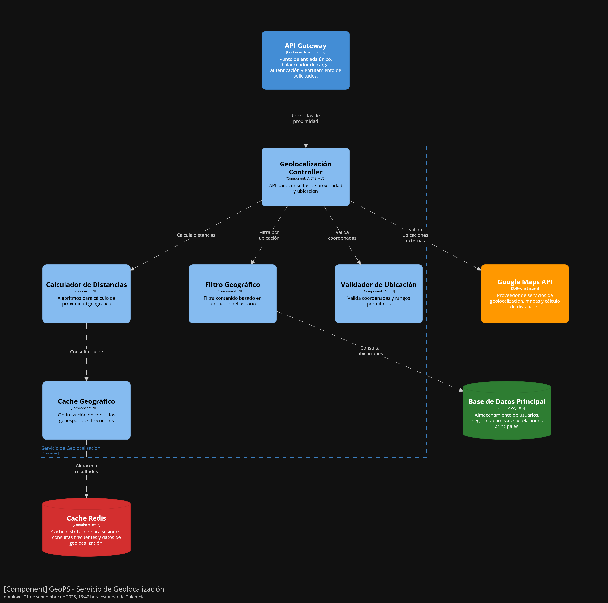

<div align="center">

  
## Universidad Peruana de Ciencias Aplicadas

**Ingeniería de Software**

**Ciclo:** 2025-2

**Curso:** Desarrollo de Aplicaciones Open Source

**Sección:** 7391

**Profesor:** Mori Paiva, Hugo Allan

---

## Informe de Trabajo Final

**Startup:** GeoPsLabs

**Nombre del producto:** GeoPs

#### Relación de integrantes

| Integrante                      | Código     |
| ------------------------------- | ---------- |
| Huapaya Galindo, Dyron          | U202322855 |
| Huarcaya Matias, Gilbert Alonso | u202322187 |
|                                 |            |
|                                 |            |
|                                 |            |

<br><div align="center"><h3>Agosto 2025</h3></div><br>

</div>
<br><br>

---

### Registro de Versiones

<div align="justify">
  
|**Versión**|**Fecha**|**Autor**|**Descripción de modificación**|
| - | - | - | - |
</div><br><br>

---

# Project Report Collaboration Insights

URL de Organización de GitHub DevWebUPC:
[https://github.com/OpenSourceDevUPC](https://github.com/OpenSourceDevUPC)

URL del Repositoria del Project Report:
[https://github.com/OpenSourceDevUPC/Project-Report-GeoPS](https://github.com/OpenSourceDevUPC/Project-Report-GeoPS)

<strong>_Entrega TB1:_</strong>

- Desarrollo de Actividades:
- Evidencias de colaboracion y commits:

---

# Contenido

- [Project Report Collaboration Insights](#project-report-collaboration-insights)
- [Contenido](#contenido)
- [Student Outcome](#student-outcome)
  - [Capitulo 1: Introducción](#capitulo-1-introducción)
    - [1.1. Startup Profile](#11-startup-profile)
      - [1.1.1. Descripcion del Startup](#111-descripcion-del-startup)
      - [1.1.2. Perfiles de Integrantes del equipo](#112-perfiles-de-integrantes-del-equipo)
    - [1.2. Solution Profile](#12-solution-profile)
      - [1.2.1. Antecedentes y problemática](#121-antecedentes-y-problemática)
      - [1.2.2. Lean UX Process](#122-lean-ux-process)
        - [1.2.2.1. Lean UX Problem Statements](#1221-lean-ux-problem-statements)
        - [1.2.2.2. Lean UX Assumptions](#1222-lean-ux-assumptions)
        - [1.2.2.3. Lean UX Hypothesis Statements](#1223-lean-ux-hypothesis-statements)
        - [1.2.2.4. Lean UX Canvas](#1224-lean-ux-canvas)
    - [1.3. Segmentos objetivos](#13-segmentos-objetivos)
  - [Capitulo 2: Requirements Elicitation \& Analysis](#capitulo-2-requirements-elicitation--analysis)
    - [2.1. Competidores](#21-competidores)
      - [2.1.1. Analisis competitivo](#211-analisis-competitivo)
      - [2.1.2. Estrategias y tácticas frente a competidores](#212-estrategias-y-tácticas-frente-a-competidores)
    - [2.2. Entrevistas](#22-entrevistas)
      - [2.2.1. Diseño de entrevistas](#221-diseño-de-entrevistas)
      - [2.2.2. Registro de entrevistas](#222-registro-de-entrevistas)
      - [2.2.3. Análisis de entrevistas](#223-análisis-de-entrevistas)
    - [2.3. Needfinding](#23-needfinding)
      - [2.3.1. User Personas](#231-user-personas)
      - [2.3.2 User Task Matrix](#232-user-task-matrix)
      - [2.3.3. User Journey Mapping](#233-user-journey-mapping)
      - [2.3.4. Empathy Mapping](#234-empathy-mapping)
      - [2.3.5. As-is Scenario Mapping](#235-as-is-scenario-mapping)
    - [2.4. Ubiquitous Language](#24-ubiquitous-language)
  - [Capitulo 3: Requirements Specification](#capitulo-3-requirements-specification)
    - [3.1. To-Be Scenario Mapping](#31-to-be-scenario-mapping)
    - [3.2. User Stories](#32-user-stories)
    - [3.3. Impact Mapping](#33-impact-mapping)
    - [3.4. Product Backlog](#34-product-backlog)
  - [Capítulo 4: Product Design](#capítulo-4-product-design)
    - [4.1. Style Guidelines](#41-style-guidelines)
      - [4.1.1. General Style Guidelines](#411-general-style-guidelines)
      - [4.1.2. Web Style Guidelines](#412-web-style-guidelines)
    - [4.2. Information Architecture](#42-information-architecture)
      - [4.2.1. Organization Systems](#421-organization-systems)
        - [Organización Visual del Contenido](#organización-visual-del-contenido)
        - [Esquemas de Categorización del Contenido](#esquemas-de-categorización-del-contenido)
      - [4.2.2. Labeling Systems](#422-labeling-systems)
      - [4.2.3. SEO Tags and Meta Tags](#423-seo-tags-and-meta-tags)
      - [4.2.4. Searching Systems](#424-searching-systems)
      - [4.2.5. Navigation Systems](#425-navigation-systems)
        - [Navegación del Landing Page](#navegación-del-landing-page)
        - [Navegación de la aplicación web](#navegación-de-la-aplicación-web)
    - [4.3. Landing Page UI Design](#43-landing-page-ui-design)
      - [4.3.1. Landing Page Wireframe](#431-landing-page-wireframe)
      - [4.3.2. Landing Page Mock-up](#432-landing-page-mock-up)
    - [4.4. Web Applications UX/UI Design](#44-web-applications-uxui-design)
      - [4.4.1. Web Applications Wireframes](#441-web-applications-wireframes)
      - [4.4.2. Web Applications Wireflow Diagrams](#442-web-applications-wireflow-diagrams)
      - [4.4.3. Web Applications Mock-ups](#443-web-applications-mock-ups)
      - [4.4.4. Web Applications User Flow Diagrams](#444-web-applications-user-flow-diagrams)
    - [4.5. Web Applications Prototyping.](#45-web-applications-prototyping)
    - [4.6. Domain-Driven Software Architecture](#46-domain-driven-software-architecture)
      - [4.6.1. Design-Level Event Storming](#461-design-level-event-storming)
      - [4.6.2. Software Architecture Context Diagram](#462-software-architecture-context-diagram)
      - [4.6.3. Software Architecture Container Diagrams](#463-software-architecture-container-diagrams)
      - [4.6.4. Software Architecture Components Diagrams](#464-software-architecture-components-diagrams)
    - [4.7. Software Object-Oriented Design](#47-software-object-oriented-design)
      - [4.7.1. Class Diagrams](#471-class-diagrams)
      - [4.7.2. Class Dictionary](#472-class-dictionary)
    - [4.8. Database Design](#48-database-design)
      - [4.8.1. Database Diagram](#481-database-diagram)
  - [Capítulo 5: Product Implementation, Validation \& Deployment](#capítulo-5-product-implementation-validation--deployment)
    - [5.1. Software Configuration Management](#51-software-configuration-management)
      - [5.1.1. Software Development Environment Configuration](#511-software-development-environment-configuration)
      - [5.1.2. Source Code Management](#512-source-code-management)
      - [5.1.3. Source Code Style Guide \& Conventions](#513-source-code-style-guide--conventions)
      - [5.1.4. Software Deployment Configuration](#514-software-deployment-configuration)
    - [5.2. Landing Page, Services \& Applications Implementation](#52-landing-page-services--applications-implementation)
    - [5.2.1. Sprint 1](#521-sprint-1)
      - [5.2.1.1. Sprint Planning 1](#5211-sprint-planning-1)
      - [5.2.1.2. Aspect Leaders and Collaborators](#5212-aspect-leaders-and-collaborators)
      - [5.2.1.3. Sprint Backlog 1](#5213-sprint-backlog-1)
      - [5.2.1.4. Development Evidence for Sprint Review](#5214-development-evidence-for-sprint-review)
      - [5.2.1.5. Execution Evidence for Sprint Review](#5215-execution-evidence-for-sprint-review)
      - [5.2.1.6. Services Documentation Evidence for Sprint Review](#5216-services-documentation-evidence-for-sprint-review)
      - [5.2.1.7. Software Deployment Evidence for Sprint Review](#5217-software-deployment-evidence-for-sprint-review)
      - [5.2.1.8. Team Collaboration Insights during Sprint](#5218-team-collaboration-insights-during-sprint)
  - [Conclusiones](#conclusiones)
  - [Anexos](#anexos)
  - [Bibliografía](#bibliografía)

# Student Outcome

 <div aligh="justify">
   
   |Criterio Específico|Acciones Realizadas|Conclusiones|
   |-------------------|-------------------|------------|
   
 </div>

## Capitulo 1: Introducción

### 1.1. Startup Profile

#### 1.1.1. Descripcion del Startup

#### 1.1.2. Perfiles de Integrantes del equipo

### 1.2. Solution Profile

#### 1.2.1. Antecedentes y problemática

#### 1.2.2. Lean UX Process

##### 1.2.2.1. Lean UX Problem Statements

##### 1.2.2.2. Lean UX Assumptions

##### 1.2.2.3. Lean UX Hypothesis Statements

##### 1.2.2.4. Lean UX Canvas

### 1.3. Segmentos objetivos

## Capitulo 2: Requirements Elicitation & Analysis

### 2.1. Competidores

#### 2.1.1. Analisis competitivo

#### 2.1.2. Estrategias y tácticas frente a competidores

### 2.2. Entrevistas

#### 2.2.1. Diseño de entrevistas

#### 2.2.2. Registro de entrevistas

#### 2.2.3. Análisis de entrevistas

### 2.3. Needfinding

#### 2.3.1. User Personas

#### 2.3.2 User Task Matrix

#### 2.3.3. User Journey Mapping

#### 2.3.4. Empathy Mapping

#### 2.3.5. As-is Scenario Mapping

### 2.4. Ubiquitous Language

## Capitulo 3: Requirements Specification

### 3.1. To-Be Scenario Mapping

### 3.2. User Stories

### 3.3. Impact Mapping

### 3.4. Product Backlog

## Capítulo 4: Product Design

### 4.1. Style Guidelines

#### 4.1.1. General Style Guidelines

**Branding**

- El nombre completo de nuestro servicio es “Geo Publicity Service”.
- Para el dominio web y la aplicación, así como para ser más memorable, se utilizará el nombre corto GeoPS.
- El tagline es “Promociones cerca de ti”, reflejando el servicio principal de promocionar ofertas de diversas tiendas cerca de tu ubicación.
- El logo tiene un diseño sencillo, lo que lo hace minimalista y fácil de recordar. Además, el uso del color morado demuestra creatividad e innovación.

<div align="center"></div>

**Typography**

Las tipografías seleccionadas son Poppins y Lobster. Lobster fué elegida principalmente para representar nuestro Logo GeoPS de una manera expresiva, atrayendo la atención de los usuarios a nuestra landing page. La tipografía Poppins se utiliza en los párrafos, títulos, subtítulos y botones de la página, transmitiendo claridad y profesionalismo, ofreciendo una buena legibilidad en la página web mediante su amplia variedad de pesos de letra.

**Tamaños y peso de tipografía**

Lobster: Peso 400, 60 px de tamaño para el logo.
Poppins:

- Títulos: Peso 600, 35 px de tamaño.
- Párrafos y texto secundario: Peso 300, 20 px de tamaño.
- Texto terciario: Peso 400, 16 px de tamaño.
- Pié de imagen y video: Peso 300, 16 px de tamaño.
- Texto dentro de imágenes: Peso 600, 24 px de tamaño.
- Texto de botones CTA: Peso 600, 25 px de tamaño.

**Colors**

Utilizaremos la siguiente paleta de colores:

<div align="center"></div>

|                                                                         |                                                                                                                                                                                                                                                     |
| ----------------------------------------------------------------------- | --------------------------------------------------------------------------------------------------------------------------------------------------------------------------------------------------------------------------------------------------- |
|  | El color amatista se utiliza principalmente en el menú vertical, el cual necesita resaltar. Este color representa la innovación y modernidad, atrayendo la atención de los usuarios sin tener que ser agresivo.                                     |
|      | El color índigo es utilizado para secciones que desean llamar la atención mostrando información importante, todo en un espacio pequeño. El color muestra elegancia, formalidad y confianza al ser un color fuerte.                                  |
|      | El color blanco es utilizado en el cuerpo de la página web. El color blanco muestra un área limpia, clara y donde hay espacio visual para mostrar las secciones de nuestra landing page.                                                            |
|        | El color negro es utilizado en botones principales y el footer de nuestra página. El color negro demuestra profesionalismo y un contraste fuerte con los otros colores utilizados, especialmente el color blanco.                                   |
|            | El color uva es utilizado en botones CTA de tamaño mediano y secciones con imágenes. Este color muestra energía, dinamismo y una personalidad fuerte, en comparación a otros botones principales. También ayuda a destacar el texto de los botones. |
|  | El color verónica es utilizado en botones pequeños CTA. Este color muestra juventud y frescura al ser un poco más claro que los otros colores de tono parecido.                                                                                     |

**Spacing**

- El espacio en el diseño de GeoPS se enfocará en proporcionar una experiencia visual clara y accesible para el usuario, reflejando los principios de orden y claridad. Se utilizarán márgenes amplios para resaltar los elementos clave, como botones y áreas interactivas, permitiendo una navegación fluida y sin distracciones.
- Al utilizar muchas imágenes, consideramos utilizar un espaciado horizontal entre las imágenes lo suficiente para mostrarlas con claridad visual y sin que interrumpa la navegación del usuario.
- El espaciado será utilizado para diferenciar las zonas de información, especialmente en secciones interactivas con párrafos.

**Tonos de Comunicacion**

El tono de comunicación de GeoPS será amigable, cercano y orientado al usuario. Buscamos establecer una conexión genuina mediante un lenguaje claro y accesible a todos, sin utilizar demasiados tecnicismos. Resaltaremos los beneficios y la facilidad de uso de nuestra aplicación web, sin abrumar al usuario con tanta información. Queremos que el usuario se sienta valorado y escuchado en cada interacción.

#### 4.1.2. Web Style Guidelines

En esta sección, se describe la guía de nuestra landing page con sus características en el estilo para mantener una coherencia visual.

**Estructura general de la página**:

**Cabecera**:

- Logotipo: El logotipo de nuestra startup está ubicado en la esquina superior izquierda. Cuando haces click, te redirigirá a la página principal.
- Barra de búsqueda: La barra de búsqueda está ubicada en la parte superior derecha. Servirá para ubicar fácilmente y rápidamente secciones en la página.
- Menú de navegación: El menú de navegación se ubica en la parte superior izquierda y en la esquina derecha. Es un conjunto de botones que permite la navegación en la página principal. Los botones designados son:
  1. Inicio
  2. Marcas
  3. Conoce más
  4. Inicia sesión

**Cuerpo**:

- Sección principal: La sección principal es la que va a atraer al usuario. Se muestran promociones conocidas y ofertas.
- Beneficios: Muestra que nuestra página ofrece beneficios, ofertas y promociones en diversas tiendas.
- Empresas que confían en nosotros: Muestra las marcas que tienen confianza en nosotros y están dispuestos a promocionar sus productos en nuestra página.
- Quienes somos: Muestra información de la empresa y permite conocer más de nosotros mediante un botón.
- Planes: Permite la muestra y promoción de los planes de compra de nuestra empresa para los usuarios de la página.
- Promociones: Muestra diversas promociones de diferentes tipos en varias tiendas.
- Invitación a los negocios: Sección de llamado a los usuarios que tienen negocios que desean participar en nuestro programa.
- Dudas: Sección que muestra preguntas frecuentes de nuestra empresa y las responde de una manera corta y clara.
- Conocenos mejor: Muestra los videos que hablan sobre nuestra marca de empresa para conectar con el usuario que ve los videos.

**Pié de página**:

- Copyright: Se incluye la información sobre los derechos de autor de la marca.
- Enlaces de soporte: Se proporcionan links de soporte y ayuda, tales como “Nosotros”, “Servicios” y “Contacto”.
- Redes sociales: Se incluyen los iconos de las redes sociales de nuestro emprendimiento para conectar con la audiencia en otras plataformas, las cuales son Instagram y LinkedIn.
- Logotipo y eslogan: Se incluye el Logo con su eslogan que representa nuestra empresa. La frase designada es: “Promociones cerca de ti”

**Diseño de la página inicial**:

<div align="center"></div>
<div align="center"></div>
<div align="center"></div>

### 4.2. Information Architecture

#### 4.2.1. Organization Systems

Se aplicarán distintos sistemas de organización de contenido tanto visual como estructural, adaptados al flujo operativo de nuestros usuarios (consumidores y negocios locales). Esto permitirá ofrecer una experiencia clara, intuitiva y eficaz durante el uso de la plataforma.

##### Organización Visual del Contenido

**Jerárquica:**
En las pantallas principales, como el Dashboard de usuario y el panel de negocios, los elementos más importantes (promociones destacadas, métricas de campaña) estarán resaltados con mayor tamaño, color contrastante y posición superior.

**Secuencial:**
Utilizado en procesos como la creación de campañas publicitarias o el registro de preferencias de usuario. Se presentarán pasos guiados (wizard) que aseguren que tanto consumidores como negocios completen los procesos de manera ordenada y sin omitir información clave.

**Matricial:**
Aplicada en la visualización de datos cruzados, como patrones de movilidad de consumidores versus resultados de campañas. Los negocios podrán ver las relaciones entre ubicación, horario y efectividad publicitaria.

##### Esquemas de Categorización del Contenido

**Por Tópicos:**
Será el sistema predominante en los menús de navegación. Las funcionalidades estarán agrupadas en temas específicos:

_Para consumidores:_

- Promociones cercanas
- Favoritos
- Historial de ofertas
- Ajustes de privacidad

_Para negocios:_

- Campañas
- Segmentación
- Métricas
- Configuración

**Cronológico:**
Usado en los reportes de campañas publicitarias (para negocios) y en el historial de notificaciones recibidas (para consumidores). La información se mostrará ordenada por fecha y hora, permitiendo un seguimiento preciso.

**Alfabético:**
Utilizado en listados como directorios de comercios o categorías de productos, facilitando la búsqueda rápida por nombre.

**Según audiencia:**
La experiencia estará personalizada según el segmento objetivo:

- **Consumidores de ofertas locales:** acceso a promociones activas, historial de notificaciones, filtros de búsqueda por categoría, proximidad o momento del día.

- **Dueños de negocios locales:** acceso a herramientas de creación de campañas, segmentación por patrones de movilidad, visualización de métricas en dashboards interactivos y configuración de notificaciones.

#### 4.2.2. Labeling Systems

En GeoPS se ha implementado un sistema de etiquetado claro y funcional, adaptado al entorno de consumo y gestión de campañas locales. El objetivo es reducir la carga cognitiva y facilitar la interacción rápida con la plataforma.

**Principios utilizados:**

**Simplicidad y claridad:**
Se prioriza el uso de términos breves y familiares para cada segmento. Ejemplo para consumidores: "Ofertas cercanas", "Favoritos", "Historial". Ejemplo para negocios: "Campañas", "Segmentación", "Métricas".

**Evitar ambigüedad:**
Se evita la jerga técnica. Por ejemplo, se prefiere "Crear campaña" en lugar de "Configurar pauta publicitaria", o "Promoción activa" en lugar de "Anuncio en circulación".

**Consistencia visual:**
Todas las etiquetas siguen una presentación uniforme en botones, menús y formularios, asegurando que el usuario reconozca patrones de uso fácilmente.

#### 4.2.3. SEO Tags and Meta Tags

Las Meta Tags son esenciales para el posicionamiento de la plataforma en buscadores y para su correcta presentación en navegadores y redes sociales.

**Meta Tags a utilizar en GeoPS:**

**Título:**

```html
<title>GeoPS | Publicidad Hiperlocal y Contextual para Consumidores y Negocios</title>
```

**Codificación de caracteres:**

```html
<meta charset="UTF-8">
```

**Descripción:**

```html
<meta name="description" content="GeoPS es una aplicación web que conecta negocios locales con consumidores mediante publicidad hiperlocal y contextual. Ofrece promociones relevantes en el momento y lugar adecuado, cuidando la privacidad y simplicidad de uso.">
```

**Palabras clave:**

```html
<meta name="keywords" content="publicidad local, promociones cercanas, geolocalización, campañas digitales, consumidores, negocios locales, ofertas hiperlocales, marketing contextual, GeoPS">
```

**Autor y Derechos de Autor:**

```html
<meta name="author" content="GeoPS Team - UPC">
<meta name="copyright" content="GeoPS © 2025. Todos los derechos reservados.">
```

**Viewport:**

```html
<meta name="viewport" content="width=device-width, initial-scale=1.0">
```

#### 4.2.4. Searching Systems

Los sistemas de búsqueda en GeoPS facilitan el acceso rápido a promociones o campañas según el segmento objetivo.

**Opciones de búsqueda en la aplicación:**

**Barra de búsqueda global:**

- Presente en el encabezado superior.
- Permite búsquedas generales tanto para consumidores como para negocios.
- Incluye icono de lupa y placeholder "Buscar promociones o campañas".

**Filtros por módulo:**

_Para consumidores:_

- Categoría de producto/servicio
- Distancia/proximidad
- Horario de vigencia
- Negocio emisor de la promoción

_Para negocios:_

- Campañas activas/inactivas
- Segmentación (ubicación, rango horario, movilidad)
- Tipo de promoción
- Resultados por fecha

**Visualización:**

- Resultados organizados por relevancia o cercanía.
- Paginación de 10 resultados por página.
- Indicadores visuales de color para destacar promociones activas.
- Acciones rápidas (Guardar, Editar, Compartir).

#### 4.2.5. Navigation Systems

Los sistemas de navegación guiarán a los usuarios a través del Landing Page y la aplicación web, adaptados a cada segmento objetivo.

##### Navegación del Landing Page

**Menú principal:**
Logo GeoPS, Productos, Negocios, Nosotros, Planes, Registrarse, Iniciar Sesión.

**Secciones principales:**

- **Hero section:** "Publicidad hiperlocal y contextual al alcance de todos" con botón "Comenzar ahora".
- **Características:** Tarjetas con los beneficios para consumidores y negocios.
- **Nosotros:** Información sobre la startup, misión y visión.
- **Planes:** Opciones diferenciadas para consumidores (gratis) y negocios (básico, premium).
- **Contacto:** Formulario para consultas o soporte.

##### Navegación de la aplicación web

**Estructura general:**

- **Menú superior:** Logo, búsqueda, notificaciones, perfil.
- **Dashboard principal:**
  - Para consumidores: Promociones cercanas y destacadas.
  - Para negocios: Resumen de campañas y métricas.

**Menú lateral por perfil:**

- **Consumidores:** Promociones, Favoritos, Historial, Ajustes.
- **Negocios:** Campañas, Segmentación, Métricas, Configuración.

**Elementos auxiliares:**

- Botones de acción rápida (guardar, crear, compartir).
- Notificaciones en tiempo real.
- Enlaces entre módulos relacionados.

### 4.3. Landing Page UI Design

#### 4.3.1. Landing Page Wireframe

#### 4.3.2. Landing Page Mock-up

### 4.4. Web Applications UX/UI Design

#### 4.4.1. Web Applications Wireframes

**Inicio de Sesión**

<div align="center"></div>

**Perfil**

<div align="center"></div>
<div align="center"></div>

**Home**

<div align="center"></div>

**Ofertas (Vista de Categorías)**

<div align="center"></div>

**Ofertas**

<div align="center"></div>

**Detalle de Oferta**

<div align="center"></div>

**Categorías**

<div align="center"></div>

**Favoritos**

<div align="center"></div>

**Mis Cupones**

<div align="center"></div>

**Notificaciones**

<div align="center"></div>
<div align="center"></div>
<div align="center"></div>

**Carrito de Compra**

<div align="center"></div>

**Proceso de Pago**

<div align="center"></div>

#### 4.4.2. Web Applications Wireflow Diagrams

#### Login

**User Goal: Iniciar Sesión**
- Usuario: Cliente o Proveedor

El usuario accede a la aplicación desde la vista de login, elige su rol (cliente o proveedor) e ingresa sus credenciales. Si los datos son correctos, el sistema valida la información y redirige al dashboard correspondiente. En caso contrario, se muestra un mensaje de error para reintentar.

<div align="center"></div>

#### Cliente


**User Goal: Visualizar planes**
- Usuario: Cliente

El cliente ingresa a la sección de planes desde el home. Allí puede ver las opciones de suscripción disponibles. Cada plan muestra sus características principales y beneficios. El usuario evalúa y elige el que mejor se ajusta a sus necesidades.

<div align="center"></div>


**User Goal: Permitir acceso a ubicación**
- Usuario: Cliente

El sistema solicita al cliente acceso a su ubicación. El usuario recibe una ventana emergente para aceptar o rechazar. Al aceptar, la aplicación muestra ofertas cercanas personalizadas. Si no lo permite, solo se muestran resultados generales.

<div align="center"></div>


**User Goal: Acceso a ayuda, notificaciones y perfil**
- Usuario: Cliente

El cliente desde el header accede al centro de ayuda, revisa sus notificaciones (con la opción de marcar como leídas o limpiarlas) y puede entrar a su perfil. En el perfil tiene acceso a la información registrada y ajustes personales.

<div align="center"></div>


**User Goal: Acceso a links principales (ofertas, categorías, favoritos, cupones)**
- Usuario: Cliente

Desde el home, el cliente selecciona alguno de los accesos rápidos (ofertas, categorías, favoritos, cupones). El sistema lo redirige a la sección correspondiente. En cada sección se muestran los elementos relacionados, organizados para facilitar la navegación.

<div align="center"></div>


**User Goal: Detalle sección y proceso de pago**
- Usuario: Cliente

El cliente entra a una sección (ej. cines), selecciona una oferta y accede al detalle. Desde allí puede añadir al carrito o comprar directamente. Posteriormente continúa con el proceso de pago, confirmando el método y finalizando la transacción.

<div align="center"></div>


**User Goal: Cerrar Sesión**
- Usuario: Cliente

El cliente, desde el perfil, selecciona la opción de cerrar sesión. El sistema valida la acción y cierra la cuenta activa.

<div align="center"></div>

#### Proveedor

**User Goal: Visualizar planes**
- Usuario: Proveedor

El proveedor accede a la sección de planes desde la opción resumen. Allí se le muestran las opciones de suscripción que permiten ampliar beneficios en la plataforma.

<div align="center"></div>


**User Goal: Acceder a ayuda, notificaciones, perfil**
- Usuario: Proveedor

El proveedor accede desde el header a secciones complementarias. En Ayuda, encuentra respuestas rápidas a dudas frecuentes. En Notificaciones, revisa avisos relevantes y puede marcarlos como leídos o eliminarlos. Finalmente, en Perfil, gestiona la información de su negocio.

<div align="center"></div>


**User Goal: Acceder a links principales**
- Usuario: Proveedor

El proveedor, desde la vista de resumen, puede navegar hacia los enlaces principales de la plataforma: campañas, creación de nuevas promociones, reportes y comentarios de clientes.

<div align="center"></div>


**User Goal: Cerrar Sesión**
- Usuario: Proveedor

El proveedor, desde el perfil, selecciona cerrar sesión. El sistema valida la acción y cierra la cuenta activa.

<div align="center"></div>

#### 4.4.3. Web Applications Mock-ups

#### 4.4.4. Web Applications User Flow Diagrams

### 4.5. Web Applications Prototyping.

### 4.6. Domain-Driven Software Architecture

La arquitectura de software basada en Domain-Driven Design (DDD) se centra en el dominio del negocio, buscando que la aplicación represente de forma fiel los procesos, reglas y necesidades de los usuarios. Con este enfoque, el desarrollo se mantiene alineado con los objetivos estratégicos de la organización y se favorece una comunicación más clara y efectiva entre los equipos técnicos y los expertos del negocio.

Se utilizó el modelo C4 (Contexto, contenedor y componentes), el cual permite visualizar el sistema en diferentes capas.

#### 4.6.1. Design-Level Event Storming

#### 4.6.2. Software Architecture Context Diagram

  <div align="center"></div>
  
El Diagrama de Contexto del sistema de GeoPS muestra una visión de alto nivel de sus componentes y cómo interactúan con usuarios y servicios externos. Este diagrama es útil para comprender la funcionalidad del sistema y sus dependencias.

En el centro del diagrama se encuentra GeoPS, la plataforma principal. Su propósito es gestionar la creación de campañas publicitarias geolocalizadas y analizar su audiencia.

**Actores principales**:
Los principales actores que interactúan con el sistema GeoPS son:

- Consumidor: Este usuario busca ofertas y promociones basadas en su ubicación actual. Interactúa con campañas publicitarias.

- Propietario de Negocio: Este usuario es dueño de una empresa que crea y gestiona campañas publicitarias para promover sus productos y servicios.

**Servicios Externos**:

Para su funcionamiento, GeoPS se apoya en varios servicios externos:

- **Servicio OAuth** (Autenticación): Permite a los usuarios autenticarse a través de proveedores como Google, Facebook y Microsoft, garantizando un acceso seguro.

- **SendGrid** (Servicio de envío): Se encarga de enviar notificaciones por correo electrónico y confirmaciones a los usuarios.

- **Google Maps API** (Proveedor de servicios): Proporciona servicios de geolocalización, mapas y cálculos de distancia, que son esenciales para las campañas geolocalizadas.

- **Stripe/PayPal** (Procesador de pagos): Maneja los pagos, aportes y suscripciones a planes de la plataforma.
- **Firebase Cloud Messaging** (Servicio de notificaciones): Permite el envío de notificaciones push para dispositivos móviles y web, habilitando la comunicación en tiempo real.

  #### 4.6.3. Software Architecture Container Diagrams

  <div align="center"></div>

Los usuarios principales, Consumidor y Propietario de Negocio, acceden al sistema a través de distintas aplicaciones web. Los Consumidores utilizan una Aplicación Web , que les permite explorar ofertas y promociones. Por otro lado, los Propietarios de Negocio acceden a una Aplicación Web, donde gestionan sus campañas publicitarias. Ambas aplicaciones se comunican con el backend a través de un API Gateway.

El backend está compuesto por varios microservicios que manejan funcionalidades específicas del sistema:

- **Servicio de Autenticación**: Gestiona el inicio de sesión y la seguridad de los usuarios.

- **Servicio de Campañas**: Permite la creación y gestión de las campañas publicitarias geolocalizadas.

- **Servicio de Negocios**: Se encarga de la información de las empresas y sus productos.

- **Servicio de Geoposicionamiento**: Maneja la lógica relacionada con la ubicación y las distancias.

- **Servicio de Analítica**: Procesa los datos para generar estadísticas sobre las campañas.

- **Servicio de Notificaciones**: Administra las notificaciones internas del sistema.

**Almacenamiento de Datos y Caching**

El sistema utiliza varios contenedores para la persistencia y el manejo de datos:

- **Base de Datos Relacional** (PostgreSQL): Almacena los datos principales del sistema, como información de usuarios, negocios y campañas.

- **Base de Datos Analítica**: Guarda la información utilizada para generar reportes y análisis.

- **Almacenamiento de Archivos** (Cloud Storage): Se utiliza para almacenar activos como imágenes y logotipos.

- **Cache Redis**: Mejora el rendimiento del sistema almacenando datos de acceso frecuente para reducir la carga de la base de datos principal.

**Integración con Servicios Externos**

Para complementar su funcionalidad, GeoPS se integra con diversos servicios externos:

**Servicio de Autenticación** (OAuth): Permite a los usuarios autenticarse a través de terceros.

**Google Maps API**: Proveedor esencial para los servicios de mapas y geolocalización.

**SendGrid**: Encargado del envío de correos electrónicos transaccionales y de notificaciones.

**Stripe/PayPal**: Procesan los pagos y las suscripciones a los planes de la plataforma.

**Firebase Cloud Messaging**: Habilita el envío de notificaciones push a dispositivos móviles y web.

Este diagrama ilustra la arquitectura modular y escalable de GeoPS, mostrando cómo todos sus componentes se comunican para dar soporte a las operaciones principales de la plataforma publicitaria geolocalizada.

#### 4.6.4. Software Architecture Components Diagrams

- **Servicio de Analytics**
<div align="center"></div>

El diagrama muestra la arquitectura de componentes del Servicio de Analítica de GeoPS, detallando cómo se gestionan y procesan los datos para la generación de reportes y métricas. Este servicio es fundamental para que los Propietarios de Negocio puedan medir el rendimiento de sus campañas.

**Componentes principales**
El flujo de datos comienza con dos puntos de entrada:

**API Gateway**: Sirve como un punto de entrada único y seguro para las solicitudes de reportes provenientes del frontend.

**Cola de Mensajes** (RabbitMQ): Recibe eventos de interacción en tiempo real desde otros servicios del sistema.

Una vez que los datos o solicitudes ingresan al sistema, son procesados por los siguientes componentes:

**Analytics Controller**: Es la API principal del servicio. Recibe las solicitudes de reportes desde el API Gateway y delega la tarea de generar los informes y exportar los datos.

**Procesador de Eventos** (Event Loop): Consume los eventos de la Cola de Mensajes en tiempo real y los procesa para su posterior análisis.

**Agregador de Métricas**: Recibe los eventos procesados y calcula las métricas y los indicadores clave de rendimiento (KPIs) de negocio. Almacena estas métricas calculadas en la base de datos.

**Generador de Reportes**: Se encarga de crear los reportes de rendimiento de las campañas, consultando los datos históricos y las métricas calculadas almacenadas.

**Exportador de Datos**: Permite exportar los datos analíticos en múltiples formatos.

- **Servicio de Campañas**

<div align="center"></div>

Este diagrama detalla la arquitectura de los componentes del Servicio de Analítica de GeoPS, mostrando cómo se gestionan, procesan y almacenan los datos de las campañas publicitarias para generar métricas e informes.

**Flujo de Datos y Componentes**
El flujo de información en el sistema tiene dos orígenes principales:

**Solicitudes de Reportes**: Provienen de la API Gateway, que actúa como un único punto de entrada para las peticiones de datos de analítica. El Analytics Controller recibe estas solicitudes y coordina la generación de los reportes.

**Eventos en Tiempo Real**: Son consumidos por la Cola de Mensajes (RabbitMQ). El Procesador de Eventos (Event Loop) consume estos eventos y los procesa para su análisis inmediato.

Una vez procesados, los eventos pasan al Agregador de Métricas, que se encarga de calcular los KPIs (Indicadores Clave de Rendimiento) de negocio. Estas métricas calculadas son almacenadas en la Base de Datos Analítica.

**Almacenamiento y Salida de Datos**

Todos los eventos, métricas y datos de análisis se almacenan en una Base de Datos Analítica (MongoDB). Este tipo de base de datos es ideal para manejar grandes volúmenes de datos semiestructurados.

Finalmente, el servicio ofrece dos componentes para la salida de la información:

**Generador de Reportes**: Consulta los datos históricos y las métricas almacenadas para crear reportes de rendimiento de las campañas, los cuales se presentan al usuario.

**Exportador de Datos**: Permite a los usuarios exportar estos datos en diferentes formatos, como CSV o JSON, para su uso en otras herramientas o análisis externos.

- **Servicio de Geolocalización**

<div align="center"></div>

Este diagrama detalla la arquitectura de componentes del Servicio de Geoposicionamiento de GeoPS, mostrando cómo se gestionan las funcionalidades basadas en la ubicación. El servicio permite a la plataforma determinar la proximidad geográfica y filtrar contenido relevante para los usuarios.

**Flujo de Datos y Componentes**
El flujo comienza con el API Gateway, que recibe las solicitudes de geolocalización. Estas solicitudes son dirigidas al Geolocalización Controller, que actúa como la API principal del servicio, gestionando la lógica de ubicación y proximidad.

El servicio se apoya en los siguientes componentes para procesar la información geográfica:

**Validador de Ubicación**: Es el primer punto de validación. Se asegura de que las coordenadas proporcionadas estén dentro de rangos y zonas permitidas. También se comunica con servicios externos, como la Google Maps API, para validar y enriquecer la información de ubicación, así como para realizar cálculos de distancia.

**Filtro Geográfico**: Una vez que la ubicación es validada, este componente filtra el contenido (como campañas o negocios) basándose en la ubicación actual del usuario.

**Calculador de Distancias**: Utiliza los datos del usuario y del contenido para calcular la distancia geográfica. Este componente consulta un Cache Geográfico para optimizar el rendimiento y evitar cálculos repetitivos.

**Cache Geográfico** (Redis): Almacena resultados de cálculos de distancias y ubicaciones frecuentes. También se utiliza un Cache Redis para guardar las sesiones de los usuarios, lo que mejora la velocidad del servicio al recordar la ubicación del usuario y los filtros aplicados.

**Almacenamiento y Servicios Externos**

**Base de Datos Principal**: Almacena la información de los negocios, las campañas y las relaciones principales, que el servicio de geolocalización consulta para determinar el contenido relevante.

**Google Maps API**: Es un servicio externo vital que provee las funcionalidades de geolocalización, mapas y cálculo de distancias.

### 4.7. Software Object-Oriented Design

#### 4.7.1. Class Diagrams

El diagrama de clases de GeoPS está organizado siguiendo los principios de Domain-Driven Design (DDD), dividido en diferentes bounded contexts que representan las áreas principales del negocio:

<div align="center"></div>

**Bounded Contexts identificados:**

1. **User Management BC**: Gestiona la autenticación y autorización de usuarios
2. **Business & Campaigns BC**: Maneja las empresas y sus campañas publicitarias
3. **Domain Events**: Eventos del dominio para comunicación entre contextos
4. **Interaction BC**: Gestiona las interacciones de los usuarios con las campañas
5. **Analytics & Tracking BC**: Proporciona métricas y seguimiento de campañas

#### 4.7.2. Class Dictionary

**User Management BC**

| **Clase**          | **Atributos**                                                                                                                                        | **Descripción**                                                                                                                              |
| ------------------ | ---------------------------------------------------------------------------------------------------------------------------------------------------- | -------------------------------------------------------------------------------------------------------------------------------------------- |
| **User**           | - id: int<br>- email: string<br>- username: string<br>- password: string<br>- profilePicture: string<br>- createdAt: DateTime<br>- lastLoginAt: void | Representa a los usuarios del sistema. Contiene la información básica de autenticación y perfil de cada usuario registrado en la plataforma. |
| **UserRepository** | - authenticateUser(email: string, password: string): User                                                                                            | Repositorio que maneja la persistencia y recuperación de datos de usuarios. Proporciona métodos para autenticar usuarios en el sistema.      |
| **BusinessOwner**  | - businessType: string<br>- businessName: string<br>- businessAddress: string<br>- contactInfo: string                                               | Extiende la clase User para representar específicamente a los propietarios de negocios que publican campañas en la plataforma.               |
| **Consumer**       | - preferences: json<br>- location: string                                                                                                            | Extiende la clase User para representar a los consumidores que visualizan y interactúan con las campañas publicitarias.                      |

**Business & Campaigns BC**

| **Clase**              | **Atributos**                                                                                                                                                                                                                         | **Descripción**                                                                                                                                        |
| ---------------------- | ------------------------------------------------------------------------------------------------------------------------------------------------------------------------------------------------------------------------------------- | ------------------------------------------------------------------------------------------------------------------------------------------------------ |
| **Business**           | - id: int<br>- businessId: int<br>- name: string<br>- category: string<br>- address: string<br>- longitude: float<br>- latitude: float<br>- description: string<br>- contactInfo: string<br>- status: string                          | Representa las empresas registradas en la plataforma. Almacena información del negocio incluyendo ubicación geográfica para el targeting de campañas.  |
| **Campaign**           | - id: int<br>- businessId: int<br>- title: string<br>- description: string<br>- startDate: Date<br>- endDate: Date<br>- budget: decimal<br>- status: string<br>- targetAudience: string<br>- createdAt: DateTime<br>- updatedAt: void | Representa las campañas publicitarias creadas por las empresas. Contiene toda la información necesaria para la gestión y targeting de las promociones. |
| **Offer**              | - id: int<br>- campaignId: int<br>- title: string<br>- description: string<br>- discountType: string<br>- discountValue: decimal<br>- validFrom: DateTime<br>- validUntil: DateTime<br>- isActive: void                               | Representa las ofertas específicas dentro de una campaña. Define los descuentos y promociones que se ofrecen a los consumidores.                       |
| **BusinessRepository** | - findById(id: int): Campaign                                                                                                                                                                                                         | Repositorio para la gestión de datos de empresas, proporcionando métodos para recuperar información de campañas por identificador.                     |

**Domain Events**

| **Clase**            | **Atributos**                                                                        | **Descripción**                                                                                                        |
| -------------------- | ------------------------------------------------------------------------------------ | ---------------------------------------------------------------------------------------------------------------------- |
| **CampaignLaunched** | - campaignId: int<br>- businessId: int<br>- launchDate: DateTime                     | Evento del dominio que se dispara cuando una nueva campaña es lanzada. Permite la comunicación entre bounded contexts. |
| **OfferPublished**   | - offerId: int<br>- campaignId: int<br>- publishDate: DateTime                       | Evento que notifica cuando una oferta ha sido publicada y está disponible para los consumidores.                       |
| **NotificationSent** | - notificationId: int<br>- userId: int<br>- campaignId: int<br>- timestamp: DateTime | Evento que registra el envío de notificaciones a usuarios sobre campañas relevantes.                                   |

**Interaction BC**

| **Clase**                  | **Atributos**                                                                                                                                     | **Descripción**                                                                                                                 |
| -------------------------- | ------------------------------------------------------------------------------------------------------------------------------------------------- | ------------------------------------------------------------------------------------------------------------------------------- |
| **UserActivity**           | - id: int<br>- userId: int<br>- activityType: string<br>- timestamp: DateTime<br>- metadata: json                                                 | Registra las actividades de los usuarios en la plataforma, como visualizaciones, clics e interacciones con campañas.            |
| **Notification**           | - id: int<br>- userId: int<br>- title: string<br>- message: string<br>- type: string<br>- isRead: bool<br>- createdAt: DateTime<br>- readAt: void | Gestiona las notificaciones enviadas a los usuarios sobre ofertas y campañas relevantes basadas en su ubicación y preferencias. |
| **NotificationRepository** | - sendNotification(notification: Notification)<br>- markAsRead(notificationId: int): UserActivity()                                               | Repositorio que maneja la persistencia y gestión de notificaciones, incluyendo el envío y marcado como leídas.                  |

**Analytics & Tracking BC**

| **Clase**             | **Atributos**                                                                                                              | **Descripción**                                                                                                         |
| --------------------- | -------------------------------------------------------------------------------------------------------------------------- | ----------------------------------------------------------------------------------------------------------------------- |
| **CampaignAnalytics** | - campaignId: int<br>- impressions: int<br>- clicks: int<br>- conversions: int<br>- reach: int<br>- generatedRevenue: void | Proporciona métricas detalladas sobre el rendimiento de las campañas, incluyendo alcance, interacciones y conversiones. |
| **AnalyticsService**  | - calculateCampaignMetrics(campaignId: int): CampaignAnalytics                                                             | Servicio que calcula y genera métricas de rendimiento para las campañas publicitarias.                                  |

### 4.8. Database Design

#### 4.8.1. Database Diagram

El diseño de la base de datos de GeoPS está estructurado para soportar eficientemente las funcionalidades de geolocalización, gestión de campañas y análisis de datos. La base de datos está optimizada para consultas geoespaciales y seguimiento de interacciones de usuarios.

<div align="center"></div>

**Descripción de las principales entidades:**

**Gestión de Usuarios:**

- **Campaigns**: Almacena información de las campañas publicitarias con campos para targeting geográfico y temporal
- **Business**: Contiene datos de las empresas registradas incluyendo coordenadas geográficas
- **Consumer**: Información de los consumidores con preferencias de ubicación
- **GUser**: Tabla principal de usuarios del sistema

**Análisis y Seguimiento:**

- **CampaignAnalytics**: Métricas de rendimiento de campañas
- **BusinessOwner**: Datos específicos de propietarios de negocios
- **UserActivity**: Registro de actividades de usuarios para análisis

**Comunicación:**

- **Notification**: Sistema de notificaciones push basadas en ubicación
- **BusinessDomain**: Categorización de dominios de negocio

Las relaciones entre tablas están diseñadas para optimizar consultas de proximidad geográfica y análisis de comportamiento de usuarios, elementos clave para el éxito de la plataforma de publicidad geolocalizada.

## Capítulo 5: Product Implementation, Validation & Deployment

### 5.1. Software Configuration Management

#### 5.1.1. Software Development Environment Configuration

#### 5.1.2. Source Code Management

#### 5.1.3. Source Code Style Guide & Conventions

#### 5.1.4. Software Deployment Configuration

### 5.2. Landing Page, Services & Applications Implementation

### 5.2.1. Sprint 1

#### 5.2.1.1. Sprint Planning 1

#### 5.2.1.2. Aspect Leaders and Collaborators

#### 5.2.1.3. Sprint Backlog 1

#### 5.2.1.4. Development Evidence for Sprint Review

#### 5.2.1.5. Execution Evidence for Sprint Review

#### 5.2.1.6. Services Documentation Evidence for Sprint Review

#### 5.2.1.7. Software Deployment Evidence for Sprint Review

#### 5.2.1.8. Team Collaboration Insights during Sprint

## Conclusiones

## Anexos

## Bibliografía
